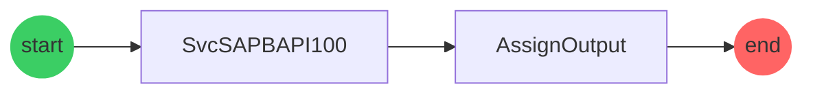

```mermaid
flowchart LR
    start((start)):::start
    AssignParameters[AssignParameters]
    AssignProcess_XML_Input[AssignProcess_XML_Input]
    SvcProcess[SvcProcess]
    D_Ticket[D_Ticket]
    AssignTicket[AssignTicket]
    Parallel_Paths_ErrorTicket[Parallel Paths ErrorTicket]
    SvcGetET[SvcGetET]
    AssignImportJ1Supplier_XML_Input[AssignImportJ1Supplier_XML_Input]
    SvcImportJ1SupplierEpro[SvcImportJ1SupplierEpro]
    SvcFilePutTicket[SvcFilePutTicket]
    AssignError[AssignError]
    e((end)):::e

    start --> AssignParameters
    AssignParameters --> AssignProcess_XML_Input
    AssignProcess_XML_Input --> SvcProcess
    SvcProcess --> D_Ticket
    D_Ticket --> AssignTicket
    AssignTicket --> Parallel_Paths_ErrorTicket

    Parallel_Paths_ErrorTicket --> SvcGetET
    SvcGetET --> AssignImportJ1Supplier_XML_Input
    AssignImportJ1Supplier_XML_Input --> SvcImportJ1SupplierEpro

    Parallel_Paths_ErrorTicket --> SvcFilePutTicket

    D_Ticket -->|condition: faultSvcProcess| AssignError
    AssignError --> AssignTicket

    SvcFilePutTicket --> e

    classDef start stroke:#3bce64
    classDef start fill:#3bce64
    classDef e fill:#ff6464
    classDef e stroke:#ff6464

    class start start
    class e e


%% Swimm:
%% flowchart LR
%%     start((start)):::start
%%     <SwmToken path="/Explore/ePro_OnGoing/OnGoing_Sap100/PRC-SupplierEproSap100.PROCESS.xml" pos="295:4:4" line-data="                  &lt;title&gt;AssignParameters&lt;/title&gt;">`AssignParameters`</SwmToken>[<SwmToken path="/Explore/ePro_OnGoing/OnGoing_Sap100/PRC-SupplierEproSap100.PROCESS.xml" pos="295:4:4" line-data="                  &lt;title&gt;AssignParameters&lt;/title&gt;">`AssignParameters`</SwmToken>]
%%     <SwmToken path="/Explore/ePro_OnGoing/OnGoing_Sap100/SIntOnGoingSupplierEproSap100.PROCESS.xml" pos="151:4:4" line-data="                  &lt;title&gt;AssignProcess_XML_Input&lt;/title&gt;">`AssignProcess_XML_Input`</SwmToken>[<SwmToken path="/Explore/ePro_OnGoing/OnGoing_Sap100/SIntOnGoingSupplierEproSap100.PROCESS.xml" pos="151:4:4" line-data="                  &lt;title&gt;AssignProcess_XML_Input&lt;/title&gt;">`AssignProcess_XML_Input`</SwmToken>]
%%     <SwmToken path="/Explore/ePro_OnGoing/OnGoing_Sap100/SIntOnGoingSupplierEproSap100.PROCESS.xml" pos="167:4:4" line-data="                     &lt;title&gt;SvcProcess&lt;/title&gt;">`SvcProcess`</SwmToken>[<SwmToken path="/Explore/ePro_OnGoing/OnGoing_Sap100/SIntOnGoingSupplierEproSap100.PROCESS.xml" pos="167:4:4" line-data="                     &lt;title&gt;SvcProcess&lt;/title&gt;">`SvcProcess`</SwmToken>]
%%     <SwmToken path="/Explore/ePro_OnGoing/OnGoing_Sap100/PRC-SupplierEproSap100.PROCESS.xml" pos="1181:4:4" line-data="                                                &lt;title&gt;D_Ticket&lt;/title&gt;">`D_Ticket`</SwmToken>[<SwmToken path="/Explore/ePro_OnGoing/OnGoing_Sap100/PRC-SupplierEproSap100.PROCESS.xml" pos="1181:4:4" line-data="                                                &lt;title&gt;D_Ticket&lt;/title&gt;">`D_Ticket`</SwmToken>]
%%     <SwmToken path="/Explore/ePro_OnGoing/OnGoing_Sap100/PRC-SupplierEproSap100.PROCESS.xml" pos="1184:4:4" line-data="                                                      &lt;title&gt;AssignTicket&lt;/title&gt;">`AssignTicket`</SwmToken>[<SwmToken path="/Explore/ePro_OnGoing/OnGoing_Sap100/PRC-SupplierEproSap100.PROCESS.xml" pos="1184:4:4" line-data="                                                      &lt;title&gt;AssignTicket&lt;/title&gt;">`AssignTicket`</SwmToken>]
%%     Parallel_Paths_ErrorTicket[Parallel Paths <SwmToken path="/Explore/ePro_OnGoing/OnGoing_Sap100/SIntOnGoingSupplierEproSap100.PROCESS.xml" pos="201:8:8" line-data="                              &lt;title&gt;Parallel Paths ErrorTicket&lt;/title&gt;">`ErrorTicket`</SwmToken>]
%%     <SwmToken path="/Explore/ePro_OnGoing/OnGoing_Sap100/PRC-SupplierEproSap100.PROCESS.xml" pos="1228:4:4" line-data="                                                               &lt;title&gt;SvcGetET&lt;/title&gt;">`SvcGetET`</SwmToken>[<SwmToken path="/Explore/ePro_OnGoing/OnGoing_Sap100/PRC-SupplierEproSap100.PROCESS.xml" pos="1228:4:4" line-data="                                                               &lt;title&gt;SvcGetET&lt;/title&gt;">`SvcGetET`</SwmToken>]
%%     <SwmToken path="/Explore/ePro_OnGoing/OnGoing_Sap100/SIntOnGoingSupplierEproSap100.PROCESS.xml" pos="216:4:4" line-data="                                          &lt;title&gt;AssignImportJ1Supplier_XML_Input&lt;/title&gt;">`AssignImportJ1Supplier_XML_Input`</SwmToken>[<SwmToken path="/Explore/ePro_OnGoing/OnGoing_Sap100/PRC-SupplierEproSap100.PROCESS.xml" pos="1239:4:4" line-data="                                                                  &lt;title&gt;AssignImportJ1Supplier_XML_Input&lt;/title&gt;">`AssignImportJ1Supplier_XML_Input`</SwmToken>]
%%     <SwmToken path="/Explore/ePro_OnGoing/OnGoing_Sap100/PRC-SupplierEproSap100.PROCESS.xml" pos="1317:4:4" line-data="                                                                     &lt;title&gt;SvcImportJ1SupplierEpro&lt;/title&gt;">`SvcImportJ1SupplierEpro`</SwmToken>[<SwmToken path="/Explore/ePro_OnGoing/OnGoing_Sap100/PRC-SupplierEproSap100.PROCESS.xml" pos="1317:4:4" line-data="                                                                     &lt;title&gt;SvcImportJ1SupplierEpro&lt;/title&gt;">`SvcImportJ1SupplierEpro`</SwmToken>]
%%     <SwmToken path="/Explore/ePro_OnGoing/OnGoing_Sap100/PRC-SupplierEproSap100.PROCESS.xml" pos="1358:4:4" line-data="                                                               &lt;title&gt;SvcFilePutTicket&lt;/title&gt;">`SvcFilePutTicket`</SwmToken>[<SwmToken path="/Explore/ePro_OnGoing/OnGoing_Sap100/PRC-SupplierEproSap100.PROCESS.xml" pos="1358:4:4" line-data="                                                               &lt;title&gt;SvcFilePutTicket&lt;/title&gt;">`SvcFilePutTicket`</SwmToken>]
%%     <SwmToken path="/Explore/ePro_OnGoing/OnGoing_Sap100/SIntOnGoingSupplierEproSap100.PROCESS.xml" pos="388:4:4" line-data="                        &lt;title&gt;AssignError&lt;/title&gt;">`AssignError`</SwmToken>[<SwmToken path="/Explore/ePro_OnGoing/OnGoing_Sap100/SIntOnGoingSupplierEproSap100.PROCESS.xml" pos="388:4:4" line-data="                        &lt;title&gt;AssignError&lt;/title&gt;">`AssignError`</SwmToken>]
%%     e((end)):::e
%% 
%%     start --> <SwmToken path="/Explore/ePro_OnGoing/OnGoing_Sap100/PRC-SupplierEproSap100.PROCESS.xml" pos="295:4:4" line-data="                  &lt;title&gt;AssignParameters&lt;/title&gt;">`AssignParameters`</SwmToken>
%%     <SwmToken path="/Explore/ePro_OnGoing/OnGoing_Sap100/PRC-SupplierEproSap100.PROCESS.xml" pos="295:4:4" line-data="                  &lt;title&gt;AssignParameters&lt;/title&gt;">`AssignParameters`</SwmToken> --> <SwmToken path="/Explore/ePro_OnGoing/OnGoing_Sap100/SIntOnGoingSupplierEproSap100.PROCESS.xml" pos="151:4:4" line-data="                  &lt;title&gt;AssignProcess_XML_Input&lt;/title&gt;">`AssignProcess_XML_Input`</SwmToken>
%%     <SwmToken path="/Explore/ePro_OnGoing/OnGoing_Sap100/SIntOnGoingSupplierEproSap100.PROCESS.xml" pos="151:4:4" line-data="                  &lt;title&gt;AssignProcess_XML_Input&lt;/title&gt;">`AssignProcess_XML_Input`</SwmToken> --> <SwmToken path="/Explore/ePro_OnGoing/OnGoing_Sap100/SIntOnGoingSupplierEproSap100.PROCESS.xml" pos="167:4:4" line-data="                     &lt;title&gt;SvcProcess&lt;/title&gt;">`SvcProcess`</SwmToken>
%%     <SwmToken path="/Explore/ePro_OnGoing/OnGoing_Sap100/SIntOnGoingSupplierEproSap100.PROCESS.xml" pos="167:4:4" line-data="                     &lt;title&gt;SvcProcess&lt;/title&gt;">`SvcProcess`</SwmToken> --> <SwmToken path="/Explore/ePro_OnGoing/OnGoing_Sap100/PRC-SupplierEproSap100.PROCESS.xml" pos="1181:4:4" line-data="                                                &lt;title&gt;D_Ticket&lt;/title&gt;">`D_Ticket`</SwmToken>
%%     <SwmToken path="/Explore/ePro_OnGoing/OnGoing_Sap100/PRC-SupplierEproSap100.PROCESS.xml" pos="1181:4:4" line-data="                                                &lt;title&gt;D_Ticket&lt;/title&gt;">`D_Ticket`</SwmToken> --> <SwmToken path="/Explore/ePro_OnGoing/OnGoing_Sap100/PRC-SupplierEproSap100.PROCESS.xml" pos="1184:4:4" line-data="                                                      &lt;title&gt;AssignTicket&lt;/title&gt;">`AssignTicket`</SwmToken>
%%     <SwmToken path="/Explore/ePro_OnGoing/OnGoing_Sap100/PRC-SupplierEproSap100.PROCESS.xml" pos="1184:4:4" line-data="                                                      &lt;title&gt;AssignTicket&lt;/title&gt;">`AssignTicket`</SwmToken> --> Parallel_Paths_ErrorTicket
%% 
%%     Parallel_Paths_ErrorTicket --> <SwmToken path="/Explore/ePro_OnGoing/OnGoing_Sap100/PRC-SupplierEproSap100.PROCESS.xml" pos="1228:4:4" line-data="                                                               &lt;title&gt;SvcGetET&lt;/title&gt;">`SvcGetET`</SwmToken>
%%     <SwmToken path="/Explore/ePro_OnGoing/OnGoing_Sap100/PRC-SupplierEproSap100.PROCESS.xml" pos="1228:4:4" line-data="                                                               &lt;title&gt;SvcGetET&lt;/title&gt;">`SvcGetET`</SwmToken> --> <SwmToken path="/Explore/ePro_OnGoing/OnGoing_Sap100/PRC-SupplierEproSap100.PROCESS.xml" pos="1239:4:4" line-data="                                                                  &lt;title&gt;AssignImportJ1Supplier_XML_Input&lt;/title&gt;">`AssignImportJ1Supplier_XML_Input`</SwmToken>
%%     <SwmToken path="/Explore/ePro_OnGoing/OnGoing_Sap100/PRC-SupplierEproSap100.PROCESS.xml" pos="1239:4:4" line-data="                                                                  &lt;title&gt;AssignImportJ1Supplier_XML_Input&lt;/title&gt;">`AssignImportJ1Supplier_XML_Input`</SwmToken> --> <SwmToken path="/Explore/ePro_OnGoing/OnGoing_Sap100/PRC-SupplierEproSap100.PROCESS.xml" pos="1317:4:4" line-data="                                                                     &lt;title&gt;SvcImportJ1SupplierEpro&lt;/title&gt;">`SvcImportJ1SupplierEpro`</SwmToken>
%% 
%%     Parallel_Paths_ErrorTicket --> <SwmToken path="/Explore/ePro_OnGoing/OnGoing_Sap100/PRC-SupplierEproSap100.PROCESS.xml" pos="1358:4:4" line-data="                                                               &lt;title&gt;SvcFilePutTicket&lt;/title&gt;">`SvcFilePutTicket`</SwmToken>
%% 
%%     <SwmToken path="/Explore/ePro_OnGoing/OnGoing_Sap100/PRC-SupplierEproSap100.PROCESS.xml" pos="1181:4:4" line-data="                                                &lt;title&gt;D_Ticket&lt;/title&gt;">`D_Ticket`</SwmToken> -->|condition: <SwmToken path="/Explore/ePro_OnGoing/OnGoing_Sap100/SIntOnGoingSupplierEproSap100.PROCESS.xml" pos="393:12:12" line-data="                           &lt;expression language=&quot;XQuery&quot;&gt;$output.faultSvcProcess[1]/code&lt;/expression&gt;">`faultSvcProcess`</SwmToken>| <SwmToken path="/Explore/ePro_OnGoing/OnGoing_Sap100/SIntOnGoingSupplierEproSap100.PROCESS.xml" pos="388:4:4" line-data="                        &lt;title&gt;AssignError&lt;/title&gt;">`AssignError`</SwmToken>
%%     <SwmToken path="/Explore/ePro_OnGoing/OnGoing_Sap100/SIntOnGoingSupplierEproSap100.PROCESS.xml" pos="388:4:4" line-data="                        &lt;title&gt;AssignError&lt;/title&gt;">`AssignError`</SwmToken> --> <SwmToken path="/Explore/ePro_OnGoing/OnGoing_Sap100/PRC-SupplierEproSap100.PROCESS.xml" pos="1184:4:4" line-data="                                                      &lt;title&gt;AssignTicket&lt;/title&gt;">`AssignTicket`</SwmToken>
%% 
%%     <SwmToken path="/Explore/ePro_OnGoing/OnGoing_Sap100/PRC-SupplierEproSap100.PROCESS.xml" pos="1358:4:4" line-data="                                                               &lt;title&gt;SvcFilePutTicket&lt;/title&gt;">`SvcFilePutTicket`</SwmToken> --> e
%% 
%%     classDef start stroke:#3bce64
%%     classDef start fill:#3bce64
%%     classDef e fill:#ff6464
%%     classDef e stroke:#ff6464
%% 
%%     class start start
%%     class e e
%% 
```

## Document History

| Version | Date      | Author                                                                                              | Description       |
| ------- | --------- | --------------------------------------------------------------------------------------------------- | ----------------- |
| 1.0     | 8/14/2025 | <SwmMention uid="8nuNSXhvVOOFSxSfN4SShQ8DFXF2">[Perla Osorio](mailto:pnosorio@ppg.com)</SwmMention> | Initial versional |

## Document validation

| Version | Date      | Validator                                                                                 | Description  |
| ------- | --------- | ----------------------------------------------------------------------------------------- | ------------ |
| 1.0     | 8/14/2025 | <SwmMention uid="1VSWY3">[Giovani Perez Romero](mailto:giovaniperez@ppg.com)</SwmMention> | Review by IM |

## Reference documents

| Document Reference | Author |
| ------------------ | ------ |
| `N/A`              | `N/A`  |

# Purpose

This document describes the integration of the creation or updating of suppliers associated with the requirements for the ERP SAP 100.

# System requirements

Secure Agent needs to be installed and running in IICS

# Process diagram

```mermaid
flowchart LR;

subgraph process-PRC-SupplierEproSap100
PRC-SupplierEproSap100 -->|AI_CONNECTION| connector-00[Conn-SC-SBusSupplierEproSapGlobal]
connector-00[Conn-SC-SBusSupplierEproSapGlobal] -->|AI_SERVICE_CONNECTOR| service-000[SC-SBusSupplierEproSapGlobal]
service-000[SC-SBusSupplierEproSapGlobal] -->|Action| action-0000[buildXML]
PRC-SupplierEproSap100 -->|AI_CONNECTION| connector-01[Conn-SC-ePro-J1Supplier]
connector-01[Conn-SC-ePro-J1Supplier] -->|AI_SERVICE_CONNECTOR| service-010[SC-ePro-J1Supplier]
service-010[SC-ePro-J1Supplier] -->|Action| action-0100[importJ1Supplier]
PRC-SupplierEproSap100 -->|AI_CONNECTION| connector-02[Conn-SC-DQ-NameValidation]
connector-02[Conn-SC-DQ-NameValidation] -->|AI_SERVICE_CONNECTOR| service-020[SC-DQ-NameValidation]
service-020[SC-DQ-NameValidation] -->|Action| action-0200[mplt_custom_Oracle_source_VendorName_Validation_mdm_load_Operation]
PRC-SupplierEproSap100 -->|AI_CONNECTION| connector-03[Conn-SC-SDasSupplierErrorTranslation]
connector-03[Conn-SC-SDasSupplierErrorTranslation] -->|AI_SERVICE_CONNECTOR| service-030[SC-SDasSupplierErrorTranslation]
service-030[SC-SDasSupplierErrorTranslation] -->|Action| action-0300[getET]
PRC-SupplierEproSap100 -->|AI_CONNECTION| connector-04[Conn-File-SuppSap100]
PRC-SupplierEproSap100 -->|AI_CONNECTION| connector-05[Conn-SC-SIntSuppliersERPMDM]
connector-05[Conn-SC-SIntSuppliersERPMDM] -->|AI_SERVICE_CONNECTOR| service-050[SC-SIntSuppliersERPMDM]
service-050[SC-SIntSuppliersERPMDM] -->|Action| action-0500[SIntSuppliersERPMDM]
PRC-SupplierEproSap100 -->|AI_PROCESS| connector-06[SUtiReadFile]
PRC-SupplierEproSap100 -->|AI_PROCESS| connector-07[SUtiNotifySuppliersJintCAI]
end
subgraph process-SIntImportSupplierSap100
SIntImportSupplierSap100 -->|AI_CONNECTION| connector-10[Conn-SAPBAPI-100]
end
subgraph process-SIntOnGoingSupplierEproSap100
SIntOnGoingSupplierEproSap100 -->|AI_CONNECTION| connector-20[Conn-SC-ePro-J1Supplier]
connector-20[Conn-SC-ePro-J1Supplier] -->|AI_SERVICE_CONNECTOR| service-200[SC-ePro-J1Supplier]
service-200[SC-ePro-J1Supplier] -->|Action| action-2000[importJ1Supplier]
SIntOnGoingSupplierEproSap100 -->|AI_CONNECTION| connector-21[Conn-SC-SIntSupplierEproSap100]
connector-21[Conn-SC-SIntSupplierEproSap100] -->|AI_SERVICE_CONNECTOR| service-210[SC-SIntSupplierEproSap100]
service-210[SC-SIntSupplierEproSap100] -->|Action| action-2100[process]
SIntOnGoingSupplierEproSap100 -->|AI_CONNECTION| connector-22[Conn-SC-SDasSupplierErrorTranslation]
connector-22[Conn-SC-SDasSupplierErrorTranslation] -->|AI_SERVICE_CONNECTOR| service-220[SC-SDasSupplierErrorTranslation]
service-220[SC-SDasSupplierErrorTranslation] -->|Action| action-2200[getET]
SIntOnGoingSupplierEproSap100 -->|AI_CONNECTION| connector-23[Conn-File-SuppSap100]
end

%% Swimm:
%% flowchart LR;
%% 
%% subgraph process-<SwmToken path="Explore/ePro_OnGoing/OnGoing_Sap100/.PRC-SupplierEproSap100.PROCESS.json" pos="4:8:10" line-data="    &quot;name&quot; : &quot;PRC-SupplierEproSap100&quot;,">`PRC-SupplierEproSap100`</SwmToken>
%% <SwmToken path="Explore/ePro_OnGoing/OnGoing_Sap100/.PRC-SupplierEproSap100.PROCESS.json" pos="4:8:10" line-data="    &quot;name&quot; : &quot;PRC-SupplierEproSap100&quot;,">`PRC-SupplierEproSap100`</SwmToken> -->|<SwmToken path="Explore/ePro_OnGoing/OnGoing_Sap100/.PRC-SupplierEproSap100.PROCESS.json" pos="27:8:8" line-data="    &quot;type&quot; : &quot;AI_CONNECTION&quot;,">`AI_CONNECTION`</SwmToken>| connector-00[<SwmToken path="Explore/ePro_OnGoing/OnGoing_Sap100/.PRC-SupplierEproSap100.PROCESS.json" pos="26:8:12" line-data="    &quot;name&quot; : &quot;Conn-SC-SBusSupplierEproSapGlobal&quot;,">`Conn-SC-SBusSupplierEproSapGlobal`</SwmToken>]
%% connector-00[<SwmToken path="Explore/ePro_OnGoing/OnGoing_Sap100/.PRC-SupplierEproSap100.PROCESS.json" pos="26:8:12" line-data="    &quot;name&quot; : &quot;Conn-SC-SBusSupplierEproSapGlobal&quot;,">`Conn-SC-SBusSupplierEproSapGlobal`</SwmToken>] -->|<SwmToken path="Explore/ePro_OnGoing/OnGoing_Sap100/.Conn-SC-SBusSupplierEproSapGlobal.AI_CONNECTION.json" pos="27:8:8" line-data="    &quot;type&quot; : &quot;AI_SERVICE_CONNECTOR&quot;,">`AI_SERVICE_CONNECTOR`</SwmToken>| service-000[<SwmToken path="Explore/ePro_OnGoing/OnGoing_Sap100/.Conn-SC-SBusSupplierEproSapGlobal.AI_CONNECTION.json" pos="26:8:10" line-data="    &quot;name&quot; : &quot;SC-SBusSupplierEproSapGlobal&quot;,">`SC-SBusSupplierEproSapGlobal`</SwmToken>]
%% service-000[<SwmToken path="Explore/ePro_OnGoing/OnGoing_Sap100/.Conn-SC-SBusSupplierEproSapGlobal.AI_CONNECTION.json" pos="26:8:10" line-data="    &quot;name&quot; : &quot;SC-SBusSupplierEproSapGlobal&quot;,">`SC-SBusSupplierEproSapGlobal`</SwmToken>] -->|Action| action-0000[<SwmToken path="Explore/ePro_OnGoing/OnGoing_Sap100/SC-SBusSupplierEproSapGlobal.AI_SERVICE_CONNECTOR.xml" pos="39:4:4" line-data="                       name=&quot;buildXML&quot;">`buildXML`</SwmToken>]
%% <SwmToken path="Explore/ePro_OnGoing/OnGoing_Sap100/.PRC-SupplierEproSap100.PROCESS.json" pos="4:8:10" line-data="    &quot;name&quot; : &quot;PRC-SupplierEproSap100&quot;,">`PRC-SupplierEproSap100`</SwmToken> -->|<SwmToken path="Explore/ePro_OnGoing/OnGoing_Sap100/.PRC-SupplierEproSap100.PROCESS.json" pos="47:8:8" line-data="    &quot;type&quot; : &quot;AI_CONNECTION&quot;,">`AI_CONNECTION`</SwmToken>| connector-01[<SwmToken path="Explore/ePro_OnGoing/OnGoing_Sap100/.PRC-SupplierEproSap100.PROCESS.json" pos="46:8:14" line-data="    &quot;name&quot; : &quot;Conn-SC-ePro-J1Supplier&quot;,">`Conn-SC-ePro-J1Supplier`</SwmToken>]
%% connector-01[<SwmToken path="Explore/ePro_OnGoing/OnGoing_Sap100/.PRC-SupplierEproSap100.PROCESS.json" pos="46:8:14" line-data="    &quot;name&quot; : &quot;Conn-SC-ePro-J1Supplier&quot;,">`Conn-SC-ePro-J1Supplier`</SwmToken>] -->|<SwmToken path="Explore/ePro_OnGoing/Utilities/.Conn-SC-ePro-J1Supplier.AI_CONNECTION.json" pos="27:8:8" line-data="    &quot;type&quot; : &quot;AI_SERVICE_CONNECTOR&quot;,">`AI_SERVICE_CONNECTOR`</SwmToken>| service-010[<SwmToken path="Explore/ePro_OnGoing/Utilities/.Conn-SC-ePro-J1Supplier.AI_CONNECTION.json" pos="26:8:12" line-data="    &quot;name&quot; : &quot;SC-ePro-J1Supplier&quot;,">`SC-ePro-J1Supplier`</SwmToken>]
%% service-010[<SwmToken path="Explore/ePro_OnGoing/Utilities/.Conn-SC-ePro-J1Supplier.AI_CONNECTION.json" pos="26:8:12" line-data="    &quot;name&quot; : &quot;SC-ePro-J1Supplier&quot;,">`SC-ePro-J1Supplier`</SwmToken>] -->|Action| action-0100[<SwmToken path="Explore/ePro_OnGoing/Utilities/SC-ePro-J1Supplier.AI_SERVICE_CONNECTOR.xml" pos="39:4:4" line-data="                       name=&quot;importJ1Supplier&quot;">`importJ1Supplier`</SwmToken>]
%% <SwmToken path="Explore/ePro_OnGoing/OnGoing_Sap100/.PRC-SupplierEproSap100.PROCESS.json" pos="4:8:10" line-data="    &quot;name&quot; : &quot;PRC-SupplierEproSap100&quot;,">`PRC-SupplierEproSap100`</SwmToken> -->|<SwmToken path="Explore/ePro_OnGoing/OnGoing_Sap100/.PRC-SupplierEproSap100.PROCESS.json" pos="67:8:8" line-data="    &quot;type&quot; : &quot;AI_CONNECTION&quot;,">`AI_CONNECTION`</SwmToken>| connector-02[<SwmToken path="Explore/ePro_OnGoing/OnGoing_Sap100/.PRC-SupplierEproSap100.PROCESS.json" pos="66:8:14" line-data="    &quot;name&quot; : &quot;Conn-SC-DQ-NameValidation&quot;,">`Conn-SC-DQ-NameValidation`</SwmToken>]
%% connector-02[<SwmToken path="Explore/ePro_OnGoing/OnGoing_Sap100/.PRC-SupplierEproSap100.PROCESS.json" pos="66:8:14" line-data="    &quot;name&quot; : &quot;Conn-SC-DQ-NameValidation&quot;,">`Conn-SC-DQ-NameValidation`</SwmToken>] -->|<SwmToken path="Explore/ePro_OnGoing/Utilities/.Conn-SC-DQ-NameValidation.AI_CONNECTION.json" pos="27:8:8" line-data="    &quot;type&quot; : &quot;AI_SERVICE_CONNECTOR&quot;,">`AI_SERVICE_CONNECTOR`</SwmToken>| service-020[<SwmToken path="Explore/ePro_OnGoing/Utilities/.Conn-SC-DQ-NameValidation.AI_CONNECTION.json" pos="26:8:12" line-data="    &quot;name&quot; : &quot;SC-DQ-NameValidation&quot;,">`SC-DQ-NameValidation`</SwmToken>]
%% service-020[<SwmToken path="Explore/ePro_OnGoing/Utilities/.Conn-SC-DQ-NameValidation.AI_CONNECTION.json" pos="26:8:12" line-data="    &quot;name&quot; : &quot;SC-DQ-NameValidation&quot;,">`SC-DQ-NameValidation`</SwmToken>] -->|Action| action-0200[<SwmToken path="Explore/ePro_OnGoing/Utilities/SC-DQ-NameValidation.AI_SERVICE_CONNECTOR.xml" pos="39:4:4" line-data="                       name=&quot;mplt_custom_Oracle_source_VendorName_Validation_mdm_load_Operation&quot;">`mplt_custom_Oracle_source_VendorName_Validation_mdm_load_Operation`</SwmToken>]
%% <SwmToken path="Explore/ePro_OnGoing/OnGoing_Sap100/.PRC-SupplierEproSap100.PROCESS.json" pos="4:8:10" line-data="    &quot;name&quot; : &quot;PRC-SupplierEproSap100&quot;,">`PRC-SupplierEproSap100`</SwmToken> -->|<SwmToken path="Explore/ePro_OnGoing/OnGoing_Sap100/.PRC-SupplierEproSap100.PROCESS.json" pos="107:8:8" line-data="    &quot;type&quot; : &quot;AI_CONNECTION&quot;,">`AI_CONNECTION`</SwmToken>| connector-03[<SwmToken path="Explore/ePro_OnGoing/OnGoing_Sap100/.PRC-SupplierEproSap100.PROCESS.json" pos="106:8:12" line-data="    &quot;name&quot; : &quot;Conn-SC-SDasSupplierErrorTranslation&quot;,">`Conn-SC-SDasSupplierErrorTranslation`</SwmToken>]
%% connector-03[<SwmToken path="Explore/ePro_OnGoing/OnGoing_Sap100/.PRC-SupplierEproSap100.PROCESS.json" pos="106:8:12" line-data="    &quot;name&quot; : &quot;Conn-SC-SDasSupplierErrorTranslation&quot;,">`Conn-SC-SDasSupplierErrorTranslation`</SwmToken>] -->|<SwmToken path="Explore/ePro_OnGoing/Utilities/.Conn-SC-SDasSupplierErrorTranslation.AI_CONNECTION.json" pos="27:8:8" line-data="    &quot;type&quot; : &quot;AI_SERVICE_CONNECTOR&quot;,">`AI_SERVICE_CONNECTOR`</SwmToken>| service-030[<SwmToken path="Explore/ePro_OnGoing/Utilities/.Conn-SC-SDasSupplierErrorTranslation.AI_CONNECTION.json" pos="26:8:10" line-data="    &quot;name&quot; : &quot;SC-SDasSupplierErrorTranslation&quot;,">`SC-SDasSupplierErrorTranslation`</SwmToken>]
%% service-030[<SwmToken path="Explore/ePro_OnGoing/Utilities/.Conn-SC-SDasSupplierErrorTranslation.AI_CONNECTION.json" pos="26:8:10" line-data="    &quot;name&quot; : &quot;SC-SDasSupplierErrorTranslation&quot;,">`SC-SDasSupplierErrorTranslation`</SwmToken>] -->|Action| action-0300[<SwmToken path="Explore/ePro_OnGoing/Utilities/SC-SDasSupplierErrorTranslation.AI_SERVICE_CONNECTOR.xml" pos="39:4:4" line-data="                       name=&quot;getET&quot;">`getET`</SwmToken>]
%% <SwmToken path="Explore/ePro_OnGoing/OnGoing_Sap100/.PRC-SupplierEproSap100.PROCESS.json" pos="4:8:10" line-data="    &quot;name&quot; : &quot;PRC-SupplierEproSap100&quot;,">`PRC-SupplierEproSap100`</SwmToken> -->|<SwmToken path="Explore/ePro_OnGoing/OnGoing_Sap100/.PRC-SupplierEproSap100.PROCESS.json" pos="127:8:8" line-data="    &quot;type&quot; : &quot;AI_CONNECTION&quot;,">`AI_CONNECTION`</SwmToken>| connector-04[<SwmToken path="Explore/ePro_OnGoing/OnGoing_Sap100/.PRC-SupplierEproSap100.PROCESS.json" pos="126:8:12" line-data="    &quot;name&quot; : &quot;Conn-File-SuppSap100&quot;,">`Conn-File-SuppSap100`</SwmToken>]
%% <SwmToken path="Explore/ePro_OnGoing/OnGoing_Sap100/.PRC-SupplierEproSap100.PROCESS.json" pos="4:8:10" line-data="    &quot;name&quot; : &quot;PRC-SupplierEproSap100&quot;,">`PRC-SupplierEproSap100`</SwmToken> -->|<SwmToken path="Explore/ePro_OnGoing/OnGoing_Sap100/.PRC-SupplierEproSap100.PROCESS.json" pos="167:8:8" line-data="    &quot;type&quot; : &quot;AI_CONNECTION&quot;,">`AI_CONNECTION`</SwmToken>| connector-05[<SwmToken path="Explore/ePro_OnGoing/OnGoing_Sap100/.PRC-SupplierEproSap100.PROCESS.json" pos="166:8:12" line-data="    &quot;name&quot; : &quot;Conn-SC-SIntSuppliersERPMDM&quot;,">`Conn-SC-SIntSuppliersERPMDM`</SwmToken>]
%% connector-05[<SwmToken path="Explore/ePro_OnGoing/OnGoing_Sap100/.PRC-SupplierEproSap100.PROCESS.json" pos="166:8:12" line-data="    &quot;name&quot; : &quot;Conn-SC-SIntSuppliersERPMDM&quot;,">`Conn-SC-SIntSuppliersERPMDM`</SwmToken>] -->|<SwmToken path="Explore/ePro_OnGoing/Utilities/.Conn-SC-SIntSuppliersERPMDM.AI_CONNECTION.json" pos="27:8:8" line-data="    &quot;type&quot; : &quot;AI_SERVICE_CONNECTOR&quot;,">`AI_SERVICE_CONNECTOR`</SwmToken>| service-050[<SwmToken path="Explore/ePro_OnGoing/Utilities/.Conn-SC-SIntSuppliersERPMDM.AI_CONNECTION.json" pos="26:8:10" line-data="    &quot;name&quot; : &quot;SC-SIntSuppliersERPMDM&quot;,">`SC-SIntSuppliersERPMDM`</SwmToken>]
%% service-050[<SwmToken path="Explore/ePro_OnGoing/Utilities/.Conn-SC-SIntSuppliersERPMDM.AI_CONNECTION.json" pos="26:8:10" line-data="    &quot;name&quot; : &quot;SC-SIntSuppliersERPMDM&quot;,">`SC-SIntSuppliersERPMDM`</SwmToken>] -->|Action| action-0500[<SwmToken path="Explore/ePro_OnGoing/Utilities/SC-SIntSuppliersERPMDM.AI_SERVICE_CONNECTOR.xml" pos="39:4:4" line-data="                       name=&quot;SIntSuppliersERPMDM&quot;">`SIntSuppliersERPMDM`</SwmToken>]
%% <SwmToken path="/Explore/ePro_OnGoing/OnGoing_Sap100/.PRC-SupplierEproSap100.PROCESS.json" pos="4:8:10" line-data="    &quot;name&quot; : &quot;PRC-SupplierEproSap100&quot;,">`PRC-SupplierEproSap100`</SwmToken> -->|AI_PROCESS| connector-06[<SwmToken path="/Explore/ePro_OnGoing/OnGoing_Sap100/.PRC-SupplierEproSap100.PROCESS.json" pos="186:8:8" line-data="    &quot;name&quot; : &quot;SUtiReadFile&quot;,">`SUtiReadFile`</SwmToken>]
%% <SwmToken path="/Explore/ePro_OnGoing/OnGoing_Sap100/.PRC-SupplierEproSap100.PROCESS.json" pos="4:8:10" line-data="    &quot;name&quot; : &quot;PRC-SupplierEproSap100&quot;,">`PRC-SupplierEproSap100`</SwmToken> -->|AI_PROCESS| connector-07[<SwmToken path="/Explore/ePro_OnGoing/OnGoing_Sap100/.PRC-SupplierEproSap100.PROCESS.json" pos="146:8:8" line-data="    &quot;name&quot; : &quot;SUtiNotifySuppliersJintCAI&quot;,">`SUtiNotifySuppliersJintCAI`</SwmToken>]
%% end
%% subgraph process-<SwmToken path="Explore/ePro_OnGoing/OnGoing_Sap100/.SIntImportSupplierSap100.PROCESS.json" pos="4:8:8" line-data="    &quot;name&quot; : &quot;SIntImportSupplierSap100&quot;,">`SIntImportSupplierSap100`</SwmToken>
%% <SwmToken path="Explore/ePro_OnGoing/OnGoing_Sap100/.SIntImportSupplierSap100.PROCESS.json" pos="4:8:8" line-data="    &quot;name&quot; : &quot;SIntImportSupplierSap100&quot;,">`SIntImportSupplierSap100`</SwmToken> -->|<SwmToken path="Explore/ePro_OnGoing/OnGoing_Sap100/.SIntImportSupplierSap100.PROCESS.json" pos="27:8:8" line-data="    &quot;type&quot; : &quot;AI_CONNECTION&quot;,">`AI_CONNECTION`</SwmToken>| connector-10[<SwmToken path="Explore/ePro_OnGoing/OnGoing_Sap100/.SIntImportSupplierSap100.PROCESS.json" pos="26:8:12" line-data="    &quot;name&quot; : &quot;Conn-SAPBAPI-100&quot;,">`Conn-SAPBAPI-100`</SwmToken>]
%% end
%% subgraph process-<SwmToken path="Explore/ePro_OnGoing/OnGoing_Sap100/.SIntOnGoingSupplierEproSap100.PROCESS.json" pos="4:8:8" line-data="    &quot;name&quot; : &quot;SIntOnGoingSupplierEproSap100&quot;,">`SIntOnGoingSupplierEproSap100`</SwmToken>
%% <SwmToken path="Explore/ePro_OnGoing/OnGoing_Sap100/.SIntOnGoingSupplierEproSap100.PROCESS.json" pos="4:8:8" line-data="    &quot;name&quot; : &quot;SIntOnGoingSupplierEproSap100&quot;,">`SIntOnGoingSupplierEproSap100`</SwmToken> -->|<SwmToken path="Explore/ePro_OnGoing/OnGoing_Sap100/.SIntOnGoingSupplierEproSap100.PROCESS.json" pos="27:8:8" line-data="    &quot;type&quot; : &quot;AI_CONNECTION&quot;,">`AI_CONNECTION`</SwmToken>| connector-20[<SwmToken path="Explore/ePro_OnGoing/OnGoing_Sap100/.SIntOnGoingSupplierEproSap100.PROCESS.json" pos="26:8:14" line-data="    &quot;name&quot; : &quot;Conn-SC-ePro-J1Supplier&quot;,">`Conn-SC-ePro-J1Supplier`</SwmToken>]
%% connector-20[<SwmToken path="Explore/ePro_OnGoing/OnGoing_Sap100/.SIntOnGoingSupplierEproSap100.PROCESS.json" pos="26:8:14" line-data="    &quot;name&quot; : &quot;Conn-SC-ePro-J1Supplier&quot;,">`Conn-SC-ePro-J1Supplier`</SwmToken>] -->|<SwmToken path="Explore/ePro_OnGoing/Utilities/.Conn-SC-ePro-J1Supplier.AI_CONNECTION.json" pos="27:8:8" line-data="    &quot;type&quot; : &quot;AI_SERVICE_CONNECTOR&quot;,">`AI_SERVICE_CONNECTOR`</SwmToken>| service-200[<SwmToken path="Explore/ePro_OnGoing/Utilities/.Conn-SC-ePro-J1Supplier.AI_CONNECTION.json" pos="26:8:12" line-data="    &quot;name&quot; : &quot;SC-ePro-J1Supplier&quot;,">`SC-ePro-J1Supplier`</SwmToken>]
%% service-200[<SwmToken path="Explore/ePro_OnGoing/Utilities/.Conn-SC-ePro-J1Supplier.AI_CONNECTION.json" pos="26:8:12" line-data="    &quot;name&quot; : &quot;SC-ePro-J1Supplier&quot;,">`SC-ePro-J1Supplier`</SwmToken>] -->|Action| action-2000[<SwmToken path="Explore/ePro_OnGoing/Utilities/SC-ePro-J1Supplier.AI_SERVICE_CONNECTOR.xml" pos="39:4:4" line-data="                       name=&quot;importJ1Supplier&quot;">`importJ1Supplier`</SwmToken>]
%% <SwmToken path="Explore/ePro_OnGoing/OnGoing_Sap100/.SIntOnGoingSupplierEproSap100.PROCESS.json" pos="4:8:8" line-data="    &quot;name&quot; : &quot;SIntOnGoingSupplierEproSap100&quot;,">`SIntOnGoingSupplierEproSap100`</SwmToken> -->|<SwmToken path="Explore/ePro_OnGoing/OnGoing_Sap100/.SIntOnGoingSupplierEproSap100.PROCESS.json" pos="47:8:8" line-data="    &quot;type&quot; : &quot;AI_CONNECTION&quot;,">`AI_CONNECTION`</SwmToken>| connector-21[<SwmToken path="Explore/ePro_OnGoing/OnGoing_Sap100/.SIntOnGoingSupplierEproSap100.PROCESS.json" pos="46:8:12" line-data="    &quot;name&quot; : &quot;Conn-SC-SIntSupplierEproSap100&quot;,">`Conn-SC-SIntSupplierEproSap100`</SwmToken>]
%% connector-21[<SwmToken path="Explore/ePro_OnGoing/OnGoing_Sap100/.SIntOnGoingSupplierEproSap100.PROCESS.json" pos="46:8:12" line-data="    &quot;name&quot; : &quot;Conn-SC-SIntSupplierEproSap100&quot;,">`Conn-SC-SIntSupplierEproSap100`</SwmToken>] -->|<SwmToken path="Explore/ePro_OnGoing/OnGoing_Sap100/.Conn-SC-SIntSupplierEproSap100.AI_CONNECTION.json" pos="27:8:8" line-data="    &quot;type&quot; : &quot;AI_SERVICE_CONNECTOR&quot;,">`AI_SERVICE_CONNECTOR`</SwmToken>| service-210[<SwmToken path="Explore/ePro_OnGoing/OnGoing_Sap100/.Conn-SC-SIntSupplierEproSap100.AI_CONNECTION.json" pos="26:8:10" line-data="    &quot;name&quot; : &quot;SC-SIntSupplierEproSap100&quot;,">`SC-SIntSupplierEproSap100`</SwmToken>]
%% service-210[<SwmToken path="Explore/ePro_OnGoing/OnGoing_Sap100/.Conn-SC-SIntSupplierEproSap100.AI_CONNECTION.json" pos="26:8:10" line-data="    &quot;name&quot; : &quot;SC-SIntSupplierEproSap100&quot;,">`SC-SIntSupplierEproSap100`</SwmToken>] -->|Action| action-2100[<SwmToken path="Explore/ePro_OnGoing/OnGoing_Sap100/SC-SIntSupplierEproSap100.AI_SERVICE_CONNECTOR.xml" pos="39:4:4" line-data="                       name=&quot;process&quot;">`process`</SwmToken>]
%% <SwmToken path="Explore/ePro_OnGoing/OnGoing_Sap100/.SIntOnGoingSupplierEproSap100.PROCESS.json" pos="4:8:8" line-data="    &quot;name&quot; : &quot;SIntOnGoingSupplierEproSap100&quot;,">`SIntOnGoingSupplierEproSap100`</SwmToken> -->|<SwmToken path="Explore/ePro_OnGoing/OnGoing_Sap100/.SIntOnGoingSupplierEproSap100.PROCESS.json" pos="67:8:8" line-data="    &quot;type&quot; : &quot;AI_CONNECTION&quot;,">`AI_CONNECTION`</SwmToken>| connector-22[<SwmToken path="Explore/ePro_OnGoing/OnGoing_Sap100/.SIntOnGoingSupplierEproSap100.PROCESS.json" pos="66:8:12" line-data="    &quot;name&quot; : &quot;Conn-SC-SDasSupplierErrorTranslation&quot;,">`Conn-SC-SDasSupplierErrorTranslation`</SwmToken>]
%% connector-22[<SwmToken path="Explore/ePro_OnGoing/OnGoing_Sap100/.SIntOnGoingSupplierEproSap100.PROCESS.json" pos="66:8:12" line-data="    &quot;name&quot; : &quot;Conn-SC-SDasSupplierErrorTranslation&quot;,">`Conn-SC-SDasSupplierErrorTranslation`</SwmToken>] -->|<SwmToken path="Explore/ePro_OnGoing/Utilities/.Conn-SC-SDasSupplierErrorTranslation.AI_CONNECTION.json" pos="27:8:8" line-data="    &quot;type&quot; : &quot;AI_SERVICE_CONNECTOR&quot;,">`AI_SERVICE_CONNECTOR`</SwmToken>| service-220[<SwmToken path="Explore/ePro_OnGoing/Utilities/.Conn-SC-SDasSupplierErrorTranslation.AI_CONNECTION.json" pos="26:8:10" line-data="    &quot;name&quot; : &quot;SC-SDasSupplierErrorTranslation&quot;,">`SC-SDasSupplierErrorTranslation`</SwmToken>]
%% service-220[<SwmToken path="Explore/ePro_OnGoing/Utilities/.Conn-SC-SDasSupplierErrorTranslation.AI_CONNECTION.json" pos="26:8:10" line-data="    &quot;name&quot; : &quot;SC-SDasSupplierErrorTranslation&quot;,">`SC-SDasSupplierErrorTranslation`</SwmToken>] -->|Action| action-2200[<SwmToken path="Explore/ePro_OnGoing/Utilities/SC-SDasSupplierErrorTranslation.AI_SERVICE_CONNECTOR.xml" pos="39:4:4" line-data="                       name=&quot;getET&quot;">`getET`</SwmToken>]
%% <SwmToken path="Explore/ePro_OnGoing/OnGoing_Sap100/.SIntOnGoingSupplierEproSap100.PROCESS.json" pos="4:8:8" line-data="    &quot;name&quot; : &quot;SIntOnGoingSupplierEproSap100&quot;,">`SIntOnGoingSupplierEproSap100`</SwmToken> -->|<SwmToken path="Explore/ePro_OnGoing/OnGoing_Sap100/.SIntOnGoingSupplierEproSap100.PROCESS.json" pos="87:8:8" line-data="    &quot;type&quot; : &quot;AI_CONNECTION&quot;,">`AI_CONNECTION`</SwmToken>| connector-23[<SwmToken path="Explore/ePro_OnGoing/OnGoing_Sap100/.SIntOnGoingSupplierEproSap100.PROCESS.json" pos="86:8:12" line-data="    &quot;name&quot; : &quot;Conn-File-SuppSap100&quot;,">`Conn-File-SuppSap100`</SwmToken>]
%% end
```

# Implementation

## <SwmToken path="Explore/ePro_OnGoing/OnGoing_Sap100/.PRC-SupplierEproSap100.PROCESS.json" pos="4:8:10" line-data="    &quot;name&quot; : &quot;PRC-SupplierEproSap100&quot;,">`PRC-SupplierEproSap100`</SwmToken>

This is a <SwmToken path="Explore/ePro_OnGoing/OnGoing_Sap100/.PRC-SupplierEproSap100.PROCESS.json" pos="5:8:8" line-data="    &quot;type&quot; : &quot;PROCESS&quot;,">`PROCESS`</SwmToken> to <SwmToken path="Explore/ePro_OnGoing/OnGoing_Sap100/.PRC-SupplierEproSap100.PROCESS.json" pos="16:19:19" line-data="        &quot;description&quot; : &quot;@source= ProcessIICS, @operation= sendSupplier, @dataType= XmlSupplier, @target= SAP100, @prcRunOn= SDCAMDMSA01, @prcAllowedGroups= Allow anonymous access&quot;,">`sendSupplier`</SwmToken> the <SwmToken path="Explore/ePro_OnGoing/OnGoing_Sap100/.PRC-SupplierEproSap100.PROCESS.json" pos="16:26:26" line-data="        &quot;description&quot; : &quot;@source= ProcessIICS, @operation= sendSupplier, @dataType= XmlSupplier, @target= SAP100, @prcRunOn= SDCAMDMSA01, @prcAllowedGroups= Allow anonymous access&quot;,">`XmlSupplier`</SwmToken> from <SwmToken path="Explore/ePro_OnGoing/OnGoing_Sap100/.PRC-SupplierEproSap100.PROCESS.json" pos="16:12:12" line-data="        &quot;description&quot; : &quot;@source= ProcessIICS, @operation= sendSupplier, @dataType= XmlSupplier, @target= SAP100, @prcRunOn= SDCAMDMSA01, @prcAllowedGroups= Allow anonymous access&quot;,">`ProcessIICS`</SwmToken> to be placed into <SwmToken path="Explore/ePro_OnGoing/OnGoing_Sap100/.PRC-SupplierEproSap100.PROCESS.json" pos="16:33:33" line-data="        &quot;description&quot; : &quot;@source= ProcessIICS, @operation= sendSupplier, @dataType= XmlSupplier, @target= SAP100, @prcRunOn= SDCAMDMSA01, @prcAllowedGroups= Allow anonymous access&quot;,">`SAP100`</SwmToken>.&nbsp;

### Deployment configuration

| Process Name                                                                                                                                                                                                      | Binding                                                                                                                                                         | Allowed Groups                                                                                                                                                                                                                                                                                                                                                     | Run On                                                                                                                                                                                                                                                                                                                                                  | Event Name | Service URL                                                                                  |
| ----------------------------------------------------------------------------------------------------------------------------------------------------------------------------------------------------------------- | --------------------------------------------------------------------------------------------------------------------------------------------------------------- | ------------------------------------------------------------------------------------------------------------------------------------------------------------------------------------------------------------------------------------------------------------------------------------------------------------------------------------------------------------------ | ------------------------------------------------------------------------------------------------------------------------------------------------------------------------------------------------------------------------------------------------------------------------------------------------------------------------------------------------------- | ---------- | -------------------------------------------------------------------------------------------- |
| <SwmToken path="Explore/ePro_OnGoing/OnGoing_Sap100/.PRC-SupplierEproSap100.PROCESS.json" pos="4:8:10" line-data="    &quot;name&quot; : &quot;PRC-SupplierEproSap100&quot;,">`PRC-SupplierEproSap100`</SwmToken> | <SwmToken path="Explore/ePro_OnGoing/OnGoing_Sap100/PRC-SupplierEproSap100.PROCESS.xml" pos="282:2:2" line-data="               &lt;rest&gt;">`rest`</SwmToken> | <SwmToken path="Explore/ePro_OnGoing/OnGoing_Sap100/.PRC-SupplierEproSap100.PROCESS.json" pos="16:47:51" line-data="        &quot;description&quot; : &quot;@source= ProcessIICS, @operation= sendSupplier, @dataType= XmlSupplier, @target= SAP100, @prcRunOn= SDCAMDMSA01, @prcAllowedGroups= Allow anonymous access&quot;,">`Allow anonymous access`</SwmToken> | <SwmToken path="Explore/ePro_OnGoing/OnGoing_Sap100/.PRC-SupplierEproSap100.PROCESS.json" pos="16:40:40" line-data="        &quot;description&quot; : &quot;@source= ProcessIICS, @operation= sendSupplier, @dataType= XmlSupplier, @target= SAP100, @prcRunOn= SDCAMDMSA01, @prcAllowedGroups= Allow anonymous access&quot;,">`SDCAMDMSA01`</SwmToken> | N/A        | <http://ppg.cai.iics.dev.web.ppg.com/process-engine/public/soap/PRC-SupplierEproSap100?wsdl> |

### Input

| Name                                                                                                                                                                                                   | Description                                                                                                                                                                                                                                                       | Type                                                                                                                                                                                       | Reference To | Required                                                                                                                                                                               |
| ------------------------------------------------------------------------------------------------------------------------------------------------------------------------------------------------------ | ----------------------------------------------------------------------------------------------------------------------------------------------------------------------------------------------------------------------------------------------------------------- | ------------------------------------------------------------------------------------------------------------------------------------------------------------------------------------------ | ------------ | -------------------------------------------------------------------------------------------------------------------------------------------------------------------------------------- |
| <SwmToken path="Explore/ePro_OnGoing/OnGoing_Sap100/PRC-SupplierEproSap100.PROCESS.xml" pos="36:4:4" line-data="                          name=&quot;in_XML&quot;">`in_XML`</SwmToken>                 | <SwmToken path="Explore/ePro_OnGoing/OnGoing_Sap100/PRC-SupplierEproSap100.PROCESS.xml" pos="35:7:17" line-data="               &lt;parameter description=&quot;XML of the purchase order requisitions&quot;">`XML of the purchase order requisitions`</SwmToken> | <SwmToken path="Explore/ePro_OnGoing/OnGoing_Sap100/PRC-SupplierEproSap100.PROCESS.xml" pos="38:4:4" line-data="                          type=&quot;string&quot;&gt;">`string`</SwmToken> | N/A          | <SwmToken path="Explore/ePro_OnGoing/OnGoing_Sap100/PRC-SupplierEproSap100.PROCESS.xml" pos="37:4:4" line-data="                          required=&quot;true&quot;">`true`</SwmToken> |
| <SwmToken path="Explore/ePro_OnGoing/OnGoing_Sap100/PRC-SupplierEproSap100.PROCESS.xml" pos="44:4:4" line-data="                          name=&quot;in_FileName&quot;">`in_FileName`</SwmToken>       | <SwmToken path="Explore/ePro_OnGoing/OnGoing_Sap100/PRC-SupplierEproSap100.PROCESS.xml" pos="43:7:9" line-data="               &lt;parameter description=&quot;File name&quot;">`File name`</SwmToken>                                                            | <SwmToken path="Explore/ePro_OnGoing/OnGoing_Sap100/PRC-SupplierEproSap100.PROCESS.xml" pos="46:4:4" line-data="                          type=&quot;string&quot;&gt;">`string`</SwmToken> | N/A          | <SwmToken path="Explore/ePro_OnGoing/OnGoing_Sap100/PRC-SupplierEproSap100.PROCESS.xml" pos="45:4:4" line-data="                          required=&quot;true&quot;">`true`</SwmToken> |
| <SwmToken path="Explore/ePro_OnGoing/OnGoing_Sap100/PRC-SupplierEproSap100.PROCESS.xml" pos="52:4:4" line-data="                          name=&quot;in_LIFNR&quot;">`in_LIFNR`</SwmToken>             | <SwmToken path="Explore/ePro_OnGoing/OnGoing_Sap100/PRC-SupplierEproSap100.PROCESS.xml" pos="51:7:9" line-data="               &lt;parameter description=&quot;SAP Id&quot;">`SAP Id`</SwmToken>                                                                  | <SwmToken path="Explore/ePro_OnGoing/OnGoing_Sap100/PRC-SupplierEproSap100.PROCESS.xml" pos="54:4:4" line-data="                          type=&quot;string&quot;&gt;">`string`</SwmToken> | N/A          | <SwmToken path="Explore/ePro_OnGoing/OnGoing_Sap100/PRC-SupplierEproSap100.PROCESS.xml" pos="53:4:4" line-data="                          required=&quot;true&quot;">`true`</SwmToken> |
| <SwmToken path="Explore/ePro_OnGoing/OnGoing_Sap100/PRC-SupplierEproSap100.PROCESS.xml" pos="60:4:4" line-data="                          name=&quot;in_LocPosition&quot;">`in_LocPosition`</SwmToken> | <SwmToken path="Explore/ePro_OnGoing/OnGoing_Sap100/PRC-SupplierEproSap100.PROCESS.xml" pos="59:7:11" line-data="               &lt;parameter description=&quot;Number of location&quot;">`Number of location`</SwmToken>                                         | <SwmToken path="Explore/ePro_OnGoing/OnGoing_Sap100/PRC-SupplierEproSap100.PROCESS.xml" pos="62:4:4" line-data="                          type=&quot;int&quot;&gt;">`int`</SwmToken>       | N/A          | <SwmToken path="Explore/ePro_OnGoing/OnGoing_Sap100/PRC-SupplierEproSap100.PROCESS.xml" pos="61:4:4" line-data="                          required=&quot;true&quot;">`true`</SwmToken> |
| <SwmToken path="Explore/ePro_OnGoing/OnGoing_Sap100/PRC-SupplierEproSap100.PROCESS.xml" pos="68:4:4" line-data="                          name=&quot;in_IsChanged&quot;">`in_IsChanged`</SwmToken>     | <SwmToken path="Explore/ePro_OnGoing/OnGoing_Sap100/PRC-SupplierEproSap100.PROCESS.xml" pos="67:7:9" line-data="               &lt;parameter description=&quot;Flag change&quot;">`Flag change`</SwmToken>                                                        | <SwmToken path="Explore/ePro_OnGoing/OnGoing_Sap100/PRC-SupplierEproSap100.PROCESS.xml" pos="70:4:4" line-data="                          type=&quot;string&quot;&gt;">`string`</SwmToken> | N/A          | <SwmToken path="Explore/ePro_OnGoing/OnGoing_Sap100/PRC-SupplierEproSap100.PROCESS.xml" pos="69:4:4" line-data="                          required=&quot;true&quot;">`true`</SwmToken> |
| <SwmToken path="Explore/ePro_OnGoing/OnGoing_Sap100/PRC-SupplierEproSap100.PROCESS.xml" pos="76:4:4" line-data="                          name=&quot;in_SendBankExt&quot;">`in_SendBankExt`</SwmToken> | <SwmToken path="Explore/ePro_OnGoing/OnGoing_Sap100/PRC-SupplierEproSap100.PROCESS.xml" pos="75:7:11" line-data="               &lt;parameter description=&quot;Flag send bank&quot;">`Flag send bank`</SwmToken>                                                 | <SwmToken path="Explore/ePro_OnGoing/OnGoing_Sap100/PRC-SupplierEproSap100.PROCESS.xml" pos="78:4:4" line-data="                          type=&quot;string&quot;&gt;">`string`</SwmToken> | N/A          | <SwmToken path="Explore/ePro_OnGoing/OnGoing_Sap100/PRC-SupplierEproSap100.PROCESS.xml" pos="77:4:4" line-data="                          required=&quot;true&quot;">`true`</SwmToken> |

### Output

| Name                                                                                                                                                                                                                                                                    | Description                                                                                                                                                                                                                                                            | Type                                                                                                                                                                                                                                                             | Required                                                                                                                                                                                                                 |
| ----------------------------------------------------------------------------------------------------------------------------------------------------------------------------------------------------------------------------------------------------------------------- | ---------------------------------------------------------------------------------------------------------------------------------------------------------------------------------------------------------------------------------------------------------------------- | ---------------------------------------------------------------------------------------------------------------------------------------------------------------------------------------------------------------------------------------------------------------- | ------------------------------------------------------------------------------------------------------------------------------------------------------------------------------------------------------------------------ |
| <SwmToken path="Explore/ePro_OnGoing/OnGoing_Sap100/PRC-SupplierEproSap100.PROCESS.xml" pos="85:15:15" line-data="               &lt;field description=&quot;SAP Id&quot; name=&quot;out_LIFNR&quot; type=&quot;string&quot;&gt;">`out_LIFNR`</SwmToken>                | <SwmToken path="Explore/ePro_OnGoing/OnGoing_Sap100/PRC-SupplierEproSap100.PROCESS.xml" pos="85:7:9" line-data="               &lt;field description=&quot;SAP Id&quot; name=&quot;out_LIFNR&quot; type=&quot;string&quot;&gt;">`SAP Id`</SwmToken>                    | <SwmToken path="Explore/ePro_OnGoing/OnGoing_Sap100/PRC-SupplierEproSap100.PROCESS.xml" pos="85:21:21" line-data="               &lt;field description=&quot;SAP Id&quot; name=&quot;out_LIFNR&quot; type=&quot;string&quot;&gt;">`string`</SwmToken>            | <SwmToken path="Explore/ePro_OnGoing/OnGoing_Sap100/PRC-SupplierEproSap100.PROCESS.xml" pos="87:10:10" line-data="                     &lt;option name=&quot;required&quot;&gt;false&lt;/option&gt;">`false`</SwmToken>  |
| <SwmToken path="Explore/ePro_OnGoing/OnGoing_Sap100/PRC-SupplierEproSap100.PROCESS.xml" pos="90:15:15" line-data="               &lt;field description=&quot;Instance Id&quot; name=&quot;out_InstanceID&quot; type=&quot;string&quot;&gt;">`out_InstanceID`</SwmToken> | <SwmToken path="Explore/ePro_OnGoing/OnGoing_Sap100/PRC-SupplierEproSap100.PROCESS.xml" pos="90:7:9" line-data="               &lt;field description=&quot;Instance Id&quot; name=&quot;out_InstanceID&quot; type=&quot;string&quot;&gt;">`Instance Id`</SwmToken>     | <SwmToken path="Explore/ePro_OnGoing/OnGoing_Sap100/PRC-SupplierEproSap100.PROCESS.xml" pos="90:21:21" line-data="               &lt;field description=&quot;Instance Id&quot; name=&quot;out_InstanceID&quot; type=&quot;string&quot;&gt;">`string`</SwmToken>  | <SwmToken path="Explore/ePro_OnGoing/OnGoing_Sap100/PRC-SupplierEproSap100.PROCESS.xml" pos="92:10:10" line-data="                     &lt;option name=&quot;required&quot;&gt;false&lt;/option&gt;">`false`</SwmToken>  |
| <SwmToken path="Explore/ePro_OnGoing/OnGoing_Sap100/PRC-SupplierEproSap100.PROCESS.xml" pos="96:4:4" line-data="                      name=&quot;out_BapiRequest&quot;">`out_BapiRequest`</SwmToken>                                                                    | <SwmToken path="Explore/ePro_OnGoing/OnGoing_Sap100/PRC-SupplierEproSap100.PROCESS.xml" pos="95:7:13" line-data="               &lt;field description=&quot;XML of BAPI Request&quot;">`XML of BAPI Request`</SwmToken>                                                | <SwmToken path="Explore/ePro_OnGoing/OnGoing_Sap100/PRC-SupplierEproSap100.PROCESS.xml" pos="97:4:4" line-data="                      type=&quot;string&quot;&gt;">`string`</SwmToken>                                                                           | <SwmToken path="Explore/ePro_OnGoing/OnGoing_Sap100/PRC-SupplierEproSap100.PROCESS.xml" pos="99:10:10" line-data="                     &lt;option name=&quot;required&quot;&gt;false&lt;/option&gt;">`false`</SwmToken>  |
| <SwmToken path="Explore/ePro_OnGoing/OnGoing_Sap100/PRC-SupplierEproSap100.PROCESS.xml" pos="103:4:4" line-data="                      name=&quot;out_BapiResponse&quot;">`out_BapiResponse`</SwmToken>                                                                 | <SwmToken path="Explore/ePro_OnGoing/OnGoing_Sap100/PRC-SupplierEproSap100.PROCESS.xml" pos="102:7:13" line-data="               &lt;field description=&quot;XML of BAPI Response&quot;">`XML of BAPI Response`</SwmToken>                                             | <SwmToken path="Explore/ePro_OnGoing/OnGoing_Sap100/PRC-SupplierEproSap100.PROCESS.xml" pos="104:4:4" line-data="                      type=&quot;string&quot;&gt;">`string`</SwmToken>                                                                          | <SwmToken path="Explore/ePro_OnGoing/OnGoing_Sap100/PRC-SupplierEproSap100.PROCESS.xml" pos="106:10:10" line-data="                     &lt;option name=&quot;required&quot;&gt;false&lt;/option&gt;">`false`</SwmToken> |
| <SwmToken path="Explore/ePro_OnGoing/OnGoing_Sap100/PRC-SupplierEproSap100.PROCESS.xml" pos="109:15:15" line-data="               &lt;field description=&quot;Sept number&quot; name=&quot;out_Step&quot; type=&quot;string&quot;&gt;">`out_Step`</SwmToken>            | <SwmToken path="Explore/ePro_OnGoing/OnGoing_Sap100/PRC-SupplierEproSap100.PROCESS.xml" pos="109:7:9" line-data="               &lt;field description=&quot;Sept number&quot; name=&quot;out_Step&quot; type=&quot;string&quot;&gt;">`Sept number`</SwmToken>          | <SwmToken path="Explore/ePro_OnGoing/OnGoing_Sap100/PRC-SupplierEproSap100.PROCESS.xml" pos="109:21:21" line-data="               &lt;field description=&quot;Sept number&quot; name=&quot;out_Step&quot; type=&quot;string&quot;&gt;">`string`</SwmToken>       | <SwmToken path="Explore/ePro_OnGoing/OnGoing_Sap100/PRC-SupplierEproSap100.PROCESS.xml" pos="111:10:10" line-data="                     &lt;option name=&quot;required&quot;&gt;false&lt;/option&gt;">`false`</SwmToken> |
| <SwmToken path="Explore/ePro_OnGoing/OnGoing_Sap100/PRC-SupplierEproSap100.PROCESS.xml" pos="114:15:15" line-data="               &lt;field description=&quot;Code number&quot; name=&quot;out_Code&quot; type=&quot;string&quot;&gt;">`out_Code`</SwmToken>            | <SwmToken path="Explore/ePro_OnGoing/OnGoing_Sap100/PRC-SupplierEproSap100.PROCESS.xml" pos="114:7:9" line-data="               &lt;field description=&quot;Code number&quot; name=&quot;out_Code&quot; type=&quot;string&quot;&gt;">`Code number`</SwmToken>          | <SwmToken path="Explore/ePro_OnGoing/OnGoing_Sap100/PRC-SupplierEproSap100.PROCESS.xml" pos="114:21:21" line-data="               &lt;field description=&quot;Code number&quot; name=&quot;out_Code&quot; type=&quot;string&quot;&gt;">`string`</SwmToken>       | <SwmToken path="Explore/ePro_OnGoing/OnGoing_Sap100/PRC-SupplierEproSap100.PROCESS.xml" pos="116:10:10" line-data="                     &lt;option name=&quot;required&quot;&gt;false&lt;/option&gt;">`false`</SwmToken> |
| <SwmToken path="Explore/ePro_OnGoing/OnGoing_Sap100/PRC-SupplierEproSap100.PROCESS.xml" pos="119:15:15" line-data="               &lt;field description=&quot;Output message&quot; name=&quot;out_Message&quot; type=&quot;string&quot;&gt;">`out_Message`</SwmToken>   | <SwmToken path="Explore/ePro_OnGoing/OnGoing_Sap100/PRC-SupplierEproSap100.PROCESS.xml" pos="119:7:9" line-data="               &lt;field description=&quot;Output message&quot; name=&quot;out_Message&quot; type=&quot;string&quot;&gt;">`Output message`</SwmToken> | <SwmToken path="Explore/ePro_OnGoing/OnGoing_Sap100/PRC-SupplierEproSap100.PROCESS.xml" pos="119:21:21" line-data="               &lt;field description=&quot;Output message&quot; name=&quot;out_Message&quot; type=&quot;string&quot;&gt;">`string`</SwmToken> | <SwmToken path="Explore/ePro_OnGoing/OnGoing_Sap100/PRC-SupplierEproSap100.PROCESS.xml" pos="121:10:10" line-data="                     &lt;option name=&quot;required&quot;&gt;false&lt;/option&gt;">`false`</SwmToken> |

### Dependency diagram

```mermaid
flowchart LR
    Start[AssignParameters]
    Start --> AssignNameValidation_XML_Input
    AssignNameValidation_XML_Input --> SvcNameValidationDQ
    SvcNameValidationDQ --> AssignNameValidation_XML_Output
    AssignNameValidation_XML_Output --> D_ValidationStatus
    D_ValidationStatus -->|Valid| SUtiReadFile
    SUtiReadFile --> SvcSIntSuppliersERPMDM
    SvcSIntSuppliersERPMDM --> D_out_scResponse
    D_out_scResponse --> D_IsChanged
    D_IsChanged --> AssignBuildXML_XML_Input
    AssignBuildXML_XML_Input --> SvcBuildXML
    SvcBuildXML --> AssignBuildXML_XML_Output
    AssignBuildXML_XML_Output --> D_code
    D_code --> AssignBapi_XML_Input
    AssignBapi_XML_Input --> SIntImportSupplierSap100
    SIntImportSupplierSap100 --> AssignBapi_XML_Output
    AssignBapi_XML_Output --> D_VENDORNUMBER
    D_VENDORNUMBER --> AssignRoundTrip
    AssignRoundTrip --> SUtiNotifySuppliersJintCAI
    SUtiNotifySuppliersJintCAI --> D_status
    D_status --> AssignOutput
    D_status --> AssignOutput
    D_VENDORNUMBER --> AssignError
    D_code --> AssignError
    SvcBuildXML --> AssignError
    SvcSIntSuppliersERPMDM --> AssignError
    SUtiReadFile --> AssignError
    SvcNameValidationDQ --> AssignError
    D_ValidationStatus --> AssignError
    D_out_scResponse --> AssignError
   AssignErrord --> AssignError
    D_Ticket[D_Ticket]
    D_out_scResponse --> D_Ticket
    D_Ticket --> AssignTicket
    AssignTicket --> AssignError
    AssignTicket --> Parallel_Paths_ErrorTicket
    Parallel_Paths_ErrorTicket --> SvcGetET
    SvcGetET --> AssignImportJ1Supplier_XML_Input
    AssignImportJ1Supplier_XML_Input --> SvcImportJ1SupplierEpro
    Parallel_Paths_ErrorTicket --> SvcFilePutTicket
    SvcFilePutTicket --> End
    End["End"]

%% Swimm:
%% flowchart LR
%%     Start[<SwmToken path="/Explore/ePro_OnGoing/OnGoing_Sap100/PRC-SupplierEproSap100.PROCESS.xml" pos="295:4:4" line-data="                  &lt;title&gt;AssignParameters&lt;/title&gt;">`AssignParameters`</SwmToken>]
%%     Start --> <SwmToken path="/Explore/ePro_OnGoing/OnGoing_Sap100/PRC-SupplierEproSap100.PROCESS.xml" pos="325:4:4" line-data="                  &lt;title&gt;AssignNameValidation_XML_Input&lt;/title&gt;">`AssignNameValidation_XML_Input`</SwmToken>
%%     <SwmToken path="/Explore/ePro_OnGoing/OnGoing_Sap100/PRC-SupplierEproSap100.PROCESS.xml" pos="325:4:4" line-data="                  &lt;title&gt;AssignNameValidation_XML_Input&lt;/title&gt;">`AssignNameValidation_XML_Input`</SwmToken> --> <SwmToken path="/Explore/ePro_OnGoing/OnGoing_Sap100/PRC-SupplierEproSap100.PROCESS.xml" pos="345:4:4" line-data="                     &lt;title&gt;SvcNameValidationDQ&lt;/title&gt;">`SvcNameValidationDQ`</SwmToken>
%%     <SwmToken path="/Explore/ePro_OnGoing/OnGoing_Sap100/PRC-SupplierEproSap100.PROCESS.xml" pos="345:4:4" line-data="                     &lt;title&gt;SvcNameValidationDQ&lt;/title&gt;">`SvcNameValidationDQ`</SwmToken> --> <SwmToken path="/Explore/ePro_OnGoing/OnGoing_Sap100/PRC-SupplierEproSap100.PROCESS.xml" pos="356:4:4" line-data="                        &lt;title&gt;AssignNameValidation_XML_Output&lt;/title&gt;">`AssignNameValidation_XML_Output`</SwmToken>
%%     <SwmToken path="/Explore/ePro_OnGoing/OnGoing_Sap100/PRC-SupplierEproSap100.PROCESS.xml" pos="356:4:4" line-data="                        &lt;title&gt;AssignNameValidation_XML_Output&lt;/title&gt;">`AssignNameValidation_XML_Output`</SwmToken> --> <SwmToken path="/Explore/ePro_OnGoing/OnGoing_Sap100/PRC-SupplierEproSap100.PROCESS.xml" pos="366:4:4" line-data="                        &lt;title&gt;D_ValidationStatus&lt;/title&gt;">`D_ValidationStatus`</SwmToken>
%%     <SwmToken path="/Explore/ePro_OnGoing/OnGoing_Sap100/PRC-SupplierEproSap100.PROCESS.xml" pos="366:4:4" line-data="                        &lt;title&gt;D_ValidationStatus&lt;/title&gt;">`D_ValidationStatus`</SwmToken> -->|Valid| <SwmToken path="/Explore/ePro_OnGoing/OnGoing_Sap100/PRC-SupplierEproSap100.PROCESS.xml" pos="370:4:4" line-data="                                 &lt;title&gt;SUtiReadFile&lt;/title&gt;">`SUtiReadFile`</SwmToken>
%%     <SwmToken path="/Explore/ePro_OnGoing/OnGoing_Sap100/PRC-SupplierEproSap100.PROCESS.xml" pos="370:4:4" line-data="                                 &lt;title&gt;SUtiReadFile&lt;/title&gt;">`SUtiReadFile`</SwmToken> --> <SwmToken path="/Explore/ePro_OnGoing/OnGoing_Sap100/PRC-SupplierEproSap100.PROCESS.xml" pos="406:4:4" line-data="                                             &lt;title&gt;SvcSIntSuppliersERPMDM&lt;/title&gt;">`SvcSIntSuppliersERPMDM`</SwmToken>
%%     <SwmToken path="/Explore/ePro_OnGoing/OnGoing_Sap100/PRC-SupplierEproSap100.PROCESS.xml" pos="406:4:4" line-data="                                             &lt;title&gt;SvcSIntSuppliersERPMDM&lt;/title&gt;">`SvcSIntSuppliersERPMDM`</SwmToken> --> <SwmToken path="/Explore/ePro_OnGoing/OnGoing_Sap100/PRC-SupplierEproSap100.PROCESS.xml" pos="417:4:4" line-data="                                                &lt;title&gt;D_out_scResponse&lt;/title&gt;">`D_out_scResponse`</SwmToken>
%%     <SwmToken path="/Explore/ePro_OnGoing/OnGoing_Sap100/PRC-SupplierEproSap100.PROCESS.xml" pos="417:4:4" line-data="                                                &lt;title&gt;D_out_scResponse&lt;/title&gt;">`D_out_scResponse`</SwmToken> --> <SwmToken path="/Explore/ePro_OnGoing/OnGoing_Sap100/PRC-SupplierEproSap100.PROCESS.xml" pos="420:4:4" line-data="                                                      &lt;title&gt;D_IsChanged&lt;/title&gt;">`D_IsChanged`</SwmToken>
%%     <SwmToken path="/Explore/ePro_OnGoing/OnGoing_Sap100/PRC-SupplierEproSap100.PROCESS.xml" pos="420:4:4" line-data="                                                      &lt;title&gt;D_IsChanged&lt;/title&gt;">`D_IsChanged`</SwmToken> --> <SwmToken path="/Explore/ePro_OnGoing/OnGoing_Sap100/PRC-SupplierEproSap100.PROCESS.xml" pos="423:4:4" line-data="                                                            &lt;title&gt;AssignBuildXML_XML_Input&lt;/title&gt;">`AssignBuildXML_XML_Input`</SwmToken>
%%     <SwmToken path="/Explore/ePro_OnGoing/OnGoing_Sap100/PRC-SupplierEproSap100.PROCESS.xml" pos="423:4:4" line-data="                                                            &lt;title&gt;AssignBuildXML_XML_Input&lt;/title&gt;">`AssignBuildXML_XML_Input`</SwmToken> --> <SwmToken path="/Explore/ePro_OnGoing/OnGoing_Sap100/PRC-SupplierEproSap100.PROCESS.xml" pos="466:4:4" line-data="                                                               &lt;title&gt;SvcBuildXML&lt;/title&gt;">`SvcBuildXML`</SwmToken>
%%     <SwmToken path="/Explore/ePro_OnGoing/OnGoing_Sap100/PRC-SupplierEproSap100.PROCESS.xml" pos="466:4:4" line-data="                                                               &lt;title&gt;SvcBuildXML&lt;/title&gt;">`SvcBuildXML`</SwmToken> --> <SwmToken path="/Explore/ePro_OnGoing/OnGoing_Sap100/PRC-SupplierEproSap100.PROCESS.xml" pos="477:4:4" line-data="                                                                  &lt;title&gt;AssignBuildXML_XML_Output&lt;/title&gt;">`AssignBuildXML_XML_Output`</SwmToken>
%%     <SwmToken path="/Explore/ePro_OnGoing/OnGoing_Sap100/PRC-SupplierEproSap100.PROCESS.xml" pos="477:4:4" line-data="                                                                  &lt;title&gt;AssignBuildXML_XML_Output&lt;/title&gt;">`AssignBuildXML_XML_Output`</SwmToken> --> <SwmToken path="/Explore/ePro_OnGoing/OnGoing_Sap100/PRC-SupplierEproSap100.PROCESS.xml" pos="494:4:4" line-data="                                                                  &lt;title&gt;D_code&lt;/title&gt;">`D_code`</SwmToken>
%%     <SwmToken path="/Explore/ePro_OnGoing/OnGoing_Sap100/PRC-SupplierEproSap100.PROCESS.xml" pos="494:4:4" line-data="                                                                  &lt;title&gt;D_code&lt;/title&gt;">`D_code`</SwmToken> --> <SwmToken path="/Explore/ePro_OnGoing/OnGoing_Sap100/PRC-SupplierEproSap100.PROCESS.xml" pos="497:4:4" line-data="                                                                        &lt;title&gt;AssignBapi_XML_Input&lt;/title&gt;">`AssignBapi_XML_Input`</SwmToken>
%%     <SwmToken path="/Explore/ePro_OnGoing/OnGoing_Sap100/PRC-SupplierEproSap100.PROCESS.xml" pos="497:4:4" line-data="                                                                        &lt;title&gt;AssignBapi_XML_Input&lt;/title&gt;">`AssignBapi_XML_Input`</SwmToken> --> <SwmToken path="/Explore/ePro_OnGoing/OnGoing_Sap100/PRC-SupplierEproSap100.PROCESS.xml" pos="505:4:4" line-data="                                                                           &lt;title&gt;SIntImportSupplierSap100&lt;/title&gt;">`SIntImportSupplierSap100`</SwmToken>
%%     <SwmToken path="/Explore/ePro_OnGoing/OnGoing_Sap100/PRC-SupplierEproSap100.PROCESS.xml" pos="505:4:4" line-data="                                                                           &lt;title&gt;SIntImportSupplierSap100&lt;/title&gt;">`SIntImportSupplierSap100`</SwmToken> --> <SwmToken path="/Explore/ePro_OnGoing/OnGoing_Sap100/PRC-SupplierEproSap100.PROCESS.xml" pos="524:4:4" line-data="                                                                              &lt;title&gt;AssignBapi_XML_Output&lt;/title&gt;">`AssignBapi_XML_Output`</SwmToken>
%%     <SwmToken path="/Explore/ePro_OnGoing/OnGoing_Sap100/PRC-SupplierEproSap100.PROCESS.xml" pos="524:4:4" line-data="                                                                              &lt;title&gt;AssignBapi_XML_Output&lt;/title&gt;">`AssignBapi_XML_Output`</SwmToken> --> <SwmToken path="/Explore/ePro_OnGoing/OnGoing_Sap100/PRC-SupplierEproSap100.PROCESS.xml" pos="585:4:4" line-data="                                                                        &lt;title&gt;D_VENDORNUMBER&lt;/title&gt;">`D_VENDORNUMBER`</SwmToken>
%%     <SwmToken path="/Explore/ePro_OnGoing/OnGoing_Sap100/PRC-SupplierEproSap100.PROCESS.xml" pos="585:4:4" line-data="                                                                        &lt;title&gt;D_VENDORNUMBER&lt;/title&gt;">`D_VENDORNUMBER`</SwmToken> --> <SwmToken path="/Explore/ePro_OnGoing/OnGoing_Sap100/PRC-SupplierEproSap100.PROCESS.xml" pos="588:4:4" line-data="                                                                              &lt;title&gt;AssignRoundTrip&lt;/title&gt;">`AssignRoundTrip`</SwmToken>
%%     <SwmToken path="/Explore/ePro_OnGoing/OnGoing_Sap100/PRC-SupplierEproSap100.PROCESS.xml" pos="588:4:4" line-data="                                                                              &lt;title&gt;AssignRoundTrip&lt;/title&gt;">`AssignRoundTrip`</SwmToken> --> <SwmToken path="/Explore/ePro_OnGoing/OnGoing_Sap100/PRC-SupplierEproSap100.PROCESS.xml" pos="927:4:4" line-data="                                                                                 &lt;title&gt;SUtiNotifySuppliersJintCAI&lt;/title&gt;">`SUtiNotifySuppliersJintCAI`</SwmToken>
%%     <SwmToken path="/Explore/ePro_OnGoing/OnGoing_Sap100/PRC-SupplierEproSap100.PROCESS.xml" pos="927:4:4" line-data="                                                                                 &lt;title&gt;SUtiNotifySuppliersJintCAI&lt;/title&gt;">`SUtiNotifySuppliersJintCAI`</SwmToken> --> <SwmToken path="/Explore/ePro_OnGoing/OnGoing_Sap100/PRC-SupplierEproSap100.PROCESS.xml" pos="957:4:4" line-data="                                                                                    &lt;title&gt;D_status&lt;/title&gt;">`D_status`</SwmToken>
%%     <SwmToken path="/Explore/ePro_OnGoing/OnGoing_Sap100/PRC-SupplierEproSap100.PROCESS.xml" pos="957:4:4" line-data="                                                                                    &lt;title&gt;D_status&lt;/title&gt;">`D_status`</SwmToken> --> <SwmToken path="/Explore/ePro_OnGoing/OnGoing_Sap100/SIntImportSupplierSap100.PROCESS.xml" pos="82:4:4" line-data="                        &lt;title&gt;AssignOutput&lt;/title&gt;">`AssignOutput`</SwmToken>
%%     <SwmToken path="/Explore/ePro_OnGoing/OnGoing_Sap100/PRC-SupplierEproSap100.PROCESS.xml" pos="957:4:4" line-data="                                                                                    &lt;title&gt;D_status&lt;/title&gt;">`D_status`</SwmToken> --> <SwmToken path="/Explore/ePro_OnGoing/OnGoing_Sap100/SIntImportSupplierSap100.PROCESS.xml" pos="82:4:4" line-data="                        &lt;title&gt;AssignOutput&lt;/title&gt;">`AssignOutput`</SwmToken>
%%     <SwmToken path="/Explore/ePro_OnGoing/OnGoing_Sap100/PRC-SupplierEproSap100.PROCESS.xml" pos="585:4:4" line-data="                                                                        &lt;title&gt;D_VENDORNUMBER&lt;/title&gt;">`D_VENDORNUMBER`</SwmToken> --> <SwmToken path="/Explore/ePro_OnGoing/OnGoing_Sap100/SIntOnGoingSupplierEproSap100.PROCESS.xml" pos="388:4:4" line-data="                        &lt;title&gt;AssignError&lt;/title&gt;">`AssignError`</SwmToken>
%%     <SwmToken path="/Explore/ePro_OnGoing/OnGoing_Sap100/PRC-SupplierEproSap100.PROCESS.xml" pos="494:4:4" line-data="                                                                  &lt;title&gt;D_code&lt;/title&gt;">`D_code`</SwmToken> --> <SwmToken path="/Explore/ePro_OnGoing/OnGoing_Sap100/SIntOnGoingSupplierEproSap100.PROCESS.xml" pos="388:4:4" line-data="                        &lt;title&gt;AssignError&lt;/title&gt;">`AssignError`</SwmToken>
%%     <SwmToken path="/Explore/ePro_OnGoing/OnGoing_Sap100/PRC-SupplierEproSap100.PROCESS.xml" pos="466:4:4" line-data="                                                               &lt;title&gt;SvcBuildXML&lt;/title&gt;">`SvcBuildXML`</SwmToken> --> <SwmToken path="/Explore/ePro_OnGoing/OnGoing_Sap100/SIntOnGoingSupplierEproSap100.PROCESS.xml" pos="388:4:4" line-data="                        &lt;title&gt;AssignError&lt;/title&gt;">`AssignError`</SwmToken>
%%     <SwmToken path="/Explore/ePro_OnGoing/OnGoing_Sap100/PRC-SupplierEproSap100.PROCESS.xml" pos="406:4:4" line-data="                                             &lt;title&gt;SvcSIntSuppliersERPMDM&lt;/title&gt;">`SvcSIntSuppliersERPMDM`</SwmToken> --> <SwmToken path="/Explore/ePro_OnGoing/OnGoing_Sap100/SIntOnGoingSupplierEproSap100.PROCESS.xml" pos="388:4:4" line-data="                        &lt;title&gt;AssignError&lt;/title&gt;">`AssignError`</SwmToken>
%%     <SwmToken path="/Explore/ePro_OnGoing/OnGoing_Sap100/PRC-SupplierEproSap100.PROCESS.xml" pos="370:4:4" line-data="                                 &lt;title&gt;SUtiReadFile&lt;/title&gt;">`SUtiReadFile`</SwmToken> --> <SwmToken path="/Explore/ePro_OnGoing/OnGoing_Sap100/SIntOnGoingSupplierEproSap100.PROCESS.xml" pos="388:4:4" line-data="                        &lt;title&gt;AssignError&lt;/title&gt;">`AssignError`</SwmToken>
%%     <SwmToken path="/Explore/ePro_OnGoing/OnGoing_Sap100/PRC-SupplierEproSap100.PROCESS.xml" pos="345:4:4" line-data="                     &lt;title&gt;SvcNameValidationDQ&lt;/title&gt;">`SvcNameValidationDQ`</SwmToken> --> <SwmToken path="/Explore/ePro_OnGoing/OnGoing_Sap100/SIntOnGoingSupplierEproSap100.PROCESS.xml" pos="388:4:4" line-data="                        &lt;title&gt;AssignError&lt;/title&gt;">`AssignError`</SwmToken>
%%     <SwmToken path="/Explore/ePro_OnGoing/OnGoing_Sap100/PRC-SupplierEproSap100.PROCESS.xml" pos="366:4:4" line-data="                        &lt;title&gt;D_ValidationStatus&lt;/title&gt;">`D_ValidationStatus`</SwmToken> --> <SwmToken path="/Explore/ePro_OnGoing/OnGoing_Sap100/SIntOnGoingSupplierEproSap100.PROCESS.xml" pos="388:4:4" line-data="                        &lt;title&gt;AssignError&lt;/title&gt;">`AssignError`</SwmToken>
%%     <SwmToken path="/Explore/ePro_OnGoing/OnGoing_Sap100/PRC-SupplierEproSap100.PROCESS.xml" pos="417:4:4" line-data="                                                &lt;title&gt;D_out_scResponse&lt;/title&gt;">`D_out_scResponse`</SwmToken> --> <SwmToken path="/Explore/ePro_OnGoing/OnGoing_Sap100/SIntOnGoingSupplierEproSap100.PROCESS.xml" pos="388:4:4" line-data="                        &lt;title&gt;AssignError&lt;/title&gt;">`AssignError`</SwmToken>
%%    <SwmToken path="/Explore/ePro_OnGoing/OnGoing_Sap100/SIntOnGoingSupplierEproSap100.PROCESS.xml" pos="388:4:4" line-data="                        &lt;title&gt;AssignError&lt;/title&gt;">`AssignError`</SwmToken>d --> <SwmToken path="/Explore/ePro_OnGoing/OnGoing_Sap100/SIntOnGoingSupplierEproSap100.PROCESS.xml" pos="388:4:4" line-data="                        &lt;title&gt;AssignError&lt;/title&gt;">`AssignError`</SwmToken>
%%     <SwmToken path="/Explore/ePro_OnGoing/OnGoing_Sap100/PRC-SupplierEproSap100.PROCESS.xml" pos="1181:4:4" line-data="                                                &lt;title&gt;D_Ticket&lt;/title&gt;">`D_Ticket`</SwmToken>[<SwmToken path="/Explore/ePro_OnGoing/OnGoing_Sap100/PRC-SupplierEproSap100.PROCESS.xml" pos="1181:4:4" line-data="                                                &lt;title&gt;D_Ticket&lt;/title&gt;">`D_Ticket`</SwmToken>]
%%     <SwmToken path="/Explore/ePro_OnGoing/OnGoing_Sap100/PRC-SupplierEproSap100.PROCESS.xml" pos="417:4:4" line-data="                                                &lt;title&gt;D_out_scResponse&lt;/title&gt;">`D_out_scResponse`</SwmToken> --> <SwmToken path="/Explore/ePro_OnGoing/OnGoing_Sap100/PRC-SupplierEproSap100.PROCESS.xml" pos="1181:4:4" line-data="                                                &lt;title&gt;D_Ticket&lt;/title&gt;">`D_Ticket`</SwmToken>
%%     <SwmToken path="/Explore/ePro_OnGoing/OnGoing_Sap100/PRC-SupplierEproSap100.PROCESS.xml" pos="1181:4:4" line-data="                                                &lt;title&gt;D_Ticket&lt;/title&gt;">`D_Ticket`</SwmToken> --> <SwmToken path="/Explore/ePro_OnGoing/OnGoing_Sap100/PRC-SupplierEproSap100.PROCESS.xml" pos="1184:4:4" line-data="                                                      &lt;title&gt;AssignTicket&lt;/title&gt;">`AssignTicket`</SwmToken>
%%     <SwmToken path="/Explore/ePro_OnGoing/OnGoing_Sap100/PRC-SupplierEproSap100.PROCESS.xml" pos="1184:4:4" line-data="                                                      &lt;title&gt;AssignTicket&lt;/title&gt;">`AssignTicket`</SwmToken> --> <SwmToken path="/Explore/ePro_OnGoing/OnGoing_Sap100/SIntOnGoingSupplierEproSap100.PROCESS.xml" pos="388:4:4" line-data="                        &lt;title&gt;AssignError&lt;/title&gt;">`AssignError`</SwmToken>
%%     <SwmToken path="/Explore/ePro_OnGoing/OnGoing_Sap100/PRC-SupplierEproSap100.PROCESS.xml" pos="1184:4:4" line-data="                                                      &lt;title&gt;AssignTicket&lt;/title&gt;">`AssignTicket`</SwmToken> --> Parallel_Paths_ErrorTicket
%%     Parallel_Paths_ErrorTicket --> <SwmToken path="/Explore/ePro_OnGoing/OnGoing_Sap100/PRC-SupplierEproSap100.PROCESS.xml" pos="1228:4:4" line-data="                                                               &lt;title&gt;SvcGetET&lt;/title&gt;">`SvcGetET`</SwmToken>
%%     <SwmToken path="/Explore/ePro_OnGoing/OnGoing_Sap100/PRC-SupplierEproSap100.PROCESS.xml" pos="1228:4:4" line-data="                                                               &lt;title&gt;SvcGetET&lt;/title&gt;">`SvcGetET`</SwmToken> --> <SwmToken path="/Explore/ePro_OnGoing/OnGoing_Sap100/PRC-SupplierEproSap100.PROCESS.xml" pos="1239:4:4" line-data="                                                                  &lt;title&gt;AssignImportJ1Supplier_XML_Input&lt;/title&gt;">`AssignImportJ1Supplier_XML_Input`</SwmToken>
%%     <SwmToken path="/Explore/ePro_OnGoing/OnGoing_Sap100/SIntOnGoingSupplierEproSap100.PROCESS.xml" pos="216:4:4" line-data="                                          &lt;title&gt;AssignImportJ1Supplier_XML_Input&lt;/title&gt;">`AssignImportJ1Supplier_XML_Input`</SwmToken> --> <SwmToken path="/Explore/ePro_OnGoing/OnGoing_Sap100/PRC-SupplierEproSap100.PROCESS.xml" pos="1317:4:4" line-data="                                                                     &lt;title&gt;SvcImportJ1SupplierEpro&lt;/title&gt;">`SvcImportJ1SupplierEpro`</SwmToken>
%%     Parallel_Paths_ErrorTicket --> <SwmToken path="/Explore/ePro_OnGoing/OnGoing_Sap100/PRC-SupplierEproSap100.PROCESS.xml" pos="1358:4:4" line-data="                                                               &lt;title&gt;SvcFilePutTicket&lt;/title&gt;">`SvcFilePutTicket`</SwmToken>
%%     <SwmToken path="/Explore/ePro_OnGoing/OnGoing_Sap100/PRC-SupplierEproSap100.PROCESS.xml" pos="1358:4:4" line-data="                                                               &lt;title&gt;SvcFilePutTicket&lt;/title&gt;">`SvcFilePutTicket`</SwmToken> --> End
%%     End["End"]
```

## APP Connection

### <SwmToken path="Explore/ePro_OnGoing/OnGoing_Sap100/.PRC-SupplierEproSap100.PROCESS.json" pos="26:8:12" line-data="    &quot;name&quot; : &quot;Conn-SC-SBusSupplierEproSapGlobal&quot;,">`Conn-SC-SBusSupplierEproSapGlobal`</SwmToken>&nbsp;

This is a <SwmToken path="Explore/ePro_OnGoing/OnGoing_Sap100/.PRC-SupplierEproSap100.PROCESS.json" pos="27:8:8" line-data="    &quot;type&quot; : &quot;AI_CONNECTION&quot;,">`AI_CONNECTION`</SwmToken> that provides <SwmToken path="Explore/ePro_OnGoing/OnGoing_Sap100/.PRC-SupplierEproSap100.PROCESS.json" pos="38:12:14" line-data="        &quot;description&quot; : &quot;@appType= Service Connector, @application= SC-SBusSupplierEproSapGlobal Service , @additionalText= Connection for Service Connector SC-SBusSupplierEproSapGlobal, @appSCName= SC-SBusSupplierEproSapGlobal&quot;,">`Service Connector`</SwmToken> functionality for the <SwmToken path="Explore/ePro_OnGoing/OnGoing_Sap100/.PRC-SupplierEproSap100.PROCESS.json" pos="38:21:25" line-data="        &quot;description&quot; : &quot;@appType= Service Connector, @application= SC-SBusSupplierEproSapGlobal Service , @additionalText= Connection for Service Connector SC-SBusSupplierEproSapGlobal, @appSCName= SC-SBusSupplierEproSapGlobal&quot;,">`SC-SBusSupplierEproSapGlobal Service`</SwmToken> application. <SwmToken path="Explore/ePro_OnGoing/OnGoing_Sap100/.PRC-SupplierEproSap100.PROCESS.json" pos="38:33:43" line-data="        &quot;description&quot; : &quot;@appType= Service Connector, @application= SC-SBusSupplierEproSapGlobal Service , @additionalText= Connection for Service Connector SC-SBusSupplierEproSapGlobal, @appSCName= SC-SBusSupplierEproSapGlobal&quot;,">`Connection for Service Connector SC-SBusSupplierEproSapGlobal`</SwmToken>

| Name                                                                                                                                                                                                                                     | Path                                                                                                                                                                                                                                          |
| ---------------------------------------------------------------------------------------------------------------------------------------------------------------------------------------------------------------------------------------- | --------------------------------------------------------------------------------------------------------------------------------------------------------------------------------------------------------------------------------------------- |
| <SwmToken path="Explore/ePro_OnGoing/OnGoing_Sap100/.PRC-SupplierEproSap100.PROCESS.json" pos="26:8:12" line-data="    &quot;name&quot; : &quot;Conn-SC-SBusSupplierEproSapGlobal&quot;,">`Conn-SC-SBusSupplierEproSapGlobal`</SwmToken> | <SwmToken path="Explore/ePro_OnGoing/OnGoing_Sap100/.PRC-SupplierEproSap100.PROCESS.json" pos="43:8:13" line-data="    &quot;path&quot; : &quot;/Explore/ePro_OnGoing/OnGoing_Sap100&quot;">`/Explore/ePro_OnGoing/OnGoing_Sap100`</SwmToken> |

## Service Connector

This is a <SwmToken path="Explore/ePro_OnGoing/OnGoing_Sap100/.Conn-SC-SBusSupplierEproSapGlobal.AI_CONNECTION.json" pos="27:8:8" line-data="    &quot;type&quot; : &quot;AI_SERVICE_CONNECTOR&quot;,">`AI_SERVICE_CONNECTOR`</SwmToken> that provides <SwmToken path="Explore/ePro_OnGoing/OnGoing_Sap100/.Conn-SC-SBusSupplierEproSapGlobal.AI_CONNECTION.json" pos="38:12:12" line-data="        &quot;description&quot; : &quot;@scType= SOAP, @application= SBusSupplierEproSapGlobal BPEL , @additionalText= Connector to execute BPEL process&quot;,">`SOAP`</SwmToken> functionality for the <SwmToken path="Explore/ePro_OnGoing/OnGoing_Sap100/.Conn-SC-SBusSupplierEproSapGlobal.AI_CONNECTION.json" pos="38:19:21" line-data="        &quot;description&quot; : &quot;@scType= SOAP, @application= SBusSupplierEproSapGlobal BPEL , @additionalText= Connector to execute BPEL process&quot;,">`SBusSupplierEproSapGlobal BPEL`</SwmToken> application. <SwmToken path="Explore/ePro_OnGoing/OnGoing_Sap100/.Conn-SC-SBusSupplierEproSapGlobal.AI_CONNECTION.json" pos="38:29:37" line-data="        &quot;description&quot; : &quot;@scType= SOAP, @application= SBusSupplierEproSapGlobal BPEL , @additionalText= Connector to execute BPEL process&quot;,">`Connector to execute BPEL process`</SwmToken>

### Actions

| Name                                                                                                                                                                                                       | Category                                                                                                                                                                                                                                                | Fail on Error                                                                                                                                                                                             | For Search                                                                                                                                                                                                | Max Redirects                                                                                                                                                                                            | Preemptive Auth                                                                                                                                                                                              | Description                                                                                                                                                                                                                                                                    |
| ---------------------------------------------------------------------------------------------------------------------------------------------------------------------------------------------------------- | ------------------------------------------------------------------------------------------------------------------------------------------------------------------------------------------------------------------------------------------------------- | --------------------------------------------------------------------------------------------------------------------------------------------------------------------------------------------------------- | --------------------------------------------------------------------------------------------------------------------------------------------------------------------------------------------------------- | -------------------------------------------------------------------------------------------------------------------------------------------------------------------------------------------------------- | ------------------------------------------------------------------------------------------------------------------------------------------------------------------------------------------------------------ | ------------------------------------------------------------------------------------------------------------------------------------------------------------------------------------------------------------------------------------------------------------------------------ |
| <SwmToken path="Explore/ePro_OnGoing/OnGoing_Sap100/SC-SBusSupplierEproSapGlobal.AI_SERVICE_CONNECTOR.xml" pos="39:4:4" line-data="                       name=&quot;buildXML&quot;">`buildXML`</SwmToken> | <SwmToken path="Explore/ePro_OnGoing/OnGoing_Sap100/SC-SBusSupplierEproSapGlobal.AI_SERVICE_CONNECTOR.xml" pos="34:7:9" line-data="               &lt;action category=&quot;ePro_OnGoing/OnGoing_Sap100&quot;">`ePro_OnGoing/OnGoing_Sap100`</SwmToken> | <SwmToken path="Explore/ePro_OnGoing/OnGoing_Sap100/SC-SBusSupplierEproSapGlobal.AI_SERVICE_CONNECTOR.xml" pos="35:4:4" line-data="                       failOnError=&quot;true&quot;">`true`</SwmToken> | <SwmToken path="Explore/ePro_OnGoing/OnGoing_Sap100/SC-SBusSupplierEproSapGlobal.AI_SERVICE_CONNECTOR.xml" pos="36:4:4" line-data="                       forSearch=&quot;false&quot;">`false`</SwmToken> | <SwmToken path="Explore/ePro_OnGoing/OnGoing_Sap100/SC-SBusSupplierEproSapGlobal.AI_SERVICE_CONNECTOR.xml" pos="38:4:4" line-data="                       maxRedirects=&quot;100&quot;">`100`</SwmToken> | <SwmToken path="Explore/ePro_OnGoing/OnGoing_Sap100/SC-SBusSupplierEproSapGlobal.AI_SERVICE_CONNECTOR.xml" pos="40:4:4" line-data="                       preemptiveAuth=&quot;true&quot;">`true`</SwmToken> | <SwmToken path="Explore/ePro_OnGoing/OnGoing_Sap100/SC-SBusSupplierEproSapGlobal.AI_SERVICE_CONNECTOR.xml" pos="42:4:12" line-data="                  &lt;description&gt;Connector to execute BPEL process&lt;/description&gt;">`Connector to execute BPEL process`</SwmToken> |

#### Input

| Name                                                                                                                                                                                                                        | Label                                                                                                                                                                                                                        | Required                                                                                                                                                                                                        | Type                                                                                                                                                                                                                 | Description                                                                                                                                                                                                                             |
| --------------------------------------------------------------------------------------------------------------------------------------------------------------------------------------------------------------------------- | ---------------------------------------------------------------------------------------------------------------------------------------------------------------------------------------------------------------------------- | --------------------------------------------------------------------------------------------------------------------------------------------------------------------------------------------------------------- | -------------------------------------------------------------------------------------------------------------------------------------------------------------------------------------------------------------------- | --------------------------------------------------------------------------------------------------------------------------------------------------------------------------------------------------------------------------------------- |
| <SwmToken path="Explore/ePro_OnGoing/OnGoing_Sap100/SC-SBusSupplierEproSapGlobal.AI_SERVICE_CONNECTOR.xml" pos="46:4:4" line-data="                                name=&quot;in_scRequest&quot;">`in_scRequest`</SwmToken> | <SwmToken path="Explore/ePro_OnGoing/OnGoing_Sap100/SC-SBusSupplierEproSapGlobal.AI_SERVICE_CONNECTOR.xml" pos="45:4:4" line-data="                                label=&quot;in_scRequest&quot;">`in_scRequest`</SwmToken> | <SwmToken path="Explore/ePro_OnGoing/OnGoing_Sap100/SC-SBusSupplierEproSapGlobal.AI_SERVICE_CONNECTOR.xml" pos="47:4:4" line-data="                                required=&quot;true&quot;">`true`</SwmToken> | <SwmToken path="Explore/ePro_OnGoing/OnGoing_Sap100/SC-SBusSupplierEproSapGlobal.AI_SERVICE_CONNECTOR.xml" pos="49:4:4" line-data="                                type=&quot;string&quot;/&gt;">`string`</SwmToken> | <SwmToken path="Explore/ePro_OnGoing/OnGoing_Sap100/SC-SBusSupplierEproSapGlobal.AI_SERVICE_CONNECTOR.xml" pos="44:7:9" line-data="                     &lt;parameter description=&quot;Input request&quot;">`Input request`</SwmToken> |

#### Output

| Name                                                                                                                                                                                                                        | Type                                                                                                                                                                                                             | Description                                                                                                                                                                                                                             |
| --------------------------------------------------------------------------------------------------------------------------------------------------------------------------------------------------------------------------- | ---------------------------------------------------------------------------------------------------------------------------------------------------------------------------------------------------------------- | --------------------------------------------------------------------------------------------------------------------------------------------------------------------------------------------------------------------------------------- |
| <SwmToken path="Explore/ePro_OnGoing/OnGoing_Sap100/SC-SBusSupplierEproSapGlobal.AI_SERVICE_CONNECTOR.xml" pos="65:4:4" line-data="                            name=&quot;out_scResponse&quot;">`out_scResponse`</SwmToken> | <SwmToken path="Explore/ePro_OnGoing/OnGoing_Sap100/SC-SBusSupplierEproSapGlobal.AI_SERVICE_CONNECTOR.xml" pos="66:4:4" line-data="                            type=&quot;string&quot;/&gt;">`string`</SwmToken> | <SwmToken path="Explore/ePro_OnGoing/OnGoing_Sap100/SC-SBusSupplierEproSapGlobal.AI_SERVICE_CONNECTOR.xml" pos="63:7:9" line-data="                     &lt;field description=&quot;Output response&quot;">`Output response`</SwmToken> |

#### Binding

| URL                                                                                                                                                                                                                                                                                                                                                                                                                                           | Verb                                                                                                                                                                                                                    | HTTP-Headers                                                                                                                                                                                                                                                                                                                                                                                                                                                                                                                                                                                                                                                                                                                                                                                                                                                                                                                             | Body                                                                                                                                                                                                                              |
| --------------------------------------------------------------------------------------------------------------------------------------------------------------------------------------------------------------------------------------------------------------------------------------------------------------------------------------------------------------------------------------------------------------------------------------------- | ----------------------------------------------------------------------------------------------------------------------------------------------------------------------------------------------------------------------- | ---------------------------------------------------------------------------------------------------------------------------------------------------------------------------------------------------------------------------------------------------------------------------------------------------------------------------------------------------------------------------------------------------------------------------------------------------------------------------------------------------------------------------------------------------------------------------------------------------------------------------------------------------------------------------------------------------------------------------------------------------------------------------------------------------------------------------------------------------------------------------------------------------------------------------------------- | --------------------------------------------------------------------------------------------------------------------------------------------------------------------------------------------------------------------------------- |
| <SwmToken path="Explore/ePro_OnGoing/OnGoing_Sap100/SC-SBusSupplierEproSapGlobal.AI_SERVICE_CONNECTOR.xml" pos="53:4:36" line-data="                                        url=&quot;{fn:concat(util:resolveURN(&#39;urn:host-https&#39;), &#39;/process-engine/services/SBusSupplierEproSapGlobal?wsdl&#39;)}&quot;">`{fn:concat(util:resolveURN('urn:host-https'), '/process-engine/services/SBusSupplierEproSapGlobal?wsdl')}`</SwmToken> | <SwmToken path="Explore/ePro_OnGoing/OnGoing_Sap100/SC-SBusSupplierEproSapGlobal.AI_SERVICE_CONNECTOR.xml" pos="54:4:4" line-data="                                        verb=&quot;POST&quot;&gt;">`POST`</SwmToken> | <SwmToken path="/Explore/ePro_OnGoing/OnGoing_Sap100/SC-SBusSupplierEproSapGlobal.AI_SERVICE_CONNECTOR.xml" pos="56:7:9" line-data="                           &lt;header name=&quot;Content-Type&quot;&gt;text/xml;charset=utf-8&lt;/header&gt;">`Content-Type`</SwmToken>:<SwmToken path="Explore/ePro_OnGoing/OnGoing_Sap100/SC-SBusSupplierEproSapGlobal.AI_SERVICE_CONNECTOR.xml" pos="56:12:20" line-data="                           &lt;header name=&quot;Content-Type&quot;&gt;text/xml;charset=utf-8&lt;/header&gt;">`text/xml;charset=utf-8`</SwmToken>;<br>Authorization:<SwmToken path="Explore/ePro_OnGoing/OnGoing_Sap100/SC-SBusSupplierEproSapGlobal.AI_SERVICE_CONNECTOR.xml" pos="57:10:23" line-data="                           &lt;header name=&quot;Authorization&quot;&gt;{util:resolveURN(&#39;urn:Authorization-Suppliers&#39;)}&lt;/header&gt;">`{util:resolveURN('urn:Authorization-Suppliers')}`</SwmToken> | <SwmToken path="Explore/ePro_OnGoing/OnGoing_Sap100/SC-SBusSupplierEproSapGlobal.AI_SERVICE_CONNECTOR.xml" pos="59:4:7" line-data="                        &lt;body&gt;{$in_scRequest}&lt;/body&gt;">`{$in_scRequest}`</SwmToken> |

## Bpel

### **SBusSupplierEproSapGlobal**

#### Process

| Operation | Binding | Allowed         | Run On      | Service URL                                                                                  | Description                                               |
| --------- | ------- | --------------- | ----------- | -------------------------------------------------------------------------------------------- | --------------------------------------------------------- |
| buildXML  | SOAP    | ServiceConsumer | SDCAMDMSA01 | <http://ppg.cai.iics.dev.web.ppg.com/process-engine/services/SBusSupplierEproSapGlobal?wsdl> | General rules on SAP100 and generate the XML BAPI request |

#### Process Flow


#### Inputs

| Label          | Type    | Description                  |
| -------------- | ------- | ---------------------------- |
| xml            | Text    | Input XML                    |
| *LIFNR*        | Text    | SAP ID                       |
| LIFNR_Sap300   | Text    | SAP ID (Sap 300)             |
| KUNNR_Sap300   | Text    | Customer Number              |
| erpName        | Text    | ERP Name                     |
| erpTarget      | Text    | ERP Name (Target)            |
| locPosition    | Integer | Number of location           |
| addPosition    | Integer | Number of location           |
| sendBankExt    | Boolean | Flag send BankExt            |
| charactersHTML | Text    | Special characters to change |

#### Outputs

| Label      | Type    | Description        |
| ---------- | ------- | ------------------ |
| xmlBapi    | Text    | XML BAPI           |
| instanceId | Integer | Instance ID        |
| code       | Text    | Output Code Number |
| message    | Text    | Output Message     |

#### **Participants**

| Partner Service Provider | Type        |
| ------------------------ | ----------- |
| PsvEProReference         | Data source |

### <SwmToken path="Explore/ePro_OnGoing/OnGoing_Sap100/.PRC-SupplierEproSap100.PROCESS.json" pos="46:8:14" line-data="    &quot;name&quot; : &quot;Conn-SC-ePro-J1Supplier&quot;,">`Conn-SC-ePro-J1Supplier`</SwmToken>&nbsp;

This is a <SwmToken path="Explore/ePro_OnGoing/OnGoing_Sap100/.PRC-SupplierEproSap100.PROCESS.json" pos="47:8:8" line-data="    &quot;type&quot; : &quot;AI_CONNECTION&quot;,">`AI_CONNECTION`</SwmToken> that provides <SwmToken path="Explore/ePro_OnGoing/OnGoing_Sap100/.PRC-SupplierEproSap100.PROCESS.json" pos="58:12:14" line-data="        &quot;description&quot; : &quot;@appType= Service Connector, @application= ePro J1 Supplier, @additionalText= Connection for Service Connector SC-ePro-J1Supplier, @appSCName= SC-ePro-J1Supplier&quot;,">`Service Connector`</SwmToken> functionality for the <SwmToken path="Explore/ePro_OnGoing/OnGoing_Sap100/.PRC-SupplierEproSap100.PROCESS.json" pos="58:21:25" line-data="        &quot;description&quot; : &quot;@appType= Service Connector, @application= ePro J1 Supplier, @additionalText= Connection for Service Connector SC-ePro-J1Supplier, @appSCName= SC-ePro-J1Supplier&quot;,">`ePro J1 Supplier`</SwmToken> application. <SwmToken path="Explore/ePro_OnGoing/OnGoing_Sap100/.PRC-SupplierEproSap100.PROCESS.json" pos="58:32:44" line-data="        &quot;description&quot; : &quot;@appType= Service Connector, @application= ePro J1 Supplier, @additionalText= Connection for Service Connector SC-ePro-J1Supplier, @appSCName= SC-ePro-J1Supplier&quot;,">`Connection for Service Connector SC-ePro-J1Supplier`</SwmToken>

| Name                                                                                                                                                                                                                 | Path                                                                                                                                                                                                                                |
| -------------------------------------------------------------------------------------------------------------------------------------------------------------------------------------------------------------------- | ----------------------------------------------------------------------------------------------------------------------------------------------------------------------------------------------------------------------------------- |
| <SwmToken path="Explore/ePro_OnGoing/OnGoing_Sap100/.PRC-SupplierEproSap100.PROCESS.json" pos="46:8:14" line-data="    &quot;name&quot; : &quot;Conn-SC-ePro-J1Supplier&quot;,">`Conn-SC-ePro-J1Supplier`</SwmToken> | <SwmToken path="Explore/ePro_OnGoing/OnGoing_Sap100/.PRC-SupplierEproSap100.PROCESS.json" pos="63:8:13" line-data="    &quot;path&quot; : &quot;/Explore/ePro_OnGoing/Utilities&quot;">`/Explore/ePro_OnGoing/Utilities`</SwmToken> |

## Service Connector

This is a <SwmToken path="Explore/ePro_OnGoing/Utilities/.Conn-SC-ePro-J1Supplier.AI_CONNECTION.json" pos="27:8:8" line-data="    &quot;type&quot; : &quot;AI_SERVICE_CONNECTOR&quot;,">`AI_SERVICE_CONNECTOR`</SwmToken> that provides <SwmToken path="Explore/ePro_OnGoing/Utilities/.Conn-SC-ePro-J1Supplier.AI_CONNECTION.json" pos="38:12:12" line-data="        &quot;description&quot; : &quot;@scType= SOAP, @application= ePro-J1Supplier Service, @additionalText= Connector to import a supplier&quot;,">`SOAP`</SwmToken> functionality for the <SwmToken path="Explore/ePro_OnGoing/Utilities/.Conn-SC-ePro-J1Supplier.AI_CONNECTION.json" pos="38:19:23" line-data="        &quot;description&quot; : &quot;@scType= SOAP, @application= ePro-J1Supplier Service, @additionalText= Connector to import a supplier&quot;,">`ePro-J1Supplier Service`</SwmToken> application. <SwmToken path="Explore/ePro_OnGoing/Utilities/.Conn-SC-ePro-J1Supplier.AI_CONNECTION.json" pos="38:30:38" line-data="        &quot;description&quot; : &quot;@scType= SOAP, @application= ePro-J1Supplier Service, @additionalText= Connector to import a supplier&quot;,">`Connector to import a supplier`</SwmToken>

### Actions

| Name                                                                                                                                                                                                        | Category                                                                                                                                                                                                                                                | Fail on Error                                                                                                                                                                              | For Search                                                                                                                                                                                 | Max Redirects                                                                                                                                                                             | Preemptive Auth                                                                                                                                                                               | Description                                                                                                                                                                                                                    |
| ----------------------------------------------------------------------------------------------------------------------------------------------------------------------------------------------------------- | ------------------------------------------------------------------------------------------------------------------------------------------------------------------------------------------------------------------------------------------------------- | ------------------------------------------------------------------------------------------------------------------------------------------------------------------------------------------ | ------------------------------------------------------------------------------------------------------------------------------------------------------------------------------------------ | ----------------------------------------------------------------------------------------------------------------------------------------------------------------------------------------- | --------------------------------------------------------------------------------------------------------------------------------------------------------------------------------------------- | ------------------------------------------------------------------------------------------------------------------------------------------------------------------------------------------------------------------------------ |
| <SwmToken path="Explore/ePro_OnGoing/Utilities/SC-ePro-J1Supplier.AI_SERVICE_CONNECTOR.xml" pos="39:4:4" line-data="                       name=&quot;importJ1Supplier&quot;">`importJ1Supplier`</SwmToken> | <SwmToken path="Explore/ePro_OnGoing/Utilities/SC-ePro-J1Supplier.AI_SERVICE_CONNECTOR.xml" pos="34:7:11" line-data="               &lt;action category=&quot;AllProjects/ePro_OnGoing/Utilerias&quot;">`AllProjects/ePro_OnGoing/Utilerias`</SwmToken> | <SwmToken path="Explore/ePro_OnGoing/Utilities/SC-ePro-J1Supplier.AI_SERVICE_CONNECTOR.xml" pos="35:4:4" line-data="                       failOnError=&quot;true&quot;">`true`</SwmToken> | <SwmToken path="Explore/ePro_OnGoing/Utilities/SC-ePro-J1Supplier.AI_SERVICE_CONNECTOR.xml" pos="36:4:4" line-data="                       forSearch=&quot;false&quot;">`false`</SwmToken> | <SwmToken path="Explore/ePro_OnGoing/Utilities/SC-ePro-J1Supplier.AI_SERVICE_CONNECTOR.xml" pos="38:4:4" line-data="                       maxRedirects=&quot;100&quot;">`100`</SwmToken> | <SwmToken path="Explore/ePro_OnGoing/Utilities/SC-ePro-J1Supplier.AI_SERVICE_CONNECTOR.xml" pos="40:4:4" line-data="                       preemptiveAuth=&quot;true&quot;">`true`</SwmToken> | <SwmToken path="Explore/ePro_OnGoing/Utilities/SC-ePro-J1Supplier.AI_SERVICE_CONNECTOR.xml" pos="42:4:8" line-data="                  &lt;description&gt;import a supplier&lt;/description&gt;">`import a supplier`</SwmToken> |

#### Input

| Name                                                                                                                                                                                                         | Label                                                                                                                                                                                                         | Required                                                                                                                                                                                         | Type                                                                                                                                                                                                  | Description                                                                                                                                                                                                              |
| ------------------------------------------------------------------------------------------------------------------------------------------------------------------------------------------------------------ | ------------------------------------------------------------------------------------------------------------------------------------------------------------------------------------------------------------- | ------------------------------------------------------------------------------------------------------------------------------------------------------------------------------------------------ | ----------------------------------------------------------------------------------------------------------------------------------------------------------------------------------------------------- | ------------------------------------------------------------------------------------------------------------------------------------------------------------------------------------------------------------------------ |
| <SwmToken path="Explore/ePro_OnGoing/Utilities/SC-ePro-J1Supplier.AI_SERVICE_CONNECTOR.xml" pos="46:4:4" line-data="                                name=&quot;in_scRequest&quot;">`in_scRequest`</SwmToken> | <SwmToken path="Explore/ePro_OnGoing/Utilities/SC-ePro-J1Supplier.AI_SERVICE_CONNECTOR.xml" pos="45:4:4" line-data="                                label=&quot;in_scRequest&quot;">`in_scRequest`</SwmToken> | <SwmToken path="Explore/ePro_OnGoing/Utilities/SC-ePro-J1Supplier.AI_SERVICE_CONNECTOR.xml" pos="47:4:4" line-data="                                required=&quot;true&quot;">`true`</SwmToken> | <SwmToken path="Explore/ePro_OnGoing/Utilities/SC-ePro-J1Supplier.AI_SERVICE_CONNECTOR.xml" pos="49:4:4" line-data="                                type=&quot;string&quot;/&gt;">`string`</SwmToken> | <SwmToken path="Explore/ePro_OnGoing/Utilities/SC-ePro-J1Supplier.AI_SERVICE_CONNECTOR.xml" pos="44:7:9" line-data="                     &lt;parameter description=&quot;Input request&quot;">`Input request`</SwmToken> |

#### Output

| Name                                                                                                                                                                                                         | Type                                                                                                                                                                                              | Description                                                                                                                                                                                                            |
| ------------------------------------------------------------------------------------------------------------------------------------------------------------------------------------------------------------ | ------------------------------------------------------------------------------------------------------------------------------------------------------------------------------------------------- | ---------------------------------------------------------------------------------------------------------------------------------------------------------------------------------------------------------------------- |
| <SwmToken path="Explore/ePro_OnGoing/Utilities/SC-ePro-J1Supplier.AI_SERVICE_CONNECTOR.xml" pos="69:4:4" line-data="                            name=&quot;out_scResponse&quot;">`out_scResponse`</SwmToken> | <SwmToken path="Explore/ePro_OnGoing/Utilities/SC-ePro-J1Supplier.AI_SERVICE_CONNECTOR.xml" pos="70:4:4" line-data="                            type=&quot;string&quot;/&gt;">`string`</SwmToken> | <SwmToken path="Explore/ePro_OnGoing/Utilities/SC-ePro-J1Supplier.AI_SERVICE_CONNECTOR.xml" pos="67:7:9" line-data="                     &lt;field description=&quot;Output request&quot;">`Output request`</SwmToken> |

#### Binding

| URL                                                                                                                                                                                                                                                                                                                                    | Verb                                                                                                                                                                                                     | HTTP-Headers                                                                                                                                                                                                                                                                                                                                                                                                                                                                                                                                                                                                                                                                                                                                                                                                                                                                                                           | Body                                                                                                                                                                                                               |
| -------------------------------------------------------------------------------------------------------------------------------------------------------------------------------------------------------------------------------------------------------------------------------------------------------------------------------------- | -------------------------------------------------------------------------------------------------------------------------------------------------------------------------------------------------------- | ---------------------------------------------------------------------------------------------------------------------------------------------------------------------------------------------------------------------------------------------------------------------------------------------------------------------------------------------------------------------------------------------------------------------------------------------------------------------------------------------------------------------------------------------------------------------------------------------------------------------------------------------------------------------------------------------------------------------------------------------------------------------------------------------------------------------------------------------------------------------------------------------------------------------- | ------------------------------------------------------------------------------------------------------------------------------------------------------------------------------------------------------------------ |
| <SwmToken path="Explore/ePro_OnGoing/Utilities/SC-ePro-J1Supplier.AI_SERVICE_CONNECTOR.xml" pos="53:4:24" line-data="                                        url=&quot;https://ppgeu-ws03-prep.app.jaggaer.com/esop/jint/services/J1Supplier&quot;">`https://ppgeu-ws03-prep.app.jaggaer.com/esop/jint/services/J1Supplier`</SwmToken> | <SwmToken path="Explore/ePro_OnGoing/Utilities/SC-ePro-J1Supplier.AI_SERVICE_CONNECTOR.xml" pos="54:4:4" line-data="                                        verb=&quot;POST&quot;&gt;">`POST`</SwmToken> | <SwmToken path="/Explore/ePro_OnGoing/OnGoing_Sap100/SC-SBusSupplierEproSapGlobal.AI_SERVICE_CONNECTOR.xml" pos="56:7:9" line-data="                           &lt;header name=&quot;Content-Type&quot;&gt;text/xml;charset=utf-8&lt;/header&gt;">`Content-Type`</SwmToken>:<SwmToken path="Explore/ePro_OnGoing/Utilities/SC-ePro-J1Supplier.AI_SERVICE_CONNECTOR.xml" pos="60:12:20" line-data="                           &lt;header name=&quot;Content-Type&quot;&gt;text/xml;charset=utf-8&lt;/header&gt;">`text/xml;charset=utf-8`</SwmToken>;<br>Authorization:<SwmToken path="Explore/ePro_OnGoing/Utilities/SC-ePro-J1Supplier.AI_SERVICE_CONNECTOR.xml" pos="61:10:25" line-data="                           &lt;header name=&quot;Authorization&quot;&gt;{util:resolveURN(&#39;urn:Authorization-ePro-J1Supplier&#39;)}&lt;/header&gt;">`{util:resolveURN('urn:Authorization-ePro-J1Supplier')}`</SwmToken> | <SwmToken path="Explore/ePro_OnGoing/Utilities/SC-ePro-J1Supplier.AI_SERVICE_CONNECTOR.xml" pos="63:4:7" line-data="                        &lt;body&gt;{$in_scRequest}&lt;/body&gt;">`{$in_scRequest}`</SwmToken> |

### <SwmToken path="Explore/ePro_OnGoing/OnGoing_Sap100/.PRC-SupplierEproSap100.PROCESS.json" pos="66:8:14" line-data="    &quot;name&quot; : &quot;Conn-SC-DQ-NameValidation&quot;,">`Conn-SC-DQ-NameValidation`</SwmToken>&nbsp;

This is a <SwmToken path="Explore/ePro_OnGoing/OnGoing_Sap100/.PRC-SupplierEproSap100.PROCESS.json" pos="67:8:8" line-data="    &quot;type&quot; : &quot;AI_CONNECTION&quot;,">`AI_CONNECTION`</SwmToken> that provides <SwmToken path="Explore/ePro_OnGoing/OnGoing_Sap100/.PRC-SupplierEproSap100.PROCESS.json" pos="78:12:14" line-data="        &quot;description&quot; : &quot;@appType= Service Connector, @application= DQ Name Validation, @additionalText= Connection for Service Connector  SC-DQ-NameValidation, @appSCName= SC-DQ-NameValidation&quot;,">`Service Connector`</SwmToken> functionality for the <SwmToken path="Explore/ePro_OnGoing/OnGoing_Sap100/.PRC-SupplierEproSap100.PROCESS.json" pos="78:21:25" line-data="        &quot;description&quot; : &quot;@appType= Service Connector, @application= DQ Name Validation, @additionalText= Connection for Service Connector  SC-DQ-NameValidation, @appSCName= SC-DQ-NameValidation&quot;,">`DQ Name Validation`</SwmToken> application. <SwmToken path="Explore/ePro_OnGoing/OnGoing_Sap100/.PRC-SupplierEproSap100.PROCESS.json" pos="78:32:44" line-data="        &quot;description&quot; : &quot;@appType= Service Connector, @application= DQ Name Validation, @additionalText= Connection for Service Connector  SC-DQ-NameValidation, @appSCName= SC-DQ-NameValidation&quot;,">`Connection for Service Connector  SC-DQ-NameValidation`</SwmToken>

| Name                                                                                                                                                                                                                     | Path                                                                                                                                                                                                                                |
| ------------------------------------------------------------------------------------------------------------------------------------------------------------------------------------------------------------------------ | ----------------------------------------------------------------------------------------------------------------------------------------------------------------------------------------------------------------------------------- |
| <SwmToken path="Explore/ePro_OnGoing/OnGoing_Sap100/.PRC-SupplierEproSap100.PROCESS.json" pos="66:8:14" line-data="    &quot;name&quot; : &quot;Conn-SC-DQ-NameValidation&quot;,">`Conn-SC-DQ-NameValidation`</SwmToken> | <SwmToken path="Explore/ePro_OnGoing/OnGoing_Sap100/.PRC-SupplierEproSap100.PROCESS.json" pos="83:8:13" line-data="    &quot;path&quot; : &quot;/Explore/ePro_OnGoing/Utilities&quot;">`/Explore/ePro_OnGoing/Utilities`</SwmToken> |

## Service Connector

This is a <SwmToken path="Explore/ePro_OnGoing/Utilities/.Conn-SC-DQ-NameValidation.AI_CONNECTION.json" pos="27:8:8" line-data="    &quot;type&quot; : &quot;AI_SERVICE_CONNECTOR&quot;,">`AI_SERVICE_CONNECTOR`</SwmToken> that provides <SwmToken path="Explore/ePro_OnGoing/Utilities/.Conn-SC-DQ-NameValidation.AI_CONNECTION.json" pos="38:12:12" line-data="        &quot;description&quot; : &quot;@scType= SOAP, @application= Vendor Name Validation, @additionalText= Service that validates the Vendor Name in Data Quality&quot;,">`SOAP`</SwmToken> functionality for the <SwmToken path="Explore/ePro_OnGoing/Utilities/.Conn-SC-DQ-NameValidation.AI_CONNECTION.json" pos="38:19:23" line-data="        &quot;description&quot; : &quot;@scType= SOAP, @application= Vendor Name Validation, @additionalText= Service that validates the Vendor Name in Data Quality&quot;,">`Vendor Name Validation`</SwmToken> application. <SwmToken path="Explore/ePro_OnGoing/Utilities/.Conn-SC-DQ-NameValidation.AI_CONNECTION.json" pos="38:30:46" line-data="        &quot;description&quot; : &quot;@scType= SOAP, @application= Vendor Name Validation, @additionalText= Service that validates the Vendor Name in Data Quality&quot;,">`Service that validates the Vendor Name in Data Quality`</SwmToken>

### Actions

| Name                                                                                                                                                                                                                                                                                                              | Category                                                                                                                                                                                                                                                  | Fail on Error                                                                                                                                                                                | For Search                                                                                                                                                                                   | Max Redirects                                                                                                                                                                               | Preemptive Auth                                                                                                                                                                                 | Description                                                                                                                                                                                                                                                                                                 |
| ----------------------------------------------------------------------------------------------------------------------------------------------------------------------------------------------------------------------------------------------------------------------------------------------------------------- | --------------------------------------------------------------------------------------------------------------------------------------------------------------------------------------------------------------------------------------------------------- | -------------------------------------------------------------------------------------------------------------------------------------------------------------------------------------------- | -------------------------------------------------------------------------------------------------------------------------------------------------------------------------------------------- | ------------------------------------------------------------------------------------------------------------------------------------------------------------------------------------------- | ----------------------------------------------------------------------------------------------------------------------------------------------------------------------------------------------- | ----------------------------------------------------------------------------------------------------------------------------------------------------------------------------------------------------------------------------------------------------------------------------------------------------------- |
| <SwmToken path="Explore/ePro_OnGoing/Utilities/SC-DQ-NameValidation.AI_SERVICE_CONNECTOR.xml" pos="39:4:4" line-data="                       name=&quot;mplt_custom_Oracle_source_VendorName_Validation_mdm_load_Operation&quot;">`mplt_custom_Oracle_source_VendorName_Validation_mdm_load_Operation`</SwmToken> | <SwmToken path="Explore/ePro_OnGoing/Utilities/SC-DQ-NameValidation.AI_SERVICE_CONNECTOR.xml" pos="34:7:11" line-data="               &lt;action category=&quot;AllProjects/ePro_OnGoing/Utilerias&quot;">`AllProjects/ePro_OnGoing/Utilerias`</SwmToken> | <SwmToken path="Explore/ePro_OnGoing/Utilities/SC-DQ-NameValidation.AI_SERVICE_CONNECTOR.xml" pos="35:4:4" line-data="                       failOnError=&quot;true&quot;">`true`</SwmToken> | <SwmToken path="Explore/ePro_OnGoing/Utilities/SC-DQ-NameValidation.AI_SERVICE_CONNECTOR.xml" pos="36:4:4" line-data="                       forSearch=&quot;false&quot;">`false`</SwmToken> | <SwmToken path="Explore/ePro_OnGoing/Utilities/SC-DQ-NameValidation.AI_SERVICE_CONNECTOR.xml" pos="38:4:4" line-data="                       maxRedirects=&quot;100&quot;">`100`</SwmToken> | <SwmToken path="Explore/ePro_OnGoing/Utilities/SC-DQ-NameValidation.AI_SERVICE_CONNECTOR.xml" pos="40:4:4" line-data="                       preemptiveAuth=&quot;true&quot;">`true`</SwmToken> | <SwmToken path="Explore/ePro_OnGoing/Utilities/SC-DQ-NameValidation.AI_SERVICE_CONNECTOR.xml" pos="42:4:20" line-data="                  &lt;description&gt;Service that validates the Vendor Name in Data Quality&lt;/description&gt;">`Service that validates the Vendor Name in Data Quality`</SwmToken> |

#### Input

| Name                                                                                                                                                                                                           | Label                                                                                                                                                                                                           | Required                                                                                                                                                                                           | Type                                                                                                                                                                                                    | Description                                                                                                                                                                                                                |
| -------------------------------------------------------------------------------------------------------------------------------------------------------------------------------------------------------------- | --------------------------------------------------------------------------------------------------------------------------------------------------------------------------------------------------------------- | -------------------------------------------------------------------------------------------------------------------------------------------------------------------------------------------------- | ------------------------------------------------------------------------------------------------------------------------------------------------------------------------------------------------------- | -------------------------------------------------------------------------------------------------------------------------------------------------------------------------------------------------------------------------- |
| <SwmToken path="Explore/ePro_OnGoing/Utilities/SC-DQ-NameValidation.AI_SERVICE_CONNECTOR.xml" pos="46:4:4" line-data="                                name=&quot;in_scRequest&quot;">`in_scRequest`</SwmToken> | <SwmToken path="Explore/ePro_OnGoing/Utilities/SC-DQ-NameValidation.AI_SERVICE_CONNECTOR.xml" pos="45:4:4" line-data="                                label=&quot;in_scRequest&quot;">`in_scRequest`</SwmToken> | <SwmToken path="Explore/ePro_OnGoing/Utilities/SC-DQ-NameValidation.AI_SERVICE_CONNECTOR.xml" pos="47:4:4" line-data="                                required=&quot;true&quot;">`true`</SwmToken> | <SwmToken path="Explore/ePro_OnGoing/Utilities/SC-DQ-NameValidation.AI_SERVICE_CONNECTOR.xml" pos="49:4:4" line-data="                                type=&quot;string&quot;/&gt;">`string`</SwmToken> | <SwmToken path="Explore/ePro_OnGoing/Utilities/SC-DQ-NameValidation.AI_SERVICE_CONNECTOR.xml" pos="44:7:9" line-data="                     &lt;parameter description=&quot;Input request&quot;">`Input request`</SwmToken> |

#### Output

| Name                                                                                                                                                                                                           | Type                                                                                                                                                                                                | Description                                                                                                                                                                                                                |
| -------------------------------------------------------------------------------------------------------------------------------------------------------------------------------------------------------------- | --------------------------------------------------------------------------------------------------------------------------------------------------------------------------------------------------- | -------------------------------------------------------------------------------------------------------------------------------------------------------------------------------------------------------------------------- |
| <SwmToken path="Explore/ePro_OnGoing/Utilities/SC-DQ-NameValidation.AI_SERVICE_CONNECTOR.xml" pos="64:4:4" line-data="                            name=&quot;out_scResponse&quot;">`out_scResponse`</SwmToken> | <SwmToken path="Explore/ePro_OnGoing/Utilities/SC-DQ-NameValidation.AI_SERVICE_CONNECTOR.xml" pos="65:4:4" line-data="                            type=&quot;string&quot;/&gt;">`string`</SwmToken> | <SwmToken path="Explore/ePro_OnGoing/Utilities/SC-DQ-NameValidation.AI_SERVICE_CONNECTOR.xml" pos="62:7:9" line-data="                     &lt;field description=&quot;Output Response&quot;">`Output Response`</SwmToken> |

#### Binding

| URL                                                                                                                                                                                                                                                                                                                                                                                                              | Verb                                                                                                                                                                                                       | HTTP-Headers                                                                                                                                                                                                                                                                                                                                                                                                                                                                                                                             | Body                                                                                                                                                                                                                 |
| ---------------------------------------------------------------------------------------------------------------------------------------------------------------------------------------------------------------------------------------------------------------------------------------------------------------------------------------------------------------------------------------------------------------- | ---------------------------------------------------------------------------------------------------------------------------------------------------------------------------------------------------------- | ---------------------------------------------------------------------------------------------------------------------------------------------------------------------------------------------------------------------------------------------------------------------------------------------------------------------------------------------------------------------------------------------------------------------------------------------------------------------------------------------------------------------------------------- | -------------------------------------------------------------------------------------------------------------------------------------------------------------------------------------------------------------------- |
| <SwmToken path="Explore/ePro_OnGoing/Utilities/SC-DQ-NameValidation.AI_SERVICE_CONNECTOR.xml" pos="53:4:23" line-data="                                        url=&quot;https://ppg-devint.idq.informaticahostednp.com:8095/DataIntegrationService/WebService/ws_Name_Validation/&quot;">`https://ppg-devint.idq.informaticahostednp.com:8095/DataIntegrationService/WebService/ws_Name_Validation/`</SwmToken> | <SwmToken path="Explore/ePro_OnGoing/Utilities/SC-DQ-NameValidation.AI_SERVICE_CONNECTOR.xml" pos="54:4:4" line-data="                                        verb=&quot;POST&quot;&gt;">`POST`</SwmToken> | <SwmToken path="/Explore/ePro_OnGoing/Utilities/SC-DQ-NameValidation.AI_SERVICE_CONNECTOR.xml" pos="56:7:9" line-data="                           &lt;header name=&quot;Content-Type&quot;&gt;text/xml;charset=utf-8&lt;/header&gt;">`Content-Type`</SwmToken>:<SwmToken path="Explore/ePro_OnGoing/Utilities/SC-DQ-NameValidation.AI_SERVICE_CONNECTOR.xml" pos="56:12:20" line-data="                           &lt;header name=&quot;Content-Type&quot;&gt;text/xml;charset=utf-8&lt;/header&gt;">`text/xml;charset=utf-8`</SwmToken> | <SwmToken path="Explore/ePro_OnGoing/Utilities/SC-DQ-NameValidation.AI_SERVICE_CONNECTOR.xml" pos="58:4:7" line-data="                        &lt;body&gt;{$in_scRequest}&lt;/body&gt;">`{$in_scRequest}`</SwmToken> |

### <SwmToken path="Explore/ePro_OnGoing/OnGoing_Sap100/.PRC-SupplierEproSap100.PROCESS.json" pos="106:8:12" line-data="    &quot;name&quot; : &quot;Conn-SC-SDasSupplierErrorTranslation&quot;,">`Conn-SC-SDasSupplierErrorTranslation`</SwmToken>&nbsp;

This is a <SwmToken path="Explore/ePro_OnGoing/OnGoing_Sap100/.PRC-SupplierEproSap100.PROCESS.json" pos="107:8:8" line-data="    &quot;type&quot; : &quot;AI_CONNECTION&quot;,">`AI_CONNECTION`</SwmToken> that provides <SwmToken path="Explore/ePro_OnGoing/OnGoing_Sap100/.PRC-SupplierEproSap100.PROCESS.json" pos="118:12:14" line-data="        &quot;description&quot; : &quot;@appType= Service Connector, @application= SDasSupplierErrorTranslation Service, @additionalText= Connection for Service Connector SC-SDasSupplierErrorTranslation, @appSCName= SC-SDasSupplierErrorTranslation&quot;,">`Service Connector`</SwmToken> functionality for the <SwmToken path="Explore/ePro_OnGoing/OnGoing_Sap100/.PRC-SupplierEproSap100.PROCESS.json" pos="118:21:23" line-data="        &quot;description&quot; : &quot;@appType= Service Connector, @application= SDasSupplierErrorTranslation Service, @additionalText= Connection for Service Connector SC-SDasSupplierErrorTranslation, @appSCName= SC-SDasSupplierErrorTranslation&quot;,">`SDasSupplierErrorTranslation Service`</SwmToken> application. <SwmToken path="Explore/ePro_OnGoing/OnGoing_Sap100/.PRC-SupplierEproSap100.PROCESS.json" pos="118:30:40" line-data="        &quot;description&quot; : &quot;@appType= Service Connector, @application= SDasSupplierErrorTranslation Service, @additionalText= Connection for Service Connector SC-SDasSupplierErrorTranslation, @appSCName= SC-SDasSupplierErrorTranslation&quot;,">`Connection for Service Connector SC-SDasSupplierErrorTranslation`</SwmToken>

| Name                                                                                                                                                                                                                                            | Path                                                                                                                                                                                                                                 |
| ----------------------------------------------------------------------------------------------------------------------------------------------------------------------------------------------------------------------------------------------- | ------------------------------------------------------------------------------------------------------------------------------------------------------------------------------------------------------------------------------------ |
| <SwmToken path="Explore/ePro_OnGoing/OnGoing_Sap100/.PRC-SupplierEproSap100.PROCESS.json" pos="106:8:12" line-data="    &quot;name&quot; : &quot;Conn-SC-SDasSupplierErrorTranslation&quot;,">`Conn-SC-SDasSupplierErrorTranslation`</SwmToken> | <SwmToken path="Explore/ePro_OnGoing/OnGoing_Sap100/.PRC-SupplierEproSap100.PROCESS.json" pos="123:8:13" line-data="    &quot;path&quot; : &quot;/Explore/ePro_OnGoing/Utilities&quot;">`/Explore/ePro_OnGoing/Utilities`</SwmToken> |

## Service Connector

This is a <SwmToken path="Explore/ePro_OnGoing/Utilities/.Conn-SC-SDasSupplierErrorTranslation.AI_CONNECTION.json" pos="27:8:8" line-data="    &quot;type&quot; : &quot;AI_SERVICE_CONNECTOR&quot;,">`AI_SERVICE_CONNECTOR`</SwmToken> that provides <SwmToken path="Explore/ePro_OnGoing/Utilities/.Conn-SC-SDasSupplierErrorTranslation.AI_CONNECTION.json" pos="38:12:12" line-data="        &quot;description&quot; : &quot;@scType= REST, @application= Supplier Error Translation, @additionalText= Service that searches for errors in a catalog&quot;,">`REST`</SwmToken> functionality for the <SwmToken path="Explore/ePro_OnGoing/Utilities/.Conn-SC-SDasSupplierErrorTranslation.AI_CONNECTION.json" pos="38:19:23" line-data="        &quot;description&quot; : &quot;@scType= REST, @application= Supplier Error Translation, @additionalText= Service that searches for errors in a catalog&quot;,">`Supplier Error Translation`</SwmToken> application. <SwmToken path="Explore/ePro_OnGoing/Utilities/.Conn-SC-SDasSupplierErrorTranslation.AI_CONNECTION.json" pos="38:30:44" line-data="        &quot;description&quot; : &quot;@scType= REST, @application= Supplier Error Translation, @additionalText= Service that searches for errors in a catalog&quot;,">`Service that searches for errors in a catalog`</SwmToken>

### Actions

| Name                                                                                                                                                                                               | Category                                                                                                                                                                                                                                    | Fail on Error                                                                                                                                                                                           | For Search                                                                                                                                                                                              | Max Redirects                                                                                                                                                                                          | Preemptive Auth                                                                                                                                                                                            | Description                                                                                                                                                                                                                               |
| -------------------------------------------------------------------------------------------------------------------------------------------------------------------------------------------------- | ------------------------------------------------------------------------------------------------------------------------------------------------------------------------------------------------------------------------------------------- | ------------------------------------------------------------------------------------------------------------------------------------------------------------------------------------------------------- | ------------------------------------------------------------------------------------------------------------------------------------------------------------------------------------------------------- | ------------------------------------------------------------------------------------------------------------------------------------------------------------------------------------------------------ | ---------------------------------------------------------------------------------------------------------------------------------------------------------------------------------------------------------- | ----------------------------------------------------------------------------------------------------------------------------------------------------------------------------------------------------------------------------------------- |
| <SwmToken path="Explore/ePro_OnGoing/Utilities/SC-SDasSupplierErrorTranslation.AI_SERVICE_CONNECTOR.xml" pos="39:4:4" line-data="                       name=&quot;getET&quot;">`getET`</SwmToken> | <SwmToken path="Explore/ePro_OnGoing/Utilities/SC-SDasSupplierErrorTranslation.AI_SERVICE_CONNECTOR.xml" pos="34:7:9" line-data="               &lt;action category=&quot;ePro_OnGoing\Utilities&quot;">`ePro_OnGoing\Utilities`</SwmToken> | <SwmToken path="Explore/ePro_OnGoing/Utilities/SC-SDasSupplierErrorTranslation.AI_SERVICE_CONNECTOR.xml" pos="35:4:4" line-data="                       failOnError=&quot;true&quot;">`true`</SwmToken> | <SwmToken path="Explore/ePro_OnGoing/Utilities/SC-SDasSupplierErrorTranslation.AI_SERVICE_CONNECTOR.xml" pos="36:4:4" line-data="                       forSearch=&quot;false&quot;">`false`</SwmToken> | <SwmToken path="Explore/ePro_OnGoing/Utilities/SC-SDasSupplierErrorTranslation.AI_SERVICE_CONNECTOR.xml" pos="38:4:4" line-data="                       maxRedirects=&quot;100&quot;">`100`</SwmToken> | <SwmToken path="Explore/ePro_OnGoing/Utilities/SC-SDasSupplierErrorTranslation.AI_SERVICE_CONNECTOR.xml" pos="40:4:4" line-data="                       preemptiveAuth=&quot;true&quot;">`true`</SwmToken> | <SwmToken path="Explore/ePro_OnGoing/Utilities/SC-SDasSupplierErrorTranslation.AI_SERVICE_CONNECTOR.xml" pos="42:4:6" line-data="                  &lt;description&gt;Error translator&lt;/description&gt;">`Error translator`</SwmToken> |

#### Input

| Name                                                                                                                                                                                                                      | Label                                                                                                                                                                                                                      | Required                                                                                                                                                                                                      | Type                                                                                                                                                                                                               | Description                                                                                                                                                                                                                           |
| ------------------------------------------------------------------------------------------------------------------------------------------------------------------------------------------------------------------------- | -------------------------------------------------------------------------------------------------------------------------------------------------------------------------------------------------------------------------- | ------------------------------------------------------------------------------------------------------------------------------------------------------------------------------------------------------------- | ------------------------------------------------------------------------------------------------------------------------------------------------------------------------------------------------------------------ | ------------------------------------------------------------------------------------------------------------------------------------------------------------------------------------------------------------------------------------- |
| <SwmToken path="Explore/ePro_OnGoing/Utilities/SC-SDasSupplierErrorTranslation.AI_SERVICE_CONNECTOR.xml" pos="46:4:4" line-data="                                name=&quot;in_scRequest&quot;">`in_scRequest`</SwmToken> | <SwmToken path="Explore/ePro_OnGoing/Utilities/SC-SDasSupplierErrorTranslation.AI_SERVICE_CONNECTOR.xml" pos="45:4:4" line-data="                                label=&quot;in_scRequest&quot;">`in_scRequest`</SwmToken> | <SwmToken path="Explore/ePro_OnGoing/Utilities/SC-SDasSupplierErrorTranslation.AI_SERVICE_CONNECTOR.xml" pos="47:4:4" line-data="                                required=&quot;true&quot;">`true`</SwmToken> | <SwmToken path="Explore/ePro_OnGoing/Utilities/SC-SDasSupplierErrorTranslation.AI_SERVICE_CONNECTOR.xml" pos="49:4:4" line-data="                                type=&quot;string&quot;/&gt;">`string`</SwmToken> | <SwmToken path="Explore/ePro_OnGoing/Utilities/SC-SDasSupplierErrorTranslation.AI_SERVICE_CONNECTOR.xml" pos="44:7:9" line-data="                     &lt;parameter description=&quot;Input request&quot;">`Input request`</SwmToken> |

#### Output

| Name                                                                                                                                                                                                                      | Type                                                                                                                                                                                                           | Description                                                                                                                                                                                                                           |
| ------------------------------------------------------------------------------------------------------------------------------------------------------------------------------------------------------------------------- | -------------------------------------------------------------------------------------------------------------------------------------------------------------------------------------------------------------- | ------------------------------------------------------------------------------------------------------------------------------------------------------------------------------------------------------------------------------------- |
| <SwmToken path="Explore/ePro_OnGoing/Utilities/SC-SDasSupplierErrorTranslation.AI_SERVICE_CONNECTOR.xml" pos="69:4:4" line-data="                            name=&quot;out_scResponse&quot;">`out_scResponse`</SwmToken> | <SwmToken path="Explore/ePro_OnGoing/Utilities/SC-SDasSupplierErrorTranslation.AI_SERVICE_CONNECTOR.xml" pos="70:4:4" line-data="                            type=&quot;string&quot;/&gt;">`string`</SwmToken> | <SwmToken path="Explore/ePro_OnGoing/Utilities/SC-SDasSupplierErrorTranslation.AI_SERVICE_CONNECTOR.xml" pos="67:7:9" line-data="                     &lt;field description=&quot;Output response&quot;">`Output response`</SwmToken> |

#### Binding

| URL                                                                                                                                                                                                                                                                                                                                                                                                                                               | Verb                                                                                                                                                                                                                  | HTTP-Headers                                                                                                                                                                                                                                                                                                                                                                                                                                                                                                                                                                                                                                                                                                                                                                                                                                                                                                                       | Body                                                                                                                                                                                                                            |
| ------------------------------------------------------------------------------------------------------------------------------------------------------------------------------------------------------------------------------------------------------------------------------------------------------------------------------------------------------------------------------------------------------------------------------------------------- | --------------------------------------------------------------------------------------------------------------------------------------------------------------------------------------------------------------------- | ---------------------------------------------------------------------------------------------------------------------------------------------------------------------------------------------------------------------------------------------------------------------------------------------------------------------------------------------------------------------------------------------------------------------------------------------------------------------------------------------------------------------------------------------------------------------------------------------------------------------------------------------------------------------------------------------------------------------------------------------------------------------------------------------------------------------------------------------------------------------------------------------------------------------------------- | ------------------------------------------------------------------------------------------------------------------------------------------------------------------------------------------------------------------------------- |
| <SwmToken path="Explore/ePro_OnGoing/Utilities/SC-SDasSupplierErrorTranslation.AI_SERVICE_CONNECTOR.xml" pos="53:4:36" line-data="                                        url=&quot;{fn:concat(util:resolveURN(&#39;urn:host-https&#39;), &#39;/process-engine/services/REST/SDasSupplierErrorTranslation&#39;)}&quot;">`{fn:concat(util:resolveURN('urn:host-https'), '/process-engine/services/REST/SDasSupplierErrorTranslation')}`</SwmToken> | <SwmToken path="Explore/ePro_OnGoing/Utilities/SC-SDasSupplierErrorTranslation.AI_SERVICE_CONNECTOR.xml" pos="54:4:4" line-data="                                        verb=&quot;POST&quot;&gt;">`POST`</SwmToken> | <SwmToken path="/Explore/ePro_OnGoing/Utilities/SC-SDasSupplierErrorTranslation.AI_SERVICE_CONNECTOR.xml" pos="60:7:9" line-data="                           &lt;header name=&quot;Content-Type&quot;&gt;text/xml;charset=utf-8&lt;/header&gt;">`Content-Type`</SwmToken>:<SwmToken path="Explore/ePro_OnGoing/Utilities/SC-SDasSupplierErrorTranslation.AI_SERVICE_CONNECTOR.xml" pos="60:12:20" line-data="                           &lt;header name=&quot;Content-Type&quot;&gt;text/xml;charset=utf-8&lt;/header&gt;">`text/xml;charset=utf-8`</SwmToken>;<br>Authorization:<SwmToken path="Explore/ePro_OnGoing/Utilities/SC-SDasSupplierErrorTranslation.AI_SERVICE_CONNECTOR.xml" pos="61:10:23" line-data="                           &lt;header name=&quot;Authorization&quot;&gt;{util:resolveURN(&#39;urn:Authorization-Suppliers&#39;)}&lt;/header&gt;">`{util:resolveURN('urn:Authorization-Suppliers')}`</SwmToken> | <SwmToken path="Explore/ePro_OnGoing/Utilities/SC-SDasSupplierErrorTranslation.AI_SERVICE_CONNECTOR.xml" pos="63:4:7" line-data="                        &lt;body&gt;{$in_scRequest}&lt;/body&gt;">`{$in_scRequest}`</SwmToken> |

### <SwmToken path="Explore/ePro_OnGoing/OnGoing_Sap100/.PRC-SupplierEproSap100.PROCESS.json" pos="126:8:12" line-data="    &quot;name&quot; : &quot;Conn-File-SuppSap100&quot;,">`Conn-File-SuppSap100`</SwmToken>&nbsp;

This is a <SwmToken path="Explore/ePro_OnGoing/OnGoing_Sap100/.PRC-SupplierEproSap100.PROCESS.json" pos="127:8:8" line-data="    &quot;type&quot; : &quot;AI_CONNECTION&quot;,">`AI_CONNECTION`</SwmToken> that provides <SwmToken path="Explore/ePro_OnGoing/OnGoing_Sap100/.PRC-SupplierEproSap100.PROCESS.json" pos="138:12:12" line-data="        &quot;description&quot; : &quot;@appType= Event, @application= FileSuppSAP100, @additionalText= Listener file connection&quot;,">`Event`</SwmToken> functionality for the <SwmToken path="Explore/ePro_OnGoing/OnGoing_Sap100/.PRC-SupplierEproSap100.PROCESS.json" pos="138:19:19" line-data="        &quot;description&quot; : &quot;@appType= Event, @application= FileSuppSAP100, @additionalText= Listener file connection&quot;,">`FileSuppSAP100`</SwmToken> application. <SwmToken path="Explore/ePro_OnGoing/OnGoing_Sap100/.PRC-SupplierEproSap100.PROCESS.json" pos="138:26:30" line-data="        &quot;description&quot; : &quot;@appType= Event, @application= FileSuppSAP100, @additionalText= Listener file connection&quot;,">`Listener file connection`</SwmToken>

| Name                                                                                                                                                                                                            | Path                                                                                                                                                                                                                                           |
| --------------------------------------------------------------------------------------------------------------------------------------------------------------------------------------------------------------- | ---------------------------------------------------------------------------------------------------------------------------------------------------------------------------------------------------------------------------------------------- |
| <SwmToken path="Explore/ePro_OnGoing/OnGoing_Sap100/.PRC-SupplierEproSap100.PROCESS.json" pos="126:8:12" line-data="    &quot;name&quot; : &quot;Conn-File-SuppSap100&quot;,">`Conn-File-SuppSap100`</SwmToken> | <SwmToken path="Explore/ePro_OnGoing/OnGoing_Sap100/.PRC-SupplierEproSap100.PROCESS.json" pos="143:8:13" line-data="    &quot;path&quot; : &quot;/Explore/ePro_OnGoing/OnGoing_Sap100&quot;">`/Explore/ePro_OnGoing/OnGoing_Sap100`</SwmToken> |

### <SwmToken path="Explore/ePro_OnGoing/OnGoing_Sap100/.PRC-SupplierEproSap100.PROCESS.json" pos="166:8:12" line-data="    &quot;name&quot; : &quot;Conn-SC-SIntSuppliersERPMDM&quot;,">`Conn-SC-SIntSuppliersERPMDM`</SwmToken>&nbsp;

This is a <SwmToken path="Explore/ePro_OnGoing/OnGoing_Sap100/.PRC-SupplierEproSap100.PROCESS.json" pos="167:8:8" line-data="    &quot;type&quot; : &quot;AI_CONNECTION&quot;,">`AI_CONNECTION`</SwmToken> that provides <SwmToken path="Explore/ePro_OnGoing/OnGoing_Sap100/.PRC-SupplierEproSap100.PROCESS.json" pos="178:12:14" line-data="        &quot;description&quot; : &quot;@appType= Service Connector, @application= SIntSuppliersERPMDM Service, @additionalText= Connection for Service Connector SC-SIntSuppliersERPMDM, @appSCName= SC-SIntSuppliersERPMDM&quot;,">`Service Connector`</SwmToken> functionality for the <SwmToken path="Explore/ePro_OnGoing/OnGoing_Sap100/.PRC-SupplierEproSap100.PROCESS.json" pos="178:21:23" line-data="        &quot;description&quot; : &quot;@appType= Service Connector, @application= SIntSuppliersERPMDM Service, @additionalText= Connection for Service Connector SC-SIntSuppliersERPMDM, @appSCName= SC-SIntSuppliersERPMDM&quot;,">`SIntSuppliersERPMDM Service`</SwmToken> application. <SwmToken path="Explore/ePro_OnGoing/OnGoing_Sap100/.PRC-SupplierEproSap100.PROCESS.json" pos="178:30:40" line-data="        &quot;description&quot; : &quot;@appType= Service Connector, @application= SIntSuppliersERPMDM Service, @additionalText= Connection for Service Connector SC-SIntSuppliersERPMDM, @appSCName= SC-SIntSuppliersERPMDM&quot;,">`Connection for Service Connector SC-SIntSuppliersERPMDM`</SwmToken>

| Name                                                                                                                                                                                                                          | Path                                                                                                                                                                                                                                 |
| ----------------------------------------------------------------------------------------------------------------------------------------------------------------------------------------------------------------------------- | ------------------------------------------------------------------------------------------------------------------------------------------------------------------------------------------------------------------------------------ |
| <SwmToken path="Explore/ePro_OnGoing/OnGoing_Sap100/.PRC-SupplierEproSap100.PROCESS.json" pos="166:8:12" line-data="    &quot;name&quot; : &quot;Conn-SC-SIntSuppliersERPMDM&quot;,">`Conn-SC-SIntSuppliersERPMDM`</SwmToken> | <SwmToken path="Explore/ePro_OnGoing/OnGoing_Sap100/.PRC-SupplierEproSap100.PROCESS.json" pos="183:8:13" line-data="    &quot;path&quot; : &quot;/Explore/ePro_OnGoing/Utilities&quot;">`/Explore/ePro_OnGoing/Utilities`</SwmToken> |

## Service Connector

This is a <SwmToken path="Explore/ePro_OnGoing/Utilities/.Conn-SC-SIntSuppliersERPMDM.AI_CONNECTION.json" pos="27:8:8" line-data="    &quot;type&quot; : &quot;AI_SERVICE_CONNECTOR&quot;,">`AI_SERVICE_CONNECTOR`</SwmToken> that provides <SwmToken path="Explore/ePro_OnGoing/Utilities/.Conn-SC-SIntSuppliersERPMDM.AI_CONNECTION.json" pos="38:12:16" line-data="        &quot;description&quot; : &quot;@scType= Rest and SOAP, @application= SIntSuppliersERPMDM Service, @additionalText= Connector to send a supplier to MDM&quot;,">`Rest and SOAP`</SwmToken> functionality for the <SwmToken path="Explore/ePro_OnGoing/Utilities/.Conn-SC-SIntSuppliersERPMDM.AI_CONNECTION.json" pos="38:23:25" line-data="        &quot;description&quot; : &quot;@scType= Rest and SOAP, @application= SIntSuppliersERPMDM Service, @additionalText= Connector to send a supplier to MDM&quot;,">`SIntSuppliersERPMDM Service`</SwmToken> application. <SwmToken path="Explore/ePro_OnGoing/Utilities/.Conn-SC-SIntSuppliersERPMDM.AI_CONNECTION.json" pos="38:32:44" line-data="        &quot;description&quot; : &quot;@scType= Rest and SOAP, @application= SIntSuppliersERPMDM Service, @additionalText= Connector to send a supplier to MDM&quot;,">`Connector to send a supplier to MDM`</SwmToken>

### Actions

| Name                                                                                                                                                                                                                  | Category                                                                                                                                                                                                                                                    | Fail on Error                                                                                                                                                                                  | For Search                                                                                                                                                                                     | Max Redirects                                                                                                                                                                                 | Preemptive Auth                                                                                                                                                                                   | Description                                                                                                                                                                                                                                   |
| --------------------------------------------------------------------------------------------------------------------------------------------------------------------------------------------------------------------- | ----------------------------------------------------------------------------------------------------------------------------------------------------------------------------------------------------------------------------------------------------------- | ---------------------------------------------------------------------------------------------------------------------------------------------------------------------------------------------- | ---------------------------------------------------------------------------------------------------------------------------------------------------------------------------------------------- | --------------------------------------------------------------------------------------------------------------------------------------------------------------------------------------------- | ------------------------------------------------------------------------------------------------------------------------------------------------------------------------------------------------- | --------------------------------------------------------------------------------------------------------------------------------------------------------------------------------------------------------------------------------------------- |
| <SwmToken path="Explore/ePro_OnGoing/Utilities/SC-SIntSuppliersERPMDM.AI_SERVICE_CONNECTOR.xml" pos="39:4:4" line-data="                       name=&quot;SIntSuppliersERPMDM&quot;">`SIntSuppliersERPMDM`</SwmToken> | <SwmToken path="Explore/ePro_OnGoing/Utilities/SC-SIntSuppliersERPMDM.AI_SERVICE_CONNECTOR.xml" pos="34:7:11" line-data="               &lt;action category=&quot;AllProjects/ePro_OnGoing/Utilerias&quot;">`AllProjects/ePro_OnGoing/Utilerias`</SwmToken> | <SwmToken path="Explore/ePro_OnGoing/Utilities/SC-SIntSuppliersERPMDM.AI_SERVICE_CONNECTOR.xml" pos="35:4:4" line-data="                       failOnError=&quot;true&quot;">`true`</SwmToken> | <SwmToken path="Explore/ePro_OnGoing/Utilities/SC-SIntSuppliersERPMDM.AI_SERVICE_CONNECTOR.xml" pos="36:4:4" line-data="                       forSearch=&quot;false&quot;">`false`</SwmToken> | <SwmToken path="Explore/ePro_OnGoing/Utilities/SC-SIntSuppliersERPMDM.AI_SERVICE_CONNECTOR.xml" pos="38:4:4" line-data="                       maxRedirects=&quot;100&quot;">`100`</SwmToken> | <SwmToken path="Explore/ePro_OnGoing/Utilities/SC-SIntSuppliersERPMDM.AI_SERVICE_CONNECTOR.xml" pos="40:4:4" line-data="                       preemptiveAuth=&quot;true&quot;">`true`</SwmToken> | <SwmToken path="Explore/ePro_OnGoing/Utilities/SC-SIntSuppliersERPMDM.AI_SERVICE_CONNECTOR.xml" pos="42:4:12" line-data="                  &lt;description&gt;Send a supplier to MDM&lt;/description&gt;">`Send a supplier to MDM`</SwmToken> |

#### Input

| Name                                                                                                                                                                                                             | Label                                                                                                                                                                                                             | Required                                                                                                                                                                                             | Type                                                                                                                                                                                                      | Description                                                                                                                                                                                                                  |
| ---------------------------------------------------------------------------------------------------------------------------------------------------------------------------------------------------------------- | ----------------------------------------------------------------------------------------------------------------------------------------------------------------------------------------------------------------- | ---------------------------------------------------------------------------------------------------------------------------------------------------------------------------------------------------- | --------------------------------------------------------------------------------------------------------------------------------------------------------------------------------------------------------- | ---------------------------------------------------------------------------------------------------------------------------------------------------------------------------------------------------------------------------- |
| <SwmToken path="Explore/ePro_OnGoing/Utilities/SC-SIntSuppliersERPMDM.AI_SERVICE_CONNECTOR.xml" pos="46:4:4" line-data="                                name=&quot;in_scRequest&quot;">`in_scRequest`</SwmToken> | <SwmToken path="Explore/ePro_OnGoing/Utilities/SC-SIntSuppliersERPMDM.AI_SERVICE_CONNECTOR.xml" pos="45:4:4" line-data="                                label=&quot;in_scRequest&quot;">`in_scRequest`</SwmToken> | <SwmToken path="Explore/ePro_OnGoing/Utilities/SC-SIntSuppliersERPMDM.AI_SERVICE_CONNECTOR.xml" pos="47:4:4" line-data="                                required=&quot;true&quot;">`true`</SwmToken> | <SwmToken path="Explore/ePro_OnGoing/Utilities/SC-SIntSuppliersERPMDM.AI_SERVICE_CONNECTOR.xml" pos="49:4:4" line-data="                                type=&quot;string&quot;/&gt;">`string`</SwmToken> | <SwmToken path="Explore/ePro_OnGoing/Utilities/SC-SIntSuppliersERPMDM.AI_SERVICE_CONNECTOR.xml" pos="44:7:9" line-data="                     &lt;parameter description=&quot;Input request&quot;">`Input request`</SwmToken> |

#### Output

| Name                                                                                                                                                                                                             | Type                                                                                                                                                                                                  | Description                                                                                                                                                                                                                  |
| ---------------------------------------------------------------------------------------------------------------------------------------------------------------------------------------------------------------- | ----------------------------------------------------------------------------------------------------------------------------------------------------------------------------------------------------- | ---------------------------------------------------------------------------------------------------------------------------------------------------------------------------------------------------------------------------- |
| <SwmToken path="Explore/ePro_OnGoing/Utilities/SC-SIntSuppliersERPMDM.AI_SERVICE_CONNECTOR.xml" pos="65:4:4" line-data="                            name=&quot;out_scResponse&quot;">`out_scResponse`</SwmToken> | <SwmToken path="Explore/ePro_OnGoing/Utilities/SC-SIntSuppliersERPMDM.AI_SERVICE_CONNECTOR.xml" pos="66:4:4" line-data="                            type=&quot;string&quot;/&gt;">`string`</SwmToken> | <SwmToken path="Explore/ePro_OnGoing/Utilities/SC-SIntSuppliersERPMDM.AI_SERVICE_CONNECTOR.xml" pos="63:7:9" line-data="                     &lt;field description=&quot;Output response&quot;">`Output response`</SwmToken> |

#### Binding

| URL                                                                                                                                                                                                                                                                                                                                                                                                                                                                                                    | Verb                                                                                                                                                                                                         | HTTP-Headers                                                                                                                                                                                                                                                                                                                                                                                                                                                                                                                                                                                                                                                                                                                                                                                                                                  | Body                                                                                                                                                                                                                   |
| ------------------------------------------------------------------------------------------------------------------------------------------------------------------------------------------------------------------------------------------------------------------------------------------------------------------------------------------------------------------------------------------------------------------------------------------------------------------------------------------------------ | ------------------------------------------------------------------------------------------------------------------------------------------------------------------------------------------------------------ | --------------------------------------------------------------------------------------------------------------------------------------------------------------------------------------------------------------------------------------------------------------------------------------------------------------------------------------------------------------------------------------------------------------------------------------------------------------------------------------------------------------------------------------------------------------------------------------------------------------------------------------------------------------------------------------------------------------------------------------------------------------------------------------------------------------------------------------------- | ---------------------------------------------------------------------------------------------------------------------------------------------------------------------------------------------------------------------- |
| <SwmToken path="Explore/ePro_OnGoing/Utilities/SC-SIntSuppliersERPMDM.AI_SERVICE_CONNECTOR.xml" pos="53:4:52" line-data="                                        url=&quot;{fn:concat(&#39;https://use6-cai.dm-us.informaticacloud.com/active-bpel/public/rt/&#39;, util:resolveURN(&#39;urn:orgId&#39;), &#39;/SIntSuppliersERPMDM&#39;)}&quot;">`{fn:concat('https://use6-cai.dm-us.informaticacloud.com/active-bpel/public/rt/', util:resolveURN('urn:orgId'), '/SIntSuppliersERPMDM')}`</SwmToken> | <SwmToken path="Explore/ePro_OnGoing/Utilities/SC-SIntSuppliersERPMDM.AI_SERVICE_CONNECTOR.xml" pos="54:4:4" line-data="                                        verb=&quot;POST&quot;&gt;">`POST`</SwmToken> | <SwmToken path="/Explore/ePro_OnGoing/Utilities/SC-SIntSuppliersERPMDM.AI_SERVICE_CONNECTOR.xml" pos="56:7:9" line-data="                           &lt;header name=&quot;Content-Type&quot;&gt;text/xml;charset=utf-8&lt;/header&gt;">`Content-Type`</SwmToken>:<SwmToken path="Explore/ePro_OnGoing/Utilities/SC-SIntSuppliersERPMDM.AI_SERVICE_CONNECTOR.xml" pos="56:12:20" line-data="                           &lt;header name=&quot;Content-Type&quot;&gt;text/xml;charset=utf-8&lt;/header&gt;">`text/xml;charset=utf-8`</SwmToken>;<br>Accept:<SwmToken path="Explore/ePro_OnGoing/Utilities/SC-SIntSuppliersERPMDM.AI_SERVICE_CONNECTOR.xml" pos="57:10:18" line-data="                           &lt;header name=&quot;Accept&quot;&gt;application/json;charset=utf-8&lt;/header&gt;">`application/json;charset=utf-8`</SwmToken> | <SwmToken path="Explore/ePro_OnGoing/Utilities/SC-SIntSuppliersERPMDM.AI_SERVICE_CONNECTOR.xml" pos="59:4:7" line-data="                        &lt;body&gt;{$in_scRequest}&lt;/body&gt;">`{$in_scRequest}`</SwmToken> |

## <SwmToken path="Explore/ePro_OnGoing/OnGoing_Sap100/.SIntImportSupplierSap100.PROCESS.json" pos="4:8:8" line-data="    &quot;name&quot; : &quot;SIntImportSupplierSap100&quot;,">`SIntImportSupplierSap100`</SwmToken>

This is a <SwmToken path="Explore/ePro_OnGoing/OnGoing_Sap100/.SIntImportSupplierSap100.PROCESS.json" pos="5:8:8" line-data="    &quot;type&quot; : &quot;PROCESS&quot;,">`PROCESS`</SwmToken> to <SwmToken path="Explore/ePro_OnGoing/OnGoing_Sap100/.SIntImportSupplierSap100.PROCESS.json" pos="16:19:19" line-data="        &quot;description&quot; : &quot;@source= ProcessIICS, @operation= SendBAPI, @dataType= XmlBAPI, @target= SAP100, @prcRunOn= SDCAMDMSA01, @prcAllowedGroups= ServiceConsumer&quot;,">`SendBAPI`</SwmToken> the <SwmToken path="Explore/ePro_OnGoing/OnGoing_Sap100/.SIntImportSupplierSap100.PROCESS.json" pos="16:26:26" line-data="        &quot;description&quot; : &quot;@source= ProcessIICS, @operation= SendBAPI, @dataType= XmlBAPI, @target= SAP100, @prcRunOn= SDCAMDMSA01, @prcAllowedGroups= ServiceConsumer&quot;,">`XmlBAPI`</SwmToken> from <SwmToken path="Explore/ePro_OnGoing/OnGoing_Sap100/.SIntImportSupplierSap100.PROCESS.json" pos="16:12:12" line-data="        &quot;description&quot; : &quot;@source= ProcessIICS, @operation= SendBAPI, @dataType= XmlBAPI, @target= SAP100, @prcRunOn= SDCAMDMSA01, @prcAllowedGroups= ServiceConsumer&quot;,">`ProcessIICS`</SwmToken> to be placed into <SwmToken path="Explore/ePro_OnGoing/OnGoing_Sap100/.SIntImportSupplierSap100.PROCESS.json" pos="16:33:33" line-data="        &quot;description&quot; : &quot;@source= ProcessIICS, @operation= SendBAPI, @dataType= XmlBAPI, @target= SAP100, @prcRunOn= SDCAMDMSA01, @prcAllowedGroups= ServiceConsumer&quot;,">`SAP100`</SwmToken>.&nbsp;

### Deployment configuration

| Process Name                                                                                                                                                                                                           | Binding                                                                                                                                                          | Allowed Groups                                                                                                                                                                                                                                                                                                                                 | Run On                                                                                                                                                                                                                                                                                                                                     | Event Name | Service URL                                                                             |
| ---------------------------------------------------------------------------------------------------------------------------------------------------------------------------------------------------------------------- | ---------------------------------------------------------------------------------------------------------------------------------------------------------------- | ---------------------------------------------------------------------------------------------------------------------------------------------------------------------------------------------------------------------------------------------------------------------------------------------------------------------------------------------- | ------------------------------------------------------------------------------------------------------------------------------------------------------------------------------------------------------------------------------------------------------------------------------------------------------------------------------------------ | ---------- | --------------------------------------------------------------------------------------- |
| <SwmToken path="Explore/ePro_OnGoing/OnGoing_Sap100/.SIntImportSupplierSap100.PROCESS.json" pos="4:8:8" line-data="    &quot;name&quot; : &quot;SIntImportSupplierSap100&quot;,">`SIntImportSupplierSap100`</SwmToken> | <SwmToken path="Explore/ePro_OnGoing/OnGoing_Sap100/SIntImportSupplierSap100.PROCESS.xml" pos="55:2:2" line-data="               &lt;rest&gt;">`rest`</SwmToken> | <SwmToken path="Explore/ePro_OnGoing/OnGoing_Sap100/.SIntImportSupplierSap100.PROCESS.json" pos="16:47:47" line-data="        &quot;description&quot; : &quot;@source= ProcessIICS, @operation= SendBAPI, @dataType= XmlBAPI, @target= SAP100, @prcRunOn= SDCAMDMSA01, @prcAllowedGroups= ServiceConsumer&quot;,">`ServiceConsumer`</SwmToken> | <SwmToken path="Explore/ePro_OnGoing/OnGoing_Sap100/.SIntImportSupplierSap100.PROCESS.json" pos="16:40:40" line-data="        &quot;description&quot; : &quot;@source= ProcessIICS, @operation= SendBAPI, @dataType= XmlBAPI, @target= SAP100, @prcRunOn= SDCAMDMSA01, @prcAllowedGroups= ServiceConsumer&quot;,">`SDCAMDMSA01`</SwmToken> | N/A        | <http://ppg.cai.iics.dev.web.ppg.com/process-engine/soap/SIntImportSupplierSap100?wsdl> |

### Input

| Name                                                                                                                                                                                                 | Description                                                                                                                                                                                                         | Type                                                                                                                                                                                         | Reference To | Required                                                                                                                                                                                 |
| ---------------------------------------------------------------------------------------------------------------------------------------------------------------------------------------------------- | ------------------------------------------------------------------------------------------------------------------------------------------------------------------------------------------------------------------- | -------------------------------------------------------------------------------------------------------------------------------------------------------------------------------------------- | ------------ | ---------------------------------------------------------------------------------------------------------------------------------------------------------------------------------------- |
| <SwmToken path="Explore/ePro_OnGoing/OnGoing_Sap100/SIntImportSupplierSap100.PROCESS.xml" pos="37:4:4" line-data="                          name=&quot;xmlBapiInput&quot;">`xmlBapiInput`</SwmToken> | <SwmToken path="Explore/ePro_OnGoing/OnGoing_Sap100/SIntImportSupplierSap100.PROCESS.xml" pos="36:7:11" line-data="               &lt;parameter description=&quot;Input XML BAPI&quot;">`Input XML BAPI`</SwmToken> | <SwmToken path="Explore/ePro_OnGoing/OnGoing_Sap100/SIntImportSupplierSap100.PROCESS.xml" pos="39:4:4" line-data="                          type=&quot;string&quot;&gt;">`string`</SwmToken> | N/A          | <SwmToken path="Explore/ePro_OnGoing/OnGoing_Sap100/SIntImportSupplierSap100.PROCESS.xml" pos="38:4:4" line-data="                          required=&quot;true&quot;">`true`</SwmToken> |

### Output

| Name                                                                                                                                                                                                                                                                        | Description                                                                                                                                                                                                                                                                  | Type                                                                                                                                                                                                                                                                 | Required                                                                                                                                                                                                                  |
| --------------------------------------------------------------------------------------------------------------------------------------------------------------------------------------------------------------------------------------------------------------------------- | ---------------------------------------------------------------------------------------------------------------------------------------------------------------------------------------------------------------------------------------------------------------------------- | -------------------------------------------------------------------------------------------------------------------------------------------------------------------------------------------------------------------------------------------------------------------- | ------------------------------------------------------------------------------------------------------------------------------------------------------------------------------------------------------------------------- |
| <SwmToken path="Explore/ePro_OnGoing/OnGoing_Sap100/SIntImportSupplierSap100.PROCESS.xml" pos="46:17:17" line-data="               &lt;field description=&quot;Output XML BAPI&quot; name=&quot;xmlBapiOutput&quot; type=&quot;string&quot;&gt;">`xmlBapiOutput`</SwmToken> | <SwmToken path="Explore/ePro_OnGoing/OnGoing_Sap100/SIntImportSupplierSap100.PROCESS.xml" pos="46:7:11" line-data="               &lt;field description=&quot;Output XML BAPI&quot; name=&quot;xmlBapiOutput&quot; type=&quot;string&quot;&gt;">`Output XML BAPI`</SwmToken> | <SwmToken path="Explore/ePro_OnGoing/OnGoing_Sap100/SIntImportSupplierSap100.PROCESS.xml" pos="46:23:23" line-data="               &lt;field description=&quot;Output XML BAPI&quot; name=&quot;xmlBapiOutput&quot; type=&quot;string&quot;&gt;">`string`</SwmToken> | <SwmToken path="Explore/ePro_OnGoing/OnGoing_Sap100/SIntImportSupplierSap100.PROCESS.xml" pos="48:10:10" line-data="                     &lt;option name=&quot;required&quot;&gt;false&lt;/option&gt;">`false`</SwmToken> |

### Dependency diagram



## APP Connection

### <SwmToken path="Explore/ePro_OnGoing/OnGoing_Sap100/.SIntImportSupplierSap100.PROCESS.json" pos="26:8:12" line-data="    &quot;name&quot; : &quot;Conn-SAPBAPI-100&quot;,">`Conn-SAPBAPI-100`</SwmToken>&nbsp;

This is a <SwmToken path="Explore/ePro_OnGoing/OnGoing_Sap100/.SIntImportSupplierSap100.PROCESS.json" pos="27:8:8" line-data="    &quot;type&quot; : &quot;AI_CONNECTION&quot;,">`AI_CONNECTION`</SwmToken> that provides <SwmToken path="Explore/ePro_OnGoing/OnGoing_Sap100/.SIntImportSupplierSap100.PROCESS.json" pos="38:12:14" line-data="        &quot;description&quot; : &quot;@appType= Service Connector, @application= SAPBAPI100 , @additionalText= BAPI SAP connection&quot;,">`Service Connector`</SwmToken> functionality for the <SwmToken path="Explore/ePro_OnGoing/OnGoing_Sap100/.SIntImportSupplierSap100.PROCESS.json" pos="38:21:21" line-data="        &quot;description&quot; : &quot;@appType= Service Connector, @application= SAPBAPI100 , @additionalText= BAPI SAP connection&quot;,">`SAPBAPI100`</SwmToken> application. <SwmToken path="Explore/ePro_OnGoing/OnGoing_Sap100/.SIntImportSupplierSap100.PROCESS.json" pos="38:29:33" line-data="        &quot;description&quot; : &quot;@appType= Service Connector, @application= SAPBAPI100 , @additionalText= BAPI SAP connection&quot;,">`BAPI SAP connection`</SwmToken>

| Name                                                                                                                                                                                                     | Path                                                                                                                                                                                                                                            |
| -------------------------------------------------------------------------------------------------------------------------------------------------------------------------------------------------------- | ----------------------------------------------------------------------------------------------------------------------------------------------------------------------------------------------------------------------------------------------- |
| <SwmToken path="Explore/ePro_OnGoing/OnGoing_Sap100/.SIntImportSupplierSap100.PROCESS.json" pos="26:8:12" line-data="    &quot;name&quot; : &quot;Conn-SAPBAPI-100&quot;,">`Conn-SAPBAPI-100`</SwmToken> | <SwmToken path="Explore/ePro_OnGoing/OnGoing_Sap100/.SIntImportSupplierSap100.PROCESS.json" pos="43:8:13" line-data="    &quot;path&quot; : &quot;/Explore/ePro_OnGoing/OnGoing_Sap100&quot;">`/Explore/ePro_OnGoing/OnGoing_Sap100`</SwmToken> |

## <SwmToken path="Explore/ePro_OnGoing/OnGoing_Sap100/.SIntOnGoingSupplierEproSap100.PROCESS.json" pos="4:8:8" line-data="    &quot;name&quot; : &quot;SIntOnGoingSupplierEproSap100&quot;,">`SIntOnGoingSupplierEproSap100`</SwmToken>

This is a <SwmToken path="Explore/ePro_OnGoing/OnGoing_Sap100/.SIntOnGoingSupplierEproSap100.PROCESS.json" pos="5:8:8" line-data="    &quot;type&quot; : &quot;PROCESS&quot;,">`PROCESS`</SwmToken> to <SwmToken path="Explore/ePro_OnGoing/OnGoing_Sap100/.SIntOnGoingSupplierEproSap100.PROCESS.json" pos="16:19:19" line-data="        &quot;description&quot; : &quot;@source= Event, @operation= sendSupplier, @dataType= XmlSupplier, @target= ProcessIICS, @prcRunOn= SDCAMDMSA01, @prcAllowedGroups= N/A&quot;,">`sendSupplier`</SwmToken> the <SwmToken path="Explore/ePro_OnGoing/OnGoing_Sap100/.SIntOnGoingSupplierEproSap100.PROCESS.json" pos="16:26:26" line-data="        &quot;description&quot; : &quot;@source= Event, @operation= sendSupplier, @dataType= XmlSupplier, @target= ProcessIICS, @prcRunOn= SDCAMDMSA01, @prcAllowedGroups= N/A&quot;,">`XmlSupplier`</SwmToken> from <SwmToken path="Explore/ePro_OnGoing/OnGoing_Sap100/.SIntOnGoingSupplierEproSap100.PROCESS.json" pos="16:12:12" line-data="        &quot;description&quot; : &quot;@source= Event, @operation= sendSupplier, @dataType= XmlSupplier, @target= ProcessIICS, @prcRunOn= SDCAMDMSA01, @prcAllowedGroups= N/A&quot;,">`Event`</SwmToken> to be placed into <SwmToken path="Explore/ePro_OnGoing/OnGoing_Sap100/.SIntOnGoingSupplierEproSap100.PROCESS.json" pos="16:33:33" line-data="        &quot;description&quot; : &quot;@source= Event, @operation= sendSupplier, @dataType= XmlSupplier, @target= ProcessIICS, @prcRunOn= SDCAMDMSA01, @prcAllowedGroups= N/A&quot;,">`ProcessIICS`</SwmToken>.&nbsp;

### Deployment configuration

| Process Name                                                                                                                                                                                                                          | Binding                                                                                                                                                                                                                            | Allowed Groups                                                                                                                                                                                                                                                                                                                     | Run On                                                                                                                                                                                                                                                                                                                                     | Event Name                                                                                                                                                                                                                                                     | Service URL |
| ------------------------------------------------------------------------------------------------------------------------------------------------------------------------------------------------------------------------------------- | ---------------------------------------------------------------------------------------------------------------------------------------------------------------------------------------------------------------------------------- | ---------------------------------------------------------------------------------------------------------------------------------------------------------------------------------------------------------------------------------------------------------------------------------------------------------------------------------- | ------------------------------------------------------------------------------------------------------------------------------------------------------------------------------------------------------------------------------------------------------------------------------------------------------------------------------------------ | -------------------------------------------------------------------------------------------------------------------------------------------------------------------------------------------------------------------------------------------------------------- | ----------- |
| <SwmToken path="Explore/ePro_OnGoing/OnGoing_Sap100/.SIntOnGoingSupplierEproSap100.PROCESS.json" pos="4:8:8" line-data="    &quot;name&quot; : &quot;SIntOnGoingSupplierEproSap100&quot;,">`SIntOnGoingSupplierEproSap100`</SwmToken> | <SwmToken path="Explore/ePro_OnGoing/OnGoing_Sap100/SIntOnGoingSupplierEproSap100.PROCESS.xml" pos="125:2:2" line-data="               &lt;event eventSource=&quot;Conn-File-SuppSap100:getSupplier&quot;/&gt;">`event`</SwmToken> | <SwmToken path="Explore/ePro_OnGoing/OnGoing_Sap100/.SIntOnGoingSupplierEproSap100.PROCESS.json" pos="16:47:49" line-data="        &quot;description&quot; : &quot;@source= Event, @operation= sendSupplier, @dataType= XmlSupplier, @target= ProcessIICS, @prcRunOn= SDCAMDMSA01, @prcAllowedGroups= N/A&quot;,">`N/A`</SwmToken> | <SwmToken path="Explore/ePro_OnGoing/OnGoing_Sap100/.SIntOnGoingSupplierEproSap100.PROCESS.json" pos="16:40:40" line-data="        &quot;description&quot; : &quot;@source= Event, @operation= sendSupplier, @dataType= XmlSupplier, @target= ProcessIICS, @prcRunOn= SDCAMDMSA01, @prcAllowedGroups= N/A&quot;,">`SDCAMDMSA01`</SwmToken> | <SwmToken path="Explore/ePro_OnGoing/OnGoing_Sap100/SIntOnGoingSupplierEproSap100.PROCESS.xml" pos="125:7:13" line-data="               &lt;event eventSource=&quot;Conn-File-SuppSap100:getSupplier&quot;/&gt;">`Conn-File-SuppSap100:getSupplier`</SwmToken> | None        |

### Input

| Name                                                                                                                                                                                                                                                             | Description                           | Type                                                                                                                                                                                                                                                             | Reference To                                                                                                                                                                                                                                                                                      | Required                                                                                                                                                                                                                       |
| ---------------------------------------------------------------------------------------------------------------------------------------------------------------------------------------------------------------------------------------------------------------- | ------------------------------------- | ---------------------------------------------------------------------------------------------------------------------------------------------------------------------------------------------------------------------------------------------------------------- | ------------------------------------------------------------------------------------------------------------------------------------------------------------------------------------------------------------------------------------------------------------------------------------------------- | ------------------------------------------------------------------------------------------------------------------------------------------------------------------------------------------------------------------------------ |
| <SwmToken path="Explore/ePro_OnGoing/OnGoing_Sap100/SIntOnGoingSupplierEproSap100.PROCESS.xml" pos="35:12:12" line-data="               &lt;parameter description=&quot;&quot; name=&quot;fileEvent&quot; type=&quot;reference&quot;&gt;">`fileEvent`</SwmToken> | Process to start the SAP100 interface | <SwmToken path="Explore/ePro_OnGoing/OnGoing_Sap100/SIntOnGoingSupplierEproSap100.PROCESS.xml" pos="35:18:18" line-data="               &lt;parameter description=&quot;&quot; name=&quot;fileEvent&quot; type=&quot;reference&quot;&gt;">`reference`</SwmToken> | <SwmToken path="Explore/ePro_OnGoing/OnGoing_Sap100/SIntOnGoingSupplierEproSap100.PROCESS.xml" pos="38:10:16" line-data="                     &lt;option name=&quot;referenceTo&quot;&gt;Conn-File-SuppSap100:PlainFileContent&lt;/option&gt;">`Conn-File-SuppSap100:PlainFileContent`</SwmToken> | <SwmToken path="Explore/ePro_OnGoing/OnGoing_Sap100/SIntOnGoingSupplierEproSap100.PROCESS.xml" pos="37:10:10" line-data="                     &lt;option name=&quot;required&quot;&gt;false&lt;/option&gt;">`false`</SwmToken> |

### Dependency diagram



## APP Connection

### <SwmToken path="Explore/ePro_OnGoing/OnGoing_Sap100/.SIntOnGoingSupplierEproSap100.PROCESS.json" pos="26:8:14" line-data="    &quot;name&quot; : &quot;Conn-SC-ePro-J1Supplier&quot;,">`Conn-SC-ePro-J1Supplier`</SwmToken>&nbsp;

This is a <SwmToken path="Explore/ePro_OnGoing/OnGoing_Sap100/.SIntOnGoingSupplierEproSap100.PROCESS.json" pos="27:8:8" line-data="    &quot;type&quot; : &quot;AI_CONNECTION&quot;,">`AI_CONNECTION`</SwmToken> that provides <SwmToken path="Explore/ePro_OnGoing/OnGoing_Sap100/.SIntOnGoingSupplierEproSap100.PROCESS.json" pos="38:12:14" line-data="        &quot;description&quot; : &quot;@appType= Service Connector, @application= ePro J1 Supplier, @additionalText= Connection for Service Connector SC-ePro-J1Supplier, @appSCName= SC-ePro-J1Supplier&quot;,">`Service Connector`</SwmToken> functionality for the <SwmToken path="Explore/ePro_OnGoing/OnGoing_Sap100/.SIntOnGoingSupplierEproSap100.PROCESS.json" pos="38:21:25" line-data="        &quot;description&quot; : &quot;@appType= Service Connector, @application= ePro J1 Supplier, @additionalText= Connection for Service Connector SC-ePro-J1Supplier, @appSCName= SC-ePro-J1Supplier&quot;,">`ePro J1 Supplier`</SwmToken> application. <SwmToken path="Explore/ePro_OnGoing/OnGoing_Sap100/.SIntOnGoingSupplierEproSap100.PROCESS.json" pos="38:32:44" line-data="        &quot;description&quot; : &quot;@appType= Service Connector, @application= ePro J1 Supplier, @additionalText= Connection for Service Connector SC-ePro-J1Supplier, @appSCName= SC-ePro-J1Supplier&quot;,">`Connection for Service Connector SC-ePro-J1Supplier`</SwmToken>

| Name                                                                                                                                                                                                                        | Path                                                                                                                                                                                                                                       |
| --------------------------------------------------------------------------------------------------------------------------------------------------------------------------------------------------------------------------- | ------------------------------------------------------------------------------------------------------------------------------------------------------------------------------------------------------------------------------------------ |
| <SwmToken path="Explore/ePro_OnGoing/OnGoing_Sap100/.SIntOnGoingSupplierEproSap100.PROCESS.json" pos="26:8:14" line-data="    &quot;name&quot; : &quot;Conn-SC-ePro-J1Supplier&quot;,">`Conn-SC-ePro-J1Supplier`</SwmToken> | <SwmToken path="Explore/ePro_OnGoing/OnGoing_Sap100/.SIntOnGoingSupplierEproSap100.PROCESS.json" pos="43:8:13" line-data="    &quot;path&quot; : &quot;/Explore/ePro_OnGoing/Utilities&quot;">`/Explore/ePro_OnGoing/Utilities`</SwmToken> |

## Service Connector

This is a <SwmToken path="Explore/ePro_OnGoing/Utilities/.Conn-SC-ePro-J1Supplier.AI_CONNECTION.json" pos="27:8:8" line-data="    &quot;type&quot; : &quot;AI_SERVICE_CONNECTOR&quot;,">`AI_SERVICE_CONNECTOR`</SwmToken> that provides <SwmToken path="Explore/ePro_OnGoing/Utilities/.Conn-SC-ePro-J1Supplier.AI_CONNECTION.json" pos="38:12:12" line-data="        &quot;description&quot; : &quot;@scType= SOAP, @application= ePro-J1Supplier Service, @additionalText= Connector to import a supplier&quot;,">`SOAP`</SwmToken> functionality for the <SwmToken path="Explore/ePro_OnGoing/Utilities/.Conn-SC-ePro-J1Supplier.AI_CONNECTION.json" pos="38:19:23" line-data="        &quot;description&quot; : &quot;@scType= SOAP, @application= ePro-J1Supplier Service, @additionalText= Connector to import a supplier&quot;,">`ePro-J1Supplier Service`</SwmToken> application. <SwmToken path="Explore/ePro_OnGoing/Utilities/.Conn-SC-ePro-J1Supplier.AI_CONNECTION.json" pos="38:30:38" line-data="        &quot;description&quot; : &quot;@scType= SOAP, @application= ePro-J1Supplier Service, @additionalText= Connector to import a supplier&quot;,">`Connector to import a supplier`</SwmToken>

### Actions

| Name                                                                                                                                                                                                        | Category                                                                                                                                                                                                                                                | Fail on Error                                                                                                                                                                              | For Search                                                                                                                                                                                 | Max Redirects                                                                                                                                                                             | Preemptive Auth                                                                                                                                                                               | Description                                                                                                                                                                                                                    |
| ----------------------------------------------------------------------------------------------------------------------------------------------------------------------------------------------------------- | ------------------------------------------------------------------------------------------------------------------------------------------------------------------------------------------------------------------------------------------------------- | ------------------------------------------------------------------------------------------------------------------------------------------------------------------------------------------ | ------------------------------------------------------------------------------------------------------------------------------------------------------------------------------------------ | ----------------------------------------------------------------------------------------------------------------------------------------------------------------------------------------- | --------------------------------------------------------------------------------------------------------------------------------------------------------------------------------------------- | ------------------------------------------------------------------------------------------------------------------------------------------------------------------------------------------------------------------------------ |
| <SwmToken path="Explore/ePro_OnGoing/Utilities/SC-ePro-J1Supplier.AI_SERVICE_CONNECTOR.xml" pos="39:4:4" line-data="                       name=&quot;importJ1Supplier&quot;">`importJ1Supplier`</SwmToken> | <SwmToken path="Explore/ePro_OnGoing/Utilities/SC-ePro-J1Supplier.AI_SERVICE_CONNECTOR.xml" pos="34:7:11" line-data="               &lt;action category=&quot;AllProjects/ePro_OnGoing/Utilerias&quot;">`AllProjects/ePro_OnGoing/Utilerias`</SwmToken> | <SwmToken path="Explore/ePro_OnGoing/Utilities/SC-ePro-J1Supplier.AI_SERVICE_CONNECTOR.xml" pos="35:4:4" line-data="                       failOnError=&quot;true&quot;">`true`</SwmToken> | <SwmToken path="Explore/ePro_OnGoing/Utilities/SC-ePro-J1Supplier.AI_SERVICE_CONNECTOR.xml" pos="36:4:4" line-data="                       forSearch=&quot;false&quot;">`false`</SwmToken> | <SwmToken path="Explore/ePro_OnGoing/Utilities/SC-ePro-J1Supplier.AI_SERVICE_CONNECTOR.xml" pos="38:4:4" line-data="                       maxRedirects=&quot;100&quot;">`100`</SwmToken> | <SwmToken path="Explore/ePro_OnGoing/Utilities/SC-ePro-J1Supplier.AI_SERVICE_CONNECTOR.xml" pos="40:4:4" line-data="                       preemptiveAuth=&quot;true&quot;">`true`</SwmToken> | <SwmToken path="Explore/ePro_OnGoing/Utilities/SC-ePro-J1Supplier.AI_SERVICE_CONNECTOR.xml" pos="42:4:8" line-data="                  &lt;description&gt;import a supplier&lt;/description&gt;">`import a supplier`</SwmToken> |

#### Input

| Name                                                                                                                                                                                                         | Label                                                                                                                                                                                                         | Required                                                                                                                                                                                         | Type                                                                                                                                                                                                  | Description                                                                                                                                                                                                              |
| ------------------------------------------------------------------------------------------------------------------------------------------------------------------------------------------------------------ | ------------------------------------------------------------------------------------------------------------------------------------------------------------------------------------------------------------- | ------------------------------------------------------------------------------------------------------------------------------------------------------------------------------------------------ | ----------------------------------------------------------------------------------------------------------------------------------------------------------------------------------------------------- | ------------------------------------------------------------------------------------------------------------------------------------------------------------------------------------------------------------------------ |
| <SwmToken path="Explore/ePro_OnGoing/Utilities/SC-ePro-J1Supplier.AI_SERVICE_CONNECTOR.xml" pos="46:4:4" line-data="                                name=&quot;in_scRequest&quot;">`in_scRequest`</SwmToken> | <SwmToken path="Explore/ePro_OnGoing/Utilities/SC-ePro-J1Supplier.AI_SERVICE_CONNECTOR.xml" pos="45:4:4" line-data="                                label=&quot;in_scRequest&quot;">`in_scRequest`</SwmToken> | <SwmToken path="Explore/ePro_OnGoing/Utilities/SC-ePro-J1Supplier.AI_SERVICE_CONNECTOR.xml" pos="47:4:4" line-data="                                required=&quot;true&quot;">`true`</SwmToken> | <SwmToken path="Explore/ePro_OnGoing/Utilities/SC-ePro-J1Supplier.AI_SERVICE_CONNECTOR.xml" pos="49:4:4" line-data="                                type=&quot;string&quot;/&gt;">`string`</SwmToken> | <SwmToken path="Explore/ePro_OnGoing/Utilities/SC-ePro-J1Supplier.AI_SERVICE_CONNECTOR.xml" pos="44:7:9" line-data="                     &lt;parameter description=&quot;Input request&quot;">`Input request`</SwmToken> |

#### Output

| Name                                                                                                                                                                                                         | Type                                                                                                                                                                                              | Description                                                                                                                                                                                                            |
| ------------------------------------------------------------------------------------------------------------------------------------------------------------------------------------------------------------ | ------------------------------------------------------------------------------------------------------------------------------------------------------------------------------------------------- | ---------------------------------------------------------------------------------------------------------------------------------------------------------------------------------------------------------------------- |
| <SwmToken path="Explore/ePro_OnGoing/Utilities/SC-ePro-J1Supplier.AI_SERVICE_CONNECTOR.xml" pos="69:4:4" line-data="                            name=&quot;out_scResponse&quot;">`out_scResponse`</SwmToken> | <SwmToken path="Explore/ePro_OnGoing/Utilities/SC-ePro-J1Supplier.AI_SERVICE_CONNECTOR.xml" pos="70:4:4" line-data="                            type=&quot;string&quot;/&gt;">`string`</SwmToken> | <SwmToken path="Explore/ePro_OnGoing/Utilities/SC-ePro-J1Supplier.AI_SERVICE_CONNECTOR.xml" pos="67:7:9" line-data="                     &lt;field description=&quot;Output request&quot;">`Output request`</SwmToken> |

#### Binding

| URL                                                                                                                                                                                                                                                                                                                                    | Verb                                                                                                                                                                                                     | HTTP-Headers                                                                                                                                                                                                                                                                                                                                                                                                                                                                                                                                                                                                                                                                                                                                                                                                                                                                                            | Body                                                                                                                                                                                                               |
| -------------------------------------------------------------------------------------------------------------------------------------------------------------------------------------------------------------------------------------------------------------------------------------------------------------------------------------- | -------------------------------------------------------------------------------------------------------------------------------------------------------------------------------------------------------- | ------------------------------------------------------------------------------------------------------------------------------------------------------------------------------------------------------------------------------------------------------------------------------------------------------------------------------------------------------------------------------------------------------------------------------------------------------------------------------------------------------------------------------------------------------------------------------------------------------------------------------------------------------------------------------------------------------------------------------------------------------------------------------------------------------------------------------------------------------------------------------------------------------- | ------------------------------------------------------------------------------------------------------------------------------------------------------------------------------------------------------------------ |
| <SwmToken path="Explore/ePro_OnGoing/Utilities/SC-ePro-J1Supplier.AI_SERVICE_CONNECTOR.xml" pos="53:4:24" line-data="                                        url=&quot;https://ppgeu-ws03-prep.app.jaggaer.com/esop/jint/services/J1Supplier&quot;">`https://ppgeu-ws03-prep.app.jaggaer.com/esop/jint/services/J1Supplier`</SwmToken> | <SwmToken path="Explore/ePro_OnGoing/Utilities/SC-ePro-J1Supplier.AI_SERVICE_CONNECTOR.xml" pos="54:4:4" line-data="                                        verb=&quot;POST&quot;&gt;">`POST`</SwmToken> | <SwmToken path="/Explore/ePro_OnGoing/Utilities/SC-ePro-J1Supplier.AI_SERVICE_CONNECTOR.xml" pos="60:7:9" line-data="                           &lt;header name=&quot;Content-Type&quot;&gt;text/xml;charset=utf-8&lt;/header&gt;">`Content-Type`</SwmToken>:<SwmToken path="Explore/ePro_OnGoing/Utilities/SC-ePro-J1Supplier.AI_SERVICE_CONNECTOR.xml" pos="60:12:20" line-data="                           &lt;header name=&quot;Content-Type&quot;&gt;text/xml;charset=utf-8&lt;/header&gt;">`text/xml;charset=utf-8`</SwmToken>;<br>Authorization:<SwmToken path="Explore/ePro_OnGoing/Utilities/SC-ePro-J1Supplier.AI_SERVICE_CONNECTOR.xml" pos="61:10:25" line-data="                           &lt;header name=&quot;Authorization&quot;&gt;{util:resolveURN(&#39;urn:Authorization-ePro-J1Supplier&#39;)}&lt;/header&gt;">`{util:resolveURN('urn:Authorization-ePro-J1Supplier')}`</SwmToken> | <SwmToken path="Explore/ePro_OnGoing/Utilities/SC-ePro-J1Supplier.AI_SERVICE_CONNECTOR.xml" pos="63:4:7" line-data="                        &lt;body&gt;{$in_scRequest}&lt;/body&gt;">`{$in_scRequest}`</SwmToken> |

### <SwmToken path="Explore/ePro_OnGoing/OnGoing_Sap100/.SIntOnGoingSupplierEproSap100.PROCESS.json" pos="46:8:12" line-data="    &quot;name&quot; : &quot;Conn-SC-SIntSupplierEproSap100&quot;,">`Conn-SC-SIntSupplierEproSap100`</SwmToken>&nbsp;

This is a <SwmToken path="Explore/ePro_OnGoing/OnGoing_Sap100/.SIntOnGoingSupplierEproSap100.PROCESS.json" pos="47:8:8" line-data="    &quot;type&quot; : &quot;AI_CONNECTION&quot;,">`AI_CONNECTION`</SwmToken> that provides <SwmToken path="Explore/ePro_OnGoing/OnGoing_Sap100/.SIntOnGoingSupplierEproSap100.PROCESS.json" pos="58:12:14" line-data="        &quot;description&quot; : &quot;@appType= Service Connector, @application= SC-SIntSupplierEproSap100 Service, @additionalText= Connection for Service Connector SC-SIntSupplierEproSap100, @appSCName= SC-SIntSupplierEproSap100&quot;,">`Service Connector`</SwmToken> functionality for the <SwmToken path="Explore/ePro_OnGoing/OnGoing_Sap100/.SIntOnGoingSupplierEproSap100.PROCESS.json" pos="58:21:25" line-data="        &quot;description&quot; : &quot;@appType= Service Connector, @application= SC-SIntSupplierEproSap100 Service, @additionalText= Connection for Service Connector SC-SIntSupplierEproSap100, @appSCName= SC-SIntSupplierEproSap100&quot;,">`SC-SIntSupplierEproSap100 Service`</SwmToken> application. <SwmToken path="Explore/ePro_OnGoing/OnGoing_Sap100/.SIntOnGoingSupplierEproSap100.PROCESS.json" pos="58:32:42" line-data="        &quot;description&quot; : &quot;@appType= Service Connector, @application= SC-SIntSupplierEproSap100 Service, @additionalText= Connection for Service Connector SC-SIntSupplierEproSap100, @appSCName= SC-SIntSupplierEproSap100&quot;,">`Connection for Service Connector SC-SIntSupplierEproSap100`</SwmToken>

| Name                                                                                                                                                                                                                                      | Path                                                                                                                                                                                                                                                 |
| ----------------------------------------------------------------------------------------------------------------------------------------------------------------------------------------------------------------------------------------- | ---------------------------------------------------------------------------------------------------------------------------------------------------------------------------------------------------------------------------------------------------- |
| <SwmToken path="Explore/ePro_OnGoing/OnGoing_Sap100/.SIntOnGoingSupplierEproSap100.PROCESS.json" pos="46:8:12" line-data="    &quot;name&quot; : &quot;Conn-SC-SIntSupplierEproSap100&quot;,">`Conn-SC-SIntSupplierEproSap100`</SwmToken> | <SwmToken path="Explore/ePro_OnGoing/OnGoing_Sap100/.SIntOnGoingSupplierEproSap100.PROCESS.json" pos="63:8:13" line-data="    &quot;path&quot; : &quot;/Explore/ePro_OnGoing/OnGoing_Sap100&quot;">`/Explore/ePro_OnGoing/OnGoing_Sap100`</SwmToken> |

## Service Connector

This is a <SwmToken path="Explore/ePro_OnGoing/OnGoing_Sap100/.Conn-SC-SIntSupplierEproSap100.AI_CONNECTION.json" pos="27:8:8" line-data="    &quot;type&quot; : &quot;AI_SERVICE_CONNECTOR&quot;,">`AI_SERVICE_CONNECTOR`</SwmToken> that provides <SwmToken path="Explore/ePro_OnGoing/OnGoing_Sap100/.Conn-SC-SIntSupplierEproSap100.AI_CONNECTION.json" pos="38:12:12" line-data="        &quot;description&quot; : &quot;@scType= SOAP, @application= SIntSupplierEproSap100 BPEL , @additionalText= Connector to execute BPEL process&quot;,">`SOAP`</SwmToken> functionality for the <SwmToken path="Explore/ePro_OnGoing/OnGoing_Sap100/.Conn-SC-SIntSupplierEproSap100.AI_CONNECTION.json" pos="38:19:21" line-data="        &quot;description&quot; : &quot;@scType= SOAP, @application= SIntSupplierEproSap100 BPEL , @additionalText= Connector to execute BPEL process&quot;,">`SIntSupplierEproSap100 BPEL`</SwmToken> application. <SwmToken path="Explore/ePro_OnGoing/OnGoing_Sap100/.Conn-SC-SIntSupplierEproSap100.AI_CONNECTION.json" pos="38:29:37" line-data="        &quot;description&quot; : &quot;@scType= SOAP, @application= SIntSupplierEproSap100 BPEL , @additionalText= Connector to execute BPEL process&quot;,">`Connector to execute BPEL process`</SwmToken>

### Actions

| Name                                                                                                                                                                                                  | Category                                                                                                                                                                                                                                             | Fail on Error                                                                                                                                                                                          | For Search                                                                                                                                                                                             | Max Redirects                                                                                                                                                                                         | Preemptive Auth                                                                                                                                                                                           | Description                                                                                                                                                                                                                                                                 |
| ----------------------------------------------------------------------------------------------------------------------------------------------------------------------------------------------------- | ---------------------------------------------------------------------------------------------------------------------------------------------------------------------------------------------------------------------------------------------------- | ------------------------------------------------------------------------------------------------------------------------------------------------------------------------------------------------------ | ------------------------------------------------------------------------------------------------------------------------------------------------------------------------------------------------------ | ----------------------------------------------------------------------------------------------------------------------------------------------------------------------------------------------------- | --------------------------------------------------------------------------------------------------------------------------------------------------------------------------------------------------------- | --------------------------------------------------------------------------------------------------------------------------------------------------------------------------------------------------------------------------------------------------------------------------- |
| <SwmToken path="Explore/ePro_OnGoing/OnGoing_Sap100/SC-SIntSupplierEproSap100.AI_SERVICE_CONNECTOR.xml" pos="39:4:4" line-data="                       name=&quot;process&quot;">`process`</SwmToken> | <SwmToken path="Explore/ePro_OnGoing/OnGoing_Sap100/SC-SIntSupplierEproSap100.AI_SERVICE_CONNECTOR.xml" pos="34:7:9" line-data="               &lt;action category=&quot;ePro_OnGoing/OnGoing_Sap100&quot;">`ePro_OnGoing/OnGoing_Sap100`</SwmToken> | <SwmToken path="Explore/ePro_OnGoing/OnGoing_Sap100/SC-SIntSupplierEproSap100.AI_SERVICE_CONNECTOR.xml" pos="35:4:4" line-data="                       failOnError=&quot;true&quot;">`true`</SwmToken> | <SwmToken path="Explore/ePro_OnGoing/OnGoing_Sap100/SC-SIntSupplierEproSap100.AI_SERVICE_CONNECTOR.xml" pos="36:4:4" line-data="                       forSearch=&quot;false&quot;">`false`</SwmToken> | <SwmToken path="Explore/ePro_OnGoing/OnGoing_Sap100/SC-SIntSupplierEproSap100.AI_SERVICE_CONNECTOR.xml" pos="38:4:4" line-data="                       maxRedirects=&quot;100&quot;">`100`</SwmToken> | <SwmToken path="Explore/ePro_OnGoing/OnGoing_Sap100/SC-SIntSupplierEproSap100.AI_SERVICE_CONNECTOR.xml" pos="40:4:4" line-data="                       preemptiveAuth=&quot;true&quot;">`true`</SwmToken> | <SwmToken path="Explore/ePro_OnGoing/OnGoing_Sap100/SC-SIntSupplierEproSap100.AI_SERVICE_CONNECTOR.xml" pos="42:4:12" line-data="                  &lt;description&gt;Connector to execute BPEL process&lt;/description&gt;">`Connector to execute BPEL process`</SwmToken> |

#### Input

| Name                                                                                                                                                                                                                     | Label                                                                                                                                                                                                                     | Required                                                                                                                                                                                                     | Type                                                                                                                                                                                                              | Description                                                                                                                                                                                                                          |
| ------------------------------------------------------------------------------------------------------------------------------------------------------------------------------------------------------------------------ | ------------------------------------------------------------------------------------------------------------------------------------------------------------------------------------------------------------------------- | ------------------------------------------------------------------------------------------------------------------------------------------------------------------------------------------------------------ | ----------------------------------------------------------------------------------------------------------------------------------------------------------------------------------------------------------------- | ------------------------------------------------------------------------------------------------------------------------------------------------------------------------------------------------------------------------------------ |
| <SwmToken path="Explore/ePro_OnGoing/OnGoing_Sap100/SC-SIntSupplierEproSap100.AI_SERVICE_CONNECTOR.xml" pos="46:4:4" line-data="                                name=&quot;in_scRequest&quot;">`in_scRequest`</SwmToken> | <SwmToken path="Explore/ePro_OnGoing/OnGoing_Sap100/SC-SIntSupplierEproSap100.AI_SERVICE_CONNECTOR.xml" pos="45:4:4" line-data="                                label=&quot;in_scRequest&quot;">`in_scRequest`</SwmToken> | <SwmToken path="Explore/ePro_OnGoing/OnGoing_Sap100/SC-SIntSupplierEproSap100.AI_SERVICE_CONNECTOR.xml" pos="47:4:4" line-data="                                required=&quot;true&quot;">`true`</SwmToken> | <SwmToken path="Explore/ePro_OnGoing/OnGoing_Sap100/SC-SIntSupplierEproSap100.AI_SERVICE_CONNECTOR.xml" pos="49:4:4" line-data="                                type=&quot;string&quot;/&gt;">`string`</SwmToken> | <SwmToken path="Explore/ePro_OnGoing/OnGoing_Sap100/SC-SIntSupplierEproSap100.AI_SERVICE_CONNECTOR.xml" pos="44:7:9" line-data="                     &lt;parameter description=&quot;Input Request&quot;">`Input Request`</SwmToken> |

#### Binding

| URL                                                                                                                                                                                                                                                                                                                                                                                                                                  | Verb                                                                                                                                                                                                                 | HTTP-Headers                                                                                                                                                                                                                                                                                                                                                                                                                                                                                                                                                                                                                           | Body                                                                                                                                                                                                                           |
| ------------------------------------------------------------------------------------------------------------------------------------------------------------------------------------------------------------------------------------------------------------------------------------------------------------------------------------------------------------------------------------------------------------------------------------ | -------------------------------------------------------------------------------------------------------------------------------------------------------------------------------------------------------------------- | -------------------------------------------------------------------------------------------------------------------------------------------------------------------------------------------------------------------------------------------------------------------------------------------------------------------------------------------------------------------------------------------------------------------------------------------------------------------------------------------------------------------------------------------------------------------------------------------------------------------------------------- | ------------------------------------------------------------------------------------------------------------------------------------------------------------------------------------------------------------------------------ |
| <SwmToken path="Explore/ePro_OnGoing/OnGoing_Sap100/SC-SIntSupplierEproSap100.AI_SERVICE_CONNECTOR.xml" pos="53:4:36" line-data="                                        url=&quot;{fn:concat(util:resolveURN(&#39;urn:host-https&#39;), &#39;/process-engine/services/SIntSupplierEproSap100?wsdl&#39;)}&quot;">`{fn:concat(util:resolveURN('urn:host-https'), '/process-engine/services/SIntSupplierEproSap100?wsdl')}`</SwmToken> | <SwmToken path="Explore/ePro_OnGoing/OnGoing_Sap100/SC-SIntSupplierEproSap100.AI_SERVICE_CONNECTOR.xml" pos="54:4:4" line-data="                                        verb=&quot;POST&quot;&gt;">`POST`</SwmToken> | <SwmToken path="/Explore/ePro_OnGoing/OnGoing_Sap100/SC-SIntSupplierEproSap100.AI_SERVICE_CONNECTOR.xml" pos="56:7:9" line-data="                           &lt;header name=&quot;Content-Type&quot;&gt;text/xml;charset=utf-8&lt;/header&gt;">`Content-Type`</SwmToken>Authorization:<SwmToken path="Explore/ePro_OnGoing/OnGoing_Sap100/SC-SIntSupplierEproSap100.AI_SERVICE_CONNECTOR.xml" pos="57:10:23" line-data="                           &lt;header name=&quot;Authorization&quot;&gt;{util:resolveURN(&#39;urn:Authorization-Suppliers&#39;)}&lt;/header&gt;">`{util:resolveURN('urn:Authorization-Suppliers')}`</SwmToken> | <SwmToken path="Explore/ePro_OnGoing/OnGoing_Sap100/SC-SIntSupplierEproSap100.AI_SERVICE_CONNECTOR.xml" pos="59:4:7" line-data="                        &lt;body&gt;{$in_scRequest}&lt;/body&gt;">`{$in_scRequest}`</SwmToken> |

## Bpel

### **SIntSupplierEproSap100**

#### Process

| Operation | Binding | Allowed         | Run On      | Service URL                                                                               | Description                                                                 |
| --------- | ------- | --------------- | ----------- | ----------------------------------------------------------------------------------------- | --------------------------------------------------------------------------- |
| process   | SOAP    | ServiceConsumer | SDCAMDMSA01 | <http://ppg.cai.iics.dev.web.ppg.com/process-engine/services/SIntSupplierEproSap100?wsdl> | To process the n locations that come from ePro and apply general ERP rules. |

#### Process Flow


#### Inputs

| Label    | Type | Description |
| -------- | ---- | ----------- |
| xml      | Text | Input XML   |
| filename | Text | File name   |

#### Outputs

| Label | Type | Description |
| ----- | ---- | ----------- |
|       |      |             |

#### **Participants**

| Partner Service Provider  | Type         |
| ------------------------- | ------------ |
| PsvPRC-SupplierEproSap100 | Rest service |
| PsvSUtiErrorSupplier      | Rest service |

### <SwmToken path="Explore/ePro_OnGoing/OnGoing_Sap100/.SIntOnGoingSupplierEproSap100.PROCESS.json" pos="66:8:12" line-data="    &quot;name&quot; : &quot;Conn-SC-SDasSupplierErrorTranslation&quot;,">`Conn-SC-SDasSupplierErrorTranslation`</SwmToken>&nbsp;

This is a <SwmToken path="Explore/ePro_OnGoing/OnGoing_Sap100/.SIntOnGoingSupplierEproSap100.PROCESS.json" pos="67:8:8" line-data="    &quot;type&quot; : &quot;AI_CONNECTION&quot;,">`AI_CONNECTION`</SwmToken> that provides <SwmToken path="Explore/ePro_OnGoing/OnGoing_Sap100/.SIntOnGoingSupplierEproSap100.PROCESS.json" pos="78:12:14" line-data="        &quot;description&quot; : &quot;@appType= Service Connector, @application= SDasSupplierErrorTranslation Service, @additionalText= Connection for Service Connector SC-SDasSupplierErrorTranslation, @appSCName= SC-SDasSupplierErrorTranslation&quot;,">`Service Connector`</SwmToken> functionality for the <SwmToken path="Explore/ePro_OnGoing/OnGoing_Sap100/.SIntOnGoingSupplierEproSap100.PROCESS.json" pos="78:21:23" line-data="        &quot;description&quot; : &quot;@appType= Service Connector, @application= SDasSupplierErrorTranslation Service, @additionalText= Connection for Service Connector SC-SDasSupplierErrorTranslation, @appSCName= SC-SDasSupplierErrorTranslation&quot;,">`SDasSupplierErrorTranslation Service`</SwmToken> application. <SwmToken path="Explore/ePro_OnGoing/OnGoing_Sap100/.SIntOnGoingSupplierEproSap100.PROCESS.json" pos="78:30:40" line-data="        &quot;description&quot; : &quot;@appType= Service Connector, @application= SDasSupplierErrorTranslation Service, @additionalText= Connection for Service Connector SC-SDasSupplierErrorTranslation, @appSCName= SC-SDasSupplierErrorTranslation&quot;,">`Connection for Service Connector SC-SDasSupplierErrorTranslation`</SwmToken>

| Name                                                                                                                                                                                                                                                  | Path                                                                                                                                                                                                                                       |
| ----------------------------------------------------------------------------------------------------------------------------------------------------------------------------------------------------------------------------------------------------- | ------------------------------------------------------------------------------------------------------------------------------------------------------------------------------------------------------------------------------------------ |
| <SwmToken path="Explore/ePro_OnGoing/OnGoing_Sap100/.SIntOnGoingSupplierEproSap100.PROCESS.json" pos="66:8:12" line-data="    &quot;name&quot; : &quot;Conn-SC-SDasSupplierErrorTranslation&quot;,">`Conn-SC-SDasSupplierErrorTranslation`</SwmToken> | <SwmToken path="Explore/ePro_OnGoing/OnGoing_Sap100/.SIntOnGoingSupplierEproSap100.PROCESS.json" pos="83:8:13" line-data="    &quot;path&quot; : &quot;/Explore/ePro_OnGoing/Utilities&quot;">`/Explore/ePro_OnGoing/Utilities`</SwmToken> |

## Service Connector

This is a <SwmToken path="Explore/ePro_OnGoing/Utilities/.Conn-SC-SDasSupplierErrorTranslation.AI_CONNECTION.json" pos="27:8:8" line-data="    &quot;type&quot; : &quot;AI_SERVICE_CONNECTOR&quot;,">`AI_SERVICE_CONNECTOR`</SwmToken> that provides <SwmToken path="Explore/ePro_OnGoing/Utilities/.Conn-SC-SDasSupplierErrorTranslation.AI_CONNECTION.json" pos="38:12:12" line-data="        &quot;description&quot; : &quot;@scType= REST, @application= Supplier Error Translation, @additionalText= Service that searches for errors in a catalog&quot;,">`REST`</SwmToken> functionality for the <SwmToken path="Explore/ePro_OnGoing/Utilities/.Conn-SC-SDasSupplierErrorTranslation.AI_CONNECTION.json" pos="38:19:23" line-data="        &quot;description&quot; : &quot;@scType= REST, @application= Supplier Error Translation, @additionalText= Service that searches for errors in a catalog&quot;,">`Supplier Error Translation`</SwmToken> application. <SwmToken path="Explore/ePro_OnGoing/Utilities/.Conn-SC-SDasSupplierErrorTranslation.AI_CONNECTION.json" pos="38:30:44" line-data="        &quot;description&quot; : &quot;@scType= REST, @application= Supplier Error Translation, @additionalText= Service that searches for errors in a catalog&quot;,">`Service that searches for errors in a catalog`</SwmToken>

### Actions

| Name                                                                                                                                                                                               | Category                                                                                                                                                                                                                                    | Fail on Error                                                                                                                                                                                           | For Search                                                                                                                                                                                              | Max Redirects                                                                                                                                                                                          | Preemptive Auth                                                                                                                                                                                            | Description                                                                                                                                                                                                                               |
| -------------------------------------------------------------------------------------------------------------------------------------------------------------------------------------------------- | ------------------------------------------------------------------------------------------------------------------------------------------------------------------------------------------------------------------------------------------- | ------------------------------------------------------------------------------------------------------------------------------------------------------------------------------------------------------- | ------------------------------------------------------------------------------------------------------------------------------------------------------------------------------------------------------- | ------------------------------------------------------------------------------------------------------------------------------------------------------------------------------------------------------ | ---------------------------------------------------------------------------------------------------------------------------------------------------------------------------------------------------------- | ----------------------------------------------------------------------------------------------------------------------------------------------------------------------------------------------------------------------------------------- |
| <SwmToken path="Explore/ePro_OnGoing/Utilities/SC-SDasSupplierErrorTranslation.AI_SERVICE_CONNECTOR.xml" pos="39:4:4" line-data="                       name=&quot;getET&quot;">`getET`</SwmToken> | <SwmToken path="Explore/ePro_OnGoing/Utilities/SC-SDasSupplierErrorTranslation.AI_SERVICE_CONNECTOR.xml" pos="34:7:9" line-data="               &lt;action category=&quot;ePro_OnGoing\Utilities&quot;">`ePro_OnGoing\Utilities`</SwmToken> | <SwmToken path="Explore/ePro_OnGoing/Utilities/SC-SDasSupplierErrorTranslation.AI_SERVICE_CONNECTOR.xml" pos="35:4:4" line-data="                       failOnError=&quot;true&quot;">`true`</SwmToken> | <SwmToken path="Explore/ePro_OnGoing/Utilities/SC-SDasSupplierErrorTranslation.AI_SERVICE_CONNECTOR.xml" pos="36:4:4" line-data="                       forSearch=&quot;false&quot;">`false`</SwmToken> | <SwmToken path="Explore/ePro_OnGoing/Utilities/SC-SDasSupplierErrorTranslation.AI_SERVICE_CONNECTOR.xml" pos="38:4:4" line-data="                       maxRedirects=&quot;100&quot;">`100`</SwmToken> | <SwmToken path="Explore/ePro_OnGoing/Utilities/SC-SDasSupplierErrorTranslation.AI_SERVICE_CONNECTOR.xml" pos="40:4:4" line-data="                       preemptiveAuth=&quot;true&quot;">`true`</SwmToken> | <SwmToken path="Explore/ePro_OnGoing/Utilities/SC-SDasSupplierErrorTranslation.AI_SERVICE_CONNECTOR.xml" pos="42:4:6" line-data="                  &lt;description&gt;Error translator&lt;/description&gt;">`Error translator`</SwmToken> |

#### Input

| Name                                                                                                                                                                                                                      | Label                                                                                                                                                                                                                      | Required                                                                                                                                                                                                      | Type                                                                                                                                                                                                               | Description                                                                                                                                                                                                                           |
| ------------------------------------------------------------------------------------------------------------------------------------------------------------------------------------------------------------------------- | -------------------------------------------------------------------------------------------------------------------------------------------------------------------------------------------------------------------------- | ------------------------------------------------------------------------------------------------------------------------------------------------------------------------------------------------------------- | ------------------------------------------------------------------------------------------------------------------------------------------------------------------------------------------------------------------ | ------------------------------------------------------------------------------------------------------------------------------------------------------------------------------------------------------------------------------------- |
| <SwmToken path="Explore/ePro_OnGoing/Utilities/SC-SDasSupplierErrorTranslation.AI_SERVICE_CONNECTOR.xml" pos="46:4:4" line-data="                                name=&quot;in_scRequest&quot;">`in_scRequest`</SwmToken> | <SwmToken path="Explore/ePro_OnGoing/Utilities/SC-SDasSupplierErrorTranslation.AI_SERVICE_CONNECTOR.xml" pos="45:4:4" line-data="                                label=&quot;in_scRequest&quot;">`in_scRequest`</SwmToken> | <SwmToken path="Explore/ePro_OnGoing/Utilities/SC-SDasSupplierErrorTranslation.AI_SERVICE_CONNECTOR.xml" pos="47:4:4" line-data="                                required=&quot;true&quot;">`true`</SwmToken> | <SwmToken path="Explore/ePro_OnGoing/Utilities/SC-SDasSupplierErrorTranslation.AI_SERVICE_CONNECTOR.xml" pos="49:4:4" line-data="                                type=&quot;string&quot;/&gt;">`string`</SwmToken> | <SwmToken path="Explore/ePro_OnGoing/Utilities/SC-SDasSupplierErrorTranslation.AI_SERVICE_CONNECTOR.xml" pos="44:7:9" line-data="                     &lt;parameter description=&quot;Input request&quot;">`Input request`</SwmToken> |

#### Output

| Name                                                                                                                                                                                                                      | Type                                                                                                                                                                                                           | Description                                                                                                                                                                                                                           |
| ------------------------------------------------------------------------------------------------------------------------------------------------------------------------------------------------------------------------- | -------------------------------------------------------------------------------------------------------------------------------------------------------------------------------------------------------------- | ------------------------------------------------------------------------------------------------------------------------------------------------------------------------------------------------------------------------------------- |
| <SwmToken path="Explore/ePro_OnGoing/Utilities/SC-SDasSupplierErrorTranslation.AI_SERVICE_CONNECTOR.xml" pos="69:4:4" line-data="                            name=&quot;out_scResponse&quot;">`out_scResponse`</SwmToken> | <SwmToken path="Explore/ePro_OnGoing/Utilities/SC-SDasSupplierErrorTranslation.AI_SERVICE_CONNECTOR.xml" pos="70:4:4" line-data="                            type=&quot;string&quot;/&gt;">`string`</SwmToken> | <SwmToken path="Explore/ePro_OnGoing/Utilities/SC-SDasSupplierErrorTranslation.AI_SERVICE_CONNECTOR.xml" pos="67:7:9" line-data="                     &lt;field description=&quot;Output response&quot;">`Output response`</SwmToken> |

#### Binding

| URL                                                                                                                                                                                                                                                                                                                                                                                                                                               | Verb                                                                                                                                                                                                                  | HTTP-Headers                                                                                                                                                                                                                                                                                                                                                                                                                                                                                                                                                                                                                                                                                                                                                                                                                                                                                                                       | Body                                                                                                                                                                                                                            |
| ------------------------------------------------------------------------------------------------------------------------------------------------------------------------------------------------------------------------------------------------------------------------------------------------------------------------------------------------------------------------------------------------------------------------------------------------- | --------------------------------------------------------------------------------------------------------------------------------------------------------------------------------------------------------------------- | ---------------------------------------------------------------------------------------------------------------------------------------------------------------------------------------------------------------------------------------------------------------------------------------------------------------------------------------------------------------------------------------------------------------------------------------------------------------------------------------------------------------------------------------------------------------------------------------------------------------------------------------------------------------------------------------------------------------------------------------------------------------------------------------------------------------------------------------------------------------------------------------------------------------------------------- | ------------------------------------------------------------------------------------------------------------------------------------------------------------------------------------------------------------------------------- |
| <SwmToken path="Explore/ePro_OnGoing/Utilities/SC-SDasSupplierErrorTranslation.AI_SERVICE_CONNECTOR.xml" pos="53:4:36" line-data="                                        url=&quot;{fn:concat(util:resolveURN(&#39;urn:host-https&#39;), &#39;/process-engine/services/REST/SDasSupplierErrorTranslation&#39;)}&quot;">`{fn:concat(util:resolveURN('urn:host-https'), '/process-engine/services/REST/SDasSupplierErrorTranslation')}`</SwmToken> | <SwmToken path="Explore/ePro_OnGoing/Utilities/SC-SDasSupplierErrorTranslation.AI_SERVICE_CONNECTOR.xml" pos="54:4:4" line-data="                                        verb=&quot;POST&quot;&gt;">`POST`</SwmToken> | <SwmToken path="/Explore/ePro_OnGoing/Utilities/SC-SDasSupplierErrorTranslation.AI_SERVICE_CONNECTOR.xml" pos="60:7:9" line-data="                           &lt;header name=&quot;Content-Type&quot;&gt;text/xml;charset=utf-8&lt;/header&gt;">`Content-Type`</SwmToken>:<SwmToken path="Explore/ePro_OnGoing/Utilities/SC-SDasSupplierErrorTranslation.AI_SERVICE_CONNECTOR.xml" pos="60:12:20" line-data="                           &lt;header name=&quot;Content-Type&quot;&gt;text/xml;charset=utf-8&lt;/header&gt;">`text/xml;charset=utf-8`</SwmToken>;<br>Authorization:<SwmToken path="Explore/ePro_OnGoing/Utilities/SC-SDasSupplierErrorTranslation.AI_SERVICE_CONNECTOR.xml" pos="61:10:23" line-data="                           &lt;header name=&quot;Authorization&quot;&gt;{util:resolveURN(&#39;urn:Authorization-Suppliers&#39;)}&lt;/header&gt;">`{util:resolveURN('urn:Authorization-Suppliers')}`</SwmToken> | <SwmToken path="Explore/ePro_OnGoing/Utilities/SC-SDasSupplierErrorTranslation.AI_SERVICE_CONNECTOR.xml" pos="63:4:7" line-data="                        &lt;body&gt;{$in_scRequest}&lt;/body&gt;">`{$in_scRequest}`</SwmToken> |

### <SwmToken path="Explore/ePro_OnGoing/OnGoing_Sap100/.SIntOnGoingSupplierEproSap100.PROCESS.json" pos="86:8:12" line-data="    &quot;name&quot; : &quot;Conn-File-SuppSap100&quot;,">`Conn-File-SuppSap100`</SwmToken>&nbsp;

This is a <SwmToken path="Explore/ePro_OnGoing/OnGoing_Sap100/.SIntOnGoingSupplierEproSap100.PROCESS.json" pos="87:8:8" line-data="    &quot;type&quot; : &quot;AI_CONNECTION&quot;,">`AI_CONNECTION`</SwmToken> that provides <SwmToken path="Explore/ePro_OnGoing/OnGoing_Sap100/.SIntOnGoingSupplierEproSap100.PROCESS.json" pos="98:12:12" line-data="        &quot;description&quot; : &quot;@appType= Event, @application= FileSuppSAP100, @additionalText= Listener file connection&quot;,">`Event`</SwmToken> functionality for the <SwmToken path="Explore/ePro_OnGoing/OnGoing_Sap100/.SIntOnGoingSupplierEproSap100.PROCESS.json" pos="98:19:19" line-data="        &quot;description&quot; : &quot;@appType= Event, @application= FileSuppSAP100, @additionalText= Listener file connection&quot;,">`FileSuppSAP100`</SwmToken> application. <SwmToken path="Explore/ePro_OnGoing/OnGoing_Sap100/.SIntOnGoingSupplierEproSap100.PROCESS.json" pos="98:26:30" line-data="        &quot;description&quot; : &quot;@appType= Event, @application= FileSuppSAP100, @additionalText= Listener file connection&quot;,">`Listener file connection`</SwmToken>

| Name                                                                                                                                                                                                                  | Path                                                                                                                                                                                                                                                  |
| --------------------------------------------------------------------------------------------------------------------------------------------------------------------------------------------------------------------- | ----------------------------------------------------------------------------------------------------------------------------------------------------------------------------------------------------------------------------------------------------- |
| <SwmToken path="Explore/ePro_OnGoing/OnGoing_Sap100/.SIntOnGoingSupplierEproSap100.PROCESS.json" pos="86:8:12" line-data="    &quot;name&quot; : &quot;Conn-File-SuppSap100&quot;,">`Conn-File-SuppSap100`</SwmToken> | <SwmToken path="Explore/ePro_OnGoing/OnGoing_Sap100/.SIntOnGoingSupplierEproSap100.PROCESS.json" pos="103:8:13" line-data="    &quot;path&quot; : &quot;/Explore/ePro_OnGoing/OnGoing_Sap100&quot;">`/Explore/ePro_OnGoing/OnGoing_Sap100`</SwmToken> |

## **SUtiReadFile**

This is a `PROCESS` to `Read` the `Suppliers` from `System Process` to be placed into `Process IICS`.&nbsp;

For more details check the following document

**<SwmLink doc-title="global-iics-coe-SUtiReadFile">[global-iics-coe-SUtiReadFile](/.swm/global-iics-coe-sutireadfile.pl44t5ml.sw.md)</SwmLink>**

## SUtiNotifySuppliersJintCAI

This is a `PROCESS` to `Jint Notify` the `XMLSupplier` from `ProcessIICS` to be placed into `Epro and System MDM`. `Process responsible for sending the information obtained by the ERP to Epro.`

For more details check the following document:

**<SwmLink doc-title="global-iics-coe-old-PPG_NotifySuppliersJintCAI">[global-iics-coe-old-PPG_NotifySuppliersJintCAI](/.swm/global-iics-coe-old-ppg_notifysuppliersjintcai.26e5v8ra.sw.md)</SwmLink>**

<SwmMeta version="3.0.0" repo-id="Z2l0aHViJTNBJTNBSW5mb3JtYXRpY2EtSUlDUy1DT0UlM0ElM0FwcGctaW5kdXN0cmllcw==" repo-name="Informatica-IICS-COE"><sup>Powered by [Swimm](https://app.swimm.io/)</sup></SwmMeta>
