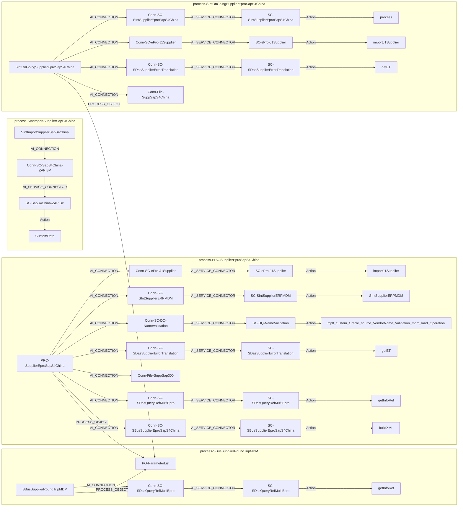
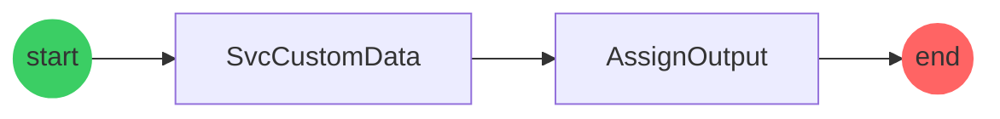
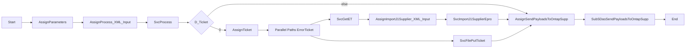
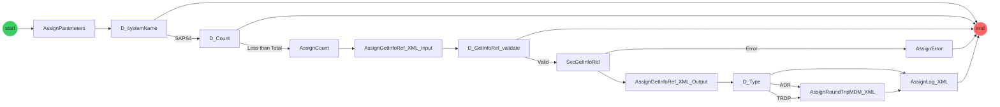

```mermaid
flowchart LR
  A[Start] --> B[AssignParameters]
  B --> D[AssignGetInfoRef_XML_Input]
  
  D --> E[SvcGetInfoRef]
  E --> F[AssignGetInfoRef_XML_Output]
  F --> G{D_GetInfoRef_code}
  G -->|0| H[AssignGetInfoRefData]
  G -->|else| I[AssignError]
  H --> J{D_CountData}
  J -->|>0| K[AssignError]
  J -->|else| L[AssignNameValidation_XML_Input]
  L --> M[SvcNameValidationIDQ]
  M --> C[AssignNameValidation_XML_Output]
  C --> N{D_ValidationStatus}
  N -->|Valid| O[AssignmentCallADR]
  N -->|else| P[AssignError]
  O --> Q{D_CallADR}
  Q -->|1| R[AssignBuildXML_XML_Input]
  Q -->|else| AE{D_Call_TRDP}
  R --> T[SvcBuildXML]
  T --> U[AssignBuildXML_XML_Output]
  U --> V{D_code}
  V -->|1| W[AssignBapiS4_XML_Input]
  V -->|else| X[AssignError]
  W --> Y[SubSIntImportSupplierSapS4China]
  Y --> YYY[AssignADRS4_XML_Output]
  YYY --> Z{D_CountErrorADRS4}
  Z -->|=0| AA[AssignRoundTripADR]
  Z -->|else| AB[AssignError]
  AA -->AAA[SvcImportJ1SupplierEpro]
  AAA --> AC[AssignImportJ1Supplier_XML_Output]
  AC --> AD{D_returnStatus}
  AD --> |1|AE{D_Call_TRDP}
  AD --> |else|AFF[AssignError]
  AE-->|1| RR[AssignBuildXML_XML_Input]
  AE -->|else| AEE{D_Ticket}
  RR --> TT[SvcBuildXML]
  TT --> UU[AssignBuildXML_XML_Output]
  UU --> VV{D_code}
  VV -->|1| WW[AssignBapiS4_XML_Input]
  VV -->|else| XX[AssignError]
  WW --> YY[SubSIntImportSupplierSapS4China]
  YY --> YYYY[AssignTRDPS4_XML_Output]
  YYYY --> ZZ{D_CountErrorTRDPS4}
  ZZ -->|=0| AAAA[AssignRoundTripTRDP]
  ZZ -->|else| ABB[AssingCode]
  AAAA -->AAAAA[SubSBusSupplierRoundTripMDM]
  AAAAA --> ACC[AssignRoundTripMDM_XML]
  ACC --> ADDD[SubSIntSupplierRoundTrip]
  ADDD --> ADD{D_Status}
  ADD -->|OK| ACCC[AssignOutput]
  ADD -->|ELSE| AEEE[AssignOutput]
  ABB --> AFFF{D_Code}
  AFFF -->|1|AGGG[SubSIntImportSupplierSapS4ChinaSBusSupplierRoundTripMDM]
  AFFF -->|else|AHHH[AssignError]
  AGGG --> AIII[AssignRoundTripMDM_XML]
  AIII --> AJJJ[SvcSIntSupplierERPMDM]
  AJJJ --> AHHH[AssignError]
  ACCC--> AEE{D_Ticket}
  AEEE--> AEE{D_Ticket}
  AEE-->|greater-than 0| ABBBB[AssignTicket]
  AEE-->|else| ACCCC[AssigParameterList]
  ABBBB --> ADDDD[Parallel Paths ErrorTicket]
  ADDDD --> AEEEE[SvcGetET]
  ADDDD --> AFFFF[SvcFilePutTicket]
  AEEEE --> AGGGG[AssignImportJ1Supplier_XML_Input]
  AGGGG --> AHHHH[SvcImportJ1SupplierEpro]
  AHHHH --> AIIII[AssignImportJ1Supplier_XML_Output]
  AIIII	--> AJJJJ[AssignError]
  AFFFF --> AJJJJ[AssignError]
  AJJJJ --> ACCCC[AssigParameterList]
  ACCCC --> AKKKK[SubSDasSendPayloadsToOntapSupp]
I -->AEE{D_Ticket}
  K -->AEE{D_Ticket}
  P -->AEE{D_Ticket}
  X -->AEE{D_Ticket}
  AB  -->AEE{D_Ticket}
  AFF-->AEE{D_Ticket}
  
  XX -->AEE{D_Ticket}
  AHHH-->AEE{D_Ticket}
  AKKKK --> AFFFFFF[End]
  class A start
  class AF e
```

## Document History

| Version | Date       | Author                                                                                              | Description     |
| ------- | ---------- | --------------------------------------------------------------------------------------------------- | --------------- |
| 1.0     | 11/21/2025 | <SwmMention uid="U1uKs9ON1OQA6dGe7ri83g8Vkbz2">[Obed Galicia](mailto:ogalicia@ppg.com)</SwmMention> | Initial version |
| 1.1     | 12/05/2025 | <SwmMention uid="2eshIj">[Obed Galicia](mailto:ogalicia@ppg.com)</SwmMention>                       | Final Version   |

## Document validation

| Version | Date       | Validator                                                                                 | Description |
| ------- | ---------- | ----------------------------------------------------------------------------------------- | ----------- |
| 1.0     | 11/21/2025 | <SwmMention uid="1VSWY3">[Giovani Perez Romero](mailto:giovaniperez@ppg.com)</SwmMention> | Approved    |
| 1.1     | 12/05/2025 | <SwmMention uid="1VSWY3">[Giovani Perez Romero](mailto:giovaniperez@ppg.com)</SwmMention> | Approved    |

## Reference documents

| Document Reference                                                                                                                                                                                                                                                                                                                          | Author          |
| ------------------------------------------------------------------------------------------------------------------------------------------------------------------------------------------------------------------------------------------------------------------------------------------------------------------------------------------- | --------------- |
| [PPG-Suppliers-ePro Integration to S4 China-MappingFile-IICS.xlsx](https://ppgindustriesinc.sharepoint.com/:x:/r/sites/EXT-IICS-CoE-Team-O365GL/_layouts/15/Doc.aspx?sourcedoc=%7B4C1A7BA7-1B71-4920-B504-C199E61CED8B%7D&file=PPG-Suppliers-ePro%20Integration%20to%20S4%20China-MappingFile-IICS.xlsx&action=default&mobileredirect=true) | @Atul Khatavkar |

# Purpose

This document describes the integration of the creation or updating of suppliers associated with the requirements for the ERP SAP S4 China

# System requirements

Secure Agent needs to be installed and running in IICS

# Process diagram

# Implementation

## <SwmToken path="/Explore/ePro_OnGoing/OnGoing_SapS4China/.PRC-SupplierEproSapS4China.PROCESS.json" pos="4:8:10" line-data="    &quot;name&quot; : &quot;PRC-SupplierEproSapS4China&quot;,">`PRC-SupplierEproSapS4China`</SwmToken>

This is a <SwmToken path="/Explore/ePro_OnGoing/OnGoing_SapS4China/.PRC-SupplierEproSapS4China.PROCESS.json" pos="5:8:8" line-data="    &quot;type&quot; : &quot;PROCESS&quot;,">`PROCESS`</SwmToken> to <SwmToken path="/Explore/ePro_OnGoing/OnGoing_SapS4China/.PRC-SupplierEproSapS4China.PROCESS.json" pos="16:19:19" line-data="        &quot;description&quot; : &quot;@source= EPRO, @operation= SendSupplier, @dataType= XMLSupplier, @target= ERP-S4- EPRO - MDM, @prcRunOn= SDCAMDMSA01, @prcAllowedGroups= Allow anonymous access, @additionalText= Process in charge of sending the supplier to ERP-S4 and generating the RT in Epro and MDM&quot;,">`SendSupplier`</SwmToken> the <SwmToken path="/Explore/ePro_OnGoing/OnGoing_SapS4China/.PRC-SupplierEproSapS4China.PROCESS.json" pos="16:26:26" line-data="        &quot;description&quot; : &quot;@source= EPRO, @operation= SendSupplier, @dataType= XMLSupplier, @target= ERP-S4- EPRO - MDM, @prcRunOn= SDCAMDMSA01, @prcAllowedGroups= Allow anonymous access, @additionalText= Process in charge of sending the supplier to ERP-S4 and generating the RT in Epro and MDM&quot;,">`XMLSupplier`</SwmToken> from <SwmToken path="/Explore/ePro_OnGoing/OnGoing_SapS4China/.PRC-SupplierEproSapS4China.PROCESS.json" pos="16:12:12" line-data="        &quot;description&quot; : &quot;@source= EPRO, @operation= SendSupplier, @dataType= XMLSupplier, @target= ERP-S4- EPRO - MDM, @prcRunOn= SDCAMDMSA01, @prcAllowedGroups= Allow anonymous access, @additionalText= Process in charge of sending the supplier to ERP-S4 and generating the RT in Epro and MDM&quot;,">`EPRO`</SwmToken> to be placed into <SwmToken path="/Explore/ePro_OnGoing/OnGoing_SapS4China/.PRC-SupplierEproSapS4China.PROCESS.json" pos="16:33:42" line-data="        &quot;description&quot; : &quot;@source= EPRO, @operation= SendSupplier, @dataType= XMLSupplier, @target= ERP-S4- EPRO - MDM, @prcRunOn= SDCAMDMSA01, @prcAllowedGroups= Allow anonymous access, @additionalText= Process in charge of sending the supplier to ERP-S4 and generating the RT in Epro and MDM&quot;,">`ERP-S4- EPRO - MDM`</SwmToken>. <SwmToken path="/Explore/ePro_OnGoing/OnGoing_SapS4China/.PRC-SupplierEproSapS4China.PROCESS.json" pos="16:67:101" line-data="        &quot;description&quot; : &quot;@source= EPRO, @operation= SendSupplier, @dataType= XMLSupplier, @target= ERP-S4- EPRO - MDM, @prcRunOn= SDCAMDMSA01, @prcAllowedGroups= Allow anonymous access, @additionalText= Process in charge of sending the supplier to ERP-S4 and generating the RT in Epro and MDM&quot;,">`Process in charge of sending the supplier to ERP-S4 and generating the RT in Epro and MDM`</SwmToken>.

### Deployment configuration

| Process Name                                                                                                                                                                                                                       | Binding                                                                                                                                                                  | Allowed Groups                                                                                                                                                                                                                                                                                                                                                                                                                                                                               | Run On                                                                                                                                                                                                                                                                                                                                                                                                                                                                            | Event Name | Service URL                                                                                 |
| ---------------------------------------------------------------------------------------------------------------------------------------------------------------------------------------------------------------------------------- | ------------------------------------------------------------------------------------------------------------------------------------------------------------------------ | -------------------------------------------------------------------------------------------------------------------------------------------------------------------------------------------------------------------------------------------------------------------------------------------------------------------------------------------------------------------------------------------------------------------------------------------------------------------------------------------- | --------------------------------------------------------------------------------------------------------------------------------------------------------------------------------------------------------------------------------------------------------------------------------------------------------------------------------------------------------------------------------------------------------------------------------------------------------------------------------- | ---------- | ------------------------------------------------------------------------------------------- |
| <SwmToken path="/Explore/ePro_OnGoing/OnGoing_SapS4China/.PRC-SupplierEproSapS4China.PROCESS.json" pos="4:8:10" line-data="    &quot;name&quot; : &quot;PRC-SupplierEproSapS4China&quot;,">`PRC-SupplierEproSapS4China`</SwmToken> | <SwmToken path="/Explore/ePro_OnGoing/OnGoing_SapS4China/PRC-SupplierEproSapS4China.PROCESS.xml" pos="476:2:2" line-data="               &lt;rest&gt;">`rest`</SwmToken> | <SwmToken path="/Explore/ePro_OnGoing/OnGoing_SapS4China/.PRC-SupplierEproSapS4China.PROCESS.json" pos="16:56:60" line-data="        &quot;description&quot; : &quot;@source= EPRO, @operation= SendSupplier, @dataType= XMLSupplier, @target= ERP-S4- EPRO - MDM, @prcRunOn= SDCAMDMSA01, @prcAllowedGroups= Allow anonymous access, @additionalText= Process in charge of sending the supplier to ERP-S4 and generating the RT in Epro and MDM&quot;,">`Allow anonymous access`</SwmToken> | <SwmToken path="/Explore/ePro_OnGoing/OnGoing_SapS4China/.PRC-SupplierEproSapS4China.PROCESS.json" pos="16:49:49" line-data="        &quot;description&quot; : &quot;@source= EPRO, @operation= SendSupplier, @dataType= XMLSupplier, @target= ERP-S4- EPRO - MDM, @prcRunOn= SDCAMDMSA01, @prcAllowedGroups= Allow anonymous access, @additionalText= Process in charge of sending the supplier to ERP-S4 and generating the RT in Epro and MDM&quot;,">`SDCAMDMSA01`</SwmToken> | N/A        | <http://ppg.cai.iics.dev.web.ppg.com/process-engine/public/soap/PRC-SupplierEproSapS4?wsdl> |

### Input

| Name                                                                                                                                                                                                                                                                                   | Description                                                                                                                                                                                                                                                                       | Type                                                                                                                                                                                                                                                                                   | Reference To | Required                                                                                                                                                                                                                                                                             |
| -------------------------------------------------------------------------------------------------------------------------------------------------------------------------------------------------------------------------------------------------------------------------------------- | --------------------------------------------------------------------------------------------------------------------------------------------------------------------------------------------------------------------------------------------------------------------------------- | -------------------------------------------------------------------------------------------------------------------------------------------------------------------------------------------------------------------------------------------------------------------------------------- | ------------ | ------------------------------------------------------------------------------------------------------------------------------------------------------------------------------------------------------------------------------------------------------------------------------------ |
| <SwmToken path="/Explore/ePro_OnGoing/OnGoing_SapS4China/PRC-SupplierEproSapS4China.PROCESS.xml" pos="35:13:13" line-data="               &lt;parameter description=&quot;XML&quot; name=&quot;in_XML&quot; required=&quot;true&quot; type=&quot;string&quot;&gt;">`in_XML`</SwmToken> | <SwmToken path="/Explore/ePro_OnGoing/OnGoing_SapS4China/PRC-SupplierEproSapS4China.PROCESS.xml" pos="35:7:7" line-data="               &lt;parameter description=&quot;XML&quot; name=&quot;in_XML&quot; required=&quot;true&quot; type=&quot;string&quot;&gt;">`XML`</SwmToken> | <SwmToken path="/Explore/ePro_OnGoing/OnGoing_SapS4China/PRC-SupplierEproSapS4China.PROCESS.xml" pos="35:25:25" line-data="               &lt;parameter description=&quot;XML&quot; name=&quot;in_XML&quot; required=&quot;true&quot; type=&quot;string&quot;&gt;">`string`</SwmToken> | N/A          | <SwmToken path="/Explore/ePro_OnGoing/OnGoing_SapS4China/PRC-SupplierEproSapS4China.PROCESS.xml" pos="35:19:19" line-data="               &lt;parameter description=&quot;XML&quot; name=&quot;in_XML&quot; required=&quot;true&quot; type=&quot;string&quot;&gt;">`true`</SwmToken> |
| <SwmToken path="/Explore/ePro_OnGoing/OnGoing_SapS4China/PRC-SupplierEproSapS4China.PROCESS.xml" pos="41:4:4" line-data="                          name=&quot;in_FileName&quot;">`in_FileName`</SwmToken>                                                                              | <SwmToken path="/Explore/ePro_OnGoing/OnGoing_SapS4China/PRC-SupplierEproSapS4China.PROCESS.xml" pos="40:7:7" line-data="               &lt;parameter description=&quot;FileName&quot;">`FileName`</SwmToken>                                                                     | <SwmToken path="/Explore/ePro_OnGoing/OnGoing_SapS4China/PRC-SupplierEproSapS4China.PROCESS.xml" pos="43:4:4" line-data="                          type=&quot;string&quot;&gt;">`string`</SwmToken>                                                                                    | N/A          | <SwmToken path="/Explore/ePro_OnGoing/OnGoing_SapS4China/PRC-SupplierEproSapS4China.PROCESS.xml" pos="42:4:4" line-data="                          required=&quot;true&quot;">`true`</SwmToken>                                                                                      |
| <SwmToken path="/Explore/ePro_OnGoing/OnGoing_SapS4China/PRC-SupplierEproSapS4China.PROCESS.xml" pos="49:4:4" line-data="                          name=&quot;in_LIFNR&quot;">`in_LIFNR`</SwmToken>                                                                                    | <SwmToken path="/Explore/ePro_OnGoing/OnGoing_SapS4China/PRC-SupplierEproSapS4China.PROCESS.xml" pos="48:7:7" line-data="               &lt;parameter description=&quot;LIFNR&quot;">`LIFNR`</SwmToken>                                                                           | <SwmToken path="/Explore/ePro_OnGoing/OnGoing_SapS4China/PRC-SupplierEproSapS4China.PROCESS.xml" pos="51:4:4" line-data="                          type=&quot;string&quot;&gt;">`string`</SwmToken>                                                                                    | N/A          | <SwmToken path="/Explore/ePro_OnGoing/OnGoing_SapS4China/PRC-SupplierEproSapS4China.PROCESS.xml" pos="50:4:4" line-data="                          required=&quot;true&quot;">`true`</SwmToken>                                                                                      |
| <SwmToken path="/Explore/ePro_OnGoing/OnGoing_SapS4China/PRC-SupplierEproSapS4China.PROCESS.xml" pos="57:4:4" line-data="                          name=&quot;in_LocPosition&quot;">`in_LocPosition`</SwmToken>                                                                        | <SwmToken path="/Explore/ePro_OnGoing/OnGoing_SapS4China/PRC-SupplierEproSapS4China.PROCESS.xml" pos="56:7:7" line-data="               &lt;parameter description=&quot;LocPosition&quot;">`LocPosition`</SwmToken>                                                               | <SwmToken path="/Explore/ePro_OnGoing/OnGoing_SapS4China/PRC-SupplierEproSapS4China.PROCESS.xml" pos="59:4:4" line-data="                          type=&quot;int&quot;&gt;">`int`</SwmToken>                                                                                          | N/A          | <SwmToken path="/Explore/ePro_OnGoing/OnGoing_SapS4China/PRC-SupplierEproSapS4China.PROCESS.xml" pos="58:4:4" line-data="                          required=&quot;true&quot;">`true`</SwmToken>                                                                                      |
| <SwmToken path="/Explore/ePro_OnGoing/OnGoing_SapS4China/PRC-SupplierEproSapS4China.PROCESS.xml" pos="65:4:4" line-data="                          name=&quot;in_IsChanged&quot;">`in_IsChanged`</SwmToken>                                                                            | <SwmToken path="/Explore/ePro_OnGoing/OnGoing_SapS4China/PRC-SupplierEproSapS4China.PROCESS.xml" pos="64:7:7" line-data="               &lt;parameter description=&quot;IsChanged&quot;">`IsChanged`</SwmToken>                                                                   | <SwmToken path="/Explore/ePro_OnGoing/OnGoing_SapS4China/PRC-SupplierEproSapS4China.PROCESS.xml" pos="67:4:4" line-data="                          type=&quot;string&quot;&gt;">`string`</SwmToken>                                                                                    | N/A          | <SwmToken path="/Explore/ePro_OnGoing/OnGoing_SapS4China/PRC-SupplierEproSapS4China.PROCESS.xml" pos="66:4:4" line-data="                          required=&quot;true&quot;">`true`</SwmToken>                                                                                      |
| <SwmToken path="/Explore/ePro_OnGoing/OnGoing_SapS4China/PRC-SupplierEproSapS4China.PROCESS.xml" pos="73:4:4" line-data="                          name=&quot;in_SendBankExt&quot;">`in_SendBankExt`</SwmToken>                                                                        | <SwmToken path="/Explore/ePro_OnGoing/OnGoing_SapS4China/PRC-SupplierEproSapS4China.PROCESS.xml" pos="72:7:7" line-data="               &lt;parameter description=&quot;SendBankExt&quot;">`SendBankExt`</SwmToken>                                                               | <SwmToken path="/Explore/ePro_OnGoing/OnGoing_SapS4China/PRC-SupplierEproSapS4China.PROCESS.xml" pos="75:4:4" line-data="                          type=&quot;string&quot;&gt;">`string`</SwmToken>                                                                                    | N/A          | <SwmToken path="/Explore/ePro_OnGoing/OnGoing_SapS4China/PRC-SupplierEproSapS4China.PROCESS.xml" pos="74:4:4" line-data="                          required=&quot;true&quot;">`true`</SwmToken>                                                                                      |

### Output

| Name                                                                                                                                                                                                                                                                                   | Description                                                                                                                                                                                                                                                                      | Type                                                                                                                                                                                                                                                                         | Required                                                                                                                                                                                                                          |
| -------------------------------------------------------------------------------------------------------------------------------------------------------------------------------------------------------------------------------------------------------------------------------------- | -------------------------------------------------------------------------------------------------------------------------------------------------------------------------------------------------------------------------------------------------------------------------------- | ---------------------------------------------------------------------------------------------------------------------------------------------------------------------------------------------------------------------------------------------------------------------------- | --------------------------------------------------------------------------------------------------------------------------------------------------------------------------------------------------------------------------------- |
| <SwmToken path="/Explore/ePro_OnGoing/OnGoing_SapS4China/PRC-SupplierEproSapS4China.PROCESS.xml" pos="82:13:13" line-data="               &lt;field description=&quot;LIFNR&quot; name=&quot;out_LIFNR&quot; type=&quot;string&quot;&gt;">`out_LIFNR`</SwmToken>                       | <SwmToken path="/Explore/ePro_OnGoing/OnGoing_SapS4China/PRC-SupplierEproSapS4China.PROCESS.xml" pos="82:7:7" line-data="               &lt;field description=&quot;LIFNR&quot; name=&quot;out_LIFNR&quot; type=&quot;string&quot;&gt;">`LIFNR`</SwmToken>                       | <SwmToken path="/Explore/ePro_OnGoing/OnGoing_SapS4China/PRC-SupplierEproSapS4China.PROCESS.xml" pos="82:19:19" line-data="               &lt;field description=&quot;LIFNR&quot; name=&quot;out_LIFNR&quot; type=&quot;string&quot;&gt;">`string`</SwmToken>                | <SwmToken path="/Explore/ePro_OnGoing/OnGoing_SapS4China/PRC-SupplierEproSapS4China.PROCESS.xml" pos="84:10:10" line-data="                     &lt;option name=&quot;required&quot;&gt;false&lt;/option&gt;">`false`</SwmToken>  |
| <SwmToken path="/Explore/ePro_OnGoing/OnGoing_SapS4China/PRC-SupplierEproSapS4China.PROCESS.xml" pos="87:13:13" line-data="               &lt;field description=&quot;InstanceID&quot; name=&quot;out_InstanceID&quot; type=&quot;string&quot;&gt;">`out_InstanceID`</SwmToken>        | <SwmToken path="/Explore/ePro_OnGoing/OnGoing_SapS4China/PRC-SupplierEproSapS4China.PROCESS.xml" pos="87:7:7" line-data="               &lt;field description=&quot;InstanceID&quot; name=&quot;out_InstanceID&quot; type=&quot;string&quot;&gt;">`InstanceID`</SwmToken>        | <SwmToken path="/Explore/ePro_OnGoing/OnGoing_SapS4China/PRC-SupplierEproSapS4China.PROCESS.xml" pos="87:19:19" line-data="               &lt;field description=&quot;InstanceID&quot; name=&quot;out_InstanceID&quot; type=&quot;string&quot;&gt;">`string`</SwmToken>      | <SwmToken path="/Explore/ePro_OnGoing/OnGoing_SapS4China/PRC-SupplierEproSapS4China.PROCESS.xml" pos="89:10:10" line-data="                     &lt;option name=&quot;required&quot;&gt;false&lt;/option&gt;">`false`</SwmToken>  |
| <SwmToken path="/Explore/ePro_OnGoing/OnGoing_SapS4China/PRC-SupplierEproSapS4China.PROCESS.xml" pos="92:13:13" line-data="               &lt;field description=&quot;ErpName&quot; name=&quot;out_ErpName&quot; type=&quot;string&quot;&gt;">`out_ErpName`</SwmToken>                 | <SwmToken path="/Explore/ePro_OnGoing/OnGoing_SapS4China/PRC-SupplierEproSapS4China.PROCESS.xml" pos="92:7:7" line-data="               &lt;field description=&quot;ErpName&quot; name=&quot;out_ErpName&quot; type=&quot;string&quot;&gt;">`ErpName`</SwmToken>                 | <SwmToken path="/Explore/ePro_OnGoing/OnGoing_SapS4China/PRC-SupplierEproSapS4China.PROCESS.xml" pos="92:19:19" line-data="               &lt;field description=&quot;ErpName&quot; name=&quot;out_ErpName&quot; type=&quot;string&quot;&gt;">`string`</SwmToken>            | <SwmToken path="/Explore/ePro_OnGoing/OnGoing_SapS4China/PRC-SupplierEproSapS4China.PROCESS.xml" pos="94:10:10" line-data="                     &lt;option name=&quot;required&quot;&gt;false&lt;/option&gt;">`false`</SwmToken>  |
| <SwmToken path="/Explore/ePro_OnGoing/OnGoing_SapS4China/PRC-SupplierEproSapS4China.PROCESS.xml" pos="97:13:13" line-data="               &lt;field description=&quot;Step&quot; name=&quot;out_Step&quot; type=&quot;string&quot;&gt;">`out_Step`</SwmToken>                          | <SwmToken path="/Explore/ePro_OnGoing/OnGoing_SapS4China/PRC-SupplierEproSapS4China.PROCESS.xml" pos="97:7:7" line-data="               &lt;field description=&quot;Step&quot; name=&quot;out_Step&quot; type=&quot;string&quot;&gt;">`Step`</SwmToken>                          | <SwmToken path="/Explore/ePro_OnGoing/OnGoing_SapS4China/PRC-SupplierEproSapS4China.PROCESS.xml" pos="97:19:19" line-data="               &lt;field description=&quot;Step&quot; name=&quot;out_Step&quot; type=&quot;string&quot;&gt;">`string`</SwmToken>                  | <SwmToken path="/Explore/ePro_OnGoing/OnGoing_SapS4China/PRC-SupplierEproSapS4China.PROCESS.xml" pos="99:10:10" line-data="                     &lt;option name=&quot;required&quot;&gt;false&lt;/option&gt;">`false`</SwmToken>  |
| <SwmToken path="/Explore/ePro_OnGoing/OnGoing_SapS4China/PRC-SupplierEproSapS4China.PROCESS.xml" pos="102:13:13" line-data="               &lt;field description=&quot;Code&quot; name=&quot;out_Code&quot; type=&quot;string&quot;&gt;">`out_Code`</SwmToken>                         | <SwmToken path="/Explore/ePro_OnGoing/OnGoing_SapS4China/PRC-SupplierEproSapS4China.PROCESS.xml" pos="102:7:7" line-data="               &lt;field description=&quot;Code&quot; name=&quot;out_Code&quot; type=&quot;string&quot;&gt;">`Code`</SwmToken>                         | <SwmToken path="/Explore/ePro_OnGoing/OnGoing_SapS4China/PRC-SupplierEproSapS4China.PROCESS.xml" pos="102:19:19" line-data="               &lt;field description=&quot;Code&quot; name=&quot;out_Code&quot; type=&quot;string&quot;&gt;">`string`</SwmToken>                 | <SwmToken path="/Explore/ePro_OnGoing/OnGoing_SapS4China/PRC-SupplierEproSapS4China.PROCESS.xml" pos="104:10:10" line-data="                     &lt;option name=&quot;required&quot;&gt;false&lt;/option&gt;">`false`</SwmToken> |
| <SwmToken path="/Explore/ePro_OnGoing/OnGoing_SapS4China/PRC-SupplierEproSapS4China.PROCESS.xml" pos="107:13:13" line-data="               &lt;field description=&quot;Message&quot; name=&quot;out_Message&quot; type=&quot;string&quot;&gt;">`out_Message`</SwmToken>                | <SwmToken path="/Explore/ePro_OnGoing/OnGoing_SapS4China/PRC-SupplierEproSapS4China.PROCESS.xml" pos="107:7:7" line-data="               &lt;field description=&quot;Message&quot; name=&quot;out_Message&quot; type=&quot;string&quot;&gt;">`Message`</SwmToken>                | <SwmToken path="/Explore/ePro_OnGoing/OnGoing_SapS4China/PRC-SupplierEproSapS4China.PROCESS.xml" pos="107:19:19" line-data="               &lt;field description=&quot;Message&quot; name=&quot;out_Message&quot; type=&quot;string&quot;&gt;">`string`</SwmToken>           | <SwmToken path="/Explore/ePro_OnGoing/OnGoing_SapS4China/PRC-SupplierEproSapS4China.PROCESS.xml" pos="109:10:10" line-data="                     &lt;option name=&quot;required&quot;&gt;false&lt;/option&gt;">`false`</SwmToken> |
| <SwmToken path="/Explore/ePro_OnGoing/OnGoing_SapS4China/PRC-SupplierEproSapS4China.PROCESS.xml" pos="112:13:13" line-data="               &lt;field description=&quot;ADRRequest&quot; name=&quot;out_ADRRequest&quot; type=&quot;string&quot;&gt;">`out_ADRRequest`</SwmToken>       | <SwmToken path="/Explore/ePro_OnGoing/OnGoing_SapS4China/PRC-SupplierEproSapS4China.PROCESS.xml" pos="112:7:7" line-data="               &lt;field description=&quot;ADRRequest&quot; name=&quot;out_ADRRequest&quot; type=&quot;string&quot;&gt;">`ADRRequest`</SwmToken>       | <SwmToken path="/Explore/ePro_OnGoing/OnGoing_SapS4China/PRC-SupplierEproSapS4China.PROCESS.xml" pos="112:19:19" line-data="               &lt;field description=&quot;ADRRequest&quot; name=&quot;out_ADRRequest&quot; type=&quot;string&quot;&gt;">`string`</SwmToken>     | <SwmToken path="/Explore/ePro_OnGoing/OnGoing_SapS4China/PRC-SupplierEproSapS4China.PROCESS.xml" pos="114:10:10" line-data="                     &lt;option name=&quot;required&quot;&gt;false&lt;/option&gt;">`false`</SwmToken> |
| <SwmToken path="/Explore/ePro_OnGoing/OnGoing_SapS4China/PRC-SupplierEproSapS4China.PROCESS.xml" pos="117:13:13" line-data="               &lt;field description=&quot;ADRResponse&quot; name=&quot;out_ADRResponse&quot; type=&quot;string&quot;&gt;">`out_ADRResponse`</SwmToken>    | <SwmToken path="/Explore/ePro_OnGoing/OnGoing_SapS4China/PRC-SupplierEproSapS4China.PROCESS.xml" pos="117:7:7" line-data="               &lt;field description=&quot;ADRResponse&quot; name=&quot;out_ADRResponse&quot; type=&quot;string&quot;&gt;">`ADRResponse`</SwmToken>    | <SwmToken path="/Explore/ePro_OnGoing/OnGoing_SapS4China/PRC-SupplierEproSapS4China.PROCESS.xml" pos="117:19:19" line-data="               &lt;field description=&quot;ADRResponse&quot; name=&quot;out_ADRResponse&quot; type=&quot;string&quot;&gt;">`string`</SwmToken>   | <SwmToken path="/Explore/ePro_OnGoing/OnGoing_SapS4China/PRC-SupplierEproSapS4China.PROCESS.xml" pos="119:10:10" line-data="                     &lt;option name=&quot;required&quot;&gt;false&lt;/option&gt;">`false`</SwmToken> |
| <SwmToken path="/Explore/ePro_OnGoing/OnGoing_SapS4China/PRC-SupplierEproSapS4China.PROCESS.xml" pos="122:13:13" line-data="               &lt;field description=&quot;TRDPRequest&quot; name=&quot;out_TRDPRequest&quot; type=&quot;string&quot;&gt;">`out_TRDPRequest`</SwmToken>    | <SwmToken path="/Explore/ePro_OnGoing/OnGoing_SapS4China/PRC-SupplierEproSapS4China.PROCESS.xml" pos="122:7:7" line-data="               &lt;field description=&quot;TRDPRequest&quot; name=&quot;out_TRDPRequest&quot; type=&quot;string&quot;&gt;">`TRDPRequest`</SwmToken>    | <SwmToken path="/Explore/ePro_OnGoing/OnGoing_SapS4China/PRC-SupplierEproSapS4China.PROCESS.xml" pos="122:19:19" line-data="               &lt;field description=&quot;TRDPRequest&quot; name=&quot;out_TRDPRequest&quot; type=&quot;string&quot;&gt;">`string`</SwmToken>   | <SwmToken path="/Explore/ePro_OnGoing/OnGoing_SapS4China/PRC-SupplierEproSapS4China.PROCESS.xml" pos="124:10:10" line-data="                     &lt;option name=&quot;required&quot;&gt;false&lt;/option&gt;">`false`</SwmToken> |
| <SwmToken path="/Explore/ePro_OnGoing/OnGoing_SapS4China/PRC-SupplierEproSapS4China.PROCESS.xml" pos="127:13:13" line-data="               &lt;field description=&quot;TRDPResponse&quot; name=&quot;out_TRDPResponse&quot; type=&quot;string&quot;&gt;">`out_TRDPResponse`</SwmToken> | <SwmToken path="/Explore/ePro_OnGoing/OnGoing_SapS4China/PRC-SupplierEproSapS4China.PROCESS.xml" pos="127:7:7" line-data="               &lt;field description=&quot;TRDPResponse&quot; name=&quot;out_TRDPResponse&quot; type=&quot;string&quot;&gt;">`TRDPResponse`</SwmToken> | <SwmToken path="/Explore/ePro_OnGoing/OnGoing_SapS4China/PRC-SupplierEproSapS4China.PROCESS.xml" pos="127:19:19" line-data="               &lt;field description=&quot;TRDPResponse&quot; name=&quot;out_TRDPResponse&quot; type=&quot;string&quot;&gt;">`string`</SwmToken> | <SwmToken path="/Explore/ePro_OnGoing/OnGoing_SapS4China/PRC-SupplierEproSapS4China.PROCESS.xml" pos="129:10:10" line-data="                     &lt;option name=&quot;required&quot;&gt;false&lt;/option&gt;">`false`</SwmToken> |

### Dependency diagram

## Bpel

### <SwmToken path="/Explore/ePro_OnGoing/OnGoing_SapS4China/PRC-SupplierEproSapS4China.PROCESS.xml" pos="1539:11:11" line-data="                                             &lt;expression language=&quot;XQuery&quot;&gt;&#39;SBusSupplierEproSapS4China&#39;&lt;/expression&gt;">`SBusSupplierEproSapS4China`</SwmToken>

#### Process

| Operation | Binding | Allowed         | Run On      | Service URL                                                                              | Description                                                     |
| --------- | ------- | --------------- | ----------- | ---------------------------------------------------------------------------------------- | --------------------------------------------------------------- |
| buildXML  | SOAP    | ServiceConsumer | SDCAMDMSA01 | <http://ppg.cai.iics.dev.web.ppg.com/process-engine/services/SBusSupplierEproSapS4?wsdl> | General rules on and generate the XML BAPI ADR and TRDP request |

#### Process Flow

&nbsp;

&nbsp;

&nbsp;

#### Inputs

| Label          | Type    | Description       |
| -------------- | ------- | ----------------- |
| xml            | Text    | Input XML         |
| *BPADR*        | Text    | BP ID ADR         |
| locPosition    | Integer | location position |
| addPosition    | Integer | Addres Position   |
| charactersHTML | Text    | Characters HTML   |
| accountGroup   | Text    | Account Group     |

#### Outputs

| Label      | Type    | Description        |
| ---------- | ------- | ------------------ |
| xmlBapi    | Text    | XML BAPI           |
| instanceId | Integer | Instance ID        |
| code       | Text    | Output Code Number |
| message    | Text    | Output Message     |

#### **Participants**

| Partner Service Provider | Type        |
| ------------------------ | ----------- |
| PsvEProReference         | Data access |

## Process Objects

### <SwmToken path="/Explore/ePro_OnGoing/OnGoing_SapS4China/.PRC-SupplierEproSapS4China.PROCESS.json" pos="106:8:10" line-data="    &quot;name&quot; : &quot;PO-ParameterList&quot;,">`PO-ParameterList`</SwmToken>

This is a <SwmToken path="/Explore/ePro_OnGoing/OnGoing_SapS4China/.PRC-SupplierEproSapS4China.PROCESS.json" pos="107:8:8" line-data="    &quot;type&quot; : &quot;PROCESS_OBJECT&quot;,">`PROCESS_OBJECT`</SwmToken> to <SwmToken path="/Explore/ePro_OnGoing/OnGoing_SapS4China/.PRC-SupplierEproSapS4China.PROCESS.json" pos="118:12:12" line-data="        &quot;description&quot; : &quot;@operation= receive, @dataType= any data list, @application= utility&quot;,">`receive`</SwmToken> the data structure of <SwmToken path="/Explore/ePro_OnGoing/OnGoing_SapS4China/.PRC-SupplierEproSapS4China.PROCESS.json" pos="118:19:23" line-data="        &quot;description&quot; : &quot;@operation= receive, @dataType= any data list, @application= utility&quot;,">`any data list`</SwmToken> required by <SwmToken path="/Explore/ePro_OnGoing/OnGoing_SapS4China/.PRC-SupplierEproSapS4China.PROCESS.json" pos="118:30:30" line-data="        &quot;description&quot; : &quot;@operation= receive, @dataType= any data list, @application= utility&quot;,">`utility`</SwmToken>

## APP Connection

### <SwmToken path="/Explore/ePro_OnGoing/OnGoing_SapS4China/.PRC-SupplierEproSapS4China.PROCESS.json" pos="46:8:14" line-data="    &quot;name&quot; : &quot;Conn-SC-ePro-J1Supplier&quot;,">`Conn-SC-ePro-J1Supplier`</SwmToken>&nbsp;

This is a <SwmToken path="/Explore/ePro_OnGoing/OnGoing_SapS4China/.PRC-SupplierEproSapS4China.PROCESS.json" pos="47:8:8" line-data="    &quot;type&quot; : &quot;AI_CONNECTION&quot;,">`AI_CONNECTION`</SwmToken> that provides <SwmToken path="/Explore/ePro_OnGoing/OnGoing_SapS4China/.PRC-SupplierEproSapS4China.PROCESS.json" pos="58:12:14" line-data="        &quot;description&quot; : &quot;@appType= Service Connector, @application= ePro J1 Supplier, @additionalText= Connection for Service Connector SC-ePro-J1Supplier, @appSCName= SC-ePro-J1Supplier&quot;,">`Service Connector`</SwmToken> functionality for the <SwmToken path="/Explore/ePro_OnGoing/OnGoing_SapS4China/.PRC-SupplierEproSapS4China.PROCESS.json" pos="58:21:25" line-data="        &quot;description&quot; : &quot;@appType= Service Connector, @application= ePro J1 Supplier, @additionalText= Connection for Service Connector SC-ePro-J1Supplier, @appSCName= SC-ePro-J1Supplier&quot;,">`ePro J1 Supplier`</SwmToken> application. <SwmToken path="/Explore/ePro_OnGoing/OnGoing_SapS4China/.PRC-SupplierEproSapS4China.PROCESS.json" pos="58:32:44" line-data="        &quot;description&quot; : &quot;@appType= Service Connector, @application= ePro J1 Supplier, @additionalText= Connection for Service Connector SC-ePro-J1Supplier, @appSCName= SC-ePro-J1Supplier&quot;,">`Connection for Service Connector SC-ePro-J1Supplier`</SwmToken>

| Name                                                                                                                                                                                                                          | Path                                                                                                                                                                                                                                         |
| ----------------------------------------------------------------------------------------------------------------------------------------------------------------------------------------------------------------------------- | -------------------------------------------------------------------------------------------------------------------------------------------------------------------------------------------------------------------------------------------- |
| <SwmToken path="/Explore/ePro_OnGoing/OnGoing_SapS4China/.PRC-SupplierEproSapS4China.PROCESS.json" pos="46:8:14" line-data="    &quot;name&quot; : &quot;Conn-SC-ePro-J1Supplier&quot;,">`Conn-SC-ePro-J1Supplier`</SwmToken> | <SwmToken path="/Explore/ePro_OnGoing/OnGoing_SapS4China/.PRC-SupplierEproSapS4China.PROCESS.json" pos="63:8:13" line-data="    &quot;path&quot; : &quot;/Explore/ePro_OnGoing/Utilities&quot;">`/Explore/ePro_OnGoing/Utilities`</SwmToken> |

## Service Connector

This is a <SwmToken path="/Explore/ePro_OnGoing/Utilities/.Conn-SC-ePro-J1Supplier.AI_CONNECTION.json" pos="27:8:8" line-data="    &quot;type&quot; : &quot;AI_SERVICE_CONNECTOR&quot;,">`AI_SERVICE_CONNECTOR`</SwmToken> that provides <SwmToken path="/Explore/ePro_OnGoing/Utilities/.Conn-SC-ePro-J1Supplier.AI_CONNECTION.json" pos="38:12:12" line-data="        &quot;description&quot; : &quot;@scType= SOAP, @application= ePro-J1Supplier Service, @additionalText= Connector to import a supplier&quot;,">`SOAP`</SwmToken> functionality for the <SwmToken path="/Explore/ePro_OnGoing/Utilities/.Conn-SC-ePro-J1Supplier.AI_CONNECTION.json" pos="38:19:23" line-data="        &quot;description&quot; : &quot;@scType= SOAP, @application= ePro-J1Supplier Service, @additionalText= Connector to import a supplier&quot;,">`ePro-J1Supplier Service`</SwmToken> application. <SwmToken path="/Explore/ePro_OnGoing/Utilities/.Conn-SC-ePro-J1Supplier.AI_CONNECTION.json" pos="38:30:38" line-data="        &quot;description&quot; : &quot;@scType= SOAP, @application= ePro-J1Supplier Service, @additionalText= Connector to import a supplier&quot;,">`Connector to import a supplier`</SwmToken>

### Actions

| Name                                                                                                                                                                                                         | Category                                                                                                                                                                                                                                                 | Fail on Error                                                                                                                                                                               | For Search                                                                                                                                                                                  | Max Redirects                                                                                                                                                                              | Preemptive Auth                                                                                                                                                                                | Description                                                                                                                                                                                                                     |
| ------------------------------------------------------------------------------------------------------------------------------------------------------------------------------------------------------------ | -------------------------------------------------------------------------------------------------------------------------------------------------------------------------------------------------------------------------------------------------------- | ------------------------------------------------------------------------------------------------------------------------------------------------------------------------------------------- | ------------------------------------------------------------------------------------------------------------------------------------------------------------------------------------------- | ------------------------------------------------------------------------------------------------------------------------------------------------------------------------------------------ | ---------------------------------------------------------------------------------------------------------------------------------------------------------------------------------------------- | ------------------------------------------------------------------------------------------------------------------------------------------------------------------------------------------------------------------------------- |
| <SwmToken path="/Explore/ePro_OnGoing/Utilities/SC-ePro-J1Supplier.AI_SERVICE_CONNECTOR.xml" pos="39:4:4" line-data="                       name=&quot;importJ1Supplier&quot;">`importJ1Supplier`</SwmToken> | <SwmToken path="/Explore/ePro_OnGoing/Utilities/SC-ePro-J1Supplier.AI_SERVICE_CONNECTOR.xml" pos="34:7:11" line-data="               &lt;action category=&quot;AllProjects/ePro_OnGoing/Utilerias&quot;">`AllProjects/ePro_OnGoing/Utilerias`</SwmToken> | <SwmToken path="/Explore/ePro_OnGoing/Utilities/SC-ePro-J1Supplier.AI_SERVICE_CONNECTOR.xml" pos="35:4:4" line-data="                       failOnError=&quot;true&quot;">`true`</SwmToken> | <SwmToken path="/Explore/ePro_OnGoing/Utilities/SC-ePro-J1Supplier.AI_SERVICE_CONNECTOR.xml" pos="36:4:4" line-data="                       forSearch=&quot;false&quot;">`false`</SwmToken> | <SwmToken path="/Explore/ePro_OnGoing/Utilities/SC-ePro-J1Supplier.AI_SERVICE_CONNECTOR.xml" pos="38:4:4" line-data="                       maxRedirects=&quot;100&quot;">`100`</SwmToken> | <SwmToken path="/Explore/ePro_OnGoing/Utilities/SC-ePro-J1Supplier.AI_SERVICE_CONNECTOR.xml" pos="40:4:4" line-data="                       preemptiveAuth=&quot;true&quot;">`true`</SwmToken> | <SwmToken path="/Explore/ePro_OnGoing/Utilities/SC-ePro-J1Supplier.AI_SERVICE_CONNECTOR.xml" pos="42:4:8" line-data="                  &lt;description&gt;import a supplier&lt;/description&gt;">`import a supplier`</SwmToken> |

#### Input

| Name                                                                                                                                                                                                          | Label                                                                                                                                                                                                          | Required                                                                                                                                                                                          | Type                                                                                                                                                                                                   | Description                                                                                                                                                                                                               |
| ------------------------------------------------------------------------------------------------------------------------------------------------------------------------------------------------------------- | -------------------------------------------------------------------------------------------------------------------------------------------------------------------------------------------------------------- | ------------------------------------------------------------------------------------------------------------------------------------------------------------------------------------------------- | ------------------------------------------------------------------------------------------------------------------------------------------------------------------------------------------------------ | ------------------------------------------------------------------------------------------------------------------------------------------------------------------------------------------------------------------------- |
| <SwmToken path="/Explore/ePro_OnGoing/Utilities/SC-ePro-J1Supplier.AI_SERVICE_CONNECTOR.xml" pos="46:4:4" line-data="                                name=&quot;in_scRequest&quot;">`in_scRequest`</SwmToken> | <SwmToken path="/Explore/ePro_OnGoing/Utilities/SC-ePro-J1Supplier.AI_SERVICE_CONNECTOR.xml" pos="45:4:4" line-data="                                label=&quot;in_scRequest&quot;">`in_scRequest`</SwmToken> | <SwmToken path="/Explore/ePro_OnGoing/Utilities/SC-ePro-J1Supplier.AI_SERVICE_CONNECTOR.xml" pos="47:4:4" line-data="                                required=&quot;true&quot;">`true`</SwmToken> | <SwmToken path="/Explore/ePro_OnGoing/Utilities/SC-ePro-J1Supplier.AI_SERVICE_CONNECTOR.xml" pos="49:4:4" line-data="                                type=&quot;string&quot;/&gt;">`string`</SwmToken> | <SwmToken path="/Explore/ePro_OnGoing/Utilities/SC-ePro-J1Supplier.AI_SERVICE_CONNECTOR.xml" pos="44:7:9" line-data="                     &lt;parameter description=&quot;Input request&quot;">`Input request`</SwmToken> |

#### Output

| Name                                                                                                                                                                                                          | Type                                                                                                                                                                                               | Description                                                                                                                                                                                                             |
| ------------------------------------------------------------------------------------------------------------------------------------------------------------------------------------------------------------- | -------------------------------------------------------------------------------------------------------------------------------------------------------------------------------------------------- | ----------------------------------------------------------------------------------------------------------------------------------------------------------------------------------------------------------------------- |
| <SwmToken path="/Explore/ePro_OnGoing/Utilities/SC-ePro-J1Supplier.AI_SERVICE_CONNECTOR.xml" pos="69:4:4" line-data="                            name=&quot;out_scResponse&quot;">`out_scResponse`</SwmToken> | <SwmToken path="/Explore/ePro_OnGoing/Utilities/SC-ePro-J1Supplier.AI_SERVICE_CONNECTOR.xml" pos="70:4:4" line-data="                            type=&quot;string&quot;/&gt;">`string`</SwmToken> | <SwmToken path="/Explore/ePro_OnGoing/Utilities/SC-ePro-J1Supplier.AI_SERVICE_CONNECTOR.xml" pos="67:7:9" line-data="                     &lt;field description=&quot;Output request&quot;">`Output request`</SwmToken> |

#### Binding

| URL                                                                                                                                                                                                                                                                                                                                     | Verb                                                                                                                                                                                                      | HTTP-Headers                                                                                                                                                                                                                                                                                                                                                                                                                                                                                                                                                                                                                                              | Body                                                                                                                                                                                                                |
| --------------------------------------------------------------------------------------------------------------------------------------------------------------------------------------------------------------------------------------------------------------------------------------------------------------------------------------- | --------------------------------------------------------------------------------------------------------------------------------------------------------------------------------------------------------- | --------------------------------------------------------------------------------------------------------------------------------------------------------------------------------------------------------------------------------------------------------------------------------------------------------------------------------------------------------------------------------------------------------------------------------------------------------------------------------------------------------------------------------------------------------------------------------------------------------------------------------------------------------- | ------------------------------------------------------------------------------------------------------------------------------------------------------------------------------------------------------------------- |
| <SwmToken path="/Explore/ePro_OnGoing/Utilities/SC-ePro-J1Supplier.AI_SERVICE_CONNECTOR.xml" pos="53:4:24" line-data="                                        url=&quot;https://ppgeu-ws03-prep.app.jaggaer.com/esop/jint/services/J1Supplier&quot;">`https://ppgeu-ws03-prep.app.jaggaer.com/esop/jint/services/J1Supplier`</SwmToken> | <SwmToken path="/Explore/ePro_OnGoing/Utilities/SC-ePro-J1Supplier.AI_SERVICE_CONNECTOR.xml" pos="54:4:4" line-data="                                        verb=&quot;POST&quot;&gt;">`POST`</SwmToken> | Content-Type:<SwmToken path="/Explore/ePro_OnGoing/Utilities/SC-ePro-J1Supplier.AI_SERVICE_CONNECTOR.xml" pos="60:12:20" line-data="                           &lt;header name=&quot;Content-Type&quot;&gt;text/xml;charset=utf-8&lt;/header&gt;">`text/xml;charset=utf-8`</SwmToken>; Authorization:<SwmToken path="/Explore/ePro_OnGoing/Utilities/SC-ePro-J1Supplier.AI_SERVICE_CONNECTOR.xml" pos="61:10:25" line-data="                           &lt;header name=&quot;Authorization&quot;&gt;{util:resolveURN(&#39;urn:Authorization-ePro-J1Supplier&#39;)}&lt;/header&gt;">`{util:resolveURN('urn:Authorization-ePro-J1Supplier')}`</SwmToken> | <SwmToken path="/Explore/ePro_OnGoing/Utilities/SC-ePro-J1Supplier.AI_SERVICE_CONNECTOR.xml" pos="63:4:7" line-data="                        &lt;body&gt;{$in_scRequest}&lt;/body&gt;">`{$in_scRequest}`</SwmToken> |

### <SwmToken path="/Explore/ePro_OnGoing/OnGoing_SapS4China/.PRC-SupplierEproSapS4China.PROCESS.json" pos="66:8:12" line-data="    &quot;name&quot; : &quot;Conn-SC-SIntSupplierERPMDM&quot;,">`Conn-SC-SIntSupplierERPMDM`</SwmToken>&nbsp;

This is a <SwmToken path="/Explore/ePro_OnGoing/OnGoing_SapS4China/.PRC-SupplierEproSapS4China.PROCESS.json" pos="67:8:8" line-data="    &quot;type&quot; : &quot;AI_CONNECTION&quot;,">`AI_CONNECTION`</SwmToken> that provides <SwmToken path="/Explore/ePro_OnGoing/OnGoing_SapS4China/.PRC-SupplierEproSapS4China.PROCESS.json" pos="78:12:14" line-data="        &quot;description&quot; : &quot;@appType= Service Connector, @application= Round Trip, @additionalText= Connection for Service Connector SC-SIntSupplierERPMDM, @appSCName=SC-SIntSupplierERPMDM&quot;,">`Service Connector`</SwmToken> functionality for the <SwmToken path="/Explore/ePro_OnGoing/OnGoing_SapS4China/.PRC-SupplierEproSapS4China.PROCESS.json" pos="78:21:23" line-data="        &quot;description&quot; : &quot;@appType= Service Connector, @application= Round Trip, @additionalText= Connection for Service Connector SC-SIntSupplierERPMDM, @appSCName=SC-SIntSupplierERPMDM&quot;,">`Round Trip`</SwmToken> application. <SwmToken path="/Explore/ePro_OnGoing/OnGoing_SapS4China/.PRC-SupplierEproSapS4China.PROCESS.json" pos="78:30:40" line-data="        &quot;description&quot; : &quot;@appType= Service Connector, @application= Round Trip, @additionalText= Connection for Service Connector SC-SIntSupplierERPMDM, @appSCName=SC-SIntSupplierERPMDM&quot;,">`Connection for Service Connector SC-SIntSupplierERPMDM`</SwmToken>

| Name                                                                                                                                                                                                                                | Path                                                                                                                                                                                                                                         |
| ----------------------------------------------------------------------------------------------------------------------------------------------------------------------------------------------------------------------------------- | -------------------------------------------------------------------------------------------------------------------------------------------------------------------------------------------------------------------------------------------- |
| <SwmToken path="/Explore/ePro_OnGoing/OnGoing_SapS4China/.PRC-SupplierEproSapS4China.PROCESS.json" pos="66:8:12" line-data="    &quot;name&quot; : &quot;Conn-SC-SIntSupplierERPMDM&quot;,">`Conn-SC-SIntSupplierERPMDM`</SwmToken> | <SwmToken path="/Explore/ePro_OnGoing/OnGoing_SapS4China/.PRC-SupplierEproSapS4China.PROCESS.json" pos="83:8:13" line-data="    &quot;path&quot; : &quot;/Explore/ePro_OnGoing/Utilities&quot;">`/Explore/ePro_OnGoing/Utilities`</SwmToken> |

## Service Connector

This is a <SwmToken path="/Explore/ePro_OnGoing/Utilities/.Conn-SC-SIntSupplierERPMDM.AI_CONNECTION.json" pos="27:8:8" line-data="    &quot;type&quot; : &quot;AI_SERVICE_CONNECTOR&quot;,">`AI_SERVICE_CONNECTOR`</SwmToken> that provides <SwmToken path="/Explore/ePro_OnGoing/Utilities/.Conn-SC-SIntSupplierERPMDM.AI_CONNECTION.json" pos="38:11:11" line-data="        &quot;description&quot; : &quot;@scType=REST, @application= Round Trip, @additionalText=Connection in charge of communication with SIntSupplierERPMDM&quot;,">`REST`</SwmToken> functionality for the <SwmToken path="/Explore/ePro_OnGoing/Utilities/.Conn-SC-SIntSupplierERPMDM.AI_CONNECTION.json" pos="38:18:20" line-data="        &quot;description&quot; : &quot;@scType=REST, @application= Round Trip, @additionalText=Connection in charge of communication with SIntSupplierERPMDM&quot;,">`Round Trip`</SwmToken> application. <SwmToken path="/Explore/ePro_OnGoing/Utilities/.Conn-SC-SIntSupplierERPMDM.AI_CONNECTION.json" pos="38:26:38" line-data="        &quot;description&quot; : &quot;@scType=REST, @application= Round Trip, @additionalText=Connection in charge of communication with SIntSupplierERPMDM&quot;,">`Connection in charge of communication with SIntSupplierERPMDM`</SwmToken>

### Actions

| Name                                                                                                                                                                                                                | Category                                                                                                                                                                                                                           | Fail on Error                                                                                                                                                                                  | For Search                                                                                                                                                                                     | Max Redirects                                                                                                                                                                                 | Preemptive Auth                                                                                                                                                                                   | Description                                                                                                                                                                                                                          |
| ------------------------------------------------------------------------------------------------------------------------------------------------------------------------------------------------------------------- | ---------------------------------------------------------------------------------------------------------------------------------------------------------------------------------------------------------------------------------- | ---------------------------------------------------------------------------------------------------------------------------------------------------------------------------------------------- | ---------------------------------------------------------------------------------------------------------------------------------------------------------------------------------------------- | --------------------------------------------------------------------------------------------------------------------------------------------------------------------------------------------- | ------------------------------------------------------------------------------------------------------------------------------------------------------------------------------------------------- | ------------------------------------------------------------------------------------------------------------------------------------------------------------------------------------------------------------------------------------ |
| <SwmToken path="/Explore/ePro_OnGoing/Utilities/SC-SIntSupplierERPMDM.AI_SERVICE_CONNECTOR.xml" pos="39:4:4" line-data="                       name=&quot;SIntSupplierERPMDM&quot;">`SIntSupplierERPMDM`</SwmToken> | <SwmToken path="/Explore/ePro_OnGoing/Utilities/SC-SIntSupplierERPMDM.AI_SERVICE_CONNECTOR.xml" pos="34:7:9" line-data="               &lt;action category=&quot;ePro_OnGoing/Utilities&quot;">`ePro_OnGoing/Utilities`</SwmToken> | <SwmToken path="/Explore/ePro_OnGoing/Utilities/SC-SIntSupplierERPMDM.AI_SERVICE_CONNECTOR.xml" pos="35:4:4" line-data="                       failOnError=&quot;true&quot;">`true`</SwmToken> | <SwmToken path="/Explore/ePro_OnGoing/Utilities/SC-SIntSupplierERPMDM.AI_SERVICE_CONNECTOR.xml" pos="36:4:4" line-data="                       forSearch=&quot;false&quot;">`false`</SwmToken> | <SwmToken path="/Explore/ePro_OnGoing/Utilities/SC-SIntSupplierERPMDM.AI_SERVICE_CONNECTOR.xml" pos="38:4:4" line-data="                       maxRedirects=&quot;100&quot;">`100`</SwmToken> | <SwmToken path="/Explore/ePro_OnGoing/Utilities/SC-SIntSupplierERPMDM.AI_SERVICE_CONNECTOR.xml" pos="40:4:4" line-data="                       preemptiveAuth=&quot;true&quot;">`true`</SwmToken> | <SwmToken path="/Explore/ePro_OnGoing/Utilities/SC-SIntSupplierERPMDM.AI_SERVICE_CONNECTOR.xml" pos="42:4:4" line-data="                  &lt;description&gt;SIntSupplierERPMDM&lt;/description&gt;">`SIntSupplierERPMDM`</SwmToken> |

#### Input

| Name                                                                                                                                                                                                             | Label                                                                                                                                                                                                             | Required                                                                                                                                                                                             | Type                                                                                                                                                                                                      | Description                                                                                                                                                                                                                  |
| ---------------------------------------------------------------------------------------------------------------------------------------------------------------------------------------------------------------- | ----------------------------------------------------------------------------------------------------------------------------------------------------------------------------------------------------------------- | ---------------------------------------------------------------------------------------------------------------------------------------------------------------------------------------------------- | --------------------------------------------------------------------------------------------------------------------------------------------------------------------------------------------------------- | ---------------------------------------------------------------------------------------------------------------------------------------------------------------------------------------------------------------------------- |
| <SwmToken path="/Explore/ePro_OnGoing/Utilities/SC-SIntSupplierERPMDM.AI_SERVICE_CONNECTOR.xml" pos="46:4:4" line-data="                                name=&quot;in_scRequest&quot;">`in_scRequest`</SwmToken> | <SwmToken path="/Explore/ePro_OnGoing/Utilities/SC-SIntSupplierERPMDM.AI_SERVICE_CONNECTOR.xml" pos="45:4:4" line-data="                                label=&quot;in_scRequest&quot;">`in_scRequest`</SwmToken> | <SwmToken path="/Explore/ePro_OnGoing/Utilities/SC-SIntSupplierERPMDM.AI_SERVICE_CONNECTOR.xml" pos="47:4:4" line-data="                                required=&quot;true&quot;">`true`</SwmToken> | <SwmToken path="/Explore/ePro_OnGoing/Utilities/SC-SIntSupplierERPMDM.AI_SERVICE_CONNECTOR.xml" pos="49:4:4" line-data="                                type=&quot;string&quot;/&gt;">`string`</SwmToken> | <SwmToken path="/Explore/ePro_OnGoing/Utilities/SC-SIntSupplierERPMDM.AI_SERVICE_CONNECTOR.xml" pos="44:7:9" line-data="                     &lt;parameter description=&quot;Input request&quot;">`Input request`</SwmToken> |

#### Output

| Name                                                                                                                                                                                                             | Type                                                                                                                                                                                                  | Description                                                                                                                                                                                                    |
| ---------------------------------------------------------------------------------------------------------------------------------------------------------------------------------------------------------------- | ----------------------------------------------------------------------------------------------------------------------------------------------------------------------------------------------------- | -------------------------------------------------------------------------------------------------------------------------------------------------------------------------------------------------------------- |
| <SwmToken path="/Explore/ePro_OnGoing/Utilities/SC-SIntSupplierERPMDM.AI_SERVICE_CONNECTOR.xml" pos="70:4:4" line-data="                            name=&quot;out_scResponse&quot;">`out_scResponse`</SwmToken> | <SwmToken path="/Explore/ePro_OnGoing/Utilities/SC-SIntSupplierERPMDM.AI_SERVICE_CONNECTOR.xml" pos="71:4:4" line-data="                            type=&quot;string&quot;/&gt;">`string`</SwmToken> | <SwmToken path="/Explore/ePro_OnGoing/Utilities/SC-SIntSupplierERPMDM.AI_SERVICE_CONNECTOR.xml" pos="68:7:7" line-data="                     &lt;field description=&quot;Response&quot;">`Response`</SwmToken> |

#### Binding

| URL                                                                                                                                                                                                                                                                                                                                                                        | Verb                                                                                                                                                                                                         | HTTP-Headers                                                                                                                                                                                                                                                                                                                                                                                                                                                                                                                                                                                                                                                                                                                                                                                                                                                                                                                                                                                                                                                                                                                               | Body                                                                                                                                                                                                                   |
| -------------------------------------------------------------------------------------------------------------------------------------------------------------------------------------------------------------------------------------------------------------------------------------------------------------------------------------------------------------------------- | ------------------------------------------------------------------------------------------------------------------------------------------------------------------------------------------------------------ | ------------------------------------------------------------------------------------------------------------------------------------------------------------------------------------------------------------------------------------------------------------------------------------------------------------------------------------------------------------------------------------------------------------------------------------------------------------------------------------------------------------------------------------------------------------------------------------------------------------------------------------------------------------------------------------------------------------------------------------------------------------------------------------------------------------------------------------------------------------------------------------------------------------------------------------------------------------------------------------------------------------------------------------------------------------------------------------------------------------------------------------------ | ---------------------------------------------------------------------------------------------------------------------------------------------------------------------------------------------------------------------- |
| <SwmToken path="/Explore/ePro_OnGoing/Utilities/SC-SIntSupplierERPMDM.AI_SERVICE_CONNECTOR.xml" pos="53:4:28" line-data="                                        url=&quot;{&#39;https://use6-cai.dm-us.informaticacloud.com/active-bpel/rt/SIntSupplierERPMDM&#39;}&quot;">`{'https://use6-cai.dm-us.informaticacloud.com/active-bpel/rt/SIntSupplierERPMDM'}`</SwmToken> | <SwmToken path="/Explore/ePro_OnGoing/Utilities/SC-SIntSupplierERPMDM.AI_SERVICE_CONNECTOR.xml" pos="54:4:4" line-data="                                        verb=&quot;POST&quot;&gt;">`POST`</SwmToken> | Content-Type:<SwmToken path="/Explore/ePro_OnGoing/Utilities/SC-SIntSupplierERPMDM.AI_SERVICE_CONNECTOR.xml" pos="60:12:20" line-data="                           &lt;header name=&quot;Content-Type&quot;&gt;text/xml;charset=utf-8&lt;/header&gt;">`text/xml;charset=utf-8`</SwmToken>; Accept:<SwmToken path="/Explore/ePro_OnGoing/Utilities/SC-SIntSupplierERPMDM.AI_SERVICE_CONNECTOR.xml" pos="61:10:18" line-data="                           &lt;header name=&quot;Accept&quot;&gt;application/json;charset=utf-8&lt;/header&gt;">`application/json;charset=utf-8`</SwmToken>; Authorization:<SwmToken path="/Explore/ePro_OnGoing/Utilities/SC-SIntSupplierERPMDM.AI_SERVICE_CONNECTOR.xml" pos="62:10:53" line-data="                           &lt;header name=&quot;Authorization&quot;&gt;{util:getCatalogResource(util:resolveURN(&#39;urn:ppg-catalog-users&#39;))/*:Parameter[name/text() = &#39;authorization-Suppliers&#39;]/*:value/text()}&lt;/header&gt;">`{util:getCatalogResource(util:resolveURN('urn:ppg-catalog-users'))/*:Parameter[name/text() = 'authorization-Suppliers']/*:value/text()}`</SwmToken> | <SwmToken path="/Explore/ePro_OnGoing/Utilities/SC-SIntSupplierERPMDM.AI_SERVICE_CONNECTOR.xml" pos="64:4:7" line-data="                        &lt;body&gt;{$in_scRequest}&lt;/body&gt;">`{$in_scRequest}`</SwmToken> |

### <SwmToken path="/Explore/ePro_OnGoing/OnGoing_SapS4China/.PRC-SupplierEproSapS4China.PROCESS.json" pos="86:8:14" line-data="    &quot;name&quot; : &quot;Conn-SC-DQ-NameValidation&quot;,">`Conn-SC-DQ-NameValidation`</SwmToken>&nbsp;

This is a <SwmToken path="/Explore/ePro_OnGoing/OnGoing_SapS4China/.PRC-SupplierEproSapS4China.PROCESS.json" pos="87:8:8" line-data="    &quot;type&quot; : &quot;AI_CONNECTION&quot;,">`AI_CONNECTION`</SwmToken> that provides <SwmToken path="/Explore/ePro_OnGoing/OnGoing_SapS4China/.PRC-SupplierEproSapS4China.PROCESS.json" pos="98:12:14" line-data="        &quot;description&quot; : &quot;@appType= Service Connector, @application= DQ Name Validation, @additionalText= Connection for Service Connector  SC-DQ-NameValidation, @appSCName= SC-DQ-NameValidation&quot;,">`Service Connector`</SwmToken> functionality for the <SwmToken path="/Explore/ePro_OnGoing/OnGoing_SapS4China/.PRC-SupplierEproSapS4China.PROCESS.json" pos="98:21:25" line-data="        &quot;description&quot; : &quot;@appType= Service Connector, @application= DQ Name Validation, @additionalText= Connection for Service Connector  SC-DQ-NameValidation, @appSCName= SC-DQ-NameValidation&quot;,">`DQ Name Validation`</SwmToken> application. <SwmToken path="/Explore/ePro_OnGoing/OnGoing_SapS4China/.PRC-SupplierEproSapS4China.PROCESS.json" pos="98:32:44" line-data="        &quot;description&quot; : &quot;@appType= Service Connector, @application= DQ Name Validation, @additionalText= Connection for Service Connector  SC-DQ-NameValidation, @appSCName= SC-DQ-NameValidation&quot;,">`Connection for Service Connector  SC-DQ-NameValidation`</SwmToken>

| Name                                                                                                                                                                                                                              | Path                                                                                                                                                                                                                                          |
| --------------------------------------------------------------------------------------------------------------------------------------------------------------------------------------------------------------------------------- | --------------------------------------------------------------------------------------------------------------------------------------------------------------------------------------------------------------------------------------------- |
| <SwmToken path="/Explore/ePro_OnGoing/OnGoing_SapS4China/.PRC-SupplierEproSapS4China.PROCESS.json" pos="86:8:14" line-data="    &quot;name&quot; : &quot;Conn-SC-DQ-NameValidation&quot;,">`Conn-SC-DQ-NameValidation`</SwmToken> | <SwmToken path="/Explore/ePro_OnGoing/OnGoing_SapS4China/.PRC-SupplierEproSapS4China.PROCESS.json" pos="103:8:13" line-data="    &quot;path&quot; : &quot;/Explore/ePro_OnGoing/Utilities&quot;">`/Explore/ePro_OnGoing/Utilities`</SwmToken> |

## Service Connector

This is a <SwmToken path="/Explore/ePro_OnGoing/Utilities/.Conn-SC-DQ-NameValidation.AI_CONNECTION.json" pos="27:8:8" line-data="    &quot;type&quot; : &quot;AI_SERVICE_CONNECTOR&quot;,">`AI_SERVICE_CONNECTOR`</SwmToken> that provides <SwmToken path="/Explore/ePro_OnGoing/Utilities/.Conn-SC-DQ-NameValidation.AI_CONNECTION.json" pos="38:12:12" line-data="        &quot;description&quot; : &quot;@scType= SOAP, @application= Vendor Name Validation, @additionalText= Service that validates the Vendor Name in Data Quality&quot;,">`SOAP`</SwmToken> functionality for the <SwmToken path="/Explore/ePro_OnGoing/Utilities/.Conn-SC-DQ-NameValidation.AI_CONNECTION.json" pos="38:19:23" line-data="        &quot;description&quot; : &quot;@scType= SOAP, @application= Vendor Name Validation, @additionalText= Service that validates the Vendor Name in Data Quality&quot;,">`Vendor Name Validation`</SwmToken> application. <SwmToken path="/Explore/ePro_OnGoing/Utilities/.Conn-SC-DQ-NameValidation.AI_CONNECTION.json" pos="38:30:46" line-data="        &quot;description&quot; : &quot;@scType= SOAP, @application= Vendor Name Validation, @additionalText= Service that validates the Vendor Name in Data Quality&quot;,">`Service that validates the Vendor Name in Data Quality`</SwmToken>

### Actions

| Name                                                                                                                                                                                                                                                                                                               | Category                                                                                                                                                                                                                                                   | Fail on Error                                                                                                                                                                                 | For Search                                                                                                                                                                                    | Max Redirects                                                                                                                                                                                | Preemptive Auth                                                                                                                                                                                  | Description                                                                                                                                                                                                                                                                                                  |
| ------------------------------------------------------------------------------------------------------------------------------------------------------------------------------------------------------------------------------------------------------------------------------------------------------------------ | ---------------------------------------------------------------------------------------------------------------------------------------------------------------------------------------------------------------------------------------------------------- | --------------------------------------------------------------------------------------------------------------------------------------------------------------------------------------------- | --------------------------------------------------------------------------------------------------------------------------------------------------------------------------------------------- | -------------------------------------------------------------------------------------------------------------------------------------------------------------------------------------------- | ------------------------------------------------------------------------------------------------------------------------------------------------------------------------------------------------ | ------------------------------------------------------------------------------------------------------------------------------------------------------------------------------------------------------------------------------------------------------------------------------------------------------------ |
| <SwmToken path="/Explore/ePro_OnGoing/Utilities/SC-DQ-NameValidation.AI_SERVICE_CONNECTOR.xml" pos="39:4:4" line-data="                       name=&quot;mplt_custom_Oracle_source_VendorName_Validation_mdm_load_Operation&quot;">`mplt_custom_Oracle_source_VendorName_Validation_mdm_load_Operation`</SwmToken> | <SwmToken path="/Explore/ePro_OnGoing/Utilities/SC-DQ-NameValidation.AI_SERVICE_CONNECTOR.xml" pos="34:7:11" line-data="               &lt;action category=&quot;AllProjects/ePro_OnGoing/Utilerias&quot;">`AllProjects/ePro_OnGoing/Utilerias`</SwmToken> | <SwmToken path="/Explore/ePro_OnGoing/Utilities/SC-DQ-NameValidation.AI_SERVICE_CONNECTOR.xml" pos="35:4:4" line-data="                       failOnError=&quot;true&quot;">`true`</SwmToken> | <SwmToken path="/Explore/ePro_OnGoing/Utilities/SC-DQ-NameValidation.AI_SERVICE_CONNECTOR.xml" pos="36:4:4" line-data="                       forSearch=&quot;false&quot;">`false`</SwmToken> | <SwmToken path="/Explore/ePro_OnGoing/Utilities/SC-DQ-NameValidation.AI_SERVICE_CONNECTOR.xml" pos="38:4:4" line-data="                       maxRedirects=&quot;100&quot;">`100`</SwmToken> | <SwmToken path="/Explore/ePro_OnGoing/Utilities/SC-DQ-NameValidation.AI_SERVICE_CONNECTOR.xml" pos="40:4:4" line-data="                       preemptiveAuth=&quot;true&quot;">`true`</SwmToken> | <SwmToken path="/Explore/ePro_OnGoing/Utilities/SC-DQ-NameValidation.AI_SERVICE_CONNECTOR.xml" pos="42:4:20" line-data="                  &lt;description&gt;Service that validates the Vendor Name in Data Quality&lt;/description&gt;">`Service that validates the Vendor Name in Data Quality`</SwmToken> |

#### Input

| Name                                                                                                                                                                                                            | Label                                                                                                                                                                                                            | Required                                                                                                                                                                                            | Type                                                                                                                                                                                                     | Description                                                                                                                                                                                                                 |
| --------------------------------------------------------------------------------------------------------------------------------------------------------------------------------------------------------------- | ---------------------------------------------------------------------------------------------------------------------------------------------------------------------------------------------------------------- | --------------------------------------------------------------------------------------------------------------------------------------------------------------------------------------------------- | -------------------------------------------------------------------------------------------------------------------------------------------------------------------------------------------------------- | --------------------------------------------------------------------------------------------------------------------------------------------------------------------------------------------------------------------------- |
| <SwmToken path="/Explore/ePro_OnGoing/Utilities/SC-DQ-NameValidation.AI_SERVICE_CONNECTOR.xml" pos="46:4:4" line-data="                                name=&quot;in_scRequest&quot;">`in_scRequest`</SwmToken> | <SwmToken path="/Explore/ePro_OnGoing/Utilities/SC-DQ-NameValidation.AI_SERVICE_CONNECTOR.xml" pos="45:4:4" line-data="                                label=&quot;in_scRequest&quot;">`in_scRequest`</SwmToken> | <SwmToken path="/Explore/ePro_OnGoing/Utilities/SC-DQ-NameValidation.AI_SERVICE_CONNECTOR.xml" pos="47:4:4" line-data="                                required=&quot;true&quot;">`true`</SwmToken> | <SwmToken path="/Explore/ePro_OnGoing/Utilities/SC-DQ-NameValidation.AI_SERVICE_CONNECTOR.xml" pos="49:4:4" line-data="                                type=&quot;string&quot;/&gt;">`string`</SwmToken> | <SwmToken path="/Explore/ePro_OnGoing/Utilities/SC-DQ-NameValidation.AI_SERVICE_CONNECTOR.xml" pos="44:7:9" line-data="                     &lt;parameter description=&quot;Input request&quot;">`Input request`</SwmToken> |

#### Output

| Name                                                                                                                                                                                                            | Type                                                                                                                                                                                                 | Description                                                                                                                                                                                                                 |
| --------------------------------------------------------------------------------------------------------------------------------------------------------------------------------------------------------------- | ---------------------------------------------------------------------------------------------------------------------------------------------------------------------------------------------------- | --------------------------------------------------------------------------------------------------------------------------------------------------------------------------------------------------------------------------- |
| <SwmToken path="/Explore/ePro_OnGoing/Utilities/SC-DQ-NameValidation.AI_SERVICE_CONNECTOR.xml" pos="64:4:4" line-data="                            name=&quot;out_scResponse&quot;">`out_scResponse`</SwmToken> | <SwmToken path="/Explore/ePro_OnGoing/Utilities/SC-DQ-NameValidation.AI_SERVICE_CONNECTOR.xml" pos="65:4:4" line-data="                            type=&quot;string&quot;/&gt;">`string`</SwmToken> | <SwmToken path="/Explore/ePro_OnGoing/Utilities/SC-DQ-NameValidation.AI_SERVICE_CONNECTOR.xml" pos="62:7:9" line-data="                     &lt;field description=&quot;Output Response&quot;">`Output Response`</SwmToken> |

#### Binding

| URL                                                                                                                                                                                                                                                                                                                                                                                                               | Verb                                                                                                                                                                                                        | HTTP-Headers                                                                                                                                                                                                                                                                            | Body                                                                                                                                                                                                                  |
| ----------------------------------------------------------------------------------------------------------------------------------------------------------------------------------------------------------------------------------------------------------------------------------------------------------------------------------------------------------------------------------------------------------------- | ----------------------------------------------------------------------------------------------------------------------------------------------------------------------------------------------------------- | --------------------------------------------------------------------------------------------------------------------------------------------------------------------------------------------------------------------------------------------------------------------------------------- | --------------------------------------------------------------------------------------------------------------------------------------------------------------------------------------------------------------------- |
| <SwmToken path="/Explore/ePro_OnGoing/Utilities/SC-DQ-NameValidation.AI_SERVICE_CONNECTOR.xml" pos="53:4:23" line-data="                                        url=&quot;https://ppg-devint.idq.informaticahostednp.com:8095/DataIntegrationService/WebService/ws_Name_Validation/&quot;">`https://ppg-devint.idq.informaticahostednp.com:8095/DataIntegrationService/WebService/ws_Name_Validation/`</SwmToken> | <SwmToken path="/Explore/ePro_OnGoing/Utilities/SC-DQ-NameValidation.AI_SERVICE_CONNECTOR.xml" pos="54:4:4" line-data="                                        verb=&quot;POST&quot;&gt;">`POST`</SwmToken> | Content-Type:<SwmToken path="/Explore/ePro_OnGoing/Utilities/SC-DQ-NameValidation.AI_SERVICE_CONNECTOR.xml" pos="56:12:20" line-data="                           &lt;header name=&quot;Content-Type&quot;&gt;text/xml;charset=utf-8&lt;/header&gt;">`text/xml;charset=utf-8`</SwmToken> | <SwmToken path="/Explore/ePro_OnGoing/Utilities/SC-DQ-NameValidation.AI_SERVICE_CONNECTOR.xml" pos="58:4:7" line-data="                        &lt;body&gt;{$in_scRequest}&lt;/body&gt;">`{$in_scRequest}`</SwmToken> |

### <SwmToken path="/Explore/ePro_OnGoing/OnGoing_SapS4China/.PRC-SupplierEproSapS4China.PROCESS.json" pos="126:8:12" line-data="    &quot;name&quot; : &quot;Conn-SC-SDasSupplierErrorTranslation&quot;,">`Conn-SC-SDasSupplierErrorTranslation`</SwmToken>&nbsp;

This is a <SwmToken path="/Explore/ePro_OnGoing/OnGoing_SapS4China/.PRC-SupplierEproSapS4China.PROCESS.json" pos="127:8:8" line-data="    &quot;type&quot; : &quot;AI_CONNECTION&quot;,">`AI_CONNECTION`</SwmToken> that provides <SwmToken path="/Explore/ePro_OnGoing/OnGoing_SapS4China/.PRC-SupplierEproSapS4China.PROCESS.json" pos="138:12:14" line-data="        &quot;description&quot; : &quot;@appType= Service Connector, @application= SDasSupplierErrorTranslation Service, @additionalText= Connection for Service Connector SC-SDasSupplierErrorTranslation, @appSCName= SC-SDasSupplierErrorTranslation&quot;,">`Service Connector`</SwmToken> functionality for the <SwmToken path="/Explore/ePro_OnGoing/OnGoing_SapS4China/.PRC-SupplierEproSapS4China.PROCESS.json" pos="138:21:23" line-data="        &quot;description&quot; : &quot;@appType= Service Connector, @application= SDasSupplierErrorTranslation Service, @additionalText= Connection for Service Connector SC-SDasSupplierErrorTranslation, @appSCName= SC-SDasSupplierErrorTranslation&quot;,">`SDasSupplierErrorTranslation Service`</SwmToken> application. <SwmToken path="/Explore/ePro_OnGoing/OnGoing_SapS4China/.PRC-SupplierEproSapS4China.PROCESS.json" pos="138:30:40" line-data="        &quot;description&quot; : &quot;@appType= Service Connector, @application= SDasSupplierErrorTranslation Service, @additionalText= Connection for Service Connector SC-SDasSupplierErrorTranslation, @appSCName= SC-SDasSupplierErrorTranslation&quot;,">`Connection for Service Connector SC-SDasSupplierErrorTranslation`</SwmToken>

| Name                                                                                                                                                                                                                                                     | Path                                                                                                                                                                                                                                          |
| -------------------------------------------------------------------------------------------------------------------------------------------------------------------------------------------------------------------------------------------------------- | --------------------------------------------------------------------------------------------------------------------------------------------------------------------------------------------------------------------------------------------- |
| <SwmToken path="/Explore/ePro_OnGoing/OnGoing_SapS4China/.PRC-SupplierEproSapS4China.PROCESS.json" pos="126:8:12" line-data="    &quot;name&quot; : &quot;Conn-SC-SDasSupplierErrorTranslation&quot;,">`Conn-SC-SDasSupplierErrorTranslation`</SwmToken> | <SwmToken path="/Explore/ePro_OnGoing/OnGoing_SapS4China/.PRC-SupplierEproSapS4China.PROCESS.json" pos="143:8:13" line-data="    &quot;path&quot; : &quot;/Explore/ePro_OnGoing/Utilities&quot;">`/Explore/ePro_OnGoing/Utilities`</SwmToken> |

## Service Connector

This is a <SwmToken path="/Explore/ePro_OnGoing/Utilities/.Conn-SC-SDasSupplierErrorTranslation.AI_CONNECTION.json" pos="27:8:8" line-data="    &quot;type&quot; : &quot;AI_SERVICE_CONNECTOR&quot;,">`AI_SERVICE_CONNECTOR`</SwmToken> that provides <SwmToken path="/Explore/ePro_OnGoing/Utilities/.Conn-SC-SDasSupplierErrorTranslation.AI_CONNECTION.json" pos="38:12:12" line-data="        &quot;description&quot; : &quot;@scType= REST, @application= Supplier Error Translation, @additionalText= Service that searches for errors in a catalog&quot;,">`REST`</SwmToken> functionality for the <SwmToken path="/Explore/ePro_OnGoing/Utilities/.Conn-SC-SDasSupplierErrorTranslation.AI_CONNECTION.json" pos="38:19:23" line-data="        &quot;description&quot; : &quot;@scType= REST, @application= Supplier Error Translation, @additionalText= Service that searches for errors in a catalog&quot;,">`Supplier Error Translation`</SwmToken> application. <SwmToken path="/Explore/ePro_OnGoing/Utilities/.Conn-SC-SDasSupplierErrorTranslation.AI_CONNECTION.json" pos="38:30:44" line-data="        &quot;description&quot; : &quot;@scType= REST, @application= Supplier Error Translation, @additionalText= Service that searches for errors in a catalog&quot;,">`Service that searches for errors in a catalog`</SwmToken>

### Actions

| Name                                                                                                                                                                                                | Category                                                                                                                                                                                                                                     | Fail on Error                                                                                                                                                                                            | For Search                                                                                                                                                                                               | Max Redirects                                                                                                                                                                                           | Preemptive Auth                                                                                                                                                                                             | Description                                                                                                                                                                                                                                |
| --------------------------------------------------------------------------------------------------------------------------------------------------------------------------------------------------- | -------------------------------------------------------------------------------------------------------------------------------------------------------------------------------------------------------------------------------------------- | -------------------------------------------------------------------------------------------------------------------------------------------------------------------------------------------------------- | -------------------------------------------------------------------------------------------------------------------------------------------------------------------------------------------------------- | ------------------------------------------------------------------------------------------------------------------------------------------------------------------------------------------------------- | ----------------------------------------------------------------------------------------------------------------------------------------------------------------------------------------------------------- | ------------------------------------------------------------------------------------------------------------------------------------------------------------------------------------------------------------------------------------------ |
| <SwmToken path="/Explore/ePro_OnGoing/Utilities/SC-SDasSupplierErrorTranslation.AI_SERVICE_CONNECTOR.xml" pos="39:4:4" line-data="                       name=&quot;getET&quot;">`getET`</SwmToken> | <SwmToken path="/Explore/ePro_OnGoing/Utilities/SC-SDasSupplierErrorTranslation.AI_SERVICE_CONNECTOR.xml" pos="34:7:9" line-data="               &lt;action category=&quot;ePro_OnGoing\Utilities&quot;">`ePro_OnGoing\Utilities`</SwmToken> | <SwmToken path="/Explore/ePro_OnGoing/Utilities/SC-SDasSupplierErrorTranslation.AI_SERVICE_CONNECTOR.xml" pos="35:4:4" line-data="                       failOnError=&quot;true&quot;">`true`</SwmToken> | <SwmToken path="/Explore/ePro_OnGoing/Utilities/SC-SDasSupplierErrorTranslation.AI_SERVICE_CONNECTOR.xml" pos="36:4:4" line-data="                       forSearch=&quot;false&quot;">`false`</SwmToken> | <SwmToken path="/Explore/ePro_OnGoing/Utilities/SC-SDasSupplierErrorTranslation.AI_SERVICE_CONNECTOR.xml" pos="38:4:4" line-data="                       maxRedirects=&quot;100&quot;">`100`</SwmToken> | <SwmToken path="/Explore/ePro_OnGoing/Utilities/SC-SDasSupplierErrorTranslation.AI_SERVICE_CONNECTOR.xml" pos="40:4:4" line-data="                       preemptiveAuth=&quot;true&quot;">`true`</SwmToken> | <SwmToken path="/Explore/ePro_OnGoing/Utilities/SC-SDasSupplierErrorTranslation.AI_SERVICE_CONNECTOR.xml" pos="42:4:6" line-data="                  &lt;description&gt;Error translator&lt;/description&gt;">`Error translator`</SwmToken> |

#### Input

| Name                                                                                                                                                                                                                       | Label                                                                                                                                                                                                                       | Required                                                                                                                                                                                                       | Type                                                                                                                                                                                                                | Description                                                                                                                                                                                                                            |
| -------------------------------------------------------------------------------------------------------------------------------------------------------------------------------------------------------------------------- | --------------------------------------------------------------------------------------------------------------------------------------------------------------------------------------------------------------------------- | -------------------------------------------------------------------------------------------------------------------------------------------------------------------------------------------------------------- | ------------------------------------------------------------------------------------------------------------------------------------------------------------------------------------------------------------------- | -------------------------------------------------------------------------------------------------------------------------------------------------------------------------------------------------------------------------------------- |
| <SwmToken path="/Explore/ePro_OnGoing/Utilities/SC-SDasSupplierErrorTranslation.AI_SERVICE_CONNECTOR.xml" pos="46:4:4" line-data="                                name=&quot;in_scRequest&quot;">`in_scRequest`</SwmToken> | <SwmToken path="/Explore/ePro_OnGoing/Utilities/SC-SDasSupplierErrorTranslation.AI_SERVICE_CONNECTOR.xml" pos="45:4:4" line-data="                                label=&quot;in_scRequest&quot;">`in_scRequest`</SwmToken> | <SwmToken path="/Explore/ePro_OnGoing/Utilities/SC-SDasSupplierErrorTranslation.AI_SERVICE_CONNECTOR.xml" pos="47:4:4" line-data="                                required=&quot;true&quot;">`true`</SwmToken> | <SwmToken path="/Explore/ePro_OnGoing/Utilities/SC-SDasSupplierErrorTranslation.AI_SERVICE_CONNECTOR.xml" pos="49:4:4" line-data="                                type=&quot;string&quot;/&gt;">`string`</SwmToken> | <SwmToken path="/Explore/ePro_OnGoing/Utilities/SC-SDasSupplierErrorTranslation.AI_SERVICE_CONNECTOR.xml" pos="44:7:9" line-data="                     &lt;parameter description=&quot;Input request&quot;">`Input request`</SwmToken> |

#### Output

| Name                                                                                                                                                                                                                       | Type                                                                                                                                                                                                            | Description                                                                                                                                                                                                                            |
| -------------------------------------------------------------------------------------------------------------------------------------------------------------------------------------------------------------------------- | --------------------------------------------------------------------------------------------------------------------------------------------------------------------------------------------------------------- | -------------------------------------------------------------------------------------------------------------------------------------------------------------------------------------------------------------------------------------- |
| <SwmToken path="/Explore/ePro_OnGoing/Utilities/SC-SDasSupplierErrorTranslation.AI_SERVICE_CONNECTOR.xml" pos="69:4:4" line-data="                            name=&quot;out_scResponse&quot;">`out_scResponse`</SwmToken> | <SwmToken path="/Explore/ePro_OnGoing/Utilities/SC-SDasSupplierErrorTranslation.AI_SERVICE_CONNECTOR.xml" pos="70:4:4" line-data="                            type=&quot;string&quot;/&gt;">`string`</SwmToken> | <SwmToken path="/Explore/ePro_OnGoing/Utilities/SC-SDasSupplierErrorTranslation.AI_SERVICE_CONNECTOR.xml" pos="67:7:9" line-data="                     &lt;field description=&quot;Output response&quot;">`Output response`</SwmToken> |

#### Binding

| URL                                                                                                                                                                                                                                                                                                                                                                                                                                                | Verb                                                                                                                                                                                                                   | HTTP-Headers                                                                                                                                                                                                                                                                                                                                                                                                                                                                                                                                                                                                                                                            | Body                                                                                                                                                                                                                             |
| -------------------------------------------------------------------------------------------------------------------------------------------------------------------------------------------------------------------------------------------------------------------------------------------------------------------------------------------------------------------------------------------------------------------------------------------------- | ---------------------------------------------------------------------------------------------------------------------------------------------------------------------------------------------------------------------- | ----------------------------------------------------------------------------------------------------------------------------------------------------------------------------------------------------------------------------------------------------------------------------------------------------------------------------------------------------------------------------------------------------------------------------------------------------------------------------------------------------------------------------------------------------------------------------------------------------------------------------------------------------------------------- | -------------------------------------------------------------------------------------------------------------------------------------------------------------------------------------------------------------------------------- |
| <SwmToken path="/Explore/ePro_OnGoing/Utilities/SC-SDasSupplierErrorTranslation.AI_SERVICE_CONNECTOR.xml" pos="53:4:36" line-data="                                        url=&quot;{fn:concat(util:resolveURN(&#39;urn:host-https&#39;), &#39;/process-engine/services/REST/SDasSupplierErrorTranslation&#39;)}&quot;">`{fn:concat(util:resolveURN('urn:host-https'), '/process-engine/services/REST/SDasSupplierErrorTranslation')}`</SwmToken> | <SwmToken path="/Explore/ePro_OnGoing/Utilities/SC-SDasSupplierErrorTranslation.AI_SERVICE_CONNECTOR.xml" pos="54:4:4" line-data="                                        verb=&quot;POST&quot;&gt;">`POST`</SwmToken> | Content-Type:<SwmToken path="/Explore/ePro_OnGoing/Utilities/SC-SDasSupplierErrorTranslation.AI_SERVICE_CONNECTOR.xml" pos="60:12:20" line-data="                           &lt;header name=&quot;Content-Type&quot;&gt;text/xml;charset=utf-8&lt;/header&gt;">`text/xml;charset=utf-8`</SwmToken>; Authorization:<SwmToken path="/Explore/ePro_OnGoing/Utilities/SC-SDasSupplierErrorTranslation.AI_SERVICE_CONNECTOR.xml" pos="61:10:23" line-data="                           &lt;header name=&quot;Authorization&quot;&gt;{util:resolveURN(&#39;urn:Authorization-Suppliers&#39;)}&lt;/header&gt;">`{util:resolveURN('urn:Authorization-Suppliers')}`</SwmToken> | <SwmToken path="/Explore/ePro_OnGoing/Utilities/SC-SDasSupplierErrorTranslation.AI_SERVICE_CONNECTOR.xml" pos="63:4:7" line-data="                        &lt;body&gt;{$in_scRequest}&lt;/body&gt;">`{$in_scRequest}`</SwmToken> |

### <SwmToken path="/Explore/ePro_OnGoing/OnGoing_SapS4China/.PRC-SupplierEproSapS4China.PROCESS.json" pos="146:8:12" line-data="    &quot;name&quot; : &quot;Conn-File-SuppSapS4China&quot;,">`Conn-File-SuppSapS4China`</SwmToken>&nbsp;

This is a <SwmToken path="/Explore/ePro_OnGoing/OnGoing_SapS4China/.PRC-SupplierEproSapS4China.PROCESS.json" pos="147:8:8" line-data="    &quot;type&quot; : &quot;AI_CONNECTION&quot;,">`AI_CONNECTION`</SwmToken> that provides <SwmToken path="/Explore/ePro_OnGoing/OnGoing_SapS4China/.PRC-SupplierEproSapS4China.PROCESS.json" pos="158:12:12" line-data="        &quot;description&quot; : &quot;@appType= FileOntap, @application= OnGoingSapS4China , @additionalText= Connection for Ontap&quot;,">`FileOntap`</SwmToken> functionality for the <SwmToken path="/Explore/ePro_OnGoing/OnGoing_SapS4China/.PRC-SupplierEproSapS4China.PROCESS.json" pos="158:19:19" line-data="        &quot;description&quot; : &quot;@appType= FileOntap, @application= OnGoingSapS4China , @additionalText= Connection for Ontap&quot;,">`OnGoingSapS4China`</SwmToken> application. <SwmToken path="/Explore/ePro_OnGoing/OnGoing_SapS4China/.PRC-SupplierEproSapS4China.PROCESS.json" pos="158:27:31" line-data="        &quot;description&quot; : &quot;@appType= FileOntap, @application= OnGoingSapS4China , @additionalText= Connection for Ontap&quot;,">`Connection for Ontap`</SwmToken>

| Name                                                                                                                                                                                                                             | Path                                                                                                                                                                                                                                                            |
| -------------------------------------------------------------------------------------------------------------------------------------------------------------------------------------------------------------------------------- | --------------------------------------------------------------------------------------------------------------------------------------------------------------------------------------------------------------------------------------------------------------- |
| <SwmToken path="/Explore/ePro_OnGoing/OnGoing_SapS4China/.PRC-SupplierEproSapS4China.PROCESS.json" pos="146:8:12" line-data="    &quot;name&quot; : &quot;Conn-File-SuppSapS4China&quot;,">`Conn-File-SuppSapS4China`</SwmToken> | <SwmToken path="/Explore/ePro_OnGoing/OnGoing_SapS4China/.PRC-SupplierEproSapS4China.PROCESS.json" pos="163:8:13" line-data="    &quot;path&quot; : &quot;/Explore/ePro_OnGoing/OnGoing_SapS4China&quot;">`/Explore/ePro_OnGoing/OnGoing_SapS4China`</SwmToken> |

### <SwmToken path="/Explore/ePro_OnGoing/OnGoing_SapS4China/.PRC-SupplierEproSapS4China.PROCESS.json" pos="206:8:12" line-data="    &quot;name&quot; : &quot;Conn-SC-SDasQueryRefMultiEpro&quot;,">`Conn-SC-SDasQueryRefMultiEpro`</SwmToken>&nbsp;

This is a <SwmToken path="/Explore/ePro_OnGoing/OnGoing_SapS4China/.PRC-SupplierEproSapS4China.PROCESS.json" pos="207:8:8" line-data="    &quot;type&quot; : &quot;AI_CONNECTION&quot;,">`AI_CONNECTION`</SwmToken> that provides <SwmToken path="/Explore/ePro_OnGoing/OnGoing_SapS4China/.PRC-SupplierEproSapS4China.PROCESS.json" pos="218:12:14" line-data="        &quot;description&quot; : &quot;@appType= Service Connector,@application= SDasQueryRefMultiEpro Service, @additionalText= Connection for Service Connector SC-SDasQueryRefMultiEpro, @appSCName= SC-SDasQueryRefMultiEpro&quot;,">`Service Connector`</SwmToken> functionality for the <SwmToken path="/Explore/ePro_OnGoing/OnGoing_SapS4China/.PRC-SupplierEproSapS4China.PROCESS.json" pos="218:19:21" line-data="        &quot;description&quot; : &quot;@appType= Service Connector,@application= SDasQueryRefMultiEpro Service, @additionalText= Connection for Service Connector SC-SDasQueryRefMultiEpro, @appSCName= SC-SDasQueryRefMultiEpro&quot;,">`SDasQueryRefMultiEpro Service`</SwmToken> application. <SwmToken path="/Explore/ePro_OnGoing/OnGoing_SapS4China/.PRC-SupplierEproSapS4China.PROCESS.json" pos="218:28:38" line-data="        &quot;description&quot; : &quot;@appType= Service Connector,@application= SDasQueryRefMultiEpro Service, @additionalText= Connection for Service Connector SC-SDasQueryRefMultiEpro, @appSCName= SC-SDasQueryRefMultiEpro&quot;,">`Connection for Service Connector SC-SDasQueryRefMultiEpro`</SwmToken>

| Name                                                                                                                                                                                                                                       | Path                                                                                                                                                                                                                                          |
| ------------------------------------------------------------------------------------------------------------------------------------------------------------------------------------------------------------------------------------------ | --------------------------------------------------------------------------------------------------------------------------------------------------------------------------------------------------------------------------------------------- |
| <SwmToken path="/Explore/ePro_OnGoing/OnGoing_SapS4China/.PRC-SupplierEproSapS4China.PROCESS.json" pos="206:8:12" line-data="    &quot;name&quot; : &quot;Conn-SC-SDasQueryRefMultiEpro&quot;,">`Conn-SC-SDasQueryRefMultiEpro`</SwmToken> | <SwmToken path="/Explore/ePro_OnGoing/OnGoing_SapS4China/.PRC-SupplierEproSapS4China.PROCESS.json" pos="183:8:13" line-data="    &quot;path&quot; : &quot;/Explore/ePro_OnGoing/Utilities&quot;">`/Explore/ePro_OnGoing/Utilities`</SwmToken> |

## Service Connector

This is a <SwmToken path="/Explore/ePro_OnGoing/Utilities/.Conn-SC-SDasQueryRefMultiEpro.AI_CONNECTION.json" pos="27:8:8" line-data="    &quot;type&quot; : &quot;AI_SERVICE_CONNECTOR&quot;,">`AI_SERVICE_CONNECTOR`</SwmToken> that provides <SwmToken path="/Explore/ePro_OnGoing/Utilities/.Conn-SC-SDasQueryRefMultiEpro.AI_CONNECTION.json" pos="38:12:12" line-data="        &quot;description&quot; : &quot;@scType= SOAP, @application= SDasQueryRefMultiEpro Service, @additionalText= Connector to lookup data references in ePro&quot;,">`SOAP`</SwmToken> functionality for the <SwmToken path="/Explore/ePro_OnGoing/Utilities/.Conn-SC-SDasQueryRefMultiEpro.AI_CONNECTION.json" pos="38:19:21" line-data="        &quot;description&quot; : &quot;@scType= SOAP, @application= SDasQueryRefMultiEpro Service, @additionalText= Connector to lookup data references in ePro&quot;,">`SDasQueryRefMultiEpro Service`</SwmToken> application. <SwmToken path="/Explore/ePro_OnGoing/Utilities/.Conn-SC-SDasQueryRefMultiEpro.AI_CONNECTION.json" pos="38:28:40" line-data="        &quot;description&quot; : &quot;@scType= SOAP, @application= SDasQueryRefMultiEpro Service, @additionalText= Connector to lookup data references in ePro&quot;,">`Connector to lookup data references in ePro`</SwmToken>

### Actions

| Name                                                                                                                                                                                                   | Category                | Fail on Error                                                                                                                                                                                     | For Search                                                                                                                                                                                        | Max Redirects                                                                                                                                                                                    | Preemptive Auth                                                                                                                                                                                      | Description                                                                                                                                                                                                                                                                                |
| ------------------------------------------------------------------------------------------------------------------------------------------------------------------------------------------------------ | ----------------------- | ------------------------------------------------------------------------------------------------------------------------------------------------------------------------------------------------- | ------------------------------------------------------------------------------------------------------------------------------------------------------------------------------------------------- | ------------------------------------------------------------------------------------------------------------------------------------------------------------------------------------------------ | ---------------------------------------------------------------------------------------------------------------------------------------------------------------------------------------------------- | ------------------------------------------------------------------------------------------------------------------------------------------------------------------------------------------------------------------------------------------------------------------------------------------ |
| <SwmToken path="/Explore/ePro_OnGoing/Utilities/SC-SDasQueryRefMultiEpro.AI_SERVICE_CONNECTOR.xml" pos="39:4:4" line-data="                       name=&quot;getInfoRef&quot;">`getInfoRef`</SwmToken> | ePro_OnGoing\\Utilities | <SwmToken path="/Explore/ePro_OnGoing/Utilities/SC-SDasQueryRefMultiEpro.AI_SERVICE_CONNECTOR.xml" pos="35:4:4" line-data="                       failOnError=&quot;true&quot;">`true`</SwmToken> | <SwmToken path="/Explore/ePro_OnGoing/Utilities/SC-SDasQueryRefMultiEpro.AI_SERVICE_CONNECTOR.xml" pos="36:4:4" line-data="                       forSearch=&quot;false&quot;">`false`</SwmToken> | <SwmToken path="/Explore/ePro_OnGoing/Utilities/SC-SDasQueryRefMultiEpro.AI_SERVICE_CONNECTOR.xml" pos="38:4:4" line-data="                       maxRedirects=&quot;100&quot;">`100`</SwmToken> | <SwmToken path="/Explore/ePro_OnGoing/Utilities/SC-SDasQueryRefMultiEpro.AI_SERVICE_CONNECTOR.xml" pos="40:4:4" line-data="                       preemptiveAuth=&quot;true&quot;">`true`</SwmToken> | <SwmToken path="/Explore/ePro_OnGoing/Utilities/SC-SDasQueryRefMultiEpro.AI_SERVICE_CONNECTOR.xml" pos="42:4:16" line-data="                  &lt;description&gt;Connector to lookup data references in ePro&lt;/description&gt;">`Connector to lookup data references in ePro`</SwmToken> |

#### Input

| Name                                                                                                                                                                                                                | Label   | Required                                                                                                                                                                                                | Type                                                                                                                                                                                                         | Description                                                                                                                                                                                                                         |
| ------------------------------------------------------------------------------------------------------------------------------------------------------------------------------------------------------------------- | ------- | ------------------------------------------------------------------------------------------------------------------------------------------------------------------------------------------------------- | ------------------------------------------------------------------------------------------------------------------------------------------------------------------------------------------------------------ | ----------------------------------------------------------------------------------------------------------------------------------------------------------------------------------------------------------------------------------- |
| <SwmToken path="/Explore/ePro_OnGoing/Utilities/SC-SDasQueryRefMultiEpro.AI_SERVICE_CONNECTOR.xml" pos="46:4:4" line-data="                                name=&quot;in_scRequest&quot;">`in_scRequest`</SwmToken> | Request | <SwmToken path="/Explore/ePro_OnGoing/Utilities/SC-SDasQueryRefMultiEpro.AI_SERVICE_CONNECTOR.xml" pos="47:4:4" line-data="                                required=&quot;true&quot;">`true`</SwmToken> | <SwmToken path="/Explore/ePro_OnGoing/Utilities/SC-SDasQueryRefMultiEpro.AI_SERVICE_CONNECTOR.xml" pos="49:4:4" line-data="                                type=&quot;string&quot;/&gt;">`string`</SwmToken> | <SwmToken path="/Explore/ePro_OnGoing/Utilities/SC-SDasQueryRefMultiEpro.AI_SERVICE_CONNECTOR.xml" pos="44:7:9" line-data="                     &lt;parameter description=&quot;Payload request&quot;">`Payload request`</SwmToken> |

#### Output

| Name                                                                                                                                                                                                                | Type                                                                                                                                                                                                     | Description                                                                                                                                                                                                                       |
| ------------------------------------------------------------------------------------------------------------------------------------------------------------------------------------------------------------------- | -------------------------------------------------------------------------------------------------------------------------------------------------------------------------------------------------------- | --------------------------------------------------------------------------------------------------------------------------------------------------------------------------------------------------------------------------------- |
| <SwmToken path="/Explore/ePro_OnGoing/Utilities/SC-SDasQueryRefMultiEpro.AI_SERVICE_CONNECTOR.xml" pos="69:4:4" line-data="                            name=&quot;out_scResponse&quot;">`out_scResponse`</SwmToken> | <SwmToken path="/Explore/ePro_OnGoing/Utilities/SC-SDasQueryRefMultiEpro.AI_SERVICE_CONNECTOR.xml" pos="70:4:4" line-data="                            type=&quot;string&quot;/&gt;">`string`</SwmToken> | <SwmToken path="/Explore/ePro_OnGoing/Utilities/SC-SDasQueryRefMultiEpro.AI_SERVICE_CONNECTOR.xml" pos="67:7:9" line-data="                     &lt;field description=&quot;Payload response&quot;">`Payload response`</SwmToken> |

#### Binding

| URL                                                                                                                                                                                                                                                                                                                                                                                                                           | Verb                                                                                                                                                                                                            | HTTP-Headers                                                                                                                                                                                                                                                                                                                                                                                                                                                                                                                                                                                                                                                                                                                                                                                                                                    | Body                                                                                                                                                                                                                      |
| ----------------------------------------------------------------------------------------------------------------------------------------------------------------------------------------------------------------------------------------------------------------------------------------------------------------------------------------------------------------------------------------------------------------------------- | --------------------------------------------------------------------------------------------------------------------------------------------------------------------------------------------------------------- | ----------------------------------------------------------------------------------------------------------------------------------------------------------------------------------------------------------------------------------------------------------------------------------------------------------------------------------------------------------------------------------------------------------------------------------------------------------------------------------------------------------------------------------------------------------------------------------------------------------------------------------------------------------------------------------------------------------------------------------------------------------------------------------------------------------------------------------------------- | ------------------------------------------------------------------------------------------------------------------------------------------------------------------------------------------------------------------------- |
| <SwmToken path="/Explore/ePro_OnGoing/Utilities/SC-SDasQueryRefMultiEpro.AI_SERVICE_CONNECTOR.xml" pos="53:4:36" line-data="                                        url=&quot;{fn:concat(util:resolveURN(&#39;urn:host-https&#39;), &#39;/process-engine/services/SDasQueryRefMultiEpro?wsdl&#39;)}&quot;">`{fn:concat(util:resolveURN('urn:host-https'), '/process-engine/services/SDasQueryRefMultiEpro?wsdl')}`</SwmToken> | <SwmToken path="/Explore/ePro_OnGoing/Utilities/SC-SDasQueryRefMultiEpro.AI_SERVICE_CONNECTOR.xml" pos="54:4:4" line-data="                                        verb=&quot;POST&quot;&gt;">`POST`</SwmToken> | Content-Type:<SwmToken path="/Explore/ePro_OnGoing/Utilities/SC-SDasQueryRefMultiEpro.AI_SERVICE_CONNECTOR.xml" pos="60:12:20" line-data="                           &lt;header name=&quot;Content-Type&quot;&gt;text/xml;charset=utf-8&lt;/header&gt;">`text/xml;charset=utf-8`</SwmToken>; Authorization:<SwmToken path="/Explore/ePro_OnGoing/Utilities/SC-SDasQueryRefMultiEpro.AI_SERVICE_CONNECTOR.xml" pos="61:10:53" line-data="                           &lt;header name=&quot;Authorization&quot;&gt;{util:getCatalogResource(util:resolveURN(&#39;urn:ppg-catalog-users&#39;))/*:Parameter[name/text() = &#39;authorization-Suppliers&#39;]/*:value/text()}&lt;/header&gt;">`{util:getCatalogResource(util:resolveURN('urn:ppg-catalog-users'))/*:Parameter[name/text() = 'authorization-Suppliers']/*:value/text()}`</SwmToken> | <SwmToken path="/Explore/ePro_OnGoing/Utilities/SC-SDasQueryRefMultiEpro.AI_SERVICE_CONNECTOR.xml" pos="63:4:7" line-data="                        &lt;body&gt;{$in_scRequest}&lt;/body&gt;">`{$in_scRequest}`</SwmToken> |

### <SwmToken path="/Explore/ePro_OnGoing/OnGoing_SapS4China/.PRC-SupplierEproSapS4China.PROCESS.json" pos="226:8:12" line-data="    &quot;name&quot; : &quot;Conn-SC-SBusSupplierEproSapS4China&quot;,">`Conn-SC-SBusSupplierEproSapS4China`</SwmToken>&nbsp;

This is a <SwmToken path="/Explore/ePro_OnGoing/OnGoing_SapS4China/.PRC-SupplierEproSapS4China.PROCESS.json" pos="227:8:8" line-data="    &quot;type&quot; : &quot;AI_CONNECTION&quot;,">`AI_CONNECTION`</SwmToken> that provides <SwmToken path="/Explore/ePro_OnGoing/OnGoing_SapS4China/.PRC-SupplierEproSapS4China.PROCESS.json" pos="238:12:14" line-data="        &quot;description&quot; : &quot;@appType= Service Connector, @application= SapS4China, @additionalText= Connection for Service Connector SC-SBusSupplierEproSapS4China, @appSCName= SC-SBusSupplierEproSapS4China&quot;,">`Service Connector`</SwmToken> functionality for the <SwmToken path="/Explore/ePro_OnGoing/OnGoing_SapS4China/.PRC-SupplierEproSapS4China.PROCESS.json" pos="238:21:21" line-data="        &quot;description&quot; : &quot;@appType= Service Connector, @application= SapS4China, @additionalText= Connection for Service Connector SC-SBusSupplierEproSapS4China, @appSCName= SC-SBusSupplierEproSapS4China&quot;,">`SapS4China`</SwmToken> application. <SwmToken path="/Explore/ePro_OnGoing/OnGoing_SapS4China/.PRC-SupplierEproSapS4China.PROCESS.json" pos="238:28:38" line-data="        &quot;description&quot; : &quot;@appType= Service Connector, @application= SapS4China, @additionalText= Connection for Service Connector SC-SBusSupplierEproSapS4China, @appSCName= SC-SBusSupplierEproSapS4China&quot;,">`Connection for Service Connector SC-SBusSupplierEproSapS4China`</SwmToken>

| Name                                                                                                                                                                                                                                                 | Path                                                                                                                                                                                                                                                            |
| ---------------------------------------------------------------------------------------------------------------------------------------------------------------------------------------------------------------------------------------------------- | --------------------------------------------------------------------------------------------------------------------------------------------------------------------------------------------------------------------------------------------------------------- |
| <SwmToken path="/Explore/ePro_OnGoing/OnGoing_SapS4China/.PRC-SupplierEproSapS4China.PROCESS.json" pos="226:8:12" line-data="    &quot;name&quot; : &quot;Conn-SC-SBusSupplierEproSapS4China&quot;,">`Conn-SC-SBusSupplierEproSapS4China`</SwmToken> | <SwmToken path="/Explore/ePro_OnGoing/OnGoing_SapS4China/.PRC-SupplierEproSapS4China.PROCESS.json" pos="243:8:13" line-data="    &quot;path&quot; : &quot;/Explore/ePro_OnGoing/OnGoing_SapS4China&quot;">`/Explore/ePro_OnGoing/OnGoing_SapS4China`</SwmToken> |

## Service Connector

This is a <SwmToken path="/Explore/ePro_OnGoing/OnGoing_SapS4China/.Conn-SC-SBusSupplierEproSapS4China.AI_CONNECTION.json" pos="27:8:8" line-data="    &quot;type&quot; : &quot;AI_SERVICE_CONNECTOR&quot;,">`AI_SERVICE_CONNECTOR`</SwmToken> that provides <SwmToken path="/Explore/ePro_OnGoing/OnGoing_SapS4China/.Conn-SC-SBusSupplierEproSapS4China.AI_CONNECTION.json" pos="38:11:11" line-data="        &quot;description&quot; : &quot;@scType=REST, @application= SapS4China, @additionalText=Connection in charge of communication with SBusSupplierEproSapS4China&quot;,">`REST`</SwmToken> functionality for the <SwmToken path="/Explore/ePro_OnGoing/OnGoing_SapS4China/.Conn-SC-SBusSupplierEproSapS4China.AI_CONNECTION.json" pos="38:18:18" line-data="        &quot;description&quot; : &quot;@scType=REST, @application= SapS4China, @additionalText=Connection in charge of communication with SBusSupplierEproSapS4China&quot;,">`SapS4China`</SwmToken> application. <SwmToken path="/Explore/ePro_OnGoing/OnGoing_SapS4China/.Conn-SC-SBusSupplierEproSapS4China.AI_CONNECTION.json" pos="38:24:36" line-data="        &quot;description&quot; : &quot;@scType=REST, @application= SapS4China, @additionalText=Connection in charge of communication with SBusSupplierEproSapS4China&quot;,">`Connection in charge of communication with SBusSupplierEproSapS4China`</SwmToken>

### Actions

| Name                                                                                                                                                                                                             | Category                                                                                                                                                                                                                                                                                       | Fail on Error                                                                                                                                                                                                   | For Search                                                                                                                                                                                                      | Max Redirects                                                                                                                                                                                                  | Preemptive Auth                                                                                                                                                                                                    | Description                                                                                                                                                                                                                       |
| ---------------------------------------------------------------------------------------------------------------------------------------------------------------------------------------------------------------- | ---------------------------------------------------------------------------------------------------------------------------------------------------------------------------------------------------------------------------------------------------------------------------------------------- | --------------------------------------------------------------------------------------------------------------------------------------------------------------------------------------------------------------- | --------------------------------------------------------------------------------------------------------------------------------------------------------------------------------------------------------------- | -------------------------------------------------------------------------------------------------------------------------------------------------------------------------------------------------------------- | ------------------------------------------------------------------------------------------------------------------------------------------------------------------------------------------------------------------ | --------------------------------------------------------------------------------------------------------------------------------------------------------------------------------------------------------------------------------- |
| <SwmToken path="/Explore/ePro_OnGoing/OnGoing_SapS4China/SC-SBusSupplierEproSapS4China.AI_SERVICE_CONNECTOR.xml" pos="39:4:4" line-data="                       name=&quot;buildXML&quot;">`buildXML`</SwmToken> | <SwmToken path="/Explore/ePro_OnGoing/OnGoing_SapS4China/SC-SBusSupplierEproSapS4China.AI_SERVICE_CONNECTOR.xml" pos="34:7:11" line-data="               &lt;action category=&quot;AllProjects/ePro_OnGoing/OnGoing_SapS4China&quot;">`AllProjects/ePro_OnGoing/OnGoing_SapS4China`</SwmToken> | <SwmToken path="/Explore/ePro_OnGoing/OnGoing_SapS4China/SC-SBusSupplierEproSapS4China.AI_SERVICE_CONNECTOR.xml" pos="35:4:4" line-data="                       failOnError=&quot;true&quot;">`true`</SwmToken> | <SwmToken path="/Explore/ePro_OnGoing/OnGoing_SapS4China/SC-SBusSupplierEproSapS4China.AI_SERVICE_CONNECTOR.xml" pos="36:4:4" line-data="                       forSearch=&quot;false&quot;">`false`</SwmToken> | <SwmToken path="/Explore/ePro_OnGoing/OnGoing_SapS4China/SC-SBusSupplierEproSapS4China.AI_SERVICE_CONNECTOR.xml" pos="38:4:4" line-data="                       maxRedirects=&quot;100&quot;">`100`</SwmToken> | <SwmToken path="/Explore/ePro_OnGoing/OnGoing_SapS4China/SC-SBusSupplierEproSapS4China.AI_SERVICE_CONNECTOR.xml" pos="40:4:4" line-data="                       preemptiveAuth=&quot;true&quot;">`true`</SwmToken> | <SwmToken path="/Explore/ePro_OnGoing/OnGoing_SapS4China/SC-SBusSupplierEproSapS4China.AI_SERVICE_CONNECTOR.xml" pos="42:4:4" line-data="                  &lt;description&gt;buildXML&lt;/description&gt;">`buildXML`</SwmToken> |

#### Input

| Name                                                                                                                                                                                                                              | Label                                                                                                                                                                                                                           | Required                                                                                                                                                                                                              | Type                                                                                                                                                                                                                       | Description |
| --------------------------------------------------------------------------------------------------------------------------------------------------------------------------------------------------------------------------------- | ------------------------------------------------------------------------------------------------------------------------------------------------------------------------------------------------------------------------------- | --------------------------------------------------------------------------------------------------------------------------------------------------------------------------------------------------------------------- | -------------------------------------------------------------------------------------------------------------------------------------------------------------------------------------------------------------------------- | ----------- |
| <SwmToken path="/Explore/ePro_OnGoing/OnGoing_SapS4China/SC-SBusSupplierEproSapS4China.AI_SERVICE_CONNECTOR.xml" pos="46:4:4" line-data="                                name=&quot;in_scRequest&quot;">`in_scRequest`</SwmToken> | <SwmToken path="/Explore/ePro_OnGoing/Utilities/SC-SDasQueryRefMultiEpro.AI_SERVICE_CONNECTOR.xml" pos="46:4:4" line-data="                                name=&quot;in_scRequest&quot;">`in_scRequest`</SwmToken>&nbsp;&nbsp; | <SwmToken path="/Explore/ePro_OnGoing/OnGoing_SapS4China/SC-SBusSupplierEproSapS4China.AI_SERVICE_CONNECTOR.xml" pos="47:4:4" line-data="                                required=&quot;true&quot;">`true`</SwmToken> | <SwmToken path="/Explore/ePro_OnGoing/OnGoing_SapS4China/SC-SBusSupplierEproSapS4China.AI_SERVICE_CONNECTOR.xml" pos="49:4:4" line-data="                                type=&quot;string&quot;/&gt;">`string`</SwmToken> | Request     |

#### Output

| Name                                                                                                                                                                                                                              | Type                                                                                                                                                                                                                   | Description                                                                                                                                                                                                                     |
| --------------------------------------------------------------------------------------------------------------------------------------------------------------------------------------------------------------------------------- | ---------------------------------------------------------------------------------------------------------------------------------------------------------------------------------------------------------------------- | ------------------------------------------------------------------------------------------------------------------------------------------------------------------------------------------------------------------------------- |
| <SwmToken path="/Explore/ePro_OnGoing/OnGoing_SapS4China/SC-SBusSupplierEproSapS4China.AI_SERVICE_CONNECTOR.xml" pos="69:4:4" line-data="                            name=&quot;out_scResponse&quot;">`out_scResponse`</SwmToken> | <SwmToken path="/Explore/ePro_OnGoing/OnGoing_SapS4China/SC-SBusSupplierEproSapS4China.AI_SERVICE_CONNECTOR.xml" pos="70:4:4" line-data="                            type=&quot;string&quot;/&gt;">`string`</SwmToken> | <SwmToken path="/Explore/ePro_OnGoing/OnGoing_SapS4China/SC-SBusSupplierEproSapS4China.AI_SERVICE_CONNECTOR.xml" pos="67:7:7" line-data="                     &lt;field description=&quot;Response&quot;">`Response`</SwmToken> |

#### Binding

| URL                                                                                                                                                                                                                                                                                                                                                                                                                                                   | Verb                                                                                                                                                                                                                          | HTTP-Headers                                                                                                                                                                                                                                                                                                                                                                                                                                                                                                                                                                                                                                                                          | Body                                                                                                                                                                                                                                    |
| ----------------------------------------------------------------------------------------------------------------------------------------------------------------------------------------------------------------------------------------------------------------------------------------------------------------------------------------------------------------------------------------------------------------------------------------------------- | ----------------------------------------------------------------------------------------------------------------------------------------------------------------------------------------------------------------------------- | ------------------------------------------------------------------------------------------------------------------------------------------------------------------------------------------------------------------------------------------------------------------------------------------------------------------------------------------------------------------------------------------------------------------------------------------------------------------------------------------------------------------------------------------------------------------------------------------------------------------------------------------------------------------------------------- | --------------------------------------------------------------------------------------------------------------------------------------------------------------------------------------------------------------------------------------- |
| <SwmToken path="/Explore/ePro_OnGoing/OnGoing_SapS4China/SC-SBusSupplierEproSapS4China.AI_SERVICE_CONNECTOR.xml" pos="53:4:36" line-data="                                        url=&quot;{fn:concat(util:resolveURN(&#39;urn:host-https&#39;), &#39;/process-engine/services/SBusSupplierEproSapS4China?wsdl&#39;)}&quot;">`{fn:concat(util:resolveURN('urn:host-https'), '/process-engine/services/SBusSupplierEproSapS4China?wsdl')}`</SwmToken> | <SwmToken path="/Explore/ePro_OnGoing/OnGoing_SapS4China/SC-SBusSupplierEproSapS4China.AI_SERVICE_CONNECTOR.xml" pos="54:4:4" line-data="                                        verb=&quot;POST&quot;&gt;">`POST`</SwmToken> | Content-Type:<SwmToken path="/Explore/ePro_OnGoing/OnGoing_SapS4China/SC-SBusSupplierEproSapS4China.AI_SERVICE_CONNECTOR.xml" pos="60:12:20" line-data="                           &lt;header name=&quot;Content-Type&quot;&gt;text/xml;charset=utf-8&lt;/header&gt;">`text/xml;charset=utf-8`</SwmToken>; Authorization:<SwmToken path="/Explore/ePro_OnGoing/OnGoing_SapS4China/SC-SBusSupplierEproSapS4China.AI_SERVICE_CONNECTOR.xml" pos="61:10:23" line-data="                           &lt;header name=&quot;Authorization&quot;&gt;{util:resolveURN(&#39;urn:Authorization-Suppliers&#39;)}&lt;/header&gt;">`{util:resolveURN('urn:Authorization-Suppliers')}`</SwmToken> | <SwmToken path="/Explore/ePro_OnGoing/OnGoing_SapS4China/SC-SBusSupplierEproSapS4China.AI_SERVICE_CONNECTOR.xml" pos="63:4:7" line-data="                        &lt;body&gt;{$in_scRequest}&lt;/body&gt;">`{$in_scRequest}`</SwmToken> |

## <SwmToken path="/Explore/ePro_OnGoing/OnGoing_SapS4China/.SIntImportSupplierSapS4China.PROCESS.json" pos="4:8:8" line-data="    &quot;name&quot; : &quot;SIntImportSupplierSapS4China&quot;,">`SIntImportSupplierSapS4China`</SwmToken>

This is a <SwmToken path="/Explore/ePro_OnGoing/OnGoing_SapS4China/.SIntImportSupplierSapS4China.PROCESS.json" pos="5:8:8" line-data="    &quot;type&quot; : &quot;PROCESS&quot;,">`PROCESS`</SwmToken> to <SwmToken path="/Explore/ePro_OnGoing/OnGoing_SapS4China/.SIntImportSupplierSapS4China.PROCESS.json" pos="16:19:19" line-data="        &quot;description&quot; : &quot;@source= EPRO, @operation= SendSupplier, @dataType= XMLSupplier, @target= ERP-S4, @prcRunOn= SDCAMDMSA01, @prcAllowedGroups= ServiceConsumer @additionalText= Process in charge of sending the supplier to ERP-S4&quot;,">`SendSupplier`</SwmToken> the <SwmToken path="/Explore/ePro_OnGoing/OnGoing_SapS4China/.SIntImportSupplierSapS4China.PROCESS.json" pos="16:26:26" line-data="        &quot;description&quot; : &quot;@source= EPRO, @operation= SendSupplier, @dataType= XMLSupplier, @target= ERP-S4, @prcRunOn= SDCAMDMSA01, @prcAllowedGroups= ServiceConsumer @additionalText= Process in charge of sending the supplier to ERP-S4&quot;,">`XMLSupplier`</SwmToken> from <SwmToken path="/Explore/ePro_OnGoing/OnGoing_SapS4China/.SIntImportSupplierSapS4China.PROCESS.json" pos="16:12:12" line-data="        &quot;description&quot; : &quot;@source= EPRO, @operation= SendSupplier, @dataType= XMLSupplier, @target= ERP-S4, @prcRunOn= SDCAMDMSA01, @prcAllowedGroups= ServiceConsumer @additionalText= Process in charge of sending the supplier to ERP-S4&quot;,">`EPRO`</SwmToken> to be placed into <SwmToken path="/Explore/ePro_OnGoing/OnGoing_SapS4China/.SIntImportSupplierSapS4China.PROCESS.json" pos="16:33:35" line-data="        &quot;description&quot; : &quot;@source= EPRO, @operation= SendSupplier, @dataType= XMLSupplier, @target= ERP-S4, @prcRunOn= SDCAMDMSA01, @prcAllowedGroups= ServiceConsumer @additionalText= Process in charge of sending the supplier to ERP-S4&quot;,">`ERP-S4`</SwmToken> .

### Deployment configuration

| Process Name                                                                                                                                                                                                                            | Binding                                                                                                                                                                   | Allowed Groups                                                                                                                                                                                                                                                                                                                                                                                                                                                                                     | Run On                                                                                                                                                                                                                                                                                                                                                                                                                    | Event Name | Service URL                                                                            |
| --------------------------------------------------------------------------------------------------------------------------------------------------------------------------------------------------------------------------------------- | ------------------------------------------------------------------------------------------------------------------------------------------------------------------------- | -------------------------------------------------------------------------------------------------------------------------------------------------------------------------------------------------------------------------------------------------------------------------------------------------------------------------------------------------------------------------------------------------------------------------------------------------------------------------------------------------- | ------------------------------------------------------------------------------------------------------------------------------------------------------------------------------------------------------------------------------------------------------------------------------------------------------------------------------------------------------------------------------------------------------------------------- | ---------- | -------------------------------------------------------------------------------------- |
| <SwmToken path="/Explore/ePro_OnGoing/OnGoing_SapS4China/.SIntImportSupplierSapS4China.PROCESS.json" pos="4:8:8" line-data="    &quot;name&quot; : &quot;SIntImportSupplierSapS4China&quot;,">`SIntImportSupplierSapS4China`</SwmToken> | <SwmToken path="/Explore/ePro_OnGoing/OnGoing_SapS4China/SIntImportSupplierSapS4China.PROCESS.xml" pos="55:2:2" line-data="               &lt;rest&gt;">`rest`</SwmToken> | <SwmToken path="/Explore/ePro_OnGoing/OnGoing_SapS4China/.SIntImportSupplierSapS4China.PROCESS.json" pos="16:49:73" line-data="        &quot;description&quot; : &quot;@source= EPRO, @operation= SendSupplier, @dataType= XMLSupplier, @target= ERP-S4, @prcRunOn= SDCAMDMSA01, @prcAllowedGroups= ServiceConsumer @additionalText= Process in charge of sending the supplier to ERP-S4&quot;,">`ServiceConsumer @additionalText= Process in charge of sending the supplier to ERP-S4`</SwmToken> | <SwmToken path="/Explore/ePro_OnGoing/OnGoing_SapS4China/.SIntImportSupplierSapS4China.PROCESS.json" pos="16:42:42" line-data="        &quot;description&quot; : &quot;@source= EPRO, @operation= SendSupplier, @dataType= XMLSupplier, @target= ERP-S4, @prcRunOn= SDCAMDMSA01, @prcAllowedGroups= ServiceConsumer @additionalText= Process in charge of sending the supplier to ERP-S4&quot;,">`SDCAMDMSA01`</SwmToken> | N/A        | <http://ppg.cai.iics.dev.web.ppg.com/process-engine/soap/SIntImportSupplierSapS4?WSDL> |

### Input

| Name                                                                                                                                                                                                    | Description                                                                                                                                                                                               | Type                                                                                                                                                                                                  | Reference To | Required                                                                                                                                                                                          |
| ------------------------------------------------------------------------------------------------------------------------------------------------------------------------------------------------------- | --------------------------------------------------------------------------------------------------------------------------------------------------------------------------------------------------------- | ----------------------------------------------------------------------------------------------------------------------------------------------------------------------------------------------------- | ------------ | ------------------------------------------------------------------------------------------------------------------------------------------------------------------------------------------------- |
| <SwmToken path="/Explore/ePro_OnGoing/OnGoing_SapS4China/SIntImportSupplierSapS4China.PROCESS.xml" pos="37:4:4" line-data="                          name=&quot;jsonInput&quot;">`jsonInput`</SwmToken> | <SwmToken path="/Explore/ePro_OnGoing/OnGoing_SapS4China/SIntImportSupplierSapS4China.PROCESS.xml" pos="36:7:7" line-data="               &lt;parameter description=&quot;Input&quot;">`Input`</SwmToken> | <SwmToken path="/Explore/ePro_OnGoing/OnGoing_SapS4China/SIntImportSupplierSapS4China.PROCESS.xml" pos="39:4:4" line-data="                          type=&quot;string&quot;&gt;">`string`</SwmToken> | N/A          | <SwmToken path="/Explore/ePro_OnGoing/OnGoing_SapS4China/SIntImportSupplierSapS4China.PROCESS.xml" pos="38:4:4" line-data="                          required=&quot;true&quot;">`true`</SwmToken> |

### Output

| Name                                                                                                                                                                                                                                                                  | Description                                                                                                                                                                                                                                                     | Type                                                                                                                                                                                                                                                              | Required                                                                                                                                                                                                                           |
| --------------------------------------------------------------------------------------------------------------------------------------------------------------------------------------------------------------------------------------------------------------------- | --------------------------------------------------------------------------------------------------------------------------------------------------------------------------------------------------------------------------------------------------------------- | ----------------------------------------------------------------------------------------------------------------------------------------------------------------------------------------------------------------------------------------------------------------- | ---------------------------------------------------------------------------------------------------------------------------------------------------------------------------------------------------------------------------------- |
| <SwmToken path="/Explore/ePro_OnGoing/OnGoing_SapS4China/SIntImportSupplierSapS4China.PROCESS.xml" pos="46:13:13" line-data="               &lt;field description=&quot;Output&quot; name=&quot;jsonOutput&quot; type=&quot;string&quot;&gt;">`jsonOutput`</SwmToken> | <SwmToken path="/Explore/ePro_OnGoing/OnGoing_SapS4China/SIntImportSupplierSapS4China.PROCESS.xml" pos="46:7:7" line-data="               &lt;field description=&quot;Output&quot; name=&quot;jsonOutput&quot; type=&quot;string&quot;&gt;">`Output`</SwmToken> | <SwmToken path="/Explore/ePro_OnGoing/OnGoing_SapS4China/SIntImportSupplierSapS4China.PROCESS.xml" pos="46:19:19" line-data="               &lt;field description=&quot;Output&quot; name=&quot;jsonOutput&quot; type=&quot;string&quot;&gt;">`string`</SwmToken> | <SwmToken path="/Explore/ePro_OnGoing/OnGoing_SapS4China/SIntImportSupplierSapS4China.PROCESS.xml" pos="48:10:10" line-data="                     &lt;option name=&quot;required&quot;&gt;false&lt;/option&gt;">`false`</SwmToken> |

### Dependency diagram

## APP Connection

### <SwmToken path="/Explore/ePro_OnGoing/OnGoing_SapS4China/.SIntImportSupplierSapS4China.PROCESS.json" pos="26:8:14" line-data="    &quot;name&quot; : &quot;Conn-SC-SapS4China-ZAPIBP&quot;,">`Conn-SC-SapS4China-ZAPIBP`</SwmToken>&nbsp;

This is a <SwmToken path="/Explore/ePro_OnGoing/OnGoing_SapS4China/.SIntImportSupplierSapS4China.PROCESS.json" pos="27:8:8" line-data="    &quot;type&quot; : &quot;AI_CONNECTION&quot;,">`AI_CONNECTION`</SwmToken> that provides <SwmToken path="/Explore/ePro_OnGoing/OnGoing_SapS4China/.SIntImportSupplierSapS4China.PROCESS.json" pos="38:12:14" line-data="        &quot;description&quot; : &quot;@appType= Service Connector, @application= SapS4China, @additionalText= Connection for SapS4China, @appSCName= SC-SapS4China-ZAPIBP&quot;,">`Service Connector`</SwmToken> functionality for the <SwmToken path="/Explore/ePro_OnGoing/OnGoing_SapS4China/.SIntImportSupplierSapS4China.PROCESS.json" pos="38:21:21" line-data="        &quot;description&quot; : &quot;@appType= Service Connector, @application= SapS4China, @additionalText= Connection for SapS4China, @appSCName= SC-SapS4China-ZAPIBP&quot;,">`SapS4China`</SwmToken> application. <SwmToken path="/Explore/ePro_OnGoing/OnGoing_SapS4China/.SIntImportSupplierSapS4China.PROCESS.json" pos="38:28:32" line-data="        &quot;description&quot; : &quot;@appType= Service Connector, @application= SapS4China, @additionalText= Connection for SapS4China, @appSCName= SC-SapS4China-ZAPIBP&quot;,">`Connection for SapS4China`</SwmToken>

| Name                                                                                                                                                                                                                                | Path                                                                                                                                                                                                                                                             |
| ----------------------------------------------------------------------------------------------------------------------------------------------------------------------------------------------------------------------------------- | ---------------------------------------------------------------------------------------------------------------------------------------------------------------------------------------------------------------------------------------------------------------- |
| <SwmToken path="/Explore/ePro_OnGoing/OnGoing_SapS4China/.SIntImportSupplierSapS4China.PROCESS.json" pos="26:8:14" line-data="    &quot;name&quot; : &quot;Conn-SC-SapS4China-ZAPIBP&quot;,">`Conn-SC-SapS4China-ZAPIBP`</SwmToken> | <SwmToken path="/Explore/ePro_OnGoing/OnGoing_SapS4China/.SIntImportSupplierSapS4China.PROCESS.json" pos="43:8:13" line-data="    &quot;path&quot; : &quot;/Explore/ePro_OnGoing/OnGoing_SapS4China&quot;">`/Explore/ePro_OnGoing/OnGoing_SapS4China`</SwmToken> |

## Service Connector

This is a <SwmToken path="/Explore/ePro_OnGoing/OnGoing_SapS4China/.Conn-SC-SapS4China-ZAPIBP.AI_CONNECTION.json" pos="27:8:8" line-data="    &quot;type&quot; : &quot;AI_SERVICE_CONNECTOR&quot;,">`AI_SERVICE_CONNECTOR`</SwmToken> that provides <SwmToken path="/Explore/ePro_OnGoing/OnGoing_SapS4China/.Conn-SC-SapS4China-ZAPIBP.AI_CONNECTION.json" pos="38:11:11" line-data="        &quot;description&quot; : &quot;@scType=REST, @application= SapS4China, @additionalText=Connection in charge of communication with SapS4China&quot;,">`REST`</SwmToken> functionality for the <SwmToken path="/Explore/ePro_OnGoing/OnGoing_SapS4China/.Conn-SC-SapS4China-ZAPIBP.AI_CONNECTION.json" pos="38:18:18" line-data="        &quot;description&quot; : &quot;@scType=REST, @application= SapS4China, @additionalText=Connection in charge of communication with SapS4China&quot;,">`SapS4China`</SwmToken> application. <SwmToken path="/Explore/ePro_OnGoing/OnGoing_SapS4China/.Conn-SC-SapS4China-ZAPIBP.AI_CONNECTION.json" pos="38:24:36" line-data="        &quot;description&quot; : &quot;@scType=REST, @application= SapS4China, @additionalText=Connection in charge of communication with SapS4China&quot;,">`Connection in charge of communication with SapS4China`</SwmToken>

### Actions

| Name                                                                                                                                                                                                        | Category                                                                                                                                                                                                                                    | Fail on Error                                                                                                                                                                                          | For Search                                                                                                                                                                                             | Max Redirects                                                                                                                                                                                         | Preemptive Auth                                                                                                                                                                                           | Description                                                                                                                                                                                                                                                                                                                                                                                                |
| ----------------------------------------------------------------------------------------------------------------------------------------------------------------------------------------------------------- | ------------------------------------------------------------------------------------------------------------------------------------------------------------------------------------------------------------------------------------------- | ------------------------------------------------------------------------------------------------------------------------------------------------------------------------------------------------------ | ------------------------------------------------------------------------------------------------------------------------------------------------------------------------------------------------------ | ----------------------------------------------------------------------------------------------------------------------------------------------------------------------------------------------------- | --------------------------------------------------------------------------------------------------------------------------------------------------------------------------------------------------------- | ---------------------------------------------------------------------------------------------------------------------------------------------------------------------------------------------------------------------------------------------------------------------------------------------------------------------------------------------------------------------------------------------------------- |
| <SwmToken path="/Explore/ePro_OnGoing/OnGoing_SapS4China/SC-SapS4China-ZAPIBP.AI_SERVICE_CONNECTOR.xml" pos="39:4:4" line-data="                       name=&quot;CustomData&quot;">`CustomData`</SwmToken> | \`<SwmToken path="/Explore/ePro_OnGoing/OnGoing_SapS4China/.PRC-SupplierEproSapS4China.PROCESS.json" pos="43:13:13" line-data="    &quot;path&quot; : &quot;/Explore/ePro_OnGoing/OnGoing_SapS4China&quot;">`OnGoing_SapS4China`</SwmToken> | <SwmToken path="/Explore/ePro_OnGoing/OnGoing_SapS4China/SC-SapS4China-ZAPIBP.AI_SERVICE_CONNECTOR.xml" pos="35:4:4" line-data="                       failOnError=&quot;true&quot;">`true`</SwmToken> | <SwmToken path="/Explore/ePro_OnGoing/OnGoing_SapS4China/SC-SapS4China-ZAPIBP.AI_SERVICE_CONNECTOR.xml" pos="36:4:4" line-data="                       forSearch=&quot;false&quot;">`false`</SwmToken> | <SwmToken path="/Explore/ePro_OnGoing/OnGoing_SapS4China/SC-SapS4China-ZAPIBP.AI_SERVICE_CONNECTOR.xml" pos="38:4:4" line-data="                       maxRedirects=&quot;100&quot;">`100`</SwmToken> | <SwmToken path="/Explore/ePro_OnGoing/OnGoing_SapS4China/SC-SapS4China-ZAPIBP.AI_SERVICE_CONNECTOR.xml" pos="40:4:4" line-data="                       preemptiveAuth=&quot;true&quot;">`true`</SwmToken> | communication with <SwmToken path="/Explore/ePro_OnGoing/OnGoing_SapS4China/.PRC-SupplierEproSapS4China.PROCESS.json" pos="238:21:21" line-data="        &quot;description&quot; : &quot;@appType= Service Connector, @application= SapS4China, @additionalText= Connection for Service Connector SC-SBusSupplierEproSapS4China, @appSCName= SC-SBusSupplierEproSapS4China&quot;,">`SapS4China`</SwmToken> |

#### Input

| Name                                                                                                                                                                                                                     | Label                                                                                                                                                                                                          | Required                                                                                                                                                                                                     | Type                                                                                                                                                                                                              | Description |
| ------------------------------------------------------------------------------------------------------------------------------------------------------------------------------------------------------------------------ | -------------------------------------------------------------------------------------------------------------------------------------------------------------------------------------------------------------- | ------------------------------------------------------------------------------------------------------------------------------------------------------------------------------------------------------------ | ----------------------------------------------------------------------------------------------------------------------------------------------------------------------------------------------------------------- | ----------- |
| <SwmToken path="/Explore/ePro_OnGoing/OnGoing_SapS4China/SC-SapS4China-ZAPIBP.AI_SERVICE_CONNECTOR.xml" pos="46:4:4" line-data="                                name=&quot;in_scRequest&quot;">`in_scRequest`</SwmToken> | <SwmToken path="/Explore/ePro_OnGoing/Utilities/SC-ePro-J1Supplier.AI_SERVICE_CONNECTOR.xml" pos="45:4:4" line-data="                                label=&quot;in_scRequest&quot;">`in_scRequest`</SwmToken> | <SwmToken path="/Explore/ePro_OnGoing/OnGoing_SapS4China/SC-SapS4China-ZAPIBP.AI_SERVICE_CONNECTOR.xml" pos="47:4:4" line-data="                                required=&quot;true&quot;">`true`</SwmToken> | <SwmToken path="/Explore/ePro_OnGoing/OnGoing_SapS4China/SC-SapS4China-ZAPIBP.AI_SERVICE_CONNECTOR.xml" pos="49:4:4" line-data="                                type=&quot;string&quot;/&gt;">`string`</SwmToken> | Request     |

#### Output

| Name                                                                                                                                                                                                                                                                               | Type                                                                                                                                                                                                                                                                       | Description |
| ---------------------------------------------------------------------------------------------------------------------------------------------------------------------------------------------------------------------------------------------------------------------------------- | -------------------------------------------------------------------------------------------------------------------------------------------------------------------------------------------------------------------------------------------------------------------------- | ----------- |
| <SwmToken path="/Explore/ePro_OnGoing/OnGoing_SapS4China/SC-SapS4China-ZAPIBP.AI_SERVICE_CONNECTOR.xml" pos="68:12:12" line-data="                     &lt;field description=&quot;&quot; name=&quot;out_scResponse&quot; type=&quot;string&quot;&gt;">`out_scResponse`</SwmToken> | <SwmToken path="/Explore/ePro_OnGoing/OnGoing_SapS4China/SC-SapS4China-ZAPIBP.AI_SERVICE_CONNECTOR.xml" pos="68:18:18" line-data="                     &lt;field description=&quot;&quot; name=&quot;out_scResponse&quot; type=&quot;string&quot;&gt;">`string`</SwmToken> | Response    |

#### Binding

| URL                                                                                                                                                                                                                                                                                                                                                                                                                                                                                                                                                                                                                                                    | Verb                                                                                                                                                                                                                 | HTTP-Headers                                                                                                                                                                                                                                                                                                                                                                                                                                                                                                                                                                                                                                                                                                                                                                                                                                                                                                                                                                                                                                                                                                                                                                                                                                                                                                                                                                                                                                                                                                                                                                                                                                         | Body                                                                                                                                                                                                                           |
| ------------------------------------------------------------------------------------------------------------------------------------------------------------------------------------------------------------------------------------------------------------------------------------------------------------------------------------------------------------------------------------------------------------------------------------------------------------------------------------------------------------------------------------------------------------------------------------------------------------------------------------------------------ | -------------------------------------------------------------------------------------------------------------------------------------------------------------------------------------------------------------------- | ---------------------------------------------------------------------------------------------------------------------------------------------------------------------------------------------------------------------------------------------------------------------------------------------------------------------------------------------------------------------------------------------------------------------------------------------------------------------------------------------------------------------------------------------------------------------------------------------------------------------------------------------------------------------------------------------------------------------------------------------------------------------------------------------------------------------------------------------------------------------------------------------------------------------------------------------------------------------------------------------------------------------------------------------------------------------------------------------------------------------------------------------------------------------------------------------------------------------------------------------------------------------------------------------------------------------------------------------------------------------------------------------------------------------------------------------------------------------------------------------------------------------------------------------------------------------------------------------------------------------------------------------------- | ------------------------------------------------------------------------------------------------------------------------------------------------------------------------------------------------------------------------------ |
| <SwmToken path="/Explore/ePro_OnGoing/OnGoing_SapS4China/SC-SapS4China-ZAPIBP.AI_SERVICE_CONNECTOR.xml" pos="53:4:76" line-data="                                        url=&quot;{let $url := util:getCatalogResource(util:resolveURN(&#39;urn:ppg-catalog-parameters&#39;))/*:Parameter[name/text() = &#39;url-SupSapS4China-ZAPIBP&#39;]/*:value/text()&amp;#xA;return&amp;#xA;fn:concat($url, &#39;/CustomData&#39;)}&quot;">`{let $url := util:getCatalogResource(util:resolveURN('urn:ppg-catalog-parameters'))/*:Parameter[name/text() = 'url-SupSapS4China-ZAPIBP']/*:value/text()&#xA;return&#xA;fn:concat($url, '/CustomData')}`</SwmToken> | <SwmToken path="/Explore/ePro_OnGoing/OnGoing_SapS4China/SC-SapS4China-ZAPIBP.AI_SERVICE_CONNECTOR.xml" pos="54:4:4" line-data="                                        verb=&quot;POST&quot;&gt;">`POST`</SwmToken> | Authorization:<SwmToken path="/Explore/ePro_OnGoing/OnGoing_SapS4China/SC-SapS4China-ZAPIBP.AI_SERVICE_CONNECTOR.xml" pos="60:10:55" line-data="                           &lt;header name=&quot;Authorization&quot;&gt;{util:getCatalogResource(util:resolveURN(&#39;urn:ppg-catalog-users&#39;))/*:Parameter[name/text() = &#39;authorization-SupSapS4China-ZAPIBP&#39;]/*:value/text()}&lt;/header&gt;">`{util:getCatalogResource(util:resolveURN('urn:ppg-catalog-users'))/*:Parameter[name/text() = 'authorization-SupSapS4China-ZAPIBP']/*:value/text()}`</SwmToken>; Content-Type:<SwmToken path="/Explore/ePro_OnGoing/OnGoing_SapS4China/SC-SapS4China-ZAPIBP.AI_SERVICE_CONNECTOR.xml" pos="61:12:20" line-data="                           &lt;header name=&quot;Content-Type&quot;&gt;application/json;charset=utf-8&lt;/header&gt;">`application/json;charset=utf-8`</SwmToken>; Cookie:<SwmToken path="/Explore/ePro_OnGoing/OnGoing_SapS4China/SC-SapS4China-ZAPIBP.AI_SERVICE_CONNECTOR.xml" pos="62:10:92" line-data="                           &lt;header name=&quot;Cookie&quot;&gt;{let $client := util:getCatalogResource(util:resolveURN(&#39;urn:ppg-catalog-parameters&#39;))/*:Parameter[name/text() = &#39;client-SupSapS4China-ZAPIBP&#39;]/*:value/text() return fn:concat(&#39;sap-usercontext=sap-client=&#39;, $client, &#39;; path=/&#39;)}&lt;/header&gt;">`{let $client := util:getCatalogResource(util:resolveURN('urn:ppg-catalog-parameters'))/*:Parameter[name/text() = 'client-SupSapS4China-ZAPIBP']/*:value/text() return fn:concat('sap-usercontext=sap-client=', $client, '; path=/')}`</SwmToken> | <SwmToken path="/Explore/ePro_OnGoing/OnGoing_SapS4China/SC-SapS4China-ZAPIBP.AI_SERVICE_CONNECTOR.xml" pos="64:4:7" line-data="                        &lt;body&gt;{$in_scRequest}&lt;/body&gt;">`{$in_scRequest}`</SwmToken> |

## <SwmToken path="/Explore/ePro_OnGoing/OnGoing_SapS4China/.SIntOnGoingSupplierEproSapS4China.PROCESS.json" pos="4:8:8" line-data="    &quot;name&quot; : &quot;SIntOnGoingSupplierEproSapS4China&quot;,">`SIntOnGoingSupplierEproSapS4China`</SwmToken>

This is a <SwmToken path="/Explore/ePro_OnGoing/OnGoing_SapS4China/.SIntOnGoingSupplierEproSapS4China.PROCESS.json" pos="5:8:8" line-data="    &quot;type&quot; : &quot;PROCESS&quot;,">`PROCESS`</SwmToken> to <SwmToken path="/Explore/ePro_OnGoing/OnGoing_SapS4China/.SIntOnGoingSupplierEproSapS4China.PROCESS.json" pos="16:19:19" line-data="        &quot;description&quot; : &quot;@source= EPRO, @operation= SendSupplier, @dataType= XMLSupplier, @target= ERP-S4 - EPRO - MDM, @prcRunOn= SDCAMDMSA01, @prcAllowedGroups= Allow anonymous access, @additionalText= Process in charge of calling the bpel that iterates the location and validates that it has to be processed \nsend the supplier to ERP-S4 and generate the RT in Epro and MDM&quot;,">`SendSupplier`</SwmToken> the <SwmToken path="/Explore/ePro_OnGoing/OnGoing_SapS4China/.SIntOnGoingSupplierEproSapS4China.PROCESS.json" pos="16:26:26" line-data="        &quot;description&quot; : &quot;@source= EPRO, @operation= SendSupplier, @dataType= XMLSupplier, @target= ERP-S4 - EPRO - MDM, @prcRunOn= SDCAMDMSA01, @prcAllowedGroups= Allow anonymous access, @additionalText= Process in charge of calling the bpel that iterates the location and validates that it has to be processed \nsend the supplier to ERP-S4 and generate the RT in Epro and MDM&quot;,">`XMLSupplier`</SwmToken> from <SwmToken path="/Explore/ePro_OnGoing/OnGoing_SapS4China/.SIntOnGoingSupplierEproSapS4China.PROCESS.json" pos="16:12:12" line-data="        &quot;description&quot; : &quot;@source= EPRO, @operation= SendSupplier, @dataType= XMLSupplier, @target= ERP-S4 - EPRO - MDM, @prcRunOn= SDCAMDMSA01, @prcAllowedGroups= Allow anonymous access, @additionalText= Process in charge of calling the bpel that iterates the location and validates that it has to be processed \nsend the supplier to ERP-S4 and generate the RT in Epro and MDM&quot;,">`EPRO`</SwmToken> to be placed into <SwmToken path="/Explore/ePro_OnGoing/OnGoing_SapS4China/.SIntOnGoingSupplierEproSapS4China.PROCESS.json" pos="16:33:43" line-data="        &quot;description&quot; : &quot;@source= EPRO, @operation= SendSupplier, @dataType= XMLSupplier, @target= ERP-S4 - EPRO - MDM, @prcRunOn= SDCAMDMSA01, @prcAllowedGroups= Allow anonymous access, @additionalText= Process in charge of calling the bpel that iterates the location and validates that it has to be processed \nsend the supplier to ERP-S4 and generate the RT in Epro and MDM&quot;,">`ERP-S4 - EPRO - MDM`</SwmToken>. <SwmToken path="/Explore/ePro_OnGoing/OnGoing_SapS4China/.SIntOnGoingSupplierEproSapS4China.PROCESS.json" pos="16:68:104" line-data="        &quot;description&quot; : &quot;@source= EPRO, @operation= SendSupplier, @dataType= XMLSupplier, @target= ERP-S4 - EPRO - MDM, @prcRunOn= SDCAMDMSA01, @prcAllowedGroups= Allow anonymous access, @additionalText= Process in charge of calling the bpel that iterates the location and validates that it has to be processed \nsend the supplier to ERP-S4 and generate the RT in Epro and MDM&quot;,">`Process in charge of calling the bpel that iterates the location and validates that it has to be processed`</SwmToken>.

### Deployment configuration

| Process Name                                                                                                                                                                                                                                           | Binding                                                                                                                                                                                                                                         | Allowed Groups                                                                                                                                                                                                                                                                                                                                                                                                                                                                                                                                                                          | Run On                                                                                                                                                                                                                                                                                                                                                                                                                                                                                                                                                                       | Event Name                                                                                                                                                                                                                                                                      | Service URL                                                                 |
| ------------------------------------------------------------------------------------------------------------------------------------------------------------------------------------------------------------------------------------------------------ | ----------------------------------------------------------------------------------------------------------------------------------------------------------------------------------------------------------------------------------------------- | --------------------------------------------------------------------------------------------------------------------------------------------------------------------------------------------------------------------------------------------------------------------------------------------------------------------------------------------------------------------------------------------------------------------------------------------------------------------------------------------------------------------------------------------------------------------------------------- | ---------------------------------------------------------------------------------------------------------------------------------------------------------------------------------------------------------------------------------------------------------------------------------------------------------------------------------------------------------------------------------------------------------------------------------------------------------------------------------------------------------------------------------------------------------------------------- | ------------------------------------------------------------------------------------------------------------------------------------------------------------------------------------------------------------------------------------------------------------------------------- | --------------------------------------------------------------------------- |
| <SwmToken path="/Explore/ePro_OnGoing/OnGoing_SapS4China/.SIntOnGoingSupplierEproSapS4China.PROCESS.json" pos="4:8:8" line-data="    &quot;name&quot; : &quot;SIntOnGoingSupplierEproSapS4China&quot;,">`SIntOnGoingSupplierEproSapS4China`</SwmToken> | <SwmToken path="/Explore/ePro_OnGoing/OnGoing_SapS4China/SIntOnGoingSupplierEproSapS4China.PROCESS.xml" pos="135:2:2" line-data="               &lt;event eventSource=&quot;Conn-File-SuppSapS4China:getSupplier&quot;/&gt;">`event`</SwmToken> | <SwmToken path="/Explore/ePro_OnGoing/OnGoing_SapS4China/.SIntOnGoingSupplierEproSapS4China.PROCESS.json" pos="16:57:61" line-data="        &quot;description&quot; : &quot;@source= EPRO, @operation= SendSupplier, @dataType= XMLSupplier, @target= ERP-S4 - EPRO - MDM, @prcRunOn= SDCAMDMSA01, @prcAllowedGroups= Allow anonymous access, @additionalText= Process in charge of calling the bpel that iterates the location and validates that it has to be processed \nsend the supplier to ERP-S4 and generate the RT in Epro and MDM&quot;,">`Allow anonymous access`</SwmToken> | <SwmToken path="/Explore/ePro_OnGoing/OnGoing_SapS4China/.SIntOnGoingSupplierEproSapS4China.PROCESS.json" pos="16:50:50" line-data="        &quot;description&quot; : &quot;@source= EPRO, @operation= SendSupplier, @dataType= XMLSupplier, @target= ERP-S4 - EPRO - MDM, @prcRunOn= SDCAMDMSA01, @prcAllowedGroups= Allow anonymous access, @additionalText= Process in charge of calling the bpel that iterates the location and validates that it has to be processed \nsend the supplier to ERP-S4 and generate the RT in Epro and MDM&quot;,">`SDCAMDMSA01`</SwmToken> | <SwmToken path="/Explore/ePro_OnGoing/OnGoing_SapS4China/SIntOnGoingSupplierEproSapS4China.PROCESS.xml" pos="135:7:13" line-data="               &lt;event eventSource=&quot;Conn-File-SuppSapS4China:getSupplier&quot;/&gt;">`Conn-File-SuppSapS4China:getSupplier`</SwmToken> | <http://10.146.16.40:7080/process-engine/soap/SIntImportSupplierSapS4?wsdl> |

### Input

| Name                                                                                                                                                                                                                                                                      | Description      | Type                                                                                                                                                                                                                                                                      | Reference To                                                                                                                                                                                                                                                                                                       | Required                                                                                                                                                                                                                                |
| ------------------------------------------------------------------------------------------------------------------------------------------------------------------------------------------------------------------------------------------------------------------------- | ---------------- | ------------------------------------------------------------------------------------------------------------------------------------------------------------------------------------------------------------------------------------------------------------------------- | ------------------------------------------------------------------------------------------------------------------------------------------------------------------------------------------------------------------------------------------------------------------------------------------------------------------ | --------------------------------------------------------------------------------------------------------------------------------------------------------------------------------------------------------------------------------------- |
| <SwmToken path="/Explore/ePro_OnGoing/OnGoing_SapS4China/SIntOnGoingSupplierEproSapS4China.PROCESS.xml" pos="37:12:12" line-data="               &lt;parameter description=&quot;&quot; name=&quot;fileEvent&quot; type=&quot;reference&quot;&gt;">`fileEvent`</SwmToken> | EPRO XML Request | <SwmToken path="/Explore/ePro_OnGoing/OnGoing_SapS4China/SIntOnGoingSupplierEproSapS4China.PROCESS.xml" pos="37:18:18" line-data="               &lt;parameter description=&quot;&quot; name=&quot;fileEvent&quot; type=&quot;reference&quot;&gt;">`reference`</SwmToken> | <SwmToken path="/Explore/ePro_OnGoing/OnGoing_SapS4China/SIntOnGoingSupplierEproSapS4China.PROCESS.xml" pos="40:10:16" line-data="                     &lt;option name=&quot;referenceTo&quot;&gt;Conn-File-SuppSapS4China:PlainFileContent&lt;/option&gt;">`Conn-File-SuppSapS4China:PlainFileContent`</SwmToken> | <SwmToken path="/Explore/ePro_OnGoing/OnGoing_SapS4China/SIntOnGoingSupplierEproSapS4China.PROCESS.xml" pos="39:10:10" line-data="                     &lt;option name=&quot;required&quot;&gt;false&lt;/option&gt;">`false`</SwmToken> |

### Dependency diagram

## Bpel

### <SwmToken path="/Explore/ePro_OnGoing/OnGoing_SapS4China/SC-SIntSupplierEproSapS4China.AI_SERVICE_CONNECTOR.xml" pos="53:31:31" line-data="                                        url=&quot;{fn:concat(util:resolveURN(&#39;urn:host-https&#39;), &#39;/process-engine/services/SIntSupplierEproSapS4China?wsdl&#39;)}&quot;">`SIntSupplierEproSapS4China`</SwmToken>

#### Process

| Operation | Binding | Allowed         | Run On      | Service URL                                                                              | Description                                                                |
| --------- | ------- | --------------- | ----------- | ---------------------------------------------------------------------------------------- | -------------------------------------------------------------------------- |
| Process   | SOAP    | ServiceConsumer | SDCAMDMSA01 | <http://ppg.cai.iics.dev.web.ppg.com/process-engine/services/SIntSupplierEproSapS4?wsdl> | To process the n locations that come from ePro and apply general ERP rules |

#### Process Flow

&nbsp;

&nbsp;

#### Inputs

| Label    | Type | Description |
| -------- | ---- | ----------- |
| xml      | Text | Input XML   |
| filename | Text | File Name   |

#### **Participants**

| Partner Service Provider | Type |
| ------------------------ | ---- |
| PsvPRC-SupplierEproSapS4 | REST |
| PsvSUtiErrorSupplier     | REST |

## Process Objects

### <SwmToken path="/Explore/ePro_OnGoing/OnGoing_SapS4China/.SIntOnGoingSupplierEproSapS4China.PROCESS.json" pos="66:8:10" line-data="    &quot;name&quot; : &quot;PO-ParameterList&quot;,">`PO-ParameterList`</SwmToken>

This is a <SwmToken path="/Explore/ePro_OnGoing/OnGoing_SapS4China/.SIntOnGoingSupplierEproSapS4China.PROCESS.json" pos="67:8:8" line-data="    &quot;type&quot; : &quot;PROCESS_OBJECT&quot;,">`PROCESS_OBJECT`</SwmToken> to <SwmToken path="/Explore/ePro_OnGoing/OnGoing_SapS4China/.SIntOnGoingSupplierEproSapS4China.PROCESS.json" pos="78:12:12" line-data="        &quot;description&quot; : &quot;@operation= receive, @dataType= any data list, @application= utility&quot;,">`receive`</SwmToken> the data structure of <SwmToken path="/Explore/ePro_OnGoing/OnGoing_SapS4China/.SIntOnGoingSupplierEproSapS4China.PROCESS.json" pos="78:19:23" line-data="        &quot;description&quot; : &quot;@operation= receive, @dataType= any data list, @application= utility&quot;,">`any data list`</SwmToken> required by <SwmToken path="/Explore/ePro_OnGoing/OnGoing_SapS4China/.SIntOnGoingSupplierEproSapS4China.PROCESS.json" pos="78:30:30" line-data="        &quot;description&quot; : &quot;@operation= receive, @dataType= any data list, @application= utility&quot;,">`utility`</SwmToken>

## APP Connection

### <SwmToken path="/Explore/ePro_OnGoing/OnGoing_SapS4China/.SIntOnGoingSupplierEproSapS4China.PROCESS.json" pos="26:8:12" line-data="    &quot;name&quot; : &quot;Conn-SC-SIntSupplierEproSapS4China&quot;,">`Conn-SC-SIntSupplierEproSapS4China`</SwmToken>&nbsp;

This is a <SwmToken path="/Explore/ePro_OnGoing/OnGoing_SapS4China/.SIntOnGoingSupplierEproSapS4China.PROCESS.json" pos="27:8:8" line-data="    &quot;type&quot; : &quot;AI_CONNECTION&quot;,">`AI_CONNECTION`</SwmToken> that provides <SwmToken path="/Explore/ePro_OnGoing/OnGoing_SapS4China/.SIntOnGoingSupplierEproSapS4China.PROCESS.json" pos="38:11:13" line-data="        &quot;description&quot; : &quot;@appType=App Connection, @application=SapS4China, @additionalText=Connection in charge of communication with SapS4China&quot;,">`App Connection`</SwmToken> functionality for the <SwmToken path="/Explore/ePro_OnGoing/OnGoing_SapS4China/.SIntOnGoingSupplierEproSapS4China.PROCESS.json" pos="38:19:19" line-data="        &quot;description&quot; : &quot;@appType=App Connection, @application=SapS4China, @additionalText=Connection in charge of communication with SapS4China&quot;,">`SapS4China`</SwmToken> application. <SwmToken path="/Explore/ePro_OnGoing/OnGoing_SapS4China/.SIntOnGoingSupplierEproSapS4China.PROCESS.json" pos="38:25:37" line-data="        &quot;description&quot; : &quot;@appType=App Connection, @application=SapS4China, @additionalText=Connection in charge of communication with SapS4China&quot;,">`Connection in charge of communication with SapS4China`</SwmToken>

| Name                                                                                                                                                                                                                                                       | Path                                                                                                                                                                                                                                                                  |
| ---------------------------------------------------------------------------------------------------------------------------------------------------------------------------------------------------------------------------------------------------------- | --------------------------------------------------------------------------------------------------------------------------------------------------------------------------------------------------------------------------------------------------------------------- |
| <SwmToken path="/Explore/ePro_OnGoing/OnGoing_SapS4China/.SIntOnGoingSupplierEproSapS4China.PROCESS.json" pos="26:8:12" line-data="    &quot;name&quot; : &quot;Conn-SC-SIntSupplierEproSapS4China&quot;,">`Conn-SC-SIntSupplierEproSapS4China`</SwmToken> | <SwmToken path="/Explore/ePro_OnGoing/OnGoing_SapS4China/.SIntOnGoingSupplierEproSapS4China.PROCESS.json" pos="43:8:13" line-data="    &quot;path&quot; : &quot;/Explore/ePro_OnGoing/OnGoing_SapS4China&quot;">`/Explore/ePro_OnGoing/OnGoing_SapS4China`</SwmToken> |

## Service Connector

This is a <SwmToken path="/Explore/ePro_OnGoing/OnGoing_SapS4China/.Conn-SC-SIntSupplierEproSapS4China.AI_CONNECTION.json" pos="27:8:8" line-data="    &quot;type&quot; : &quot;AI_SERVICE_CONNECTOR&quot;,">`AI_SERVICE_CONNECTOR`</SwmToken> that provides <SwmToken path="/Explore/ePro_OnGoing/OnGoing_SapS4China/.Conn-SC-SIntSupplierEproSapS4China.AI_CONNECTION.json" pos="38:11:11" line-data="        &quot;description&quot; : &quot;@scType=REST, @application= SapS4China, @additionalText=Connection in charge of communication with SapS4China&quot;,">`REST`</SwmToken> functionality for the <SwmToken path="/Explore/ePro_OnGoing/OnGoing_SapS4China/.Conn-SC-SIntSupplierEproSapS4China.AI_CONNECTION.json" pos="38:18:18" line-data="        &quot;description&quot; : &quot;@scType=REST, @application= SapS4China, @additionalText=Connection in charge of communication with SapS4China&quot;,">`SapS4China`</SwmToken> application. <SwmToken path="/Explore/ePro_OnGoing/OnGoing_SapS4China/.Conn-SC-SIntSupplierEproSapS4China.AI_CONNECTION.json" pos="38:24:36" line-data="        &quot;description&quot; : &quot;@scType=REST, @application= SapS4China, @additionalText=Connection in charge of communication with SapS4China&quot;,">`Connection in charge of communication with SapS4China`</SwmToken>

### Actions

| Name                                                                                                                                                                                                           | Category                                                                                                                                                                                                                                                                                       | Fail on Error                                                                                                                                                                                                   | For Search                                                                                                                                                                                                      | Max Redirects                                                                                                                                                                                                  | Preemptive Auth                                                                                                                                                                                                    | Description                                                                                                                                                                                                                         |
| -------------------------------------------------------------------------------------------------------------------------------------------------------------------------------------------------------------- | ---------------------------------------------------------------------------------------------------------------------------------------------------------------------------------------------------------------------------------------------------------------------------------------------- | --------------------------------------------------------------------------------------------------------------------------------------------------------------------------------------------------------------- | --------------------------------------------------------------------------------------------------------------------------------------------------------------------------------------------------------------- | -------------------------------------------------------------------------------------------------------------------------------------------------------------------------------------------------------------- | ------------------------------------------------------------------------------------------------------------------------------------------------------------------------------------------------------------------ | ----------------------------------------------------------------------------------------------------------------------------------------------------------------------------------------------------------------------------------- |
| <SwmToken path="/Explore/ePro_OnGoing/OnGoing_SapS4China/SC-SIntSupplierEproSapS4China.AI_SERVICE_CONNECTOR.xml" pos="39:4:4" line-data="                       name=&quot;process&quot;">`process`</SwmToken> | <SwmToken path="/Explore/ePro_OnGoing/OnGoing_SapS4China/SC-SIntSupplierEproSapS4China.AI_SERVICE_CONNECTOR.xml" pos="34:7:11" line-data="               &lt;action category=&quot;AllProjects/ePro_OnGoing/OnGoing_SapS4China&quot;">`AllProjects/ePro_OnGoing/OnGoing_SapS4China`</SwmToken> | <SwmToken path="/Explore/ePro_OnGoing/OnGoing_SapS4China/SC-SIntSupplierEproSapS4China.AI_SERVICE_CONNECTOR.xml" pos="35:4:4" line-data="                       failOnError=&quot;true&quot;">`true`</SwmToken> | <SwmToken path="/Explore/ePro_OnGoing/OnGoing_SapS4China/SC-SIntSupplierEproSapS4China.AI_SERVICE_CONNECTOR.xml" pos="36:4:4" line-data="                       forSearch=&quot;false&quot;">`false`</SwmToken> | <SwmToken path="/Explore/ePro_OnGoing/OnGoing_SapS4China/SC-SIntSupplierEproSapS4China.AI_SERVICE_CONNECTOR.xml" pos="38:4:4" line-data="                       maxRedirects=&quot;100&quot;">`100`</SwmToken> | <SwmToken path="/Explore/ePro_OnGoing/OnGoing_SapS4China/SC-SIntSupplierEproSapS4China.AI_SERVICE_CONNECTOR.xml" pos="40:4:4" line-data="                       preemptiveAuth=&quot;true&quot;">`true`</SwmToken> | <SwmToken path="/Explore/ePro_OnGoing/OnGoing_SapS4China/SC-SIntSupplierEproSapS4China.AI_SERVICE_CONNECTOR.xml" pos="42:4:6" line-data="                  &lt;description&gt;Api SapS4&lt;/description&gt;">`Api SapS4`</SwmToken> |

#### Input

| Name                                                                                                                                                                                                                              | Label                                                                                                                                                                                                          | Required                                                                                                                                                                                                              | Type                                                                                                                                                                                                                       | Description                                                                                                                                                                                                                           |
| --------------------------------------------------------------------------------------------------------------------------------------------------------------------------------------------------------------------------------- | -------------------------------------------------------------------------------------------------------------------------------------------------------------------------------------------------------------- | --------------------------------------------------------------------------------------------------------------------------------------------------------------------------------------------------------------------- | -------------------------------------------------------------------------------------------------------------------------------------------------------------------------------------------------------------------------- | ------------------------------------------------------------------------------------------------------------------------------------------------------------------------------------------------------------------------------------- |
| <SwmToken path="/Explore/ePro_OnGoing/OnGoing_SapS4China/SC-SIntSupplierEproSapS4China.AI_SERVICE_CONNECTOR.xml" pos="46:4:4" line-data="                                name=&quot;in_scRequest&quot;">`in_scRequest`</SwmToken> | <SwmToken path="/Explore/ePro_OnGoing/Utilities/SC-ePro-J1Supplier.AI_SERVICE_CONNECTOR.xml" pos="45:4:4" line-data="                                label=&quot;in_scRequest&quot;">`in_scRequest`</SwmToken> | <SwmToken path="/Explore/ePro_OnGoing/OnGoing_SapS4China/SC-SIntSupplierEproSapS4China.AI_SERVICE_CONNECTOR.xml" pos="47:4:4" line-data="                                required=&quot;true&quot;">`true`</SwmToken> | <SwmToken path="/Explore/ePro_OnGoing/OnGoing_SapS4China/SC-SIntSupplierEproSapS4China.AI_SERVICE_CONNECTOR.xml" pos="49:4:4" line-data="                                type=&quot;string&quot;/&gt;">`string`</SwmToken> | <SwmToken path="/Explore/ePro_OnGoing/OnGoing_SapS4China/SC-SIntSupplierEproSapS4China.AI_SERVICE_CONNECTOR.xml" pos="44:7:9" line-data="                     &lt;parameter description=&quot;Api SapS4&quot;">`Api SapS4`</SwmToken> |

#### Binding

| URL                                                                                                                                                                                                                                                                                                                                                                                                                                                   | Verb                                                                                                                                                                                                                          | HTTP-Headers                                                                                                                                                                                                                                                                                                                                                                                                                                                                                                                                                                                                                                                                          | Body                                                                                                                                                                                                                                    |
| ----------------------------------------------------------------------------------------------------------------------------------------------------------------------------------------------------------------------------------------------------------------------------------------------------------------------------------------------------------------------------------------------------------------------------------------------------- | ----------------------------------------------------------------------------------------------------------------------------------------------------------------------------------------------------------------------------- | ------------------------------------------------------------------------------------------------------------------------------------------------------------------------------------------------------------------------------------------------------------------------------------------------------------------------------------------------------------------------------------------------------------------------------------------------------------------------------------------------------------------------------------------------------------------------------------------------------------------------------------------------------------------------------------- | --------------------------------------------------------------------------------------------------------------------------------------------------------------------------------------------------------------------------------------- |
| <SwmToken path="/Explore/ePro_OnGoing/OnGoing_SapS4China/SC-SIntSupplierEproSapS4China.AI_SERVICE_CONNECTOR.xml" pos="53:4:36" line-data="                                        url=&quot;{fn:concat(util:resolveURN(&#39;urn:host-https&#39;), &#39;/process-engine/services/SIntSupplierEproSapS4China?wsdl&#39;)}&quot;">`{fn:concat(util:resolveURN('urn:host-https'), '/process-engine/services/SIntSupplierEproSapS4China?wsdl')}`</SwmToken> | <SwmToken path="/Explore/ePro_OnGoing/OnGoing_SapS4China/SC-SIntSupplierEproSapS4China.AI_SERVICE_CONNECTOR.xml" pos="54:4:4" line-data="                                        verb=&quot;POST&quot;&gt;">`POST`</SwmToken> | Content-Type:<SwmToken path="/Explore/ePro_OnGoing/OnGoing_SapS4China/SC-SIntSupplierEproSapS4China.AI_SERVICE_CONNECTOR.xml" pos="60:12:20" line-data="                           &lt;header name=&quot;Content-Type&quot;&gt;text/xml;charset=utf-8&lt;/header&gt;">`text/xml;charset=utf-8`</SwmToken>; Authorization:<SwmToken path="/Explore/ePro_OnGoing/OnGoing_SapS4China/SC-SIntSupplierEproSapS4China.AI_SERVICE_CONNECTOR.xml" pos="61:10:23" line-data="                           &lt;header name=&quot;Authorization&quot;&gt;{util:resolveURN(&#39;urn:Authorization-Suppliers&#39;)}&lt;/header&gt;">`{util:resolveURN('urn:Authorization-Suppliers')}`</SwmToken> | <SwmToken path="/Explore/ePro_OnGoing/OnGoing_SapS4China/SC-SIntSupplierEproSapS4China.AI_SERVICE_CONNECTOR.xml" pos="63:4:7" line-data="                        &lt;body&gt;{$in_scRequest}&lt;/body&gt;">`{$in_scRequest}`</SwmToken> |

### <SwmToken path="/Explore/ePro_OnGoing/OnGoing_SapS4China/.SIntOnGoingSupplierEproSapS4China.PROCESS.json" pos="46:8:14" line-data="    &quot;name&quot; : &quot;Conn-SC-ePro-J1Supplier&quot;,">`Conn-SC-ePro-J1Supplier`</SwmToken>&nbsp;

This is a <SwmToken path="/Explore/ePro_OnGoing/OnGoing_SapS4China/.SIntOnGoingSupplierEproSapS4China.PROCESS.json" pos="47:8:8" line-data="    &quot;type&quot; : &quot;AI_CONNECTION&quot;,">`AI_CONNECTION`</SwmToken> that provides <SwmToken path="/Explore/ePro_OnGoing/OnGoing_SapS4China/.SIntOnGoingSupplierEproSapS4China.PROCESS.json" pos="58:12:14" line-data="        &quot;description&quot; : &quot;@appType= Service Connector, @application= ePro J1 Supplier, @additionalText= Connection for Service Connector SC-ePro-J1Supplier, @appSCName= SC-ePro-J1Supplier&quot;,">`Service Connector`</SwmToken> functionality for the <SwmToken path="/Explore/ePro_OnGoing/OnGoing_SapS4China/.SIntOnGoingSupplierEproSapS4China.PROCESS.json" pos="58:21:25" line-data="        &quot;description&quot; : &quot;@appType= Service Connector, @application= ePro J1 Supplier, @additionalText= Connection for Service Connector SC-ePro-J1Supplier, @appSCName= SC-ePro-J1Supplier&quot;,">`ePro J1 Supplier`</SwmToken> application. <SwmToken path="/Explore/ePro_OnGoing/OnGoing_SapS4China/.SIntOnGoingSupplierEproSapS4China.PROCESS.json" pos="58:32:44" line-data="        &quot;description&quot; : &quot;@appType= Service Connector, @application= ePro J1 Supplier, @additionalText= Connection for Service Connector SC-ePro-J1Supplier, @appSCName= SC-ePro-J1Supplier&quot;,">`Connection for Service Connector SC-ePro-J1Supplier`</SwmToken>

| Name                                                                                                                                                                                                                                 | Path                                                                                                                                                                                                                                                |
| ------------------------------------------------------------------------------------------------------------------------------------------------------------------------------------------------------------------------------------ | --------------------------------------------------------------------------------------------------------------------------------------------------------------------------------------------------------------------------------------------------- |
| <SwmToken path="/Explore/ePro_OnGoing/OnGoing_SapS4China/.SIntOnGoingSupplierEproSapS4China.PROCESS.json" pos="46:8:14" line-data="    &quot;name&quot; : &quot;Conn-SC-ePro-J1Supplier&quot;,">`Conn-SC-ePro-J1Supplier`</SwmToken> | <SwmToken path="/Explore/ePro_OnGoing/OnGoing_SapS4China/.SIntOnGoingSupplierEproSapS4China.PROCESS.json" pos="63:8:13" line-data="    &quot;path&quot; : &quot;/Explore/ePro_OnGoing/Utilities&quot;">`/Explore/ePro_OnGoing/Utilities`</SwmToken> |

## Service Connector

This is a <SwmToken path="/Explore/ePro_OnGoing/Utilities/.Conn-SC-ePro-J1Supplier.AI_CONNECTION.json" pos="27:8:8" line-data="    &quot;type&quot; : &quot;AI_SERVICE_CONNECTOR&quot;,">`AI_SERVICE_CONNECTOR`</SwmToken> that provides <SwmToken path="/Explore/ePro_OnGoing/Utilities/.Conn-SC-ePro-J1Supplier.AI_CONNECTION.json" pos="38:12:12" line-data="        &quot;description&quot; : &quot;@scType= SOAP, @application= ePro-J1Supplier Service, @additionalText= Connector to import a supplier&quot;,">`SOAP`</SwmToken> functionality for the <SwmToken path="/Explore/ePro_OnGoing/Utilities/.Conn-SC-ePro-J1Supplier.AI_CONNECTION.json" pos="38:19:23" line-data="        &quot;description&quot; : &quot;@scType= SOAP, @application= ePro-J1Supplier Service, @additionalText= Connector to import a supplier&quot;,">`ePro-J1Supplier Service`</SwmToken> application. <SwmToken path="/Explore/ePro_OnGoing/Utilities/.Conn-SC-ePro-J1Supplier.AI_CONNECTION.json" pos="38:30:38" line-data="        &quot;description&quot; : &quot;@scType= SOAP, @application= ePro-J1Supplier Service, @additionalText= Connector to import a supplier&quot;,">`Connector to import a supplier`</SwmToken>

### Actions

| Name                                                                                                                                                                                                         | Category                                                                                                                                                                                                                                                 | Fail on Error                                                                                                                                                                               | For Search                                                                                                                                                                                  | Max Redirects                                                                                                                                                                              | Preemptive Auth                                                                                                                                                                                | Description                                                                                                                                                                                                                     |
| ------------------------------------------------------------------------------------------------------------------------------------------------------------------------------------------------------------ | -------------------------------------------------------------------------------------------------------------------------------------------------------------------------------------------------------------------------------------------------------- | ------------------------------------------------------------------------------------------------------------------------------------------------------------------------------------------- | ------------------------------------------------------------------------------------------------------------------------------------------------------------------------------------------- | ------------------------------------------------------------------------------------------------------------------------------------------------------------------------------------------ | ---------------------------------------------------------------------------------------------------------------------------------------------------------------------------------------------- | ------------------------------------------------------------------------------------------------------------------------------------------------------------------------------------------------------------------------------- |
| <SwmToken path="/Explore/ePro_OnGoing/Utilities/SC-ePro-J1Supplier.AI_SERVICE_CONNECTOR.xml" pos="39:4:4" line-data="                       name=&quot;importJ1Supplier&quot;">`importJ1Supplier`</SwmToken> | <SwmToken path="/Explore/ePro_OnGoing/Utilities/SC-ePro-J1Supplier.AI_SERVICE_CONNECTOR.xml" pos="34:7:11" line-data="               &lt;action category=&quot;AllProjects/ePro_OnGoing/Utilerias&quot;">`AllProjects/ePro_OnGoing/Utilerias`</SwmToken> | <SwmToken path="/Explore/ePro_OnGoing/Utilities/SC-ePro-J1Supplier.AI_SERVICE_CONNECTOR.xml" pos="35:4:4" line-data="                       failOnError=&quot;true&quot;">`true`</SwmToken> | <SwmToken path="/Explore/ePro_OnGoing/Utilities/SC-ePro-J1Supplier.AI_SERVICE_CONNECTOR.xml" pos="36:4:4" line-data="                       forSearch=&quot;false&quot;">`false`</SwmToken> | <SwmToken path="/Explore/ePro_OnGoing/Utilities/SC-ePro-J1Supplier.AI_SERVICE_CONNECTOR.xml" pos="38:4:4" line-data="                       maxRedirects=&quot;100&quot;">`100`</SwmToken> | <SwmToken path="/Explore/ePro_OnGoing/Utilities/SC-ePro-J1Supplier.AI_SERVICE_CONNECTOR.xml" pos="40:4:4" line-data="                       preemptiveAuth=&quot;true&quot;">`true`</SwmToken> | <SwmToken path="/Explore/ePro_OnGoing/Utilities/SC-ePro-J1Supplier.AI_SERVICE_CONNECTOR.xml" pos="42:4:8" line-data="                  &lt;description&gt;import a supplier&lt;/description&gt;">`import a supplier`</SwmToken> |

#### Input

| Name                                                                                                                                                                                                          | Label                                                                                                                                                                                                          | Required                                                                                                                                                                                          | Type                                                                                                                                                                                                   | Description                                                                                                                                                                                                               |
| ------------------------------------------------------------------------------------------------------------------------------------------------------------------------------------------------------------- | -------------------------------------------------------------------------------------------------------------------------------------------------------------------------------------------------------------- | ------------------------------------------------------------------------------------------------------------------------------------------------------------------------------------------------- | ------------------------------------------------------------------------------------------------------------------------------------------------------------------------------------------------------ | ------------------------------------------------------------------------------------------------------------------------------------------------------------------------------------------------------------------------- |
| <SwmToken path="/Explore/ePro_OnGoing/Utilities/SC-ePro-J1Supplier.AI_SERVICE_CONNECTOR.xml" pos="46:4:4" line-data="                                name=&quot;in_scRequest&quot;">`in_scRequest`</SwmToken> | <SwmToken path="/Explore/ePro_OnGoing/Utilities/SC-ePro-J1Supplier.AI_SERVICE_CONNECTOR.xml" pos="45:4:4" line-data="                                label=&quot;in_scRequest&quot;">`in_scRequest`</SwmToken> | <SwmToken path="/Explore/ePro_OnGoing/Utilities/SC-ePro-J1Supplier.AI_SERVICE_CONNECTOR.xml" pos="47:4:4" line-data="                                required=&quot;true&quot;">`true`</SwmToken> | <SwmToken path="/Explore/ePro_OnGoing/Utilities/SC-ePro-J1Supplier.AI_SERVICE_CONNECTOR.xml" pos="49:4:4" line-data="                                type=&quot;string&quot;/&gt;">`string`</SwmToken> | <SwmToken path="/Explore/ePro_OnGoing/Utilities/SC-ePro-J1Supplier.AI_SERVICE_CONNECTOR.xml" pos="44:7:9" line-data="                     &lt;parameter description=&quot;Input request&quot;">`Input request`</SwmToken> |

#### Output

| Name                                                                                                                                                                                                          | Type                                                                                                                                                                                               | Description                                                                                                                                                                                                             |
| ------------------------------------------------------------------------------------------------------------------------------------------------------------------------------------------------------------- | -------------------------------------------------------------------------------------------------------------------------------------------------------------------------------------------------- | ----------------------------------------------------------------------------------------------------------------------------------------------------------------------------------------------------------------------- |
| <SwmToken path="/Explore/ePro_OnGoing/Utilities/SC-ePro-J1Supplier.AI_SERVICE_CONNECTOR.xml" pos="69:4:4" line-data="                            name=&quot;out_scResponse&quot;">`out_scResponse`</SwmToken> | <SwmToken path="/Explore/ePro_OnGoing/Utilities/SC-ePro-J1Supplier.AI_SERVICE_CONNECTOR.xml" pos="70:4:4" line-data="                            type=&quot;string&quot;/&gt;">`string`</SwmToken> | <SwmToken path="/Explore/ePro_OnGoing/Utilities/SC-ePro-J1Supplier.AI_SERVICE_CONNECTOR.xml" pos="67:7:9" line-data="                     &lt;field description=&quot;Output request&quot;">`Output request`</SwmToken> |

#### Binding

| URL                                                                                                                                                                                                                                                                                                                                     | Verb                                                                                                                                                                                                      | HTTP-Headers                                                                                                                                                                                                                                                                                                                                                                                                                                                                                                                                                                                                                                              | Body                                                                                                                                                                                                                |
| --------------------------------------------------------------------------------------------------------------------------------------------------------------------------------------------------------------------------------------------------------------------------------------------------------------------------------------- | --------------------------------------------------------------------------------------------------------------------------------------------------------------------------------------------------------- | --------------------------------------------------------------------------------------------------------------------------------------------------------------------------------------------------------------------------------------------------------------------------------------------------------------------------------------------------------------------------------------------------------------------------------------------------------------------------------------------------------------------------------------------------------------------------------------------------------------------------------------------------------- | ------------------------------------------------------------------------------------------------------------------------------------------------------------------------------------------------------------------- |
| <SwmToken path="/Explore/ePro_OnGoing/Utilities/SC-ePro-J1Supplier.AI_SERVICE_CONNECTOR.xml" pos="53:4:24" line-data="                                        url=&quot;https://ppgeu-ws03-prep.app.jaggaer.com/esop/jint/services/J1Supplier&quot;">`https://ppgeu-ws03-prep.app.jaggaer.com/esop/jint/services/J1Supplier`</SwmToken> | <SwmToken path="/Explore/ePro_OnGoing/Utilities/SC-ePro-J1Supplier.AI_SERVICE_CONNECTOR.xml" pos="54:4:4" line-data="                                        verb=&quot;POST&quot;&gt;">`POST`</SwmToken> | Content-Type:<SwmToken path="/Explore/ePro_OnGoing/Utilities/SC-ePro-J1Supplier.AI_SERVICE_CONNECTOR.xml" pos="60:12:20" line-data="                           &lt;header name=&quot;Content-Type&quot;&gt;text/xml;charset=utf-8&lt;/header&gt;">`text/xml;charset=utf-8`</SwmToken>; Authorization:<SwmToken path="/Explore/ePro_OnGoing/Utilities/SC-ePro-J1Supplier.AI_SERVICE_CONNECTOR.xml" pos="61:10:25" line-data="                           &lt;header name=&quot;Authorization&quot;&gt;{util:resolveURN(&#39;urn:Authorization-ePro-J1Supplier&#39;)}&lt;/header&gt;">`{util:resolveURN('urn:Authorization-ePro-J1Supplier')}`</SwmToken> | <SwmToken path="/Explore/ePro_OnGoing/Utilities/SC-ePro-J1Supplier.AI_SERVICE_CONNECTOR.xml" pos="63:4:7" line-data="                        &lt;body&gt;{$in_scRequest}&lt;/body&gt;">`{$in_scRequest}`</SwmToken> |

### <SwmToken path="/Explore/ePro_OnGoing/OnGoing_SapS4China/.SIntOnGoingSupplierEproSapS4China.PROCESS.json" pos="86:8:12" line-data="    &quot;name&quot; : &quot;Conn-SC-SDasSupplierErrorTranslation&quot;,">`Conn-SC-SDasSupplierErrorTranslation`</SwmToken>&nbsp;

This is a <SwmToken path="/Explore/ePro_OnGoing/OnGoing_SapS4China/.SIntOnGoingSupplierEproSapS4China.PROCESS.json" pos="87:8:8" line-data="    &quot;type&quot; : &quot;AI_CONNECTION&quot;,">`AI_CONNECTION`</SwmToken> that provides <SwmToken path="/Explore/ePro_OnGoing/OnGoing_SapS4China/.SIntOnGoingSupplierEproSapS4China.PROCESS.json" pos="98:12:14" line-data="        &quot;description&quot; : &quot;@appType= Service Connector, @application= SDasSupplierErrorTranslation Service, @additionalText= Connection for Service Connector SC-SDasSupplierErrorTranslation, @appSCName= SC-SDasSupplierErrorTranslation&quot;,">`Service Connector`</SwmToken> functionality for the <SwmToken path="/Explore/ePro_OnGoing/OnGoing_SapS4China/.SIntOnGoingSupplierEproSapS4China.PROCESS.json" pos="98:21:23" line-data="        &quot;description&quot; : &quot;@appType= Service Connector, @application= SDasSupplierErrorTranslation Service, @additionalText= Connection for Service Connector SC-SDasSupplierErrorTranslation, @appSCName= SC-SDasSupplierErrorTranslation&quot;,">`SDasSupplierErrorTranslation Service`</SwmToken> application. <SwmToken path="/Explore/ePro_OnGoing/OnGoing_SapS4China/.SIntOnGoingSupplierEproSapS4China.PROCESS.json" pos="98:30:40" line-data="        &quot;description&quot; : &quot;@appType= Service Connector, @application= SDasSupplierErrorTranslation Service, @additionalText= Connection for Service Connector SC-SDasSupplierErrorTranslation, @appSCName= SC-SDasSupplierErrorTranslation&quot;,">`Connection for Service Connector SC-SDasSupplierErrorTranslation`</SwmToken>

| Name                                                                                                                                                                                                                                                           | Path                                                                                                                                                                                                                                                 |
| -------------------------------------------------------------------------------------------------------------------------------------------------------------------------------------------------------------------------------------------------------------- | ---------------------------------------------------------------------------------------------------------------------------------------------------------------------------------------------------------------------------------------------------- |
| <SwmToken path="/Explore/ePro_OnGoing/OnGoing_SapS4China/.SIntOnGoingSupplierEproSapS4China.PROCESS.json" pos="86:8:12" line-data="    &quot;name&quot; : &quot;Conn-SC-SDasSupplierErrorTranslation&quot;,">`Conn-SC-SDasSupplierErrorTranslation`</SwmToken> | <SwmToken path="/Explore/ePro_OnGoing/OnGoing_SapS4China/.SIntOnGoingSupplierEproSapS4China.PROCESS.json" pos="103:8:13" line-data="    &quot;path&quot; : &quot;/Explore/ePro_OnGoing/Utilities&quot;">`/Explore/ePro_OnGoing/Utilities`</SwmToken> |

## Service Connector

This is a <SwmToken path="/Explore/ePro_OnGoing/Utilities/.Conn-SC-SDasSupplierErrorTranslation.AI_CONNECTION.json" pos="27:8:8" line-data="    &quot;type&quot; : &quot;AI_SERVICE_CONNECTOR&quot;,">`AI_SERVICE_CONNECTOR`</SwmToken> that provides <SwmToken path="/Explore/ePro_OnGoing/Utilities/.Conn-SC-SDasSupplierErrorTranslation.AI_CONNECTION.json" pos="38:12:12" line-data="        &quot;description&quot; : &quot;@scType= REST, @application= Supplier Error Translation, @additionalText= Service that searches for errors in a catalog&quot;,">`REST`</SwmToken> functionality for the <SwmToken path="/Explore/ePro_OnGoing/Utilities/.Conn-SC-SDasSupplierErrorTranslation.AI_CONNECTION.json" pos="38:19:23" line-data="        &quot;description&quot; : &quot;@scType= REST, @application= Supplier Error Translation, @additionalText= Service that searches for errors in a catalog&quot;,">`Supplier Error Translation`</SwmToken> application. <SwmToken path="/Explore/ePro_OnGoing/Utilities/.Conn-SC-SDasSupplierErrorTranslation.AI_CONNECTION.json" pos="38:30:44" line-data="        &quot;description&quot; : &quot;@scType= REST, @application= Supplier Error Translation, @additionalText= Service that searches for errors in a catalog&quot;,">`Service that searches for errors in a catalog`</SwmToken>

### Actions

| Name                                                                                                                                                                                                | Category                                                                                                                                                                                                                                     | Fail on Error                                                                                                                                                                                            | For Search                                                                                                                                                                                               | Max Redirects                                                                                                                                                                                           | Preemptive Auth                                                                                                                                                                                             | Description                                                                                                                                                                                                                                |
| --------------------------------------------------------------------------------------------------------------------------------------------------------------------------------------------------- | -------------------------------------------------------------------------------------------------------------------------------------------------------------------------------------------------------------------------------------------- | -------------------------------------------------------------------------------------------------------------------------------------------------------------------------------------------------------- | -------------------------------------------------------------------------------------------------------------------------------------------------------------------------------------------------------- | ------------------------------------------------------------------------------------------------------------------------------------------------------------------------------------------------------- | ----------------------------------------------------------------------------------------------------------------------------------------------------------------------------------------------------------- | ------------------------------------------------------------------------------------------------------------------------------------------------------------------------------------------------------------------------------------------ |
| <SwmToken path="/Explore/ePro_OnGoing/Utilities/SC-SDasSupplierErrorTranslation.AI_SERVICE_CONNECTOR.xml" pos="39:4:4" line-data="                       name=&quot;getET&quot;">`getET`</SwmToken> | <SwmToken path="/Explore/ePro_OnGoing/Utilities/SC-SDasSupplierErrorTranslation.AI_SERVICE_CONNECTOR.xml" pos="34:7:9" line-data="               &lt;action category=&quot;ePro_OnGoing\Utilities&quot;">`ePro_OnGoing\Utilities`</SwmToken> | <SwmToken path="/Explore/ePro_OnGoing/Utilities/SC-SDasSupplierErrorTranslation.AI_SERVICE_CONNECTOR.xml" pos="35:4:4" line-data="                       failOnError=&quot;true&quot;">`true`</SwmToken> | <SwmToken path="/Explore/ePro_OnGoing/Utilities/SC-SDasSupplierErrorTranslation.AI_SERVICE_CONNECTOR.xml" pos="36:4:4" line-data="                       forSearch=&quot;false&quot;">`false`</SwmToken> | <SwmToken path="/Explore/ePro_OnGoing/Utilities/SC-SDasSupplierErrorTranslation.AI_SERVICE_CONNECTOR.xml" pos="38:4:4" line-data="                       maxRedirects=&quot;100&quot;">`100`</SwmToken> | <SwmToken path="/Explore/ePro_OnGoing/Utilities/SC-SDasSupplierErrorTranslation.AI_SERVICE_CONNECTOR.xml" pos="40:4:4" line-data="                       preemptiveAuth=&quot;true&quot;">`true`</SwmToken> | <SwmToken path="/Explore/ePro_OnGoing/Utilities/SC-SDasSupplierErrorTranslation.AI_SERVICE_CONNECTOR.xml" pos="42:4:6" line-data="                  &lt;description&gt;Error translator&lt;/description&gt;">`Error translator`</SwmToken> |

#### Input

| Name                                                                                                                                                                                                                       | Label                                                                                                                                                                                                                       | Required                                                                                                                                                                                                       | Type                                                                                                                                                                                                                | Description                                                                                                                                                                                                                            |
| -------------------------------------------------------------------------------------------------------------------------------------------------------------------------------------------------------------------------- | --------------------------------------------------------------------------------------------------------------------------------------------------------------------------------------------------------------------------- | -------------------------------------------------------------------------------------------------------------------------------------------------------------------------------------------------------------- | ------------------------------------------------------------------------------------------------------------------------------------------------------------------------------------------------------------------- | -------------------------------------------------------------------------------------------------------------------------------------------------------------------------------------------------------------------------------------- |
| <SwmToken path="/Explore/ePro_OnGoing/Utilities/SC-SDasSupplierErrorTranslation.AI_SERVICE_CONNECTOR.xml" pos="46:4:4" line-data="                                name=&quot;in_scRequest&quot;">`in_scRequest`</SwmToken> | <SwmToken path="/Explore/ePro_OnGoing/Utilities/SC-SDasSupplierErrorTranslation.AI_SERVICE_CONNECTOR.xml" pos="45:4:4" line-data="                                label=&quot;in_scRequest&quot;">`in_scRequest`</SwmToken> | <SwmToken path="/Explore/ePro_OnGoing/Utilities/SC-SDasSupplierErrorTranslation.AI_SERVICE_CONNECTOR.xml" pos="47:4:4" line-data="                                required=&quot;true&quot;">`true`</SwmToken> | <SwmToken path="/Explore/ePro_OnGoing/Utilities/SC-SDasSupplierErrorTranslation.AI_SERVICE_CONNECTOR.xml" pos="49:4:4" line-data="                                type=&quot;string&quot;/&gt;">`string`</SwmToken> | <SwmToken path="/Explore/ePro_OnGoing/Utilities/SC-SDasSupplierErrorTranslation.AI_SERVICE_CONNECTOR.xml" pos="44:7:9" line-data="                     &lt;parameter description=&quot;Input request&quot;">`Input request`</SwmToken> |

#### Output

| Name                                                                                                                                                                                                                       | Type                                                                                                                                                                                                            | Description                                                                                                                                                                                                                            |
| -------------------------------------------------------------------------------------------------------------------------------------------------------------------------------------------------------------------------- | --------------------------------------------------------------------------------------------------------------------------------------------------------------------------------------------------------------- | -------------------------------------------------------------------------------------------------------------------------------------------------------------------------------------------------------------------------------------- |
| <SwmToken path="/Explore/ePro_OnGoing/Utilities/SC-SDasSupplierErrorTranslation.AI_SERVICE_CONNECTOR.xml" pos="69:4:4" line-data="                            name=&quot;out_scResponse&quot;">`out_scResponse`</SwmToken> | <SwmToken path="/Explore/ePro_OnGoing/Utilities/SC-SDasSupplierErrorTranslation.AI_SERVICE_CONNECTOR.xml" pos="70:4:4" line-data="                            type=&quot;string&quot;/&gt;">`string`</SwmToken> | <SwmToken path="/Explore/ePro_OnGoing/Utilities/SC-SDasSupplierErrorTranslation.AI_SERVICE_CONNECTOR.xml" pos="67:7:9" line-data="                     &lt;field description=&quot;Output response&quot;">`Output response`</SwmToken> |

#### Binding

| URL                                                                                                                                                                                                                                                                                                                                                                                                                                                | Verb                                                                                                                                                                                                                   | HTTP-Headers                                                                                                                                                                                                                                                                                                                                                                                                                                                                                                                                                                                                                                                            | Body                                                                                                                                                                                                                             |
| -------------------------------------------------------------------------------------------------------------------------------------------------------------------------------------------------------------------------------------------------------------------------------------------------------------------------------------------------------------------------------------------------------------------------------------------------- | ---------------------------------------------------------------------------------------------------------------------------------------------------------------------------------------------------------------------- | ----------------------------------------------------------------------------------------------------------------------------------------------------------------------------------------------------------------------------------------------------------------------------------------------------------------------------------------------------------------------------------------------------------------------------------------------------------------------------------------------------------------------------------------------------------------------------------------------------------------------------------------------------------------------- | -------------------------------------------------------------------------------------------------------------------------------------------------------------------------------------------------------------------------------- |
| <SwmToken path="/Explore/ePro_OnGoing/Utilities/SC-SDasSupplierErrorTranslation.AI_SERVICE_CONNECTOR.xml" pos="53:4:36" line-data="                                        url=&quot;{fn:concat(util:resolveURN(&#39;urn:host-https&#39;), &#39;/process-engine/services/REST/SDasSupplierErrorTranslation&#39;)}&quot;">`{fn:concat(util:resolveURN('urn:host-https'), '/process-engine/services/REST/SDasSupplierErrorTranslation')}`</SwmToken> | <SwmToken path="/Explore/ePro_OnGoing/Utilities/SC-SDasSupplierErrorTranslation.AI_SERVICE_CONNECTOR.xml" pos="54:4:4" line-data="                                        verb=&quot;POST&quot;&gt;">`POST`</SwmToken> | Content-Type:<SwmToken path="/Explore/ePro_OnGoing/Utilities/SC-SDasSupplierErrorTranslation.AI_SERVICE_CONNECTOR.xml" pos="60:12:20" line-data="                           &lt;header name=&quot;Content-Type&quot;&gt;text/xml;charset=utf-8&lt;/header&gt;">`text/xml;charset=utf-8`</SwmToken>; Authorization:<SwmToken path="/Explore/ePro_OnGoing/Utilities/SC-SDasSupplierErrorTranslation.AI_SERVICE_CONNECTOR.xml" pos="61:10:23" line-data="                           &lt;header name=&quot;Authorization&quot;&gt;{util:resolveURN(&#39;urn:Authorization-Suppliers&#39;)}&lt;/header&gt;">`{util:resolveURN('urn:Authorization-Suppliers')}`</SwmToken> | <SwmToken path="/Explore/ePro_OnGoing/Utilities/SC-SDasSupplierErrorTranslation.AI_SERVICE_CONNECTOR.xml" pos="63:4:7" line-data="                        &lt;body&gt;{$in_scRequest}&lt;/body&gt;">`{$in_scRequest}`</SwmToken> |

### <SwmToken path="/Explore/ePro_OnGoing/OnGoing_SapS4China/.SIntOnGoingSupplierEproSapS4China.PROCESS.json" pos="106:8:12" line-data="    &quot;name&quot; : &quot;Conn-File-SuppSapS4China&quot;,">`Conn-File-SuppSapS4China`</SwmToken>&nbsp;

This is a <SwmToken path="/Explore/ePro_OnGoing/OnGoing_SapS4China/.SIntOnGoingSupplierEproSapS4China.PROCESS.json" pos="107:8:8" line-data="    &quot;type&quot; : &quot;AI_CONNECTION&quot;,">`AI_CONNECTION`</SwmToken> that provides <SwmToken path="/Explore/ePro_OnGoing/OnGoing_SapS4China/.SIntOnGoingSupplierEproSapS4China.PROCESS.json" pos="118:12:12" line-data="        &quot;description&quot; : &quot;@appType= FileOntap, @application= OnGoingSapS4China , @additionalText= Connection for Ontap&quot;,">`FileOntap`</SwmToken> functionality for the <SwmToken path="/Explore/ePro_OnGoing/OnGoing_SapS4China/.SIntOnGoingSupplierEproSapS4China.PROCESS.json" pos="118:19:19" line-data="        &quot;description&quot; : &quot;@appType= FileOntap, @application= OnGoingSapS4China , @additionalText= Connection for Ontap&quot;,">`OnGoingSapS4China`</SwmToken> application. <SwmToken path="/Explore/ePro_OnGoing/OnGoing_SapS4China/.SIntOnGoingSupplierEproSapS4China.PROCESS.json" pos="118:27:31" line-data="        &quot;description&quot; : &quot;@appType= FileOntap, @application= OnGoingSapS4China , @additionalText= Connection for Ontap&quot;,">`Connection for Ontap`</SwmToken>

| Name                                                                                                                                                                                                                                    | Path                                                                                                                                                                                                                                                                   |
| --------------------------------------------------------------------------------------------------------------------------------------------------------------------------------------------------------------------------------------- | ---------------------------------------------------------------------------------------------------------------------------------------------------------------------------------------------------------------------------------------------------------------------- |
| <SwmToken path="/Explore/ePro_OnGoing/OnGoing_SapS4China/.SIntOnGoingSupplierEproSapS4China.PROCESS.json" pos="106:8:12" line-data="    &quot;name&quot; : &quot;Conn-File-SuppSapS4China&quot;,">`Conn-File-SuppSapS4China`</SwmToken> | <SwmToken path="/Explore/ePro_OnGoing/OnGoing_SapS4China/.SIntOnGoingSupplierEproSapS4China.PROCESS.json" pos="123:8:13" line-data="    &quot;path&quot; : &quot;/Explore/ePro_OnGoing/OnGoing_SapS4China&quot;">`/Explore/ePro_OnGoing/OnGoing_SapS4China`</SwmToken> |

## <SwmToken path="/Explore/ePro_OnGoing/Utilities/.SBusSupplierRoundTripMDM.PROCESS.json" pos="4:8:8" line-data="    &quot;name&quot; : &quot;SBusSupplierRoundTripMDM&quot;,">`SBusSupplierRoundTripMDM`</SwmToken>

This is a <SwmToken path="/Explore/ePro_OnGoing/Utilities/.SBusSupplierRoundTripMDM.PROCESS.json" pos="5:8:8" line-data="    &quot;type&quot; : &quot;PROCESS&quot;,">`PROCESS`</SwmToken> to <SwmToken path="/Explore/ePro_OnGoing/Utilities/.SBusSupplierRoundTripMDM.PROCESS.json" pos="16:21:21" line-data="        &quot;description&quot; : &quot;@source= IICS Process, @operation= CreateRoundTrip, @dataType= XMLSupplier, @target= Process IICS, @prcRunOn= SDCAMDMSA01, @prcAllowedGroups= Allow anonymous access&quot;,">`CreateRoundTrip`</SwmToken> the <SwmToken path="/Explore/ePro_OnGoing/Utilities/.SBusSupplierRoundTripMDM.PROCESS.json" pos="16:28:28" line-data="        &quot;description&quot; : &quot;@source= IICS Process, @operation= CreateRoundTrip, @dataType= XMLSupplier, @target= Process IICS, @prcRunOn= SDCAMDMSA01, @prcAllowedGroups= Allow anonymous access&quot;,">`XMLSupplier`</SwmToken> from <SwmToken path="/Explore/ePro_OnGoing/Utilities/.SBusSupplierRoundTripMDM.PROCESS.json" pos="16:12:14" line-data="        &quot;description&quot; : &quot;@source= IICS Process, @operation= CreateRoundTrip, @dataType= XMLSupplier, @target= Process IICS, @prcRunOn= SDCAMDMSA01, @prcAllowedGroups= Allow anonymous access&quot;,">`IICS Process`</SwmToken> to be placed into <SwmToken path="/Explore/ePro_OnGoing/Utilities/.SBusSupplierRoundTripMDM.PROCESS.json" pos="16:35:37" line-data="        &quot;description&quot; : &quot;@source= IICS Process, @operation= CreateRoundTrip, @dataType= XMLSupplier, @target= Process IICS, @prcRunOn= SDCAMDMSA01, @prcAllowedGroups= Allow anonymous access&quot;,">`Process IICS`</SwmToken>.&nbsp;

### Deployment configuration

| Process Name                                                                                                                                                                                                       | Binding                                                                                                                                                       | Allowed Groups                                                                                                                                                                                                                                                                                                                                                             | Run On                                                                                                                                                                                                                                                                                                                                                          | Event Name | Service URL                                                                                    |
| ------------------------------------------------------------------------------------------------------------------------------------------------------------------------------------------------------------------ | ------------------------------------------------------------------------------------------------------------------------------------------------------------- | -------------------------------------------------------------------------------------------------------------------------------------------------------------------------------------------------------------------------------------------------------------------------------------------------------------------------------------------------------------------------- | --------------------------------------------------------------------------------------------------------------------------------------------------------------------------------------------------------------------------------------------------------------------------------------------------------------------------------------------------------------- | ---------- | ---------------------------------------------------------------------------------------------- |
| <SwmToken path="/Explore/ePro_OnGoing/Utilities/.SBusSupplierRoundTripMDM.PROCESS.json" pos="4:8:8" line-data="    &quot;name&quot; : &quot;SBusSupplierRoundTripMDM&quot;,">`SBusSupplierRoundTripMDM`</SwmToken> | <SwmToken path="/Explore/ePro_OnGoing/Utilities/SBusSupplierRoundTripMDM.PROCESS.xml" pos="170:2:2" line-data="               &lt;rest&gt;">`rest`</SwmToken> | <SwmToken path="/Explore/ePro_OnGoing/Utilities/.SBusSupplierRoundTripMDM.PROCESS.json" pos="16:51:55" line-data="        &quot;description&quot; : &quot;@source= IICS Process, @operation= CreateRoundTrip, @dataType= XMLSupplier, @target= Process IICS, @prcRunOn= SDCAMDMSA01, @prcAllowedGroups= Allow anonymous access&quot;,">`Allow anonymous access`</SwmToken> | <SwmToken path="/Explore/ePro_OnGoing/Utilities/.SBusSupplierRoundTripMDM.PROCESS.json" pos="16:44:44" line-data="        &quot;description&quot; : &quot;@source= IICS Process, @operation= CreateRoundTrip, @dataType= XMLSupplier, @target= Process IICS, @prcRunOn= SDCAMDMSA01, @prcAllowedGroups= Allow anonymous access&quot;,">`SDCAMDMSA01`</SwmToken> | N/A        | <http://ppg.cai.iics.dev.web.ppg.com/process-engine/public/soap/SBusSupplierRoundTripMDM?wsdl> |

### Input

| Name                                                                                                                                                                                           | Description                                                                                                                                                                                                                 | Type                                                                                                                                                                                           | Reference To                                                                                                                                                                                                                                          | Required                                                                                                                                                                             |
| ---------------------------------------------------------------------------------------------------------------------------------------------------------------------------------------------- | --------------------------------------------------------------------------------------------------------------------------------------------------------------------------------------------------------------------------- | ---------------------------------------------------------------------------------------------------------------------------------------------------------------------------------------------- | ----------------------------------------------------------------------------------------------------------------------------------------------------------------------------------------------------------------------------------------------------- | ------------------------------------------------------------------------------------------------------------------------------------------------------------------------------------ |
| <SwmToken path="/Explore/ePro_OnGoing/Utilities/SBusSupplierRoundTripMDM.PROCESS.xml" pos="37:4:4" line-data="                          name=&quot;EproXML&quot;">`EproXML`</SwmToken>         | <SwmToken path="/Explore/ePro_OnGoing/Utilities/SBusSupplierRoundTripMDM.PROCESS.xml" pos="36:7:11" line-data="               &lt;parameter description=&quot;Input Epro XML&quot;">`Input Epro XML`</SwmToken>             | <SwmToken path="/Explore/ePro_OnGoing/Utilities/SBusSupplierRoundTripMDM.PROCESS.xml" pos="39:4:4" line-data="                          type=&quot;string&quot;&gt;">`string`</SwmToken>       | N/A                                                                                                                                                                                                                                                   | <SwmToken path="/Explore/ePro_OnGoing/Utilities/SBusSupplierRoundTripMDM.PROCESS.xml" pos="38:4:4" line-data="                          required=&quot;true&quot;">`true`</SwmToken> |
| <SwmToken path="/Explore/ePro_OnGoing/Utilities/SBusSupplierRoundTripMDM.PROCESS.xml" pos="45:4:4" line-data="                          name=&quot;locPosition&quot;">`locPosition`</SwmToken> | <SwmToken path="/Explore/ePro_OnGoing/Utilities/SBusSupplierRoundTripMDM.PROCESS.xml" pos="44:7:11" line-data="               &lt;parameter description=&quot;Position of location&quot;">`Position of location`</SwmToken> | <SwmToken path="/Explore/ePro_OnGoing/Utilities/SBusSupplierRoundTripMDM.PROCESS.xml" pos="47:4:4" line-data="                          type=&quot;int&quot;&gt;">`int`</SwmToken>             | N/A                                                                                                                                                                                                                                                   | <SwmToken path="/Explore/ePro_OnGoing/Utilities/SBusSupplierRoundTripMDM.PROCESS.xml" pos="46:4:4" line-data="                          required=&quot;true&quot;">`true`</SwmToken> |
| <SwmToken path="/Explore/ePro_OnGoing/Utilities/SBusSupplierRoundTripMDM.PROCESS.xml" pos="53:4:4" line-data="                          name=&quot;responseERP&quot;">`responseERP`</SwmToken> | <SwmToken path="/Explore/ePro_OnGoing/Utilities/SBusSupplierRoundTripMDM.PROCESS.xml" pos="52:7:11" line-data="               &lt;parameter description=&quot;Response of ERP&quot;">`Response of ERP`</SwmToken>           | <SwmToken path="/Explore/ePro_OnGoing/Utilities/SBusSupplierRoundTripMDM.PROCESS.xml" pos="55:4:4" line-data="                          type=&quot;reference&quot;&gt;">`reference`</SwmToken> | <SwmToken path="/Explore/ePro_OnGoing/Utilities/SBusSupplierRoundTripMDM.PROCESS.xml" pos="57:10:14" line-data="                     &lt;option name=&quot;referenceTo&quot;&gt;$po:PO-ParameterList&lt;/option&gt;">`po:PO-ParameterList`</SwmToken> | <SwmToken path="/Explore/ePro_OnGoing/Utilities/SBusSupplierRoundTripMDM.PROCESS.xml" pos="54:4:4" line-data="                          required=&quot;true&quot;">`true`</SwmToken> |
| <SwmToken path="/Explore/ePro_OnGoing/Utilities/SBusSupplierRoundTripMDM.PROCESS.xml" pos="64:4:4" line-data="                          name=&quot;systemName&quot;">`systemName`</SwmToken>   | <SwmToken path="/Explore/ePro_OnGoing/Utilities/SBusSupplierRoundTripMDM.PROCESS.xml" pos="63:7:11" line-data="               &lt;parameter description=&quot;Name of system&quot;">`Name of system`</SwmToken>             | <SwmToken path="/Explore/ePro_OnGoing/Utilities/SBusSupplierRoundTripMDM.PROCESS.xml" pos="66:4:4" line-data="                          type=&quot;string&quot;&gt;">`string`</SwmToken>       | N/A                                                                                                                                                                                                                                                   | <SwmToken path="/Explore/ePro_OnGoing/Utilities/SBusSupplierRoundTripMDM.PROCESS.xml" pos="65:4:4" line-data="                          required=&quot;true&quot;">`true`</SwmToken> |

### Output

| Name                                                                                                                                                                                                                                                              | Description                                                                                                                                                                                                                                                              | Type                                                                                                                                                                                                                                                       | Required                                                                                                                                                                                                              |
| ----------------------------------------------------------------------------------------------------------------------------------------------------------------------------------------------------------------------------------------------------------------- | ------------------------------------------------------------------------------------------------------------------------------------------------------------------------------------------------------------------------------------------------------------------------ | ---------------------------------------------------------------------------------------------------------------------------------------------------------------------------------------------------------------------------------------------------------- | --------------------------------------------------------------------------------------------------------------------------------------------------------------------------------------------------------------------- |
| <SwmToken path="/Explore/ePro_OnGoing/Utilities/SBusSupplierRoundTripMDM.PROCESS.xml" pos="73:17:17" line-data="               &lt;field description=&quot;Output instance ID&quot; name=&quot;instanceId&quot; type=&quot;int&quot;&gt;">`instanceId`</SwmToken> | <SwmToken path="/Explore/ePro_OnGoing/Utilities/SBusSupplierRoundTripMDM.PROCESS.xml" pos="73:7:11" line-data="               &lt;field description=&quot;Output instance ID&quot; name=&quot;instanceId&quot; type=&quot;int&quot;&gt;">`Output instance ID`</SwmToken> | <SwmToken path="/Explore/ePro_OnGoing/Utilities/SBusSupplierRoundTripMDM.PROCESS.xml" pos="73:23:23" line-data="               &lt;field description=&quot;Output instance ID&quot; name=&quot;instanceId&quot; type=&quot;int&quot;&gt;">`int`</SwmToken> | <SwmToken path="/Explore/ePro_OnGoing/Utilities/SBusSupplierRoundTripMDM.PROCESS.xml" pos="75:10:10" line-data="                     &lt;option name=&quot;required&quot;&gt;false&lt;/option&gt;">`false`</SwmToken> |
| <SwmToken path="/Explore/ePro_OnGoing/Utilities/SBusSupplierRoundTripMDM.PROCESS.xml" pos="79:4:4" line-data="                      name=&quot;roundTripMdmXML&quot;">`roundTripMdmXML`</SwmToken>                                                                | <SwmToken path="/Explore/ePro_OnGoing/Utilities/SBusSupplierRoundTripMDM.PROCESS.xml" pos="78:7:13" line-data="               &lt;field description=&quot;XML of RoundTrip MDM&quot;">`XML of RoundTrip MDM`</SwmToken>                                                  | <SwmToken path="/Explore/ePro_OnGoing/Utilities/SBusSupplierRoundTripMDM.PROCESS.xml" pos="80:4:4" line-data="                      type=&quot;reference&quot;&gt;">`reference`</SwmToken>                                                                 | <SwmToken path="/Explore/ePro_OnGoing/Utilities/SBusSupplierRoundTripMDM.PROCESS.xml" pos="83:10:10" line-data="                     &lt;option name=&quot;required&quot;&gt;false&lt;/option&gt;">`false`</SwmToken> |

### Dependency diagram

## Process Objects

### <SwmToken path="/Explore/ePro_OnGoing/Utilities/.SBusSupplierRoundTripMDM.PROCESS.json" pos="26:8:10" line-data="    &quot;name&quot; : &quot;PO-ParameterList&quot;,">`PO-ParameterList`</SwmToken>

This is a <SwmToken path="/Explore/ePro_OnGoing/Utilities/.SBusSupplierRoundTripMDM.PROCESS.json" pos="27:8:8" line-data="    &quot;type&quot; : &quot;PROCESS_OBJECT&quot;,">`PROCESS_OBJECT`</SwmToken> to <SwmToken path="/Explore/ePro_OnGoing/Utilities/.SBusSupplierRoundTripMDM.PROCESS.json" pos="38:12:12" line-data="        &quot;description&quot; : &quot;@operation= receive, @dataType= any data list, @application= utility&quot;,">`receive`</SwmToken> the data structure of <SwmToken path="/Explore/ePro_OnGoing/Utilities/.SBusSupplierRoundTripMDM.PROCESS.json" pos="38:19:23" line-data="        &quot;description&quot; : &quot;@operation= receive, @dataType= any data list, @application= utility&quot;,">`any data list`</SwmToken> required by <SwmToken path="/Explore/ePro_OnGoing/Utilities/.SBusSupplierRoundTripMDM.PROCESS.json" pos="38:30:30" line-data="        &quot;description&quot; : &quot;@operation= receive, @dataType= any data list, @application= utility&quot;,">`utility`</SwmToken>

## APP Connection

### <SwmToken path="/Explore/ePro_OnGoing/Utilities/.SBusSupplierRoundTripMDM.PROCESS.json" pos="46:8:12" line-data="    &quot;name&quot; : &quot;Conn-SC-SDasQueryRefMultiEpro&quot;,">`Conn-SC-SDasQueryRefMultiEpro`</SwmToken>&nbsp;

This is a <SwmToken path="/Explore/ePro_OnGoing/Utilities/.SBusSupplierRoundTripMDM.PROCESS.json" pos="47:8:8" line-data="    &quot;type&quot; : &quot;AI_CONNECTION&quot;,">`AI_CONNECTION`</SwmToken> that provides <SwmToken path="/Explore/ePro_OnGoing/Utilities/.SBusSupplierRoundTripMDM.PROCESS.json" pos="58:12:14" line-data="        &quot;description&quot; : &quot;@appType= Service Connector,@application= SDasQueryRefMultiEpro Service, @additionalText= Connection for Service Connector SC-SDasQueryRefMultiEpro, @appSCName= SC-SDasQueryRefMultiEpro&quot;,">`Service Connector`</SwmToken> functionality for the <SwmToken path="/Explore/ePro_OnGoing/Utilities/.SBusSupplierRoundTripMDM.PROCESS.json" pos="58:19:21" line-data="        &quot;description&quot; : &quot;@appType= Service Connector,@application= SDasQueryRefMultiEpro Service, @additionalText= Connection for Service Connector SC-SDasQueryRefMultiEpro, @appSCName= SC-SDasQueryRefMultiEpro&quot;,">`SDasQueryRefMultiEpro Service`</SwmToken> application. <SwmToken path="/Explore/ePro_OnGoing/Utilities/.SBusSupplierRoundTripMDM.PROCESS.json" pos="58:28:38" line-data="        &quot;description&quot; : &quot;@appType= Service Connector,@application= SDasQueryRefMultiEpro Service, @additionalText= Connection for Service Connector SC-SDasQueryRefMultiEpro, @appSCName= SC-SDasQueryRefMultiEpro&quot;,">`Connection for Service Connector SC-SDasQueryRefMultiEpro`</SwmToken>

| Name                                                                                                                                                                                                                           | Path                                                                                                                                                                                                                              |
| ------------------------------------------------------------------------------------------------------------------------------------------------------------------------------------------------------------------------------ | --------------------------------------------------------------------------------------------------------------------------------------------------------------------------------------------------------------------------------- |
| <SwmToken path="/Explore/ePro_OnGoing/Utilities/.SBusSupplierRoundTripMDM.PROCESS.json" pos="46:8:12" line-data="    &quot;name&quot; : &quot;Conn-SC-SDasQueryRefMultiEpro&quot;,">`Conn-SC-SDasQueryRefMultiEpro`</SwmToken> | <SwmToken path="/Explore/ePro_OnGoing/Utilities/.SBusSupplierRoundTripMDM.PROCESS.json" pos="63:8:13" line-data="    &quot;path&quot; : &quot;/Explore/ePro_OnGoing/Utilities&quot;">`/Explore/ePro_OnGoing/Utilities`</SwmToken> |

## Service Connector

This is a <SwmToken path="/Explore/ePro_OnGoing/Utilities/.Conn-SC-SDasQueryRefMultiEpro.AI_CONNECTION.json" pos="27:8:8" line-data="    &quot;type&quot; : &quot;AI_SERVICE_CONNECTOR&quot;,">`AI_SERVICE_CONNECTOR`</SwmToken> that provides <SwmToken path="/Explore/ePro_OnGoing/Utilities/.Conn-SC-SDasQueryRefMultiEpro.AI_CONNECTION.json" pos="38:12:12" line-data="        &quot;description&quot; : &quot;@scType= SOAP, @application= SDasQueryRefMultiEpro Service, @additionalText= Connector to lookup data references in ePro&quot;,">`SOAP`</SwmToken> functionality for the <SwmToken path="/Explore/ePro_OnGoing/Utilities/.Conn-SC-SDasQueryRefMultiEpro.AI_CONNECTION.json" pos="38:19:21" line-data="        &quot;description&quot; : &quot;@scType= SOAP, @application= SDasQueryRefMultiEpro Service, @additionalText= Connector to lookup data references in ePro&quot;,">`SDasQueryRefMultiEpro Service`</SwmToken> application. <SwmToken path="/Explore/ePro_OnGoing/Utilities/.Conn-SC-SDasQueryRefMultiEpro.AI_CONNECTION.json" pos="38:28:40" line-data="        &quot;description&quot; : &quot;@scType= SOAP, @application= SDasQueryRefMultiEpro Service, @additionalText= Connector to lookup data references in ePro&quot;,">`Connector to lookup data references in ePro`</SwmToken>

### Actions

| Name                                                                                                                                                                                                   | Category                                                                                                                                                                                                           | Fail on Error                                                                                                                                                                                     | For Search                                                                                                                                                                                        | Max Redirects                                                                                                                                                                                    | Preemptive Auth                                                                                                                                                                                      | Description                                                                                                                                                                                                                                                                                |
| ------------------------------------------------------------------------------------------------------------------------------------------------------------------------------------------------------ | ------------------------------------------------------------------------------------------------------------------------------------------------------------------------------------------------------------------ | ------------------------------------------------------------------------------------------------------------------------------------------------------------------------------------------------- | ------------------------------------------------------------------------------------------------------------------------------------------------------------------------------------------------- | ------------------------------------------------------------------------------------------------------------------------------------------------------------------------------------------------ | ---------------------------------------------------------------------------------------------------------------------------------------------------------------------------------------------------- | ------------------------------------------------------------------------------------------------------------------------------------------------------------------------------------------------------------------------------------------------------------------------------------------ |
| <SwmToken path="/Explore/ePro_OnGoing/Utilities/SC-SDasQueryRefMultiEpro.AI_SERVICE_CONNECTOR.xml" pos="39:4:4" line-data="                       name=&quot;getInfoRef&quot;">`getInfoRef`</SwmToken> | <SwmToken path="/Explore/ePro_OnGoing/Utilities/SC-SDasQueryRefMultiEpro.AI_SERVICE_CONNECTOR.xml" pos="39:4:4" line-data="                       name=&quot;getInfoRef&quot;">`getInfoRef`</SwmToken>&nbsp;&nbsp; | <SwmToken path="/Explore/ePro_OnGoing/Utilities/SC-SDasQueryRefMultiEpro.AI_SERVICE_CONNECTOR.xml" pos="35:4:4" line-data="                       failOnError=&quot;true&quot;">`true`</SwmToken> | <SwmToken path="/Explore/ePro_OnGoing/Utilities/SC-SDasQueryRefMultiEpro.AI_SERVICE_CONNECTOR.xml" pos="36:4:4" line-data="                       forSearch=&quot;false&quot;">`false`</SwmToken> | <SwmToken path="/Explore/ePro_OnGoing/Utilities/SC-SDasQueryRefMultiEpro.AI_SERVICE_CONNECTOR.xml" pos="38:4:4" line-data="                       maxRedirects=&quot;100&quot;">`100`</SwmToken> | <SwmToken path="/Explore/ePro_OnGoing/Utilities/SC-SDasQueryRefMultiEpro.AI_SERVICE_CONNECTOR.xml" pos="40:4:4" line-data="                       preemptiveAuth=&quot;true&quot;">`true`</SwmToken> | <SwmToken path="/Explore/ePro_OnGoing/Utilities/SC-SDasQueryRefMultiEpro.AI_SERVICE_CONNECTOR.xml" pos="42:4:16" line-data="                  &lt;description&gt;Connector to lookup data references in ePro&lt;/description&gt;">`Connector to lookup data references in ePro`</SwmToken> |

#### Input

| Name                                                                                                                                                                                                                | Label           | Required                                                                                                                                                                                                | Type                                                                                                                                                                                                         | Description                                                                                                                                                                                                                         |
| ------------------------------------------------------------------------------------------------------------------------------------------------------------------------------------------------------------------- | --------------- | ------------------------------------------------------------------------------------------------------------------------------------------------------------------------------------------------------- | ------------------------------------------------------------------------------------------------------------------------------------------------------------------------------------------------------------ | ----------------------------------------------------------------------------------------------------------------------------------------------------------------------------------------------------------------------------------- |
| <SwmToken path="/Explore/ePro_OnGoing/Utilities/SC-SDasQueryRefMultiEpro.AI_SERVICE_CONNECTOR.xml" pos="46:4:4" line-data="                                name=&quot;in_scRequest&quot;">`in_scRequest`</SwmToken> | Payload request | <SwmToken path="/Explore/ePro_OnGoing/Utilities/SC-SDasQueryRefMultiEpro.AI_SERVICE_CONNECTOR.xml" pos="47:4:4" line-data="                                required=&quot;true&quot;">`true`</SwmToken> | <SwmToken path="/Explore/ePro_OnGoing/Utilities/SC-SDasQueryRefMultiEpro.AI_SERVICE_CONNECTOR.xml" pos="49:4:4" line-data="                                type=&quot;string&quot;/&gt;">`string`</SwmToken> | <SwmToken path="/Explore/ePro_OnGoing/Utilities/SC-SDasQueryRefMultiEpro.AI_SERVICE_CONNECTOR.xml" pos="44:7:9" line-data="                     &lt;parameter description=&quot;Payload request&quot;">`Payload request`</SwmToken> |

#### Output

| Name                                                                                                                                                                                                                | Type                                                                                                                                                                                                     | Description                                                                                                                                                                                                                       |
| ------------------------------------------------------------------------------------------------------------------------------------------------------------------------------------------------------------------- | -------------------------------------------------------------------------------------------------------------------------------------------------------------------------------------------------------- | --------------------------------------------------------------------------------------------------------------------------------------------------------------------------------------------------------------------------------- |
| <SwmToken path="/Explore/ePro_OnGoing/Utilities/SC-SDasQueryRefMultiEpro.AI_SERVICE_CONNECTOR.xml" pos="69:4:4" line-data="                            name=&quot;out_scResponse&quot;">`out_scResponse`</SwmToken> | <SwmToken path="/Explore/ePro_OnGoing/Utilities/SC-SDasQueryRefMultiEpro.AI_SERVICE_CONNECTOR.xml" pos="70:4:4" line-data="                            type=&quot;string&quot;/&gt;">`string`</SwmToken> | <SwmToken path="/Explore/ePro_OnGoing/Utilities/SC-SDasQueryRefMultiEpro.AI_SERVICE_CONNECTOR.xml" pos="67:7:9" line-data="                     &lt;field description=&quot;Payload response&quot;">`Payload response`</SwmToken> |

#### Binding

| URL                                                                                                                                                                                                                                                                                                                                                                                                                           | Verb                                                                                                                                                                                                            | HTTP-Headers                                                                                                                                                                                                                                                                                                                                                                                                                                                                                                                                                                                                                                                                                                                                                                                                                                    | Body                                                                                                                                                                                                                      |
| ----------------------------------------------------------------------------------------------------------------------------------------------------------------------------------------------------------------------------------------------------------------------------------------------------------------------------------------------------------------------------------------------------------------------------- | --------------------------------------------------------------------------------------------------------------------------------------------------------------------------------------------------------------- | ----------------------------------------------------------------------------------------------------------------------------------------------------------------------------------------------------------------------------------------------------------------------------------------------------------------------------------------------------------------------------------------------------------------------------------------------------------------------------------------------------------------------------------------------------------------------------------------------------------------------------------------------------------------------------------------------------------------------------------------------------------------------------------------------------------------------------------------------- | ------------------------------------------------------------------------------------------------------------------------------------------------------------------------------------------------------------------------- |
| <SwmToken path="/Explore/ePro_OnGoing/Utilities/SC-SDasQueryRefMultiEpro.AI_SERVICE_CONNECTOR.xml" pos="53:4:36" line-data="                                        url=&quot;{fn:concat(util:resolveURN(&#39;urn:host-https&#39;), &#39;/process-engine/services/SDasQueryRefMultiEpro?wsdl&#39;)}&quot;">`{fn:concat(util:resolveURN('urn:host-https'), '/process-engine/services/SDasQueryRefMultiEpro?wsdl')}`</SwmToken> | <SwmToken path="/Explore/ePro_OnGoing/Utilities/SC-SDasQueryRefMultiEpro.AI_SERVICE_CONNECTOR.xml" pos="54:4:4" line-data="                                        verb=&quot;POST&quot;&gt;">`POST`</SwmToken> | Content-Type:<SwmToken path="/Explore/ePro_OnGoing/Utilities/SC-SDasQueryRefMultiEpro.AI_SERVICE_CONNECTOR.xml" pos="60:12:20" line-data="                           &lt;header name=&quot;Content-Type&quot;&gt;text/xml;charset=utf-8&lt;/header&gt;">`text/xml;charset=utf-8`</SwmToken>; Authorization:<SwmToken path="/Explore/ePro_OnGoing/Utilities/SC-SDasQueryRefMultiEpro.AI_SERVICE_CONNECTOR.xml" pos="61:10:53" line-data="                           &lt;header name=&quot;Authorization&quot;&gt;{util:getCatalogResource(util:resolveURN(&#39;urn:ppg-catalog-users&#39;))/*:Parameter[name/text() = &#39;authorization-Suppliers&#39;]/*:value/text()}&lt;/header&gt;">`{util:getCatalogResource(util:resolveURN('urn:ppg-catalog-users'))/*:Parameter[name/text() = 'authorization-Suppliers']/*:value/text()}`</SwmToken> | <SwmToken path="/Explore/ePro_OnGoing/Utilities/SC-SDasQueryRefMultiEpro.AI_SERVICE_CONNECTOR.xml" pos="63:4:7" line-data="                        &lt;body&gt;{$in_scRequest}&lt;/body&gt;">`{$in_scRequest}`</SwmToken> |

**Test Process on DEV environment**

1\. Search for instances of the process <SwmToken path="/Explore/ePro_OnGoing/OnGoing_SapS4China/.SIntOnGoingSupplierEproSapS4China.PROCESS.json" pos="4:8:8" line-data="    &quot;name&quot; : &quot;SIntOnGoingSupplierEproSapS4China&quot;,">`SIntOnGoingSupplierEproSapS4China`</SwmToken>pS4China in the agents of the agent group.&nbsp;

2. Validate SIntSupplierEproSapS4ChinaBPEL Instance

&nbsp;

3. Validate <SwmToken path="/Explore/ePro_OnGoing/OnGoing_SapS4China/.PRC-SupplierEproSapS4China.PROCESS.json" pos="4:8:10" line-data="    &quot;name&quot; : &quot;PRC-SupplierEproSapS4China&quot;,">`PRC-SupplierEproSapS4China`</SwmToken> Instance

   &nbsp;

&nbsp;

4. Validate SBusSupplierEproSapS4ChinaBPEL Instance

5. Validate <SwmToken path="/Explore/ePro_OnGoing/OnGoing_SapS4China/.SIntImportSupplierSapS4China.PROCESS.json" pos="4:8:8" line-data="    &quot;name&quot; : &quot;SIntImportSupplierSapS4China&quot;,">`SIntImportSupplierSapS4China`</SwmToken> Instance (For now, it is showing an error due to a lack of valid data.)

&nbsp;

6. Validate <SwmToken path="/Explore/ePro_OnGoing/OnGoing_SapS4China/.PRC-SupplierEproSapS4China.PROCESS.json" pos="246:8:8" line-data="    &quot;name&quot; : &quot;SDasSendPayloadsToOntapSupp&quot;,">`SDasSendPayloadsToOntapSupp`</SwmToken> Instance

<SwmMeta version="3.0.0" repo-id="Z2l0aHViJTNBJTNBSW5mb3JtYXRpY2EtSUlDUy1DT0UlM0ElM0FwcGctaW5kdXN0cmllcw==" repo-name="Informatica-IICS-COE">Powered by [Swimm](https://app.swimm.io/)</SwmMeta>
